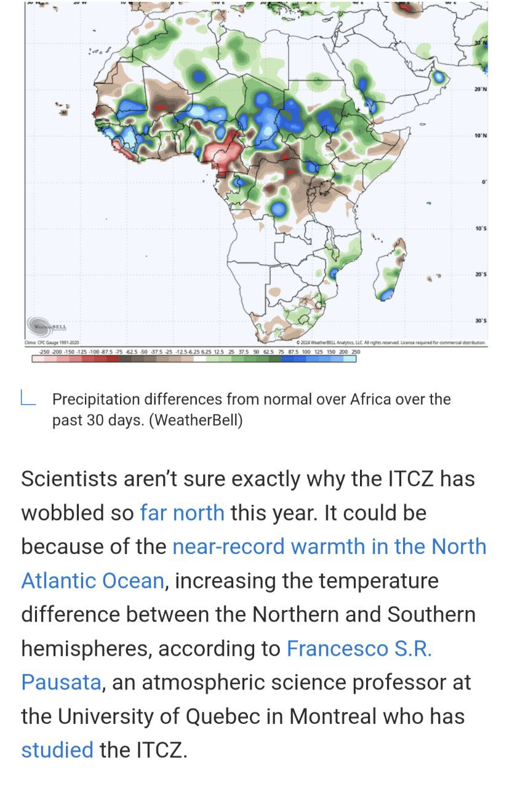

# Recent Natural Disasters

Goal: Monitor recent natural disasters in relation to the impending ECDO event. Specifically, disasters of infrequent yet extreme severity, or completely new disasters such as previously inactive volcanoes becoming active, may provide a good signal.

## Earthquake Forecasting - SSGEOS

Uses solar system metrics (planetary geometry, movements and solar activity) to predict quakes through cycle resonances. He has quite a good track record.
- https://youtu.be/O_OB9se30-Q
- https://ssgeos.org

## ITCZ Weakening

## Volcanoes

https://x.com/volcaholic1

## Flooding

Even the collector of this material is so astounded by the volume of water seen in September that he’s compiled it into a thread. 

https://x.com/volcaholic1/status/1838907698663833874?s=46

# TODO

https://watchers.news/2024/09/26/swarm-of-over-100-earthquakes-hits-hanford-nuclear-site-near-tri-cities-in-washington-u-s/