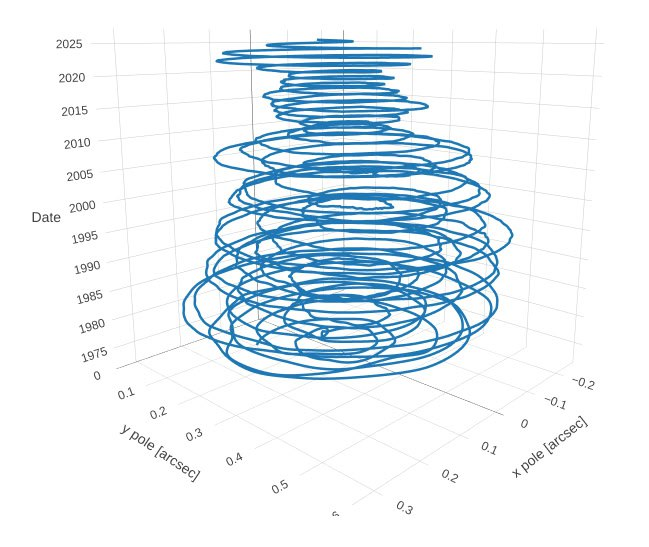
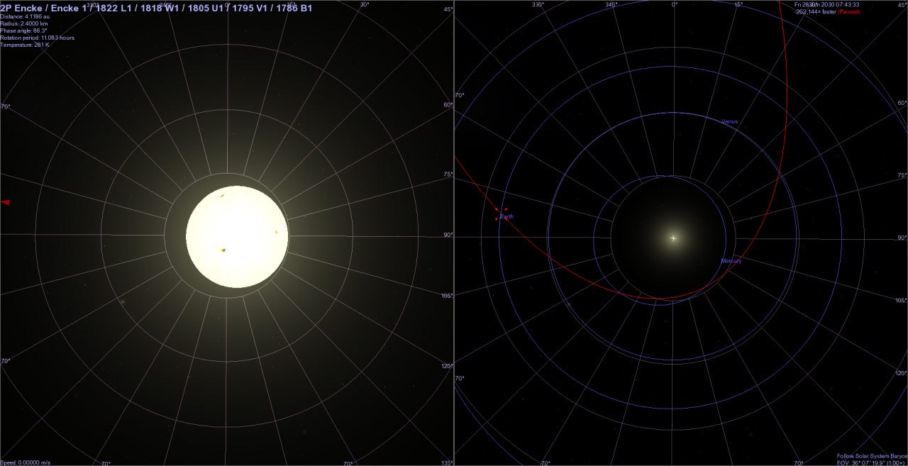

# Date and Triggers

This folder is for predicting the date of the impending ECDO, along with potential triggers for it.

## Timeframe Speculation

Possible destabilization began around 1973 (Reference Ethical Skeptic thesis).

Nobulart prediction: Worst case S1 -> S2 as early as mid-2030, with S2 -> S1 in 2042/3.

## Possible Triggers

- galactic current sheet
- micronova
- planetary alignment
- periodic comet
- Earth simply letting go

## Nobulart

The steady narrowing of real polar nutation [1] in apparent lockstep with the approaching Landscheidt Minimum [2] in June 2030, and near pass by 2P/Encke in June 2030 [3] whilst we are at solar grand minimum[4]. AgeEnder 2030 courtesy of the Saturnalian maniacs behind it. As a sidenote: When the 360-365 day calendar adjustment around 687BC is accounted for, the Mayan long-count does not resolve to 2012, but to around 2030-2040 depending on when one determines the calendar adjustment occurred.

[1] https://www.iers.org/IERS/EN/DataProducts/EarthOrientationData/eop.html
[2] https://landscheidt.info/
[4] https://nobulart.com/360-days/