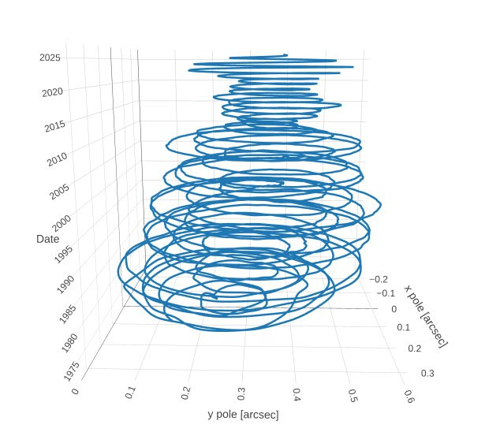

# "Shudder"

A phenomena Ethical Skeptic referenced but didn't fully explain recently on social media, where the Earth reacts measurably leading up to the actual ECDO event.

## Nobulart

I may have an idea though. Something I was looking at the other day. Earth's geographic polar wander (nutation) shown here as an amplitude and as a 3D time spiral going back 50 years. Notice the dramatic tapering in the last ten years. As we approach the gravitational null between the gas giants in 2030, I suspect this polar nutation is going to slow and center even more. I think there may be a geological disturbance at the point where we cross the null zone, and the sun traverses the SSB. Where has the energy driving the previously broad nutation gone? Is it lessening now as core-mantle slippage occurs, driving heat up from below as the clutch starts to burn out?
https://www.iers.org/IERS/EN/DataProducts/EarthOrientationData/eop.html