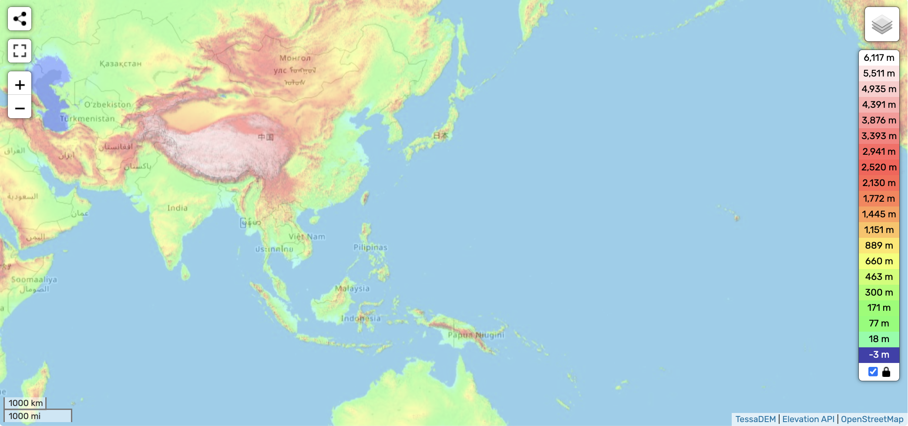

# China

China, while having a very large stretch of very high elevation land, still has to deal with quite a bit of water during both S1 -> S2 (Pacific) and S2 -> S1 (Indian Ocean). It potentially also has to deal with the northern parts of the Pacific Ocean spilling over from Russia.

## S1 -> S2

### Rotational path across the ocean (S1 -> S2)

I'll use Beijing as an initial reference point during this calculation.

Beijing is at an angle of 355 degrees from the eastern pivot, and a Haversine (Earth surface) distance of 4461 km from the eastern pivot.

So, to find the ending point after Beijing rotates, we traverse 4461 km at an angle of 104 degrees from the eastern pivot, giving us a lat/long of (-6.4, 160.2), courtesy of ChatGPT.

Finally, in this visualization, we can see Beijing rotating from the red circle to the green circle along the orange line during S1 -> S2.

That's a lot of water China will be rushing into.

### S1 -> S2 basic analysis

During S1 -> S2, it's difficult to imagine that the eastern part of China, which is about 0m - 300m in elevation and directly in front of the coast, doesn't get inundated. The [Khafre pyramid erosion line](https://github.com/sovrynn/ecdo/tree/master/4-LOCATION-MAPPING/0-general-heuristics/flood-height) is 192m above sea level, and the momentary inundation is likely higher, potentially by multiples.

It does seem that there is a patch of shallower ocean bordering the eastern coast before the ocean gets deeper, although I don't know exactly how much shallower it is. Visualization from [NOAA](https://github.com/sovrynn/ecdo/tree/master/6-TOOLS-DATA-DEV).

## Physical Evidence, Notable Locations

### Zhangjiajie Mountains

Zhangjiajie mountains are a group of mountains with very interesting shape. They are tall, narrow mountain pillars.

The mountains lie at an average elevation of over 1000m.

"Zhangjiajie Sandstone Peak Forest Geopark in north-west Hunan Province, China, contains more than 3,100 natural pillars, columns and peaks made of quartz sandstone. More than 1,000 of them soar above 120 metres (393 feet) tall, and 45 reach over 300 metres (984 feet)."

This is what the terrain looks like, from Google Maps:

The pillars are of quartz-sandstone pillars and [resemble kartz terrain](https://en.wikipedia.org/wiki/Zhangjiajie_National_Forest_Park). Supposedly they were created from [sea erosion 380 million years ago](http://www.chinatoday.com.cn/ctenglish/se/txt/2009-01/21/content_175438.htm).

Definitely potential for this location to have been created by fast-moving water/debris. Not sure whether it would have been during S1 -> S2, S2 -> S1, or both.

### Zhoukoudian Cave (Beijing)

[Zhoukoudian Cave](https://en.wikipedia.org/wiki/Zhoukoudian_Peking_Man_Site) (39.4 N, 115.5 E) is a cave in Beijing where remains of a very old (200k+ years) human predecessor was found.

Surprisingly, the cave is located only at an [elevation of 128m](https://www.degruyter.com/document/doi/10.1515/char.2001.1.1.85/pdf).

### Wangfujing site (Beijing)

This is an archaelogical site in Beijing (39.9 N, 116.4 E) where Paleolithic Stone Age tools were found.

It's only at an elevation of 50m above sea level.

## Longest Inhabited Cities

Beijing and Luoyang are the only two locations in China which have been inhabited continuously for a long time.

Beijing's history goes far back as 1100 BC, which is ~3100 years ago, when it was named the City of Ji during the Zhou Dynasty.

There may have been a city named Zhenxun built near present day Luoyang in 2070 BC.

Surprisingly, neither of them are at very high elevation:
- Beijing is from 43.5m at the lowest, to 2303m at the highest (Mount Ling)
- Luoyang is at 144m

## TODO

Things to look into:
- historical sites
- interesting mountain ranges

## Citations

- https://en.wikipedia.org/wiki/History_of_Beijing

Zhangjiajie:
- https://en.wikipedia.org/wiki/Zhangjiajie_National_Forest_Park
- http://www.chinatoday.com.cn/ctenglish/se/txt/2009-01/21/content_175438.htm
- https://whhlyt.hunan.gov.cn/whhlyt/english/TourismInRegions/Zhangjiajie/ZhangjiajieAttractions/202211/t20221108_29119497.html
- https://www.guinnessworldrecords.com/world-records/593531-largest-concentration-of-sandstone-pillars