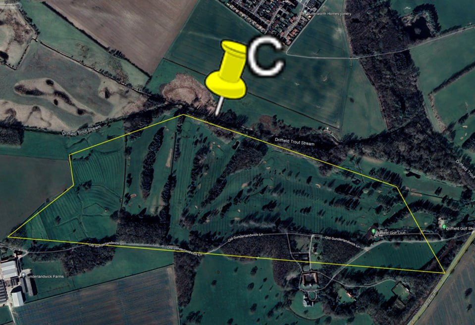

# East Yorkshire

## Investigating Ripples Potentially Related to ECDO

I'm not sure this is going to work but I have taken some screenshots of ripples I have found where I live on the East Yorkshire coast on permanent pasture that has likely never been cultivated or developed. The ripples are small. Max about 1 metre high and 10 metres wide. These lie on top of the original cliff top that is buried in sediment. This sediment makes up about half my county and all of its present coastline along the North Sea. Hopefully this will be clear in the coming images...

Geographic location

Ripple sites (A,B,C). Blue line is the original buried coastline. Everything to the East is land made of sediment (Boulder Clay).

Ripple sites in yellow boxes.

A,B,C- ripple sites. D- Archaeological discovery. Blue Line- old cliff line.

Also for interest this archaeological discovery was found at point D:
https://www.thehistoryblog.com/archives/63342

## Nobulart Response

Do you know what the main crops in this area are? These appear to be of agricultural origin. Old swales or forestry planting rows perhaps. They appear too regular and grouped at conflicting angles to be flow ripples.I have access to some high-res DEM imagery for the UK. I'll pull it up.

Maybe this:
https://en.m.wikipedia.org/wiki/Ridge_and_furrow