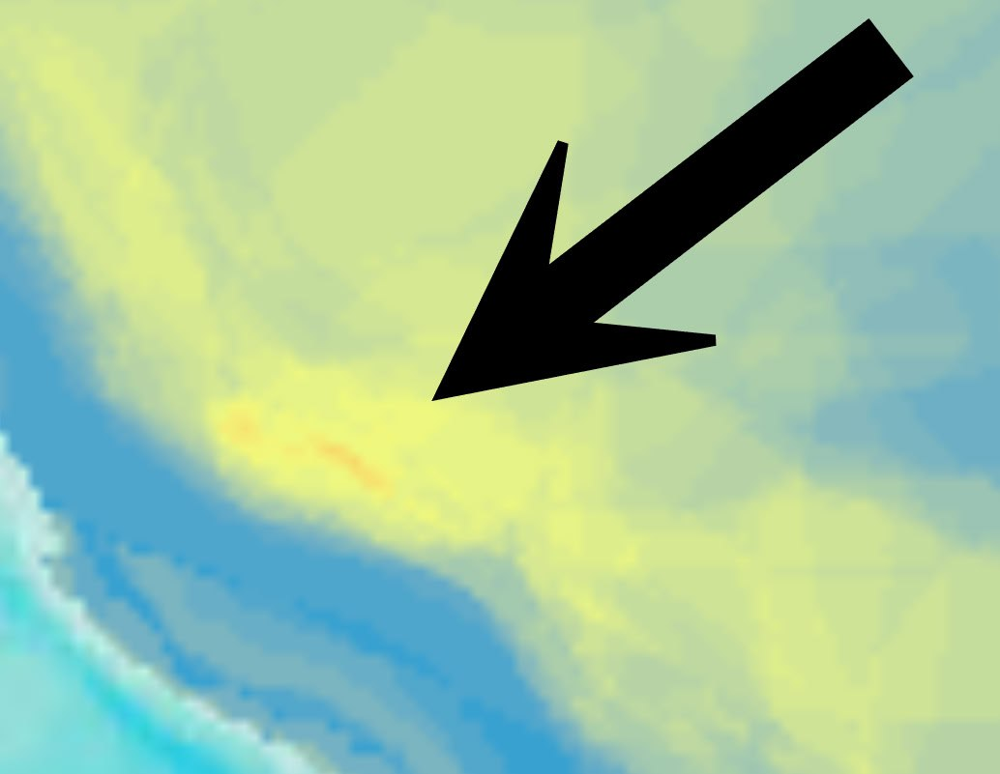

# Andes mountain range

The Andes are the tall mountain range running along the west coast of South America. High in elevation and close to the western pivot, they may be safe during S1 to S2 of the ECDO event.

## Nobulart predictions

The Andes have to deal with the Pacific hitting them from the west at speeds probably up to 1000 km/h when returning from S2>S1.

The Andes are a possibility. Problem with high places is that there is a lot of material to fall on top of you when the earth shakes.

Mountainous regions like the Andes will be less susceptible to water, but will be dangerous due to falling debris and renewed orogeny (mountain building). 

## Toctuca

That south part of the crescent appears to be richer in mammalian life as well.

Richest spot appears to be almost exactly near Toctuca.