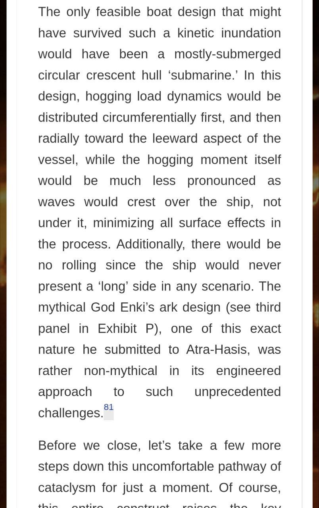
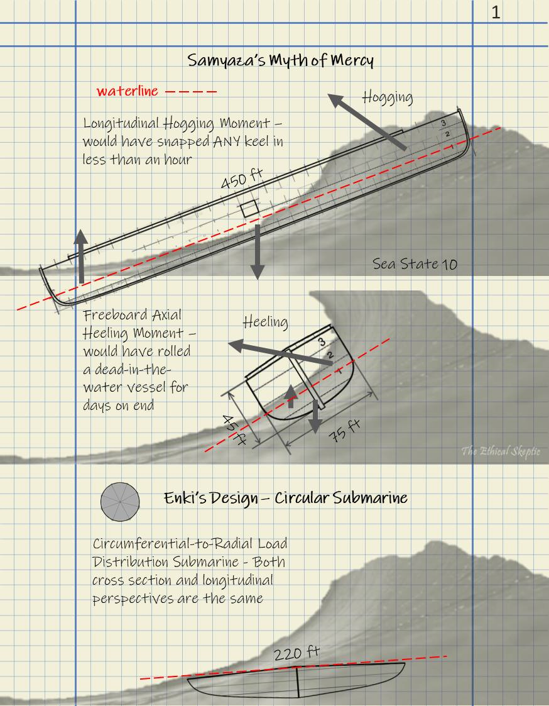
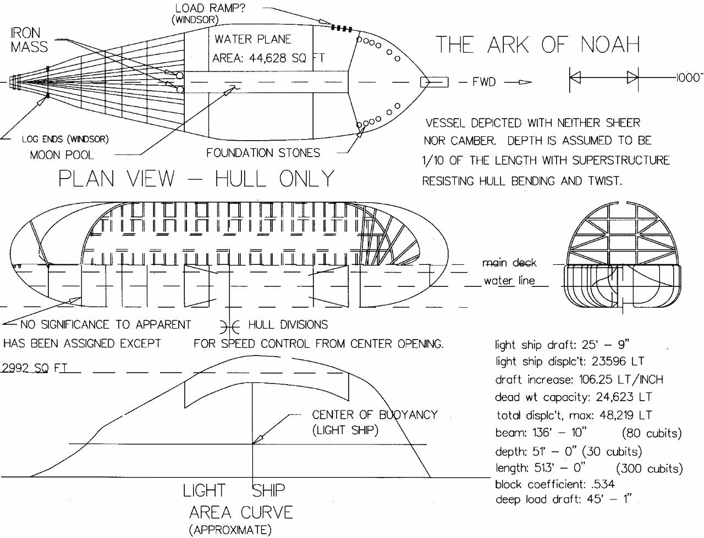
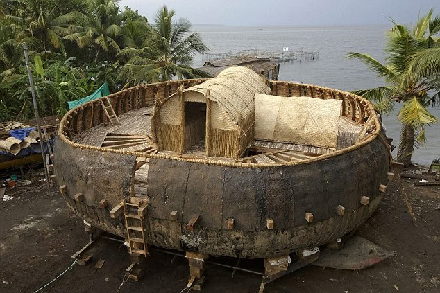
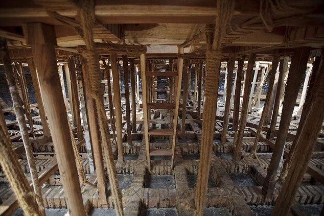

# Boats

Fun little topic.

## Ethical Skeptic Diagram

## Noah's Ark

https://youtu.be/s_fkpZSnz2I

https://en.wikipedia.org/wiki/Finkel%27s_replica_of_Babylonian_ark

https://www.coraclesociety.org.uk/news/12-09-2014/tv-documentary-real-noahs-ark (not available)

Noah's Ark revealed: Scaled-down replica build by hand in India
- https://www.dailymail.co.uk/sciencetech/article-2753211/Noah-s-Ark-revealed-Scaled-replica-based-4000-year-old-tablet-s-instructions-build-hand-India.html

https://creation.com/rebuilding-noahs-ark

https://creation.com/real-noahs-ark

### India

That's a 1/5 scaled down version of the original tablet dimensions. Made in India. Based on a coracle design. 

It didn't float. And the base had to be supported downwards with struts, so it wouldn't push up centrally & sink in on itself.

A viable version would probably require quite a lot of engineering.

Whether the original prescription of palm herd rope, wood support structures & bitumen waterproofing is enough is TBC.