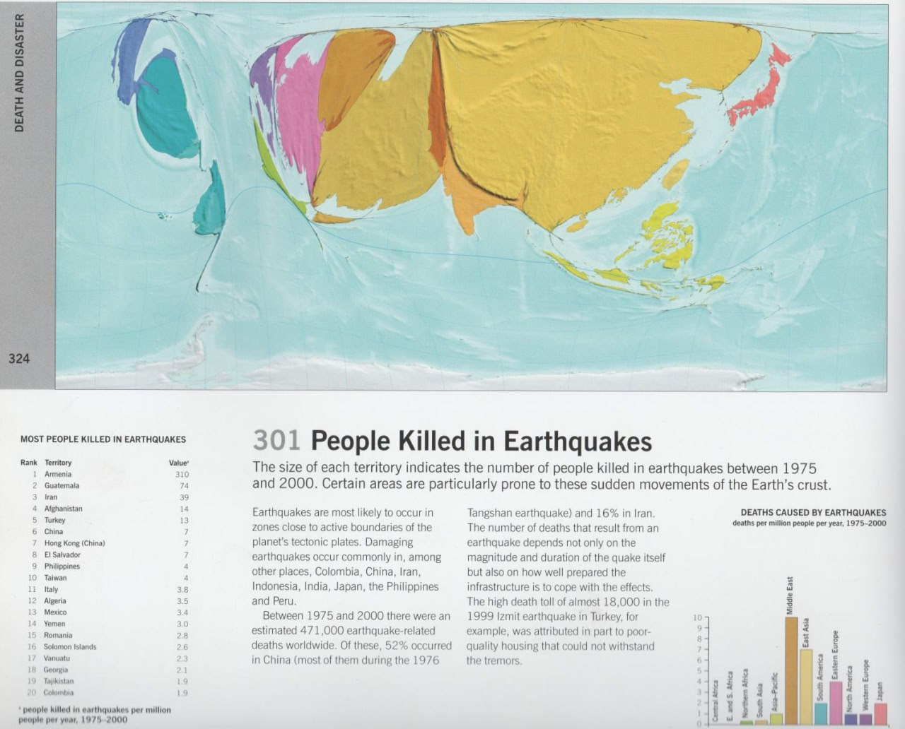
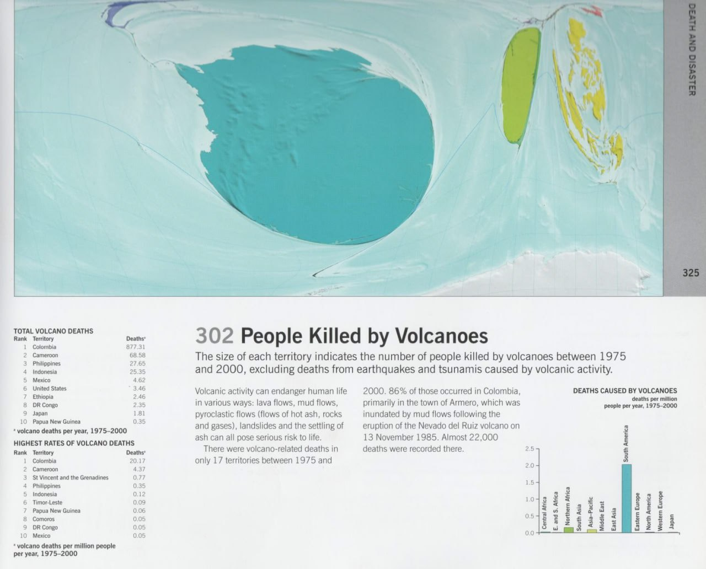
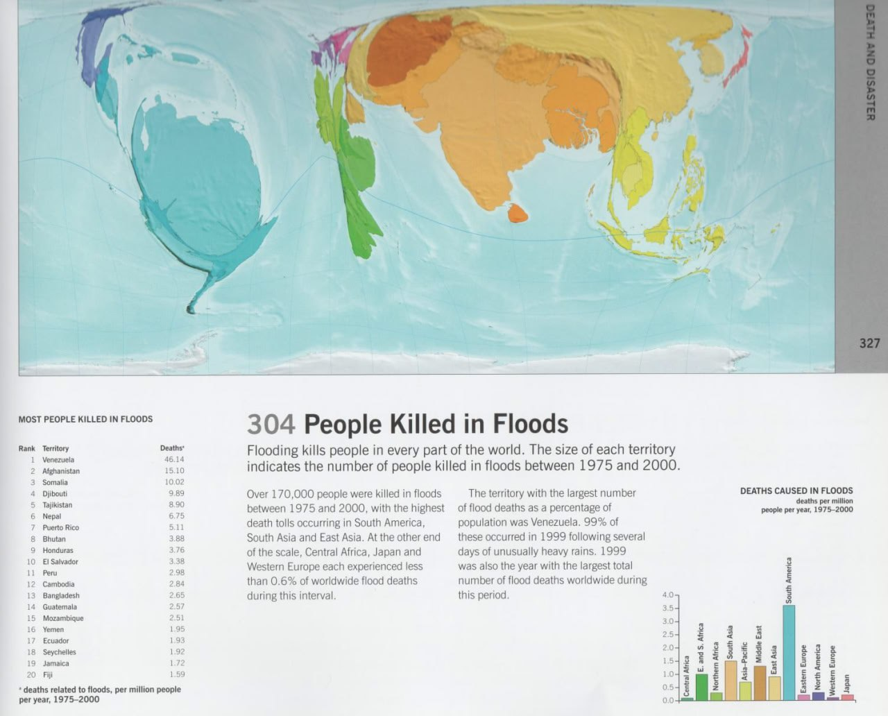
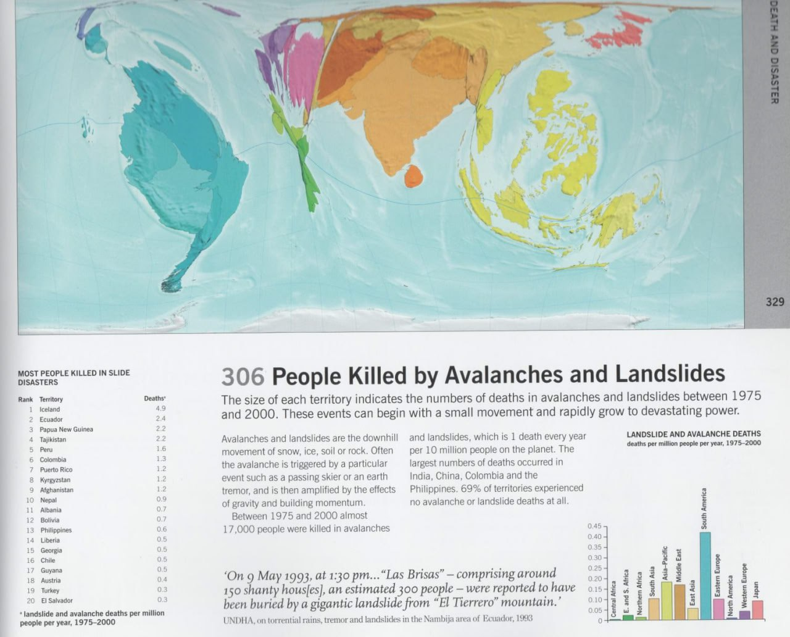

# Location

## Relative geographical risk from natural disasters by location

Four rather interesting maps showing relative geographical risk from various natural disasters according to location.

## Heuristics

Takes us back to the heuristics we've highlighted before:

🟢cave art/petroglyphs suggesting sustained human habitation 
🟢 biodiversity maps
🟢 nearby significant high altitude to hide from the deluge (or proximal to pivot points)

Seems to be a decent combo to look for....

We're building models around ECDO & solar events etc ...But small variables can put those off by quite a bit in identifying safer zones…

The heuristics might be our best bet.

Longest standing structures good as well.