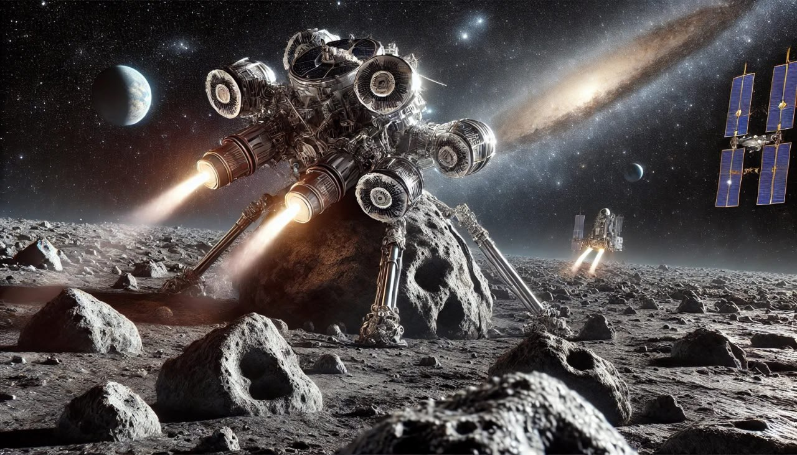
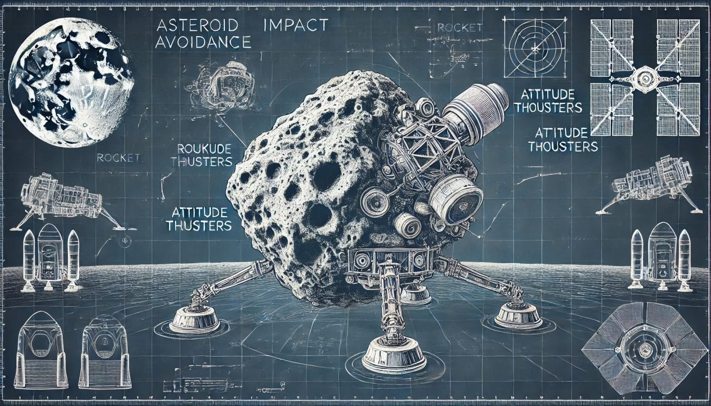
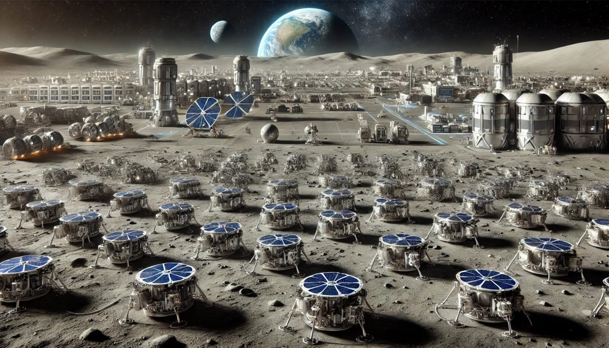

# Space Tech

## Lunar-based Asteroid Impact Mitigation System

"..an innovative and scalable solution to address one of the greatest natural threats to humanity, using the Moon as a strategic platform for planetary defense." If we can land on asteroids then we should be able to alter their trajectories. I asked GPT to take a shot at visualizing the concept of a lunar-based asteroid impact mitigation system (L-BAIMS). Thousands of these could be stationed in a launch-ready state on the far side of the moon. A summary of the concept is included in the transcript.
[1] https://chatgpt.com/share/674c4492-22ac-8005-81c2-cd4256eb56f7

## TES ELORA

TES's ELORA concept comes to mind: https://theethicalskeptic.com/2019/09/14/the-earth-lunar-lagrange-1-orbital-rapid-response-array-elora/
