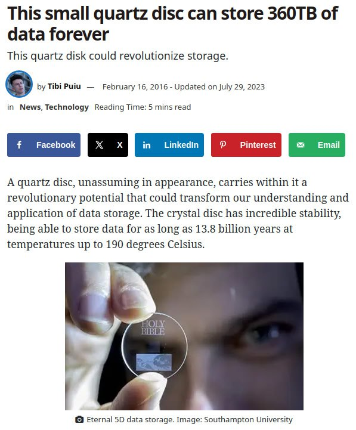
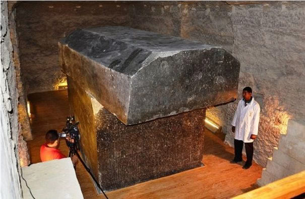
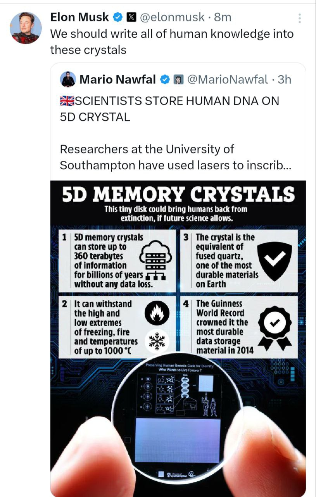

# Tools

## Tech tools

Gridbase (Local internet):
- https://www.gridbase.net/products/pocket
- https://youtu.be/qxyYB8RBbJs?si=cJ3-qbjQj1ZSRN9I

Starlink

## Data Storage [1]

https://www.zmescience.com/science/news-science/quartz-disk-5d-storage-52543/

Accessing data afterwards: *"We could if we launched the data and the tech to read it into low-earth orbit until after the event. Put enough lead around the gear and it should be safe. Most space tech is extremely hardened against EMP's already."*

*"Put enough lead or stone around something and it should be fine. Maybe thats what the sarcophagus containers were really for. These were airtight and self sealing in the event of seismic movement."*

*"Maybe starlink is more than we’ve been told... This stuff has all been done already in preparation. Question is who gets to retrieve the data afterwards? A micronova event would likely not take out all of the satellites on the dark side. It’s quite directional."*

How to retrieve it?: *"What goes up can always come down. Preprogrammed reentry, but I'm assuming that the folk with money to put satellites in space also have the money to build hardened bunkers for the gear to access the satellites from down here both before and afterwards. Be silly not to."*

*"Stone like granite is essentially EMP-proof. It converts the electromagnetic energy into kinetic - it vibrates. Granite and similar stone is probably one of the best protections against an EMP. The converse is also true of course - granite which is vibrating produces electric current flux."*

## Data Crystals

## Citations

1. [Craig Stone](https://nobulart.com)