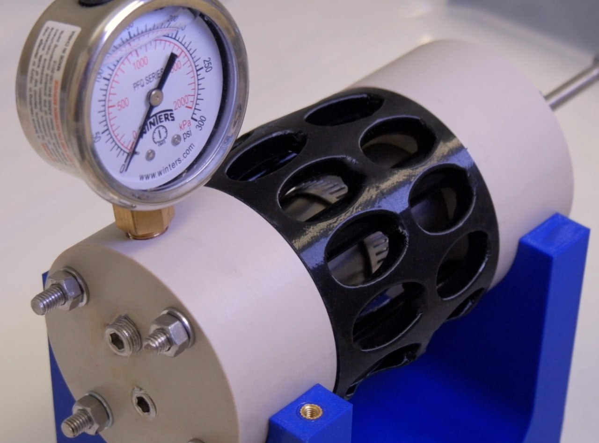
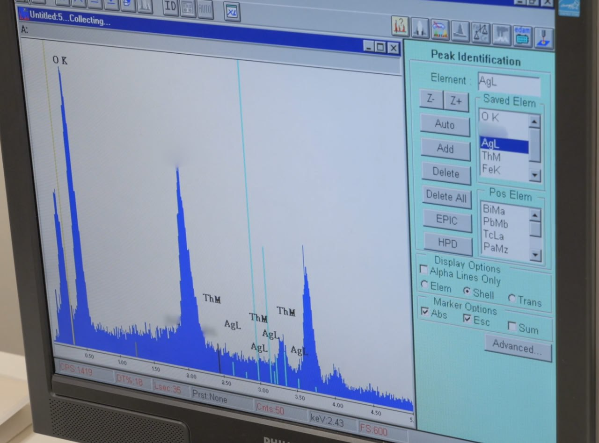

# Tools

## Tech tools

Gridbase (Local internet):
- https://www.gridbase.net/products/pocket
- https://youtu.be/qxyYB8RBbJs?si=cJ3-qbjQj1ZSRN9I

Starlink

## Data Storage [1]

https://www.zmescience.com/science/news-science/quartz-disk-5d-storage-52543/

Accessing data afterwards: *"We could if we launched the data and the tech to read it into low-earth orbit until after the event. Put enough lead around the gear and it should be safe. Most space tech is extremely hardened against EMP's already."*

*"Put enough lead or stone around something and it should be fine. Maybe thats what the sarcophagus containers were really for. These were airtight and self sealing in the event of seismic movement."*

*"Maybe starlink is more than we’ve been told... This stuff has all been done already in preparation. Question is who gets to retrieve the data afterwards? A micronova event would likely not take out all of the satellites on the dark side. It’s quite directional."*

How to retrieve it?: *"What goes up can always come down. Preprogrammed reentry, but I'm assuming that the folk with money to put satellites in space also have the money to build hardened bunkers for the gear to access the satellites from down here both before and afterwards. Be silly not to."*

*"Stone like granite is essentially EMP-proof. It converts the electromagnetic energy into kinetic - it vibrates. Granite and similar stone is probably one of the best protections against an EMP. The converse is also true of course - granite which is vibrating produces electric current flux."*

## Data Crystals

## LoRA, LoRAWAN

The technology blew me away.

Check out this guy doing experiments with it https://youtu.be/eIdHBDSQHyw?si=zmIUSzsYxQqsHbLf

This kind of long range transmission was strictly in the realm of military applications up until a few years ago, to the best of my knowledge. Long range yet very low power.

## Scientology Archive

For pro tips of archival, check the project scientology takes to preserve their original source material. Wondering if the archive grade paper they developed would be available commercially. This really goes over the top though, requires huge resources. https://www.scientology.tv/series/inside-scientology/archival-project.html

## Measuring magnetic field

Something along the lines of the Raspberry Raspberry Shake project. The sensor used for magnetic field measurement is a hall effect sensor. Built into almost every smarthpone and watch, and found in many of the devkit electronics like the ESP32, Arduino and Raspberry pi gear.
https://stationview.raspberryshake.org

That is a cool idea. Need to collect magnetic field strength data - there could be an app for that!

Looks like somebody has already done something like this.  Guessing for different reasons.  Apple (https://www.youtube.com/watch?v=ocIn_LzlAVQ) / Android (https://magnetic-field-sensor.en.softonic.com/android)

So the app would have to permit GPS location and report Mag and location data.  It varies by location correct? 

https://geomag.bgs.ac.uk/education/earthmag.html

Maybe there is an easier way, but if Ben wants the data - he should make a Suspicious0bserver app

## Nuclear Reactor

The end of nuclear waste? In 2023 the SAFIRE team commenced tests on their 3rd-generation reactor (the size of a portable radio), and used it to transmute the radioactive element thorium into non-radioactive elements; accelerating its decay rate from 14 billion years to minutes.
Video : https://vimeo.com/897600309
Project: https://aureon.ca

Safire is a plasma reactor based on the electric universe theory of the sun. It doesn’t run on heat from nuclear fission. It uses electrically excited plasma to generate heat. It just so happens that the hydrogen plasma in these reactors can also transmute radioactive materials into other elements. It eats nuclear waste and spits out copper, nickel, lead and other elements. It creates clean energy from a reusable fuel (hydrogen) whilst also solving the nuclear waste problem.

https://x.com/nobulart/status/1864417471807058263?s=46

SAFIRE is, at its heart, a very simple design. The secret to making it work is in finding the right combination of current, frequency and gas mixture. Seeing what the SAF team have achieved in just a few years, its almost a certainty that this tech has already been developed and is already in use. Having the critical fuel components (nuke waste and hydrogen) on hand together makes sense.

## Citations

1. [Craig Stone](https://nobulart.com)
