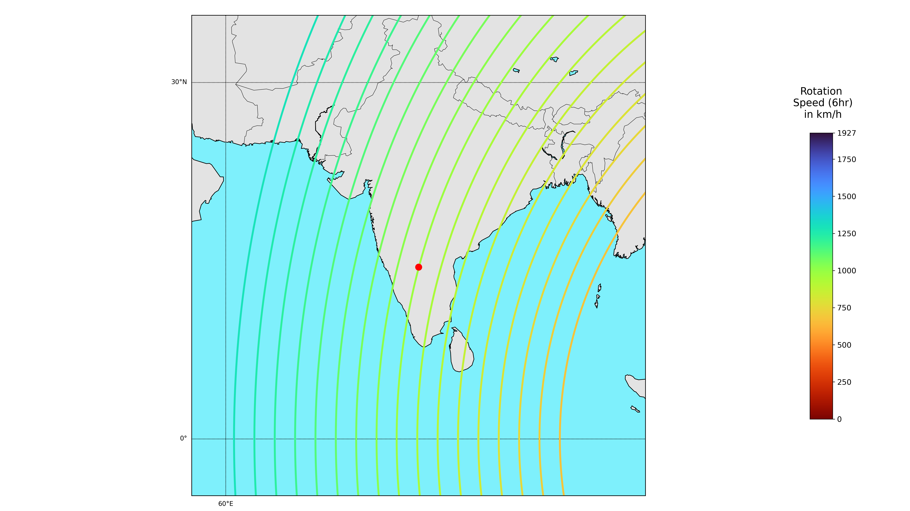
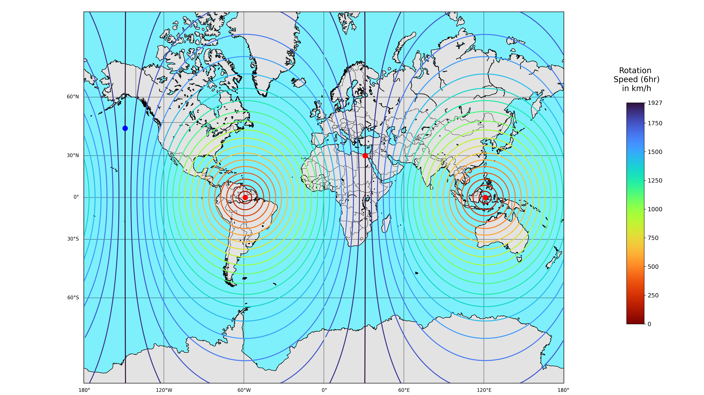

# Rotational Path 2D Map Generator

`gen.py` is a customizable Python script that will generate a KML file showing the movement path of any specified location during S1 -> S2.

The location, marked by the red dot, rotates along the red line. The lines vary in thickness depending on their rotation speed.

## Dependencies

Need [Python](https://www.python.org/downloads/) installed, along with [pip](https://pip.pypa.io/en/stable/installation/).

Then, try running the script in the command line. It'll tell you if you're missing some required Python packages (ex: numpy, simplekml, geopy, matplotlib). Install them using pip (`pip/pip3 install [NAME]`).

## Running it

Once you have the dependencies installed, just run the script using python using your command line (`python3 gen.py`). You'll need to setup the input values file though.

The script reads 5 input values from `input.txt`, each on its own line, in the following order:
- latitude of point
- longitude of point
- latitude radius of visualized region, centered around input point (Default 20, maximum 160)
- longitude radius of visualized region, centered around input point (Default 20, maximum 360)
- Number of pairs of extra lines to draw (Default 3)
- Distance between drawn rotation lines in km, whole numbers only (Default 200)
- Thickness of lines, decimals accepted (Default 4)
- Whether or not to display a marker on the center point (Options "y"/"n", default "y")
- Marker size (Default 10)

I've included a template input file `input-TEMPLATE.txt`. You'll need to rename it to use it, as well as remove the comments I added (everything after and including the `#`).

All the values are optional, but can only be read in order. After the first omitted value, none of the values will be read (properly).

## Post-run

Output image will be written to `output.png`.
