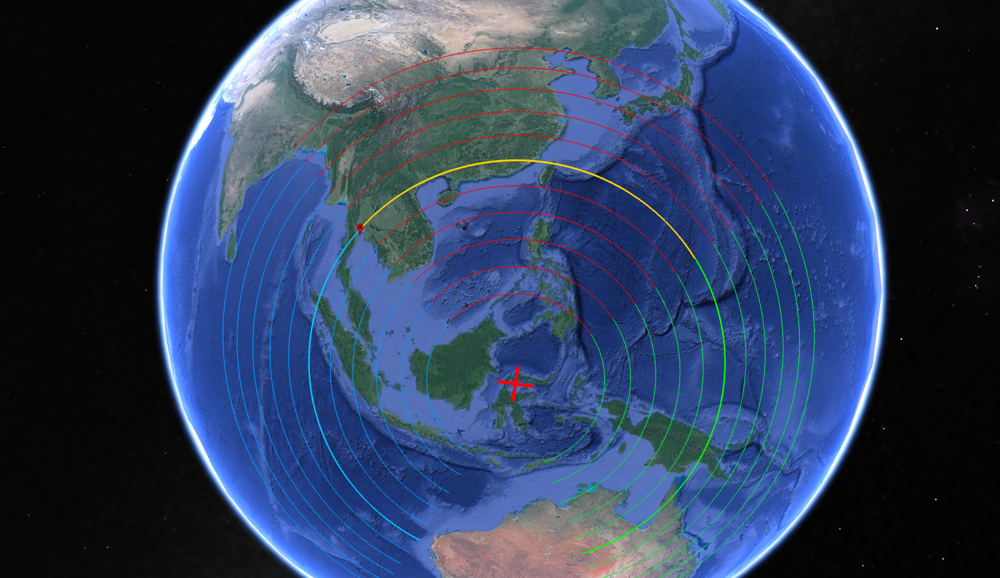

# Rotational Path KML generator for Google Earth

`gen.py` is a Python script that will generate a KML file showing movement path of any location during S1 -> S2.

The location rotates along the orange line, starting from the red pin, and ending up at the end of the orange line touching the green line.

`khafre.kml` is a KML file generated from the script, with rotation lines covering pretty much all locations, centered around Khafre, for those who want a KML file without running the script.

## Dependencies

Need Python installed, along with [pip](https://pip.pypa.io/en/stable/installation/) (Python package manager) and some Python packages (numpy, simplekml, geopy).

Just try running the script in the command line, and follow the error messages, which will tell you what to do.

## Running it

Once you have the dependencies installed, just run the script using python using your command line (`python3 gen.py`). You'll need to setup the input values file though.

The script reads 5 input values from `input.txt` using a specific format:
- First line: latitude of moving location
- Second line: longitude of moving location
- Third line: Number of extra lines to draw on each side of the main rotation line, whole numbers only
- Fourth line: Distance between drawn rotation lines in km, whole numbers only
- Fifth line: Thickness of lines, decimals accepted (3 is a good default)

I've included a template input file `input-TEMPLATE.txt`. You'll need to rename it to use it, as well as remove the comments I added (everything after and including the `#`).

## Post-run

Output KML file will be written to `output.kml` which can then be loaded up into Google Earth.

Legend:
- The red crosses are the pivots.
- Red pin is the location that rotates
- Orange line is the path that the location will travel
- Blue lines (104 degrees) are the part of the Earth that will rotate into the orange and red lines
- Orange and red lines will rotate into the green lines (104 degrees)
