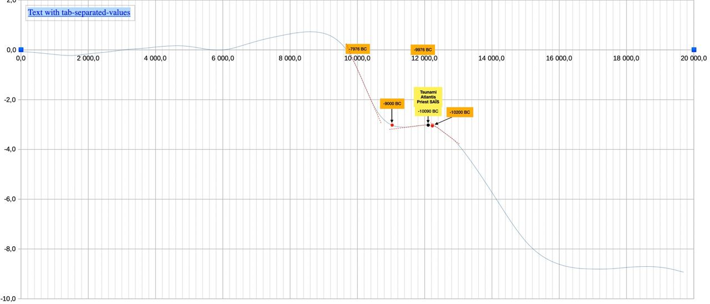

# Ice cores

VOSTOK files : https://iridl.ldeo.columbia.edu/SOURCES/.ICE/.CORE/.VOSTOK/.temp/datafiles.html   ///.  based on the tab separated data : https://iridl.ldeo.columbia.edu/SOURCES/.ICE/.CORE/.VOSTOK/.temp/%5BT%5Ddata.tsv, filtered from 0 to -20000 current time, additionnal SAÏS PRIEST/SOLON/CRITIAS/PLATO Flood datation (Priest met Solon around -590BC and the priest told about the past event -9500 years before)

Could the temperature stabilisation at red point in -10200 BD (or -12200 current time) be a candidate for a global ECDO event ?