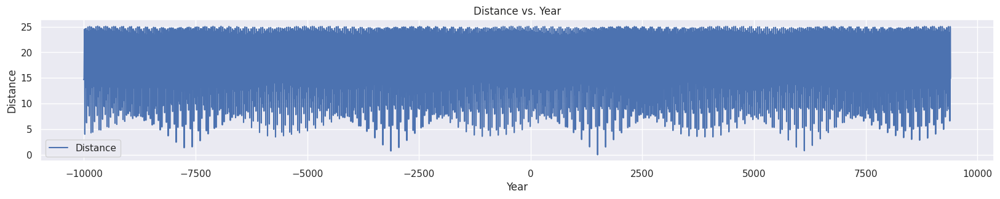

# Sun SSB Distance Dataset

## Contents

- `SUN-SSB-20ka.txt`: 20,000 years of Sun-SSB displacement data, pulled from Horizons in chunks and reassembled into a continuous record.
- `SUN-SSB-20ka.lml`: LabPlot Fourier Analysis. Plug the file into LabPlot.
- `ssb.ipynb`: Google Colab simple matrix distance analysis.

## LML Fourier Analysis [1]

See `EVIDENCE/solar-system/ssb`.

## Google Colab Analysis

Uses simple cumulative absolute value distance to find SSB displacement intervals that are closest to a desired interval.

All it really shows is the ~4500 year gas giant cycle. However you can also see the individual signals in tiny subwaves which are better teased out through Fourier analysis.

## Citations

1. https://nobulart.com
2. https://landscheidt.info
