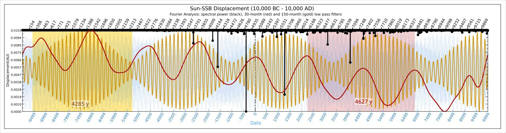
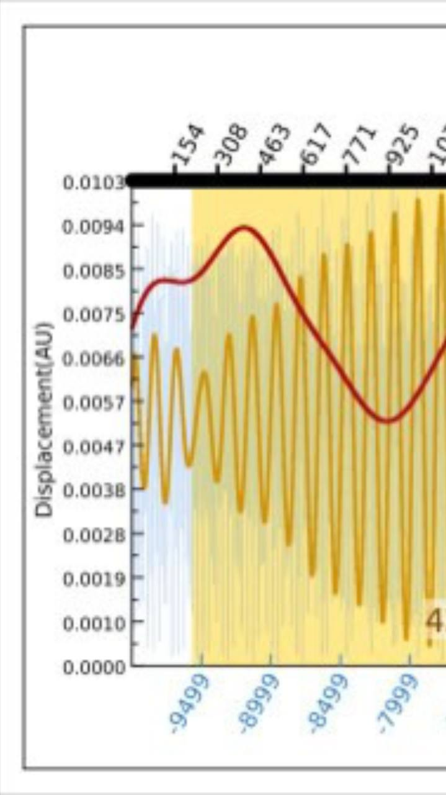
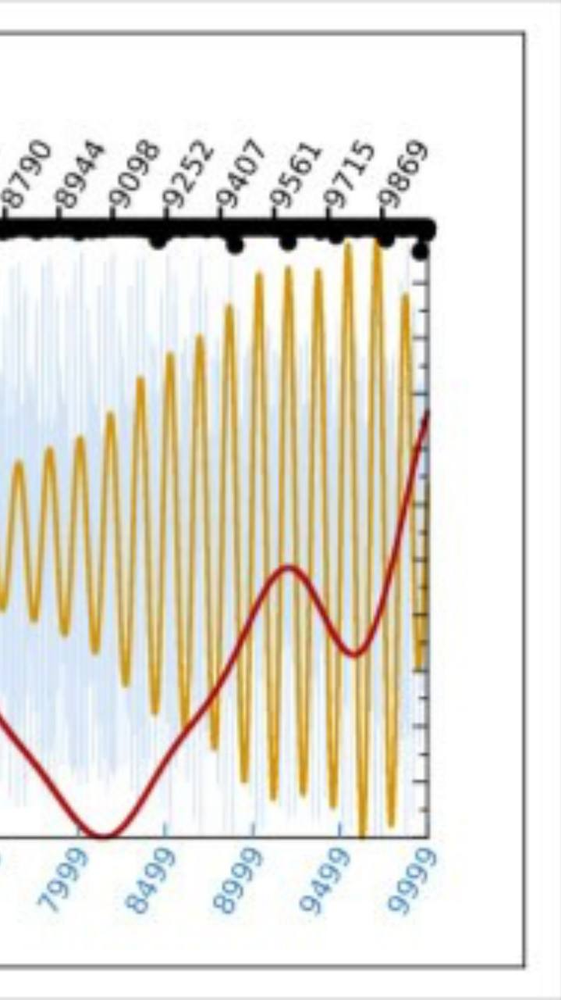
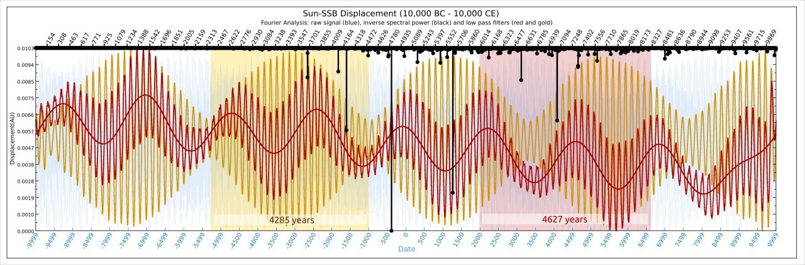
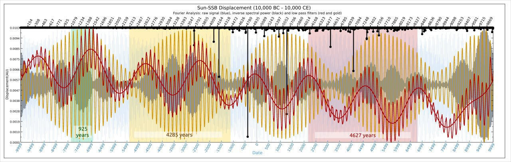
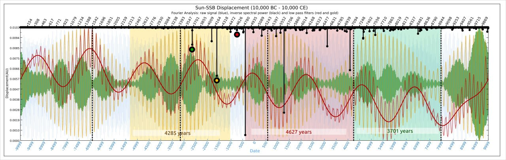
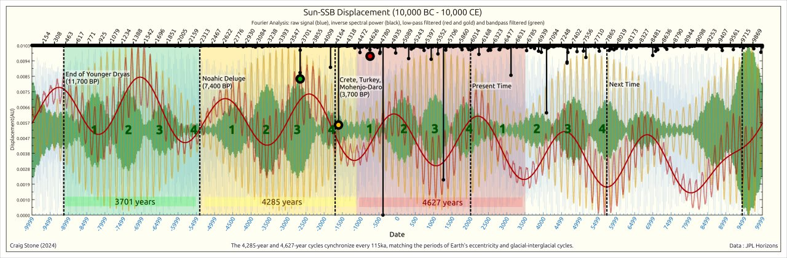

# Sun SSB Distance Dataset

## Contents

- `SUN-SSB-20ka.txt`: 20,000 years of Sun-SSB displacement data, pulled from Horizons in chunks and reassembled into a continuous record.
- `SUN-SSB-20ka.lml`: LabPlot Fourier Analysis. Plug the file into LabPlot.
- `ssb.ipynb`: Google Colab simple matrix distance analysis.

## LML Fourier Analysis [1]

I've indicated 4627 year periods with background colours.

Been trying to tease some of the components out of this 20ka dataset. The black dropstrings across the top are a Fourier transform which identifies resonant frequencies of SSB minimums within the set. Our 3700-year marker is clearly visible. I've also run a couple of Fourier filters to isolate a couple of the stronger signals. The resonance around 4285 years is a strong signal (gold), as is the known 4627 year grand cycle (red). Its interesting to see some of the many subcycles which are wrapped up in here.

Note the perturbations near the beginning and end of the 4627 filtered cycle (red line). The one at the beginning is smack bang on the end of the YD. These two kinks are roughly 18.5-19.5ka apart.

Spectral decomposition of the minimum points in the sequence (black dropstrings) reveals a clear coherence near the 3,701-year cycle (as expected). Low pass filters reveal the 4,627-year component (partially isolated and reconstituted in red). A strong 4,285-year period became apparent (gold). The shorter wave seen within the red and gold filtered signals is almost exactly the ±172 year JUNS cycle perturbation period described by Geoff Sharp[2].

I've shifted the red marker to more clearly show the cycle alignment. Also discovered another pattern as i'm stepping through the frequencies - grey blobs.

So the 2,400 year period is exactly half of the largest dropstring on this chart at 4800 years. Very likely a halfwave of that particular planetary harmonic. Interesting.

The grey blobs, it turns out, have an average period of 925 years (green). Half of the 1850 X harmonic.

I think I have found the 3701-year cycle in here. Now marked in green blobs (previously grey) and with black dotted lines to illustrate how that sequence interlocks every 3700 years.

I've adjusted the 3.7ka markers to align with our existing timeline. They occur on the downbeat of a rock ballad.

## Citations

1. https://nobulart.com
2. https://landscheidt.info

# TODO

https://colab.research.google.com/drive/1fMxwUoyc_-YXL_zB7mcgxcGjX_i9WWYX?usp=sharing
