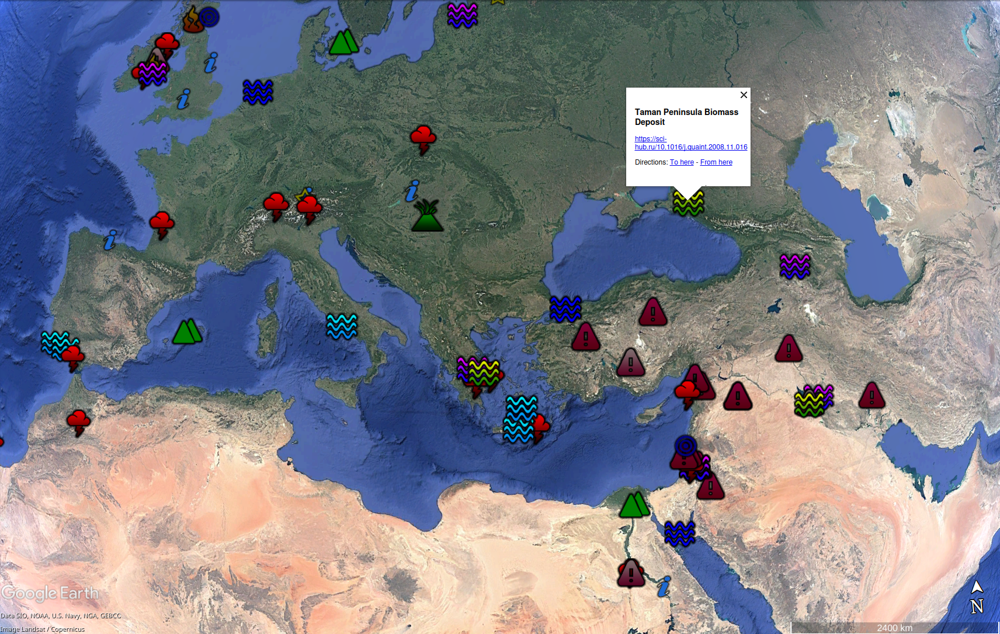
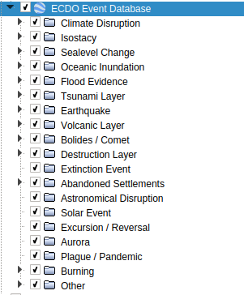

# Event Database KML (event-database.kml in current folder)

Load it up into Google Earth. Works on mobile as well.

Clicking on the icon for the event will show a link to the source.

120 (mostly) unique events.



Data source, the event database, is stored as a Google spreadsheet: https://docs.google.com/spreadsheets/d/12wWdujQop8mkRSnj3LgZ5VSc_cAVShsOyCXYEofj664/edit?usp=sharing

# Categories

There are 19 categories. They have different icons and unique colors:

```
CATEGORY_ICONS = [
    "http://maps.google.com/mapfiles/kml/shapes/thunderstorm.png",          # 0: Climate Disruption
    "http://maps.google.com/mapfiles/kml/shapes/mountains.png",          # 1: Isostacy
    "http://maps.google.com/mapfiles/kml/shapes/water.png",          # 2: Sealevel Change
    "http://maps.google.com/mapfiles/kml/shapes/water.png",          # 3: Oceanic Inundation
    "http://maps.google.com/mapfiles/kml/shapes/water.png",       # 4: Flood Evidence
    "http://maps.google.com/mapfiles/kml/shapes/water.png",          # 5: Tsunami Layer
    "http://maps.google.com/mapfiles/kml/shapes/target.png",       # 6: Earthquake
    "http://maps.google.com/mapfiles/kml/shapes/volcano.png",        # 7: Volcanic Layer
    "http://maps.google.com/mapfiles/kml/shapes/star.png",         # 8: Bolides / Comet
    "http://maps.google.com/mapfiles/kml/shapes/caution.png",       # 9: Destruction Layer
    "http://maps.google.com/mapfiles/kml/shapes/caution.png",    # 10: Extinction Event
    "http://maps.google.com/mapfiles/kml/shapes/caution.png",     # 11: Abandoned Settlements
    "http://maps.google.com/mapfiles/kml/shapes/star.png", # 12: Astronomical Disruption
    "http://maps.google.com/mapfiles/kml/shapes/sunny.png",  # 13: Solar Event
    "http://maps.google.com/mapfiles/kml/shapes/star.png",         # 14: Excursion / Reversal
    "http://maps.google.com/mapfiles/kml/shapes/star.png",        # 15: Aurora
    "http://maps.google.com/mapfiles/kml/shapes/lodging.png",       # 16: Plague / Pandemic
    "http://maps.google.com/mapfiles/kml/shapes/firedept.png",  # 17: Burning
    "http://maps.google.com/mapfiles/kml/shapes/info-i.png",     # 18: Other
]
```

These can be toggled in Google Earth:

