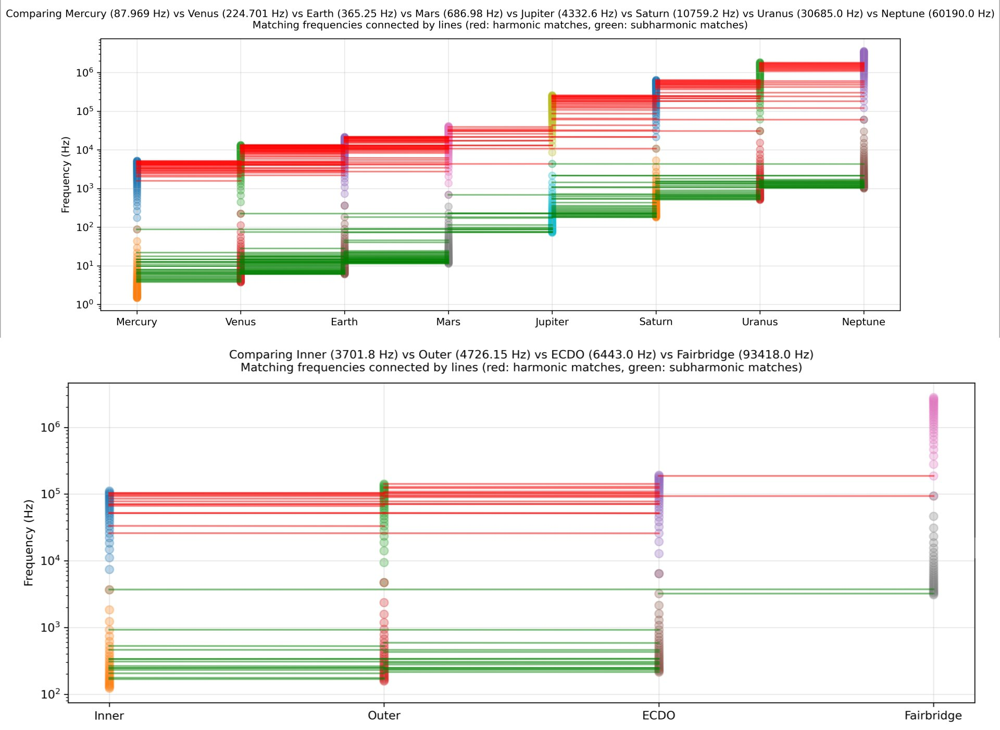
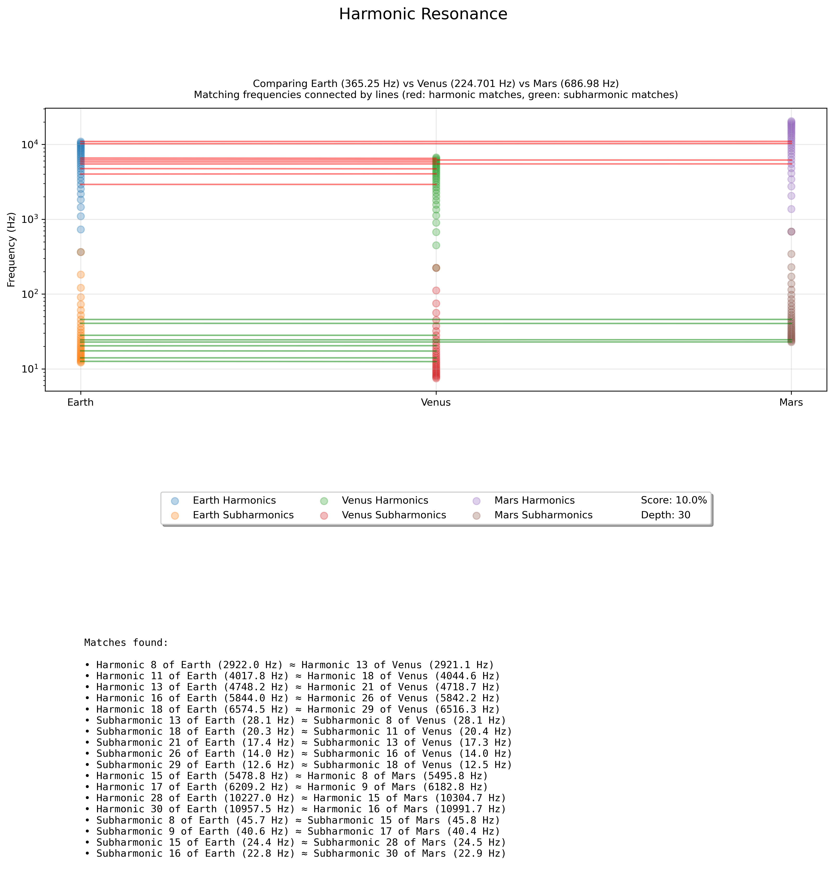
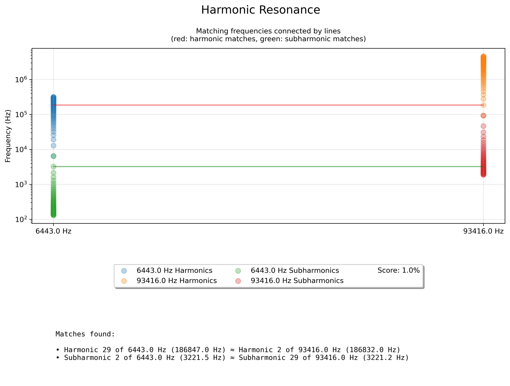
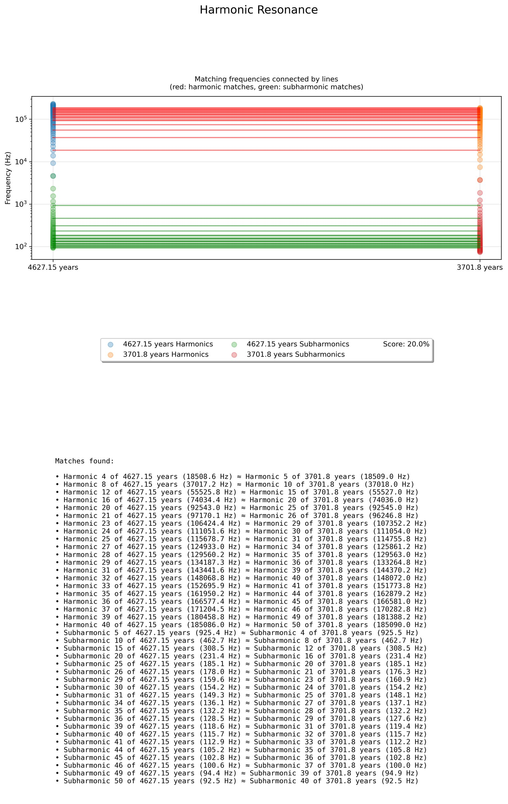
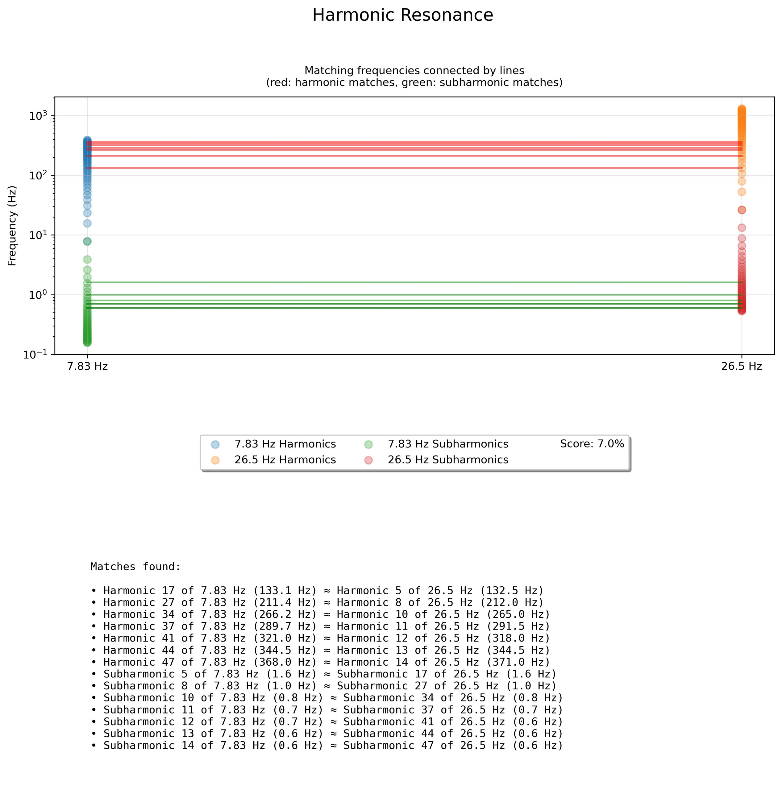
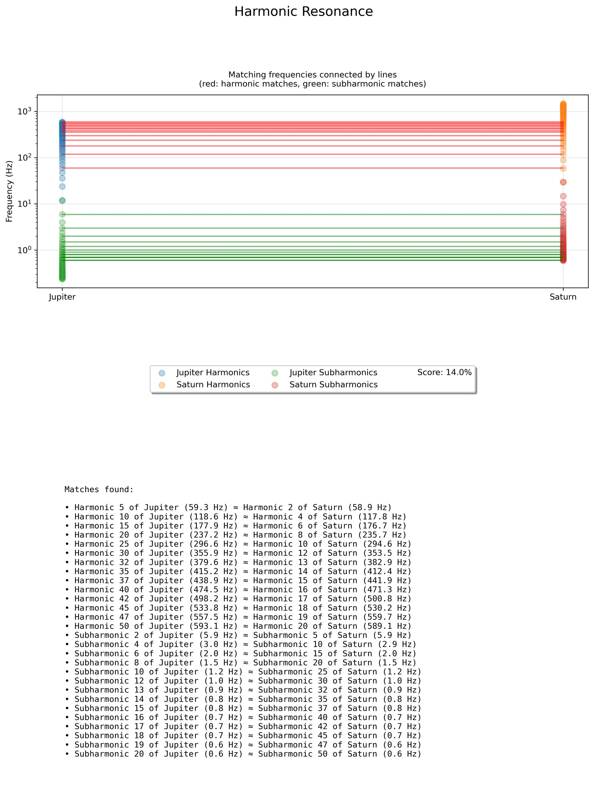
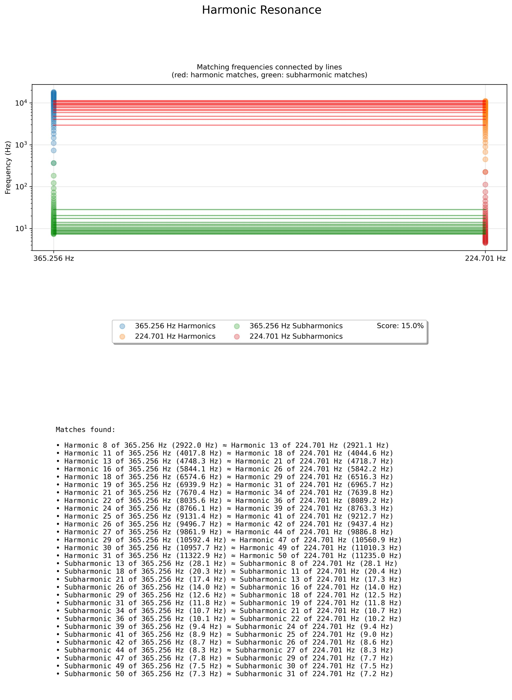

# Planetary Harmonics

## Overview

These are the numerical results for these two charts. Solar system periods are in days. The group comparisons are in years. (.txt files).

The python script for anyone wanting to use it. This script can be used to identify resonances between any number of comparable signals. Format is:

python harmonics.py [depth] [freq1]:[label1] [freq2]:[label2] ..

eg. 

python harmonics.py 30 365.25:Earth 224.701:Venus 686.980:Mars

produces the attached output.

## Process

Resonance fingerprint of 6443 years (TES) and 93416 years (Fairbridge). In the same range of 50 subharmonics there is only a single match <1%

These are starting to become very interesting when seen side by side. Each is a fingerprint, and there 
are stories buried in here that are only just starting to surface. What does the single pair on 6443 suggest; is it a younger relationship? Do broader, more complex harmonic relationships form over longer periods? [Earth:Venus had a div/0 error causing the imbalance. Now fixed]

## Citations

1. Craig Stone