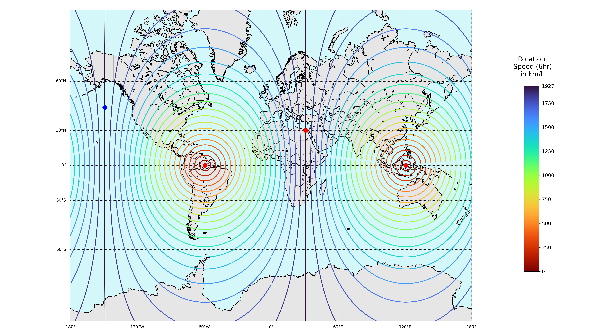
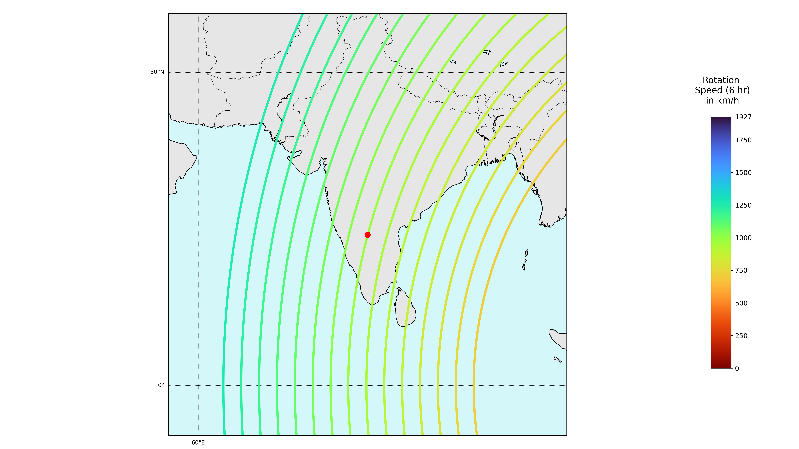

# Rotational Path 2D Map Generator

`gen.py` is a customizable Python script that will generate a KML file showing the movement path of any specified location during S1 -> S2.

The location, marked by the red dot, rotates 104 degrees to the blue dot. The lines vary in color based on their rotation speed. The legend depicts the predicted average rotation speed during a 6 hour rotation.

## Dependencies

Need [Python](https://www.python.org/downloads/) installed, along with [pip](https://pip.pypa.io/en/stable/installation/).

Then, try running the script in the command line. It'll tell you if you're missing some required Python packages (ex: numpy, simplekml, geopy, matplotlib). Install them using pip (`pip/pip3 install [NAME]`).

## Running it - input values file

Once you have the dependencies installed, just run the script using python using your command line (`python3 gen.py`). You'll need to setup the input values file though. I've included a template input file `input-TEMPLATE.txt`. You'll need to rename it to use it. You can leave the comments in there, the script will ignore them.

The script reads several input values from `input.txt`, each on its own line, in the following order:
- latitude of point
- longitude of point
- latitude radius of visualized region, in degrees, centered around input point (Default 20, maximum 160)
- longitude radius of visualized region, in degrees, centered around input point (Default 20, maximum 360)
- Number of pairs of extra lines to draw (Default 3)
- Distance between drawn rotation lines in km, whole numbers only (Default 200)
- Thickness of lines, decimals accepted (Default 1)
- 360 or 104 visualization (Options '360'/'104', Default 360)
- Whether or not to display a marker on the center point (Options "y"/"n", default "y")
- Marker size (Default 10)

All the values are optional, but can only be read in order. If you want to use default values, just omit them from the input file. Note that the script will stop reading the values properly after the first omitted value.

## Post-run

Output image will be written to `output.png`.

## Other comments

Basemap is deprecated and doesn't work with the most up-to-date version of matplotlib. Use 3.8.0.

Legend spacing is annoying. Have fun reading my code if you want to edit it. The way I've set it up now, there will almost always be an awkward margin between the chart and the legend, but the chart will never get drawn on top of the legend. If you find a better way please make a pull request!

Don't use great_circle, use geodesic!