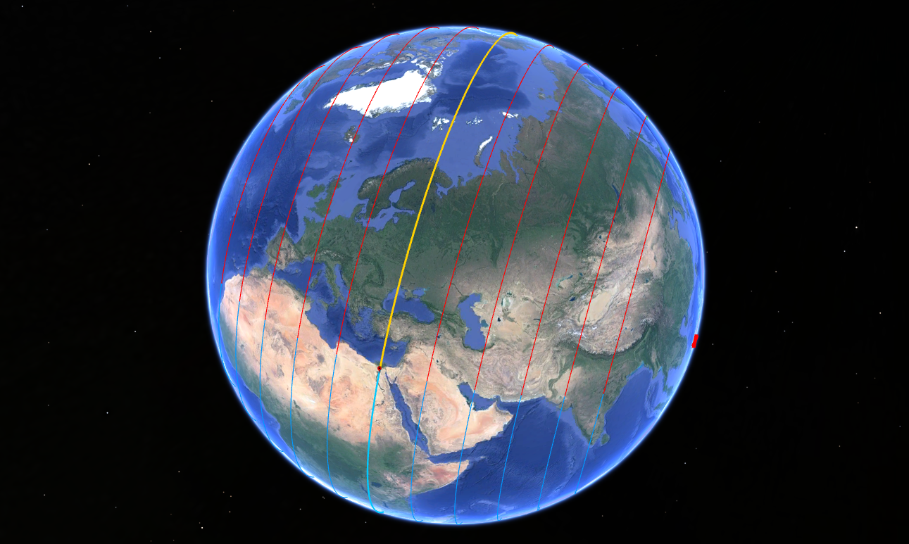

# Rotational Path KML generator for Google Earth

`gen.py` is a customizable Python script that will generate a KML file showing the movement path of any specified location during S1 -> S2.

The location rotates along the orange line, starting from the red pin, and ending up at the end of the orange line touching the green line.

## Dependencies

Need [Python](https://www.python.org/downloads/) installed, along with [pip](https://pip.pypa.io/en/stable/installation/).

Then, try running the script in the command line. It'll tell you if you're missing some required Python packages (ex: numpy, simplekml, geopy). Install them using pip (`pip/pip3 install [NAME]`).

## Running it

Once you have the dependencies installed, just run the script using python using your command line (`python3 gen.py`). You'll need to setup the input values file though. I've included a template input file `input-TEMPLATE.txt`. You'll need to rename it to use it. You can leave the comments in there, the script will ignore them.

The script reads several input values from `input.txt`, each on its own line, in the following order:
- latitude of point
- longitude of point
- Number of pairs of extra lines to draw on each side of the main rotation line, whole numbers only (Default 1)
- Distance between drawn rotation lines in km, whole numbers only (Default 500)
- Thickness of lines, decimals accepted (Default 3)
- Whether or not to place a marker at the location (Options "y"/"n", default "y")
- Size of the marker (Default 2.4)

All the values are optional, but can only be read in order. If you want to use default values, just omit them from the input file. Note that the script will stop reading the values properly after the first omitted value.

## Post-run

Output KML file will be written to `output.kml` which can then be loaded up into Google Earth.

Legend:
- The red crosses are the pivots.
- Red pin is the location that rotates
- Orange line is the path that the location will travel
- Blue lines (104 degrees) are the part of the Earth that will rotate into the orange and red lines
- Orange and red lines will rotate into the green lines (104 degrees)

## Starter KML, Shapefiles

`starters/khafre.kml` is a KML file generated from the script, with rotation lines covering pretty much all locations, centered around Khafre, for those who just want a quick way to see rotation lines without running the script. Corresponding Shapefile in `starters/shapefile/`.

## Notes

Use geodesic, not great_circle, from geopy.

Automatically centers the view on the point using LookAt KML tag.

On Google Earth Engine, these MKL files wrap around due to the 180 meridian being crossed. So, I made a new version of the script `earthengine.py` that fixes that.