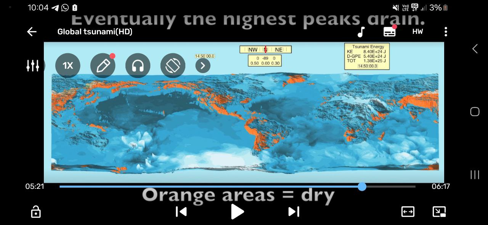

# Flood Simulation

## Steven Ward simulations

Steven Ward:
https://websites.pmc.ucsc.edu/~ward/

In Steven Ward there is a curiosity : He stopped Earth's rotation here https://websites.pmc.ucsc.edu/~ward/global%20tsunami(HD).mov

Interestingly, what he is modeling here would possibly be even more devastating than the rotation we are looking at (depending on how quickly it stops in his model). With the ECDO rotation, a great deal of the land masses 'get out of the way' so to speak.

### Source

I found this : https://github.com/kwschultz/TsunamiSquares

and the following publication : https://www.sciencedirect.com/science/article/pii/S259006172100051X

## Video

It is the great flood simulation, although not ecdo
https://youtu.be/6oT1_j0Am7Y?si=1t9YY8BAFiysFMzB