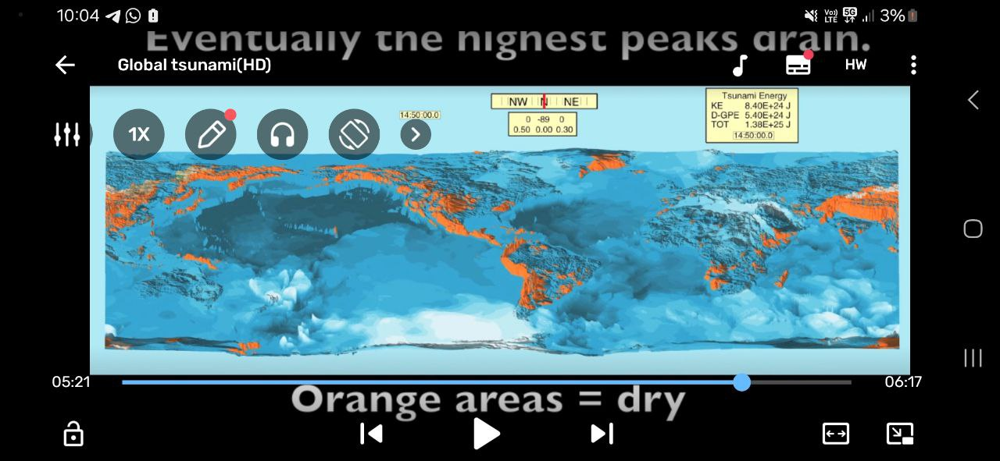

# Fluid Simulation

Parallelization important for scaling up to larger sims.

I also assume programmatically accessed solvers are easier to run on cloud compute setups.

## Fluid Sim Software

### CPU-based:
- Splishsplash: https://github.com/InteractiveComputerGraphics/SPlisHSPlasH
- MESHFREE: https://www.meshfree.eu/
- OpenFOAM

### GPU based:

- Nvidia GDB Voxels:
	- Fast Fluid Simulations with Sparse Volumes on the GPU: https://people.csail.mit.edu/kuiwu/gvdb_sim.html
	- Source: https://developer.nvidia.com/gvdb
	- Video: https://www.youtube.com/watch?v=7VPPKKpde3A
- Genesis AI: physics engine for robotics, can also sim liquid but not very feature rich

### Other

- Houdini (professional VFX tool)
- Realflow
- Blender FLIP Fluid
- Fluent
- FluidX3D
	- Pretty legit: https://www.youtube.com/watch?v=-MkRBeQkLk8

Legit:
- ANSYS Fluent
- Siemen's Star-CCM+
- OpenFOAM
- Numeca

## CPU vs GPU?

"If your case fits in the VRAM GPU is virtually always superior."

https://www.reddit.com/r/CFD/comments/1ddue39/is_there_benchmark_result_comparing_cpu_and_gpu/

## Parallelization

You have the easy form of parallelization - multiple cores in a CPU, or multiple GPUs plugged into the same system.

The more difficult form of parallelization is running across multiple HPC clusters - this requires specialized software AFAIK. Industrial grade. SOTA software.

## Steven Ward simulations

Steven Ward:
https://websites.pmc.ucsc.edu/~ward/

In Steven Ward there is a curiosity : He stopped Earth's rotation here https://websites.pmc.ucsc.edu/~ward/global%20tsunami(HD).mov

Interestingly, what he is modeling here would possibly be even more devastating than the rotation we are looking at (depending on how quickly it stops in his model). With the ECDO rotation, a great deal of the land masses 'get out of the way' so to speak.

### Source

I found this : https://github.com/kwschultz/TsunamiSquares

and the following publication : https://www.sciencedirect.com/science/article/pii/S259006172100051X

## Video

It is the great flood simulation, although not ecdo
https://youtu.be/6oT1_j0Am7Y?si=1t9YY8BAFiysFMzB