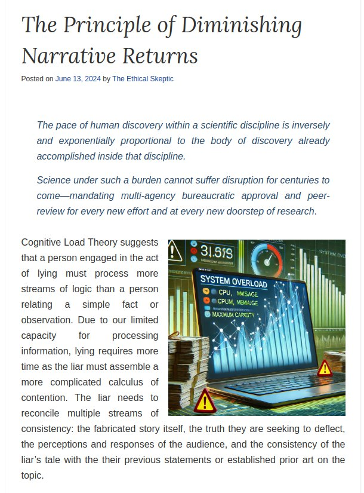
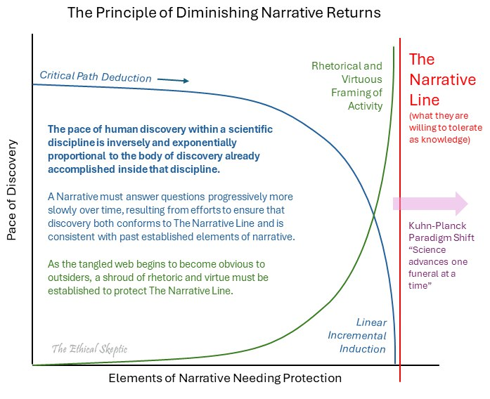
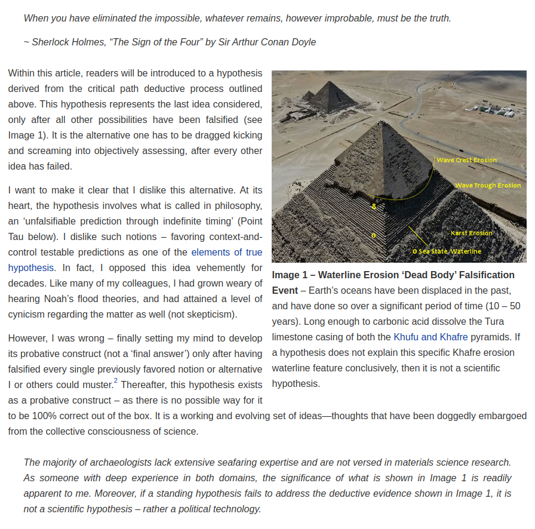
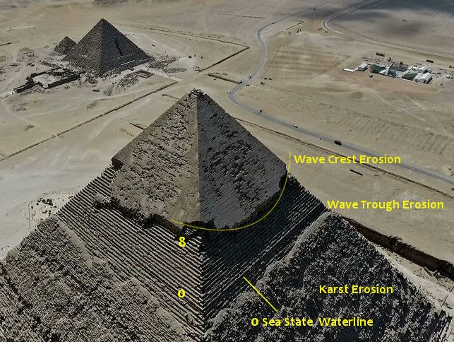
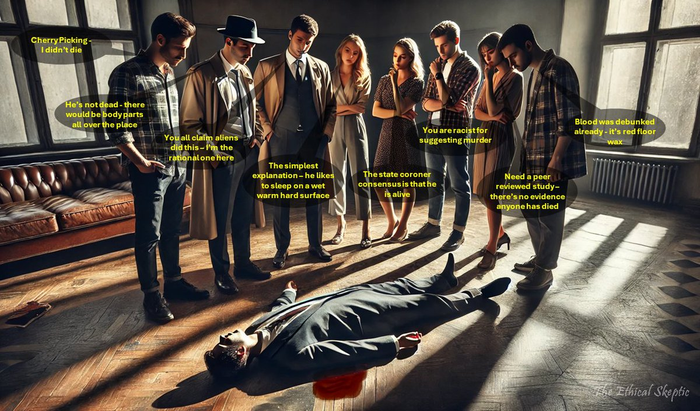
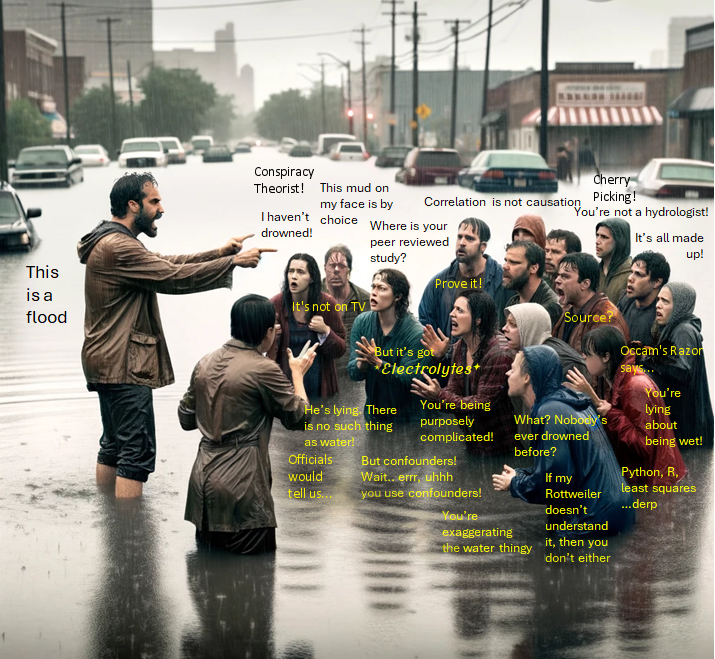

# Ethical Skeptic

Ethical Skeptic is the author of the [original ECDO thesis](https://theethicalskeptic.com/2024/05/23/master-exothermic-core-mantle-decoupling-dzhanibekov-oscillation-theory/).

Notably, he breaks his thesis down into 3 parts:
- The Earth's warming being caused by the core exerting heat into the mantle
- What the Pyramid of Giza tells us
- Dzhanibekov oscillation

The key point to understand here is that this thesis is not a random dart throw but was a progressive process of figuring things out, as outlined in his three theses.

For newcomers, he recommends reading them in the order 2, 3, 1.

I consider recreating his proofs to be of the highest priority. That work belongs in folder `FOUNDATION-THEORY`.

Hard copies taken September 21, 2024.

## Quotes

*"It is our contention that we are now well past an Indigo Point of exothermic core-mantle decoupling and that we have incorrectly interpreted the heat presented by this phenomenon as being caused solely by human activity. While we don’t conjecture an interval for this catastrophic cycle, and cannot predict when the next instance will occur, we nonetheless cite that there exists an urgent need to consider the possibility and detect the approach of a subsequent Tau Point Dzhanibekov gyroscopic oscillation in Earth’s rotation. Such a rotation will likely reproduce the cataclysmic inundation we see marked into the Tura limestone casing of the Khafre Pyramid and which is contained inside many ancient cultural mythologies."*

## Diminishing

https://theethicalskeptic.com/2024/06/13/the-principle-of-diminishing-narrative-returns/

## Other noteworthy articles of his

- History being hidden: https://theethicalskeptic.com/2021/10/16/eternal-are-the-embers-which-conflagrate-the-library-of-history/
- Intent in DNA design: https://theethicalskeptic.com/2019/06/30/the-dual-burden-model-of-inferential-ethics/
- https://theethicalskeptic.com/2024/08/17/the-dark-pentad-five-traits-of-abusive-dominion/

## "When you have eliminated the...

"When you have eliminated the impossible, whatever remains, however improbable, must be the truth." ~ Sherlock Holmes, “The Sign of the Four” by Sir Arthur Conan Doyle https://t.co/P3MWyLsyO7 https://t.co/z0UPAN9HPY

## RT The reason why mankind...

RT The reason why mankind is an ignorant and uncontacted people. https://t.co/XYkKWtab8r

## Contents

- `theory-part-[1-3]`: My personal quote compilations and short summaries of Ethical Skeptic's theses.
