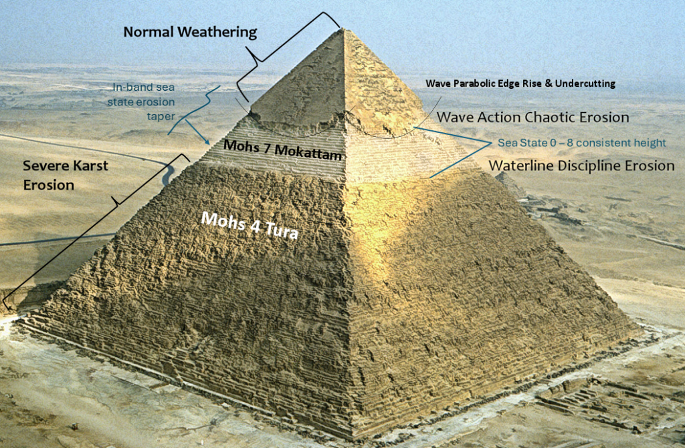

# Master Exothermic Core-Mantle Decoupling – Dzhanibekov Oscillation (ECDO) Theory [1]

*Posted on May 23, 2024 by The Ethical Skeptic*

The following material summarizes three novel hypotheses, each developed by the author through decades of dedicated professional and independent research. These original hypotheses form the foundation of The Ethical Skeptic’s ECDO Theory.

*Within this summary, we outline a novel theory, the result of 25 years of research, comprising three primary novel hypotheses that link recent climate changes to specific alterations in the Earth’s core and mantle. These changes are proposed to lead to a shift in the rotation of Earth’s mantle and crust, which may result in a recurrence of the cataclysmic inundations mentioned in many cultural mythologies. The three hypotheses are summarized in the articles below.*

## Article I. The Climate Change Alternative We Ignore (to Our Peril) [See Article Here](https://theethicalskeptic.com/2020/02/16/the-climate-change-alternative-we-ignore-to-our-peril/)

We propose that recent climate change may stem from structural and exothermic phase changes in the Earth’s nickel-iron core, rather than solely from human carbon and methane generating activity. Lattice structure changes in shed core material release latent kinetic energy (heat), which flows to the asthenosphere and abyssal ocean depths. This process could be the primary driver of observed climate change, the rapid ocean heating of 2023, methane outpacing climate model projections, and a long-associated weakening of the Earth’s geomagnetic dipole.

## Article II. Hidden in Plain Sight [See Article Here](https://theethicalskeptic.com/2023/12/18/hidden-in-plain-sight/)

We propose that the unique features observed on the Khufu and especially Khafre Pyramids suggest a sustained oceanic displacement lasting 10 to 50 years, which inundated the Giza Plateau in antiquity. This inundation reached a height of 576 feet above current sea level, leaving a distinctive ocean water karst erosion band near the top of the Khafre Pyramid. The sustained and stable nature of this inundation strongly suggests that it was caused by a change in the georotational dynamics of the Earth sometime within the last fourteen millennia. This constitutes ‘dead body’ evidence, and it must be addressed. This evidence, along with its supporting predictive observations, have been neglected through professional buffoonery.

## Article III. Exothermic Core-Mantle Decoupling – Dzhanibekov Oscillation (ECDO) Hypothesis [See Article Here](https://theethicalskeptic.com/2024/05/12/exothermic-core-mantle-decoupling-dzhanibekov-oscillation-ecdo-theory/)

We propose that periodically, the Earth’s core loses its magnetic moment and decouples from the outer rotational body (ORB), which includes the mantle and crust. This decoupling causes a shift in the Earth’s geographic axis of rotation along the 31st East meridian, moving towards South Africa. At this critical transition point, the Earth’s inertial moment takes precedence over its magnetic moment, causing this change in the geographic location of its rotational axis. The process is facilitated by the lubricating effect of exothermic H-layer material shed from the core. These effects enable the Earth’s outer rotational body to shift from today’s geomagnetic mechanical equilibrium to a 104-degree rotated momentum-conserving gyroscopic one. This cyclical and violent process may be the impetus behind many world flood myths, as well as being reflected in the inner design and function of the Khufu Pyramid itself. After a period of time and reversal in this Earth core condition, the Earth rotates back to its magnetic moment priority.

## Critical Path Conclusion

It is our proposition that we are now well past an Indigo Point of exothermic core-mantle decoupling and that we have incorrectly interpreted the heat presented by this phenomenon as being caused solely by human activity. While we don’t conjecture an interval for this catastrophic cycle, and cannot predict when the next instance will occur, we nonetheless cite that there exists an urgent need to consider the possibility and detect the approach of a subsequent Tau Point Dzhanibekov gyroscopic oscillation in Earth’s rotation. Such a rotation will likely reproduce the cataclysmic inundation we see marked into the Tura limestone casing of the Khafre Pyramid and which is contained inside many ancient cultural mythologies.

*Man himself has proved to be a greater threat to our knowledge and understanding than any natural disaster ever could be. Envy finds fault in the trivial, while a concealed truth intoxicates. Until we mature spiritually, we will perpetually believe that we were created out of clay or recently and amazingly evolved from a dissimilar yet extinct species.*

*Every ancient library burned, every inscription erased, every sculpture smitten, every artifact easily explained, reburied, and ignored – all in the name of The True God™ and The True Science™ (same team, same playbook). As long as our hearts remain in this darkened state, so too will our past be equally opaque, and our present a constant series of paradoxes.*

epoche vanguards gnosis

The Ethical Skeptic