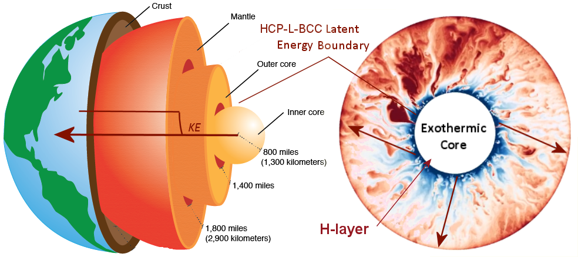
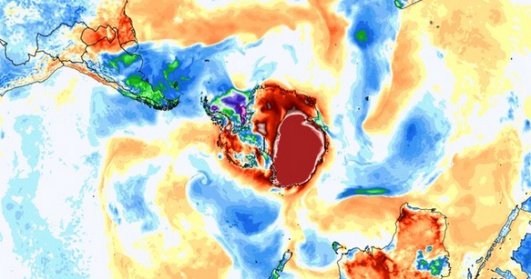

# The Climate Change Alternative We Ignore (to Our Peril)

*Posted on February 16, 2020 by The Ethical Skeptic*

The following material presents one of three novel hypotheses, each developed by the author through decades of dedicated professional and independent research. These original hypotheses form the foundation of The Ethical Skeptic’s ECDO Theory, which is summarized in this article.

Article Last Updated: 31 Jul 2024: Exothermic Core Hypothesis makes another successful prediction. See Exhibit 7D.

Recent climate change may originate from structural and exothermic phase changes in the nickel-iron core of the Earth, and not primarily from man’s activity alone. Lattice structure (phase) changes in sloughed (shed) core material releases latent kinetic energy (heat) which flows to the asthenosphere and abyssal ocean depths, thereby becoming genesis of the majority of observed climate change, greenhouse gas forcing, and long-associated geomagnetic dipole phenomena.

Indeed, the Earth can be likened to a thermos bottle; however, its reality is that of a leaky one. What’s even more crucial is that we haven’t explored 95% of this realm to a sufficient level of scientific diligence. Our approach inside this epistemology involves excessive boasting, rendering it more of a political technology than a true science.

## Synopsis – Exothermic (Cyclic) Core Theory of Climate Change

1.  The Earth’s core undergoes extreme exothermic change – sloughing high-latent-energy hexagonal closepack (HCP) iron from its H-layer and into the outer core where it converts to liquid face centered cubic (FCC/BCC) iron plus kinetic energy (latent heat of phase transition). Core magnetic permeability weakens and its geomagnetic dipole wanders. Earth’s rotation speeds up on a decadal basis from the loss in magnetic coupling from outer core to mantle. Earth’s rotational axial inclination also changes.

2.  The exothermic heat content from this eventually reaches Earth’s asthenosphere. Deep crude acyclic alkane pockets are heated and accelerate fractional and volatile organic compound release into atmosphere. Methane ppms far outpace model predictions. Carbon-12-rich oceans and now-warmer tundra each spring solar warming, both release proportionally more carbon.

3.  Abyssal ocean conveyance belts pull novel heat content from small-footprint yet now much hotter contribution points exposed to the asthenosphere – and convey (not conduct, convect, nor radiate) this novel heat content through oceanic advection and upwelling systems to the surface of the ocean. Abyssal ocean currents (and consequently surface ones as well) speed up from the discrete addition of kinetic energy. Arctic and Antarctic polar ice sheets melt rapidly in winter from the bottom up. Land desiccates more quickly and wildfires erupt earlier and out-of-season, especially near heat plumes.

4.  Ocean heats atmosphere (or fails to cool it as well as it once did) much more readily than atmosphere heats ocean. This exothermic core-to-mantle equilibrium is cyclic, and can and will eventually reverse.

**Under the specter of censorship and reprisal, true consensus cannot exist.**

I read a very interesting study that a friend forwarded to me yesterday, one which piqued my interest in summarizing some of the research I have assembled over the last two decades regarding climate change. My friend forwarded me the study because he was aware of my active research concerning the increase in thermal energy content of the world’s oceans. While the study and several associated headlines were interesting (CNN: “Oceans are warming at the same rate as if five Hiroshima bombs were dropped in every second”), I found its conclusions premature, de rigueur, incomplete in critical scope, and unsound. Yes the Earth’s oceans are warming, but they are warming far too fast and asymmetrically at abyssal depths, to be explained by man’s activity alone. Such pluralistic ignorance and myopia epitomizes the entire coercive miasma surrounding current climate change science.

Yes, it is generally acknowledged by mainstream science and society at large that our planet’s oceans are heating very fast.1 2 3 4 The result of this warming is an increasingly unhealthy environment for our ocean’s flora, fishes, microbiota, mollusks, crustaceans, and fauna.5 To varying degrees, this emergent condition threatens everything which lives on planet Earth. The vast preponderance of scientists agree that we are well underway on the sixth mass, or what could be reasonably titled, Anthropocene Extinction. Much of this the result of extreme and recent climate change brought about through man’s activity.

Now before reviewing this material, I must ask two things of its prospective reader. First, before succumbing to the temptation to assign me an ‘anti-‘ label, understand that I am a proponent of addressing anthropogenic global warming as a first priority for mankind. I first adopted the ‘Venus – runaway greenhouse effect’ paradigm (applied to Earth’s climate) after reading Carl Sagan’s groundbreaking work outlined in his book, The Cosmic Connection. Since that time, I’ve worked more extensively than most inside efforts targeting mitigation of volatile organic compounds, alkanes, methane, and carbon monoxide/dioxide contribution on the part of mankind. I have conducted professional studies regarding the value chain of carbon inside the economy, and have developed businesses and worked to change markets, with a principal focus of mitigating carbon contribution by the various industries involved. My firm’s capital plans and designs for energy systems/plants never fail to include emissions carbon-scrubbing technologies. I have shared in the grave concern over human contribution to the stark rise in global temperatures now obviously underway.

Second, this is not a ‘study’ nor a true ‘article’, but rather a critical path argument – a petition under the scientific method. As such, it is a summary of my analysis, observations, and inference, all of which have developed on this issue over time. It is meant to provide a framework of sponsorship behind an idea which I have slowly formulated over two decades. This article is not a ‘claim’, in the obtuse lingo of the debunker, rather it constitutes an inferential appeal for deductive hypothesis sponsorship. A distinction taught in the philosophy of ethics and science – framed particularly for the instance where an existing enforced hypothesis is based solely upon inductive inference, and as well has recently failed several critical confirmations.6 7

The sad reality is that climate science has unfortunately crossed the ethical line into becoming Syndicate Science. When anti-citizen statements such as this are made by government officials, it is time to question the powers that select the science that is approved. It is time to question a climate consensus that is, in reality, political, for what it truly is: fraud.

In contrast, this petition regards a construct, a critical path of observation-to-inference which now aspires to be developed into full hypothesis. As such, this work is not posed under a pretense of residing at the level of a broad-scope scientific research effort. To do full justice inside this argument would require a great deal more research on the part of mainstream science. However, one can anticipate herein a greater depth of schema and level of sourcing recitation as compared to the standard media article. My hope is that you find this article both challenging and refreshing. Please understand that its purpose is a single hypothesis’s petition for Ockham’s Razor plurality, and not any insistence (claim) as to a single and final answer. While of course posed as an alternative, the genesis of this hypothesis does not arise from a desire to ‘deny’ anthropogenic induced climate change. Therefore, I am not a ‘climate change denier’. Do not trust anyone who mindlessly employs such weaponized pejoratives, as it is their malicious conduct which is serving to create a mistrust of climate science to begin with.

**The ad hoc rescue which (as of the 2023 global ocean and land heat plumes) climate science disingenuously now calls ‘Underground Climate Change‘.**

Please note as well, that the unqualified idea that ‘climate heat must be coming from under the ground’ (even if predicated upon man’s activity) alone is not a theory per se, as the notion of mere proximity bears neither mechanism, definition, parsimony, explanatory predictive power, nor test-ability – all necessary components of hypothesis.8 Exothermic Core Theory is the first actual qualified hypothesis of this nature – much of its critical path being based upon two decades of original research and investigation on the part of its sponsor.

**Climate change is an ACAN Problem, meaning it has pushed experts beyond their domain of competence in terms of problem definition. Consequently, they have doubled-down on a single premature conclusion that carries significant risk.**

**If climate scientists obtained the wrong answer or measures on some key real world model applications, for example carbon emissions concerning the ethanol value chain, marine terminating glacial current vectors and melt rates, and the net negative impact of electric vehicles – in some cases having to be corrected by ‘outsiders’ (actual value chain experts who craft systemic models as part of their profession) – then legitimate concern is raised regarding overall methodology and competence in the field.**

If what I propose here as a supplementary contributor to climate change theory begins to explain more completely what we are observing globally – then the construct will have served its purpose. Further then, it is my opinion that its core kinetic-energy-derivation argument bears soundness, salience, elegance, logical calculus, and compelling explanatory power – key prerequisites of true hypothesis. Despite its need for further development and maturation, this argument should not be ignored through our polarization over this issue politically. We need fewer children with scowling faces, fewer leftist enforcement squads, and more unbiased thinking adults addressing this challenge.

The key issue entailed inside this argument is that of observed lithosphere and hydrosphere (oceans) heat increases, and these measures far-outpacing what atmospheric carbon capture models have predicted or could serve to induce.9 This is the critical path issue at hand.

## Part of The Heat May Indeed Be Coming from Beneath Our Feet

During some of my agricultural and green energy work a number of peripheral observations my teams have made have begun to linger in my mind over time. They have given me pause and convinced me of the necessity to formulate and propose another idea. An idea that in my opinion fits the observation base much more elegantly, without forcing, and in more compelling fashion than simply the Omega Hypothesis of ‘man is causing it all – no need to look any further’. These notions stem as well from my time heading an exotic materials research company, and from working with several US oil exploration companies to reduce natural gas emissions. My point is, that this is an idea which requires a multi-disciplinary understanding of the physical phenomena involved.

In short, my alternative idea could be titled: ‘The Heat May in Part Be Coming from Beneath our Feet’. Its exegesis (at the end of this article), derived from a series of ten primary independent observations in order of critical path dependence and increasing inferential strength, follows: 

### Observation 1 (Inductive-Heteroductive-Introduces Plurality) – Fall to winter CO2 rise exhibits a northern hemisphere winter solstice pause which should not exist if all ppm is generated by man alone – Covid-19 industrial shutdown served to produce two critical path heteroductive observations

**Exhibit 1A** – 1974 to 2018 average normalized annual northern hemisphere carbon ppm variation by season of year. The greening of the northern hemisphere aids in recovery, however there is a substantial vernal jump in carbon ppm each year from 15 Feb through 1 Apr when the sun increases its heat contribution upon northern hemisphere tundra latitudes, which then sympathetically release more carbon dioxide.

The chart I developed to the right in Exhibit 1A depicts the annual normalized Keeling Curve cycling of carbon parts per million (PPM, ppm) as measured at the Earth’s northern hemisphere Mauna Loa observatory (blue bars) as compared to the annual geographic latitude position of the sun (orange sinusoidal line).10 11 12 One can observe the strong consumption of carbon dioxide out of the atmosphere which occurs each spring and into the summer, upon the annual greening of the northern hemisphere. Take note here as to the raw power which nature and forestation in particular possess in mitigating atmospheric carbon, if left alone to do their work.13 This trend is mostly solar-photosynthesis induced as its regression matches the latitudinal declination regression of the sun each year almost exactly (the summer months in the graph). Each year however, we experience a surplus between carbon generated and the carbon which plants and algae consume (difference between the magnitude of the peak on the left and the trough on the right in blue bars) – thereby causing an annual overage in our planet’s carbon budget, if you will – a deficit which accumulates and does not go away (observable in the carbon ppm and temperature graph below).

**Exhibit 1B** – Comparison of Winter versus Spring annual normalized carbon ppm increase, northern hemisphere.

Now consider for a moment this parallel sympathetic trend between the solar latitude (declination) and the carbon ppm mitigation effect of northern hemisphere foliage in the spring and summer Keeling Curve – and notice that this same parallel sympathetic trend is violated in the winter months for the northern hemisphere (see Exhibit 1B to the right). If one examines the right-hand side of the carbon ppm bars (15 Dec – 15 Jan), there exists a taper off (flattening of ppm slope) in Carbon contribution which occurs annually each time the sun hits its most southerly latitudes – a feature which is not a signature of economic activity, as man does not just stop producing carbon in the winter and in fact produces more carbon for heating dwellings and massive levels of travel. Rather, I propose that this flatter ppm slope stems from an annual winter-cessation in solar heating of the high northerly-latitude permafrost, tundra, and shallow oil formations (such as exist in Russia and between Alaska and Texas). Deeper geostrata, features, and biomes which are already hotter than in the past, because of some separate influence than merely solar radiation capture. In other words, the pace of methane and carbon emission is synced very heavily with the sun’s geographic latitude – almost exclusively. One can see this inside the graph’s carbon ppm slope differential between the winter solstice period as compared to the vernal equinox period – or what is identified in Exhibit 1A as the ‘vernal jump’. The slope in carbon ppm is clearly less, during a time when its magnitude should actually be higher. This mandates plurality on the subject.

Moreover, something in the northern latitudes of the globe responds in very sensitive ppm relationship with the rising of the sun’s geographic position across the equator moving north each northern hemisphere spring (vernal equinox jump 5 Feb – 1 Apr). A change in contribution which is significantly larger than the carbon effect imbued through man’s activity alone during that same period and the winter prior. Man does not suddenly increase his carbon output by a 2:1 ratio exactly the same week each spring (the vernal jump). One can bear witness to the strength of this natural vernal jump, which overcomes the carbon activities of mankind by far, in Exhibit 1C below. Understand that this ridiculous notion is a requisite foundational element of classic climate science. This assumption, along with a lack of addressing the winter pause, constitute flawed spades in a very tall house of cards.

Along these same lines, the Covid-19 pandemic afforded us a chance to test some of these flawed foundational notions of climate science. Two experiments in particular (1A and 1B below), offer up tantalizing observations.

*Experiment: 2020 CoV-SA2RS-2 Economic Lockdown Observation 1A*

**Exhibit 1C** – 2019/2020 carbon ppm as compared to select 5-year annual variation profiles. 2020 record carbon ppm increase occurred simultaneous with a 47% shutdown of the global economy. This is a white crow falsification event.

In similar perspective, let’s examine the recent global industrial shutdown which was necessitated by our Coronavirus 2019 SARS-2 pandemic. Most of Europe, Asia and North America were shut down during the March – June 2020 time frame. Demand for fossil fuels was hardest hit during that time – especially oil, which plunged 8.6% and coal 4% (averaged across the entire period – see red line in Exhibit 1C).14

During that same time frame however, the Northern Hemisphere observed its most aggressive CO2 ppm growth in 45 years of data.15 One can observe this by means of the red dotted-line slope in Exhibit 1C to the right (21 Mar – 30 May). The coronavirus incidence and shutdown periods are marked along the timeline as well, in the form of PCR-detection arrival curves for China and the US. Most of the industrialized northern hemisphere shut down commensurate with the United States detection curve, as depicted on Exhibit 1C (and two to three weeks prior as well). Notice as well if you will, the US Energy Information Administration data on liquid fuels consumed globally for this same time period (red line on lower portion of Exhibit 1C).16 Just as our global use of fossil fuels for power, transportation, and industry hit their lowest impact-use of the coronavirus lockdown – at this very same moment in time, carbon dioxide ppm were posting a record 45-year increase (~May 15).

How does such a record CO2 ppm increase occur during a global industrial shutdown, if it is indeed industry which is the primary source of this CO2? In fact, how does this record CO2 ppm increase occur during that time frame, if indeed 47% of global greenhouse gas producing economies are shut down that entire time?17 A resurgence in Chinese activity (standalone 27.5% of carbon contribution) alone cannot explain this ppm rebound. The implication is of course, that another factor is playing into the release of CO2 into the atmosphere. A factor which is highly sensitive to the sun heating our northerly landmass (67% of global landmass). Now while this heating occurs every year – one very plausible reason (among very few candidates) it is most recently ranging into higher and higher levels of unrecoverable CO2 release, is because this solar-heated source of CO2 (and methane?) is already hotter in its ‘winter’ than compared to previous years/decades/centuries.

*Just as the entire world was burning fossil fuels at a record depressed rate at the height of the Covid-19 Pandemic, at that same exact time the planet ironically observed its most aggressive CO2 ppm growth in 45 years – right amidst the annual ‘vernal jump’.*

*Experiment: 2020 CoV-SARS-2 Economic Lockdown Observation 1B*

**Exhibit 1D** – 2018/19/20 reduced carbon ppms globally only served to produce record peak global temperatures at the same time. Climate models critically failed here.

Now follow this experiment to its next inferential step. From June 2018 through to the end of 2020, humans emitted significantly lower CO2 than in the most recent years. One can observe this in Exhibit 1D to the right which indicates lower emissions during the June 2018 through end of 2020 timeframe.18 As we saw in the previous Exhibit 1C in Observation 1A, this was due unequivocally to China’s reaction to something which caused it to shut down industrial activity during that 2.5-year duration. Despite this sustained exceptional lower trend in CO2 emissions, curiously the Earth also happened to experience its hottest non-El Niño year on record in 2020.19

This was explained away with no study nor ability to forecast whatsoever, as stemming from the following: “global shutdowns related to the ongoing coronavirus (COVID-19) pandemic reduced particulate air pollution in many areas, allowing more sunlight to reach the surface and producing a small but potentially significant warming effect.”20 The credibility of climate models was severely strained with this form of ad hoc rescue. If 2.5 years of lower CO2 emissions also causes global temperatures to rise, then what are we doing? And why did we not know that this would occur in advance? Our models should have indicated this through ergodicity, yet they did not. We are broaching pseudo-theory with such an apologetic method. A theory which quickly explains everything a posteriori without any relevant research, likely explains nothing.

*At the very same time as carbon emissions were depressed (from June 2018) through the end of 2020, the Earth experienced its hottest year on record.*

*Even more disconcerting, our models did not predict this and we explained it only after the fact through ad hoc and apologetic, not deductive science.*

Now combine the dynamics of these two natural experiments, 1A and 1B in your mind for a moment.

The largest rise in atmospheric carbon ppm in 45 years came right on the heels of the hottest year on record, and during the vernal equinox timeframe (for the Northern Hemisphere) – in other words, the carbon increase followed the temperature rise, maintained its normal seasonal arrival distribution, and did not precede that heat increase. Moreover, all of this occurred during a climate change activist’s dream scenario, one in which global fossil fuel consumption was down 16% (~47% in western nations, the villains in this play) – and should have produced a sizeable and measurable effect in ppm and/or temperature, neither of which manifested (except carbon ppm in China alone).

Simply because a professional has memorized the abductive, black body, and watt/m2 budget – the static metrics of a system – does not mean they therefore understand that system nor its dynamics. Medical professionals labored for most of a century enforcing the false notion that obesity was simply a matter of personal caloric balance – and completely missed the entailed systemic injury. The injured stakeholders had to drag the professionals, kicking and screaming, into fully understanding their own discipline. They had modeled the human body as being analogous to an input-output black box, and not the reality of its complex and delicate endocrine system balance. Especially when victim-blaming, cartel profit, and political ideologies are at play, never be intimidated by persons spouting ‘watts per square meter’ figures, as if demonstrating competence through recitation of static indices. Such constitutes nothing but chest-thumping and intimidation. Systems theory demands a completely different mindset and analytical approach.

Now that you have done that, let’s proceed onward through this chain of critical-path inference regarding system dynamics.

### Observation 2 (Inductive-Introduces Plurality) – Atmospheric CO2 levels follow temperature rises and are accelerating – Man’s carbon-producing activity is linear and of insufficient slope to drive this

**Exhibit 2A** – CO2 levels are chasing temperatures by means of an unjustifiable acceleration function, which must be regression-adjusted every year to maintain the relationship. Is it possible that, rather than pulling linear temperatures up, this curve is being pushed (accelerated) by them instead?

In order to understand this correlation mismatch, one must understand what is occurring in Exhibit 2A above. The two regressions – regressions of both Y-axis 1 – ΔT or global temperature anomaly and Y-axis 2 – Mauna Loa measured carbon ppm – are aligned manually and made congruent so as to remove any reference range bias. This allows the reader to make observation in perspective to a tight relationship between carbon ppm measures at the Mauna Loa NOAA observatory and the global temperature increases since 1958.21 22 But one must remember that this apparent tight relationship is forced by me, through an annual and necessary adjustment of the two-axis regression alignment. If I apply this same regression alignment (the straight line in the graphic to the right) to other timeframes as well, suddenly the two curves do not match up as cleanly.

However, of key note even inside this clean and annually re-aligned graphic are several observations:
- Atmospheric CO2 levels are increasing by a power arrival function (acceleration). A power function suggests that either the underlying principle driving this CO2 increase also features a non-linear arrival or two impelling factors or more are underway, not just one: the primary carbon motive force itself and the mechanism of impetus behind its acceleration. This because,
- Economic activity levels on the part of man are not increasing by a power law, but are linear – nor even this fast in slope. Moreover, there was no slowdown in carbon ppm trends attributable to the global economic depression from 2008 – 2012 – and there should have been one.
- Successful programs to cut fossil fuel emissions, such as China’s much lauded “decision to cut its fossil fuels emissions nearly in half (saving 2.4 million lives worldwide, including 1.5 million lives in China) from 2012 to 2018” have produced no appreciable effect on observed carbon ppms (see Exhibit 2A).23
- Global temperature increases are rising linearly, while carbon ppm mole fractions appear to be forced by this metric, and not the cause of it (derivative of/dependent upon). The CO2 relationship features a responsive, not causal, acceleration (linear anthropocentric and unacknowledged natural acceleration serving a power law acceleration). This was corroborated by specific cause-to-effect observations in Mar – Apr of 2023 (see Exhibit 7A).
- There is no acceleration-to-acceleration relationship anywhere inside this relational data. There is one discrete change in temperature trend at 1965, a trend which remains linear until 2016 – yet carbon ppm are in continuous acceleration the entire time.
- Therefore, the viable mechanism of CO2 increase is as a direct dependency/functional derivative of temperature, and not independence as a model variable (deductive proof shown in Exhibit 7A – Global 2023 ENSO Event).

*Oddly, while the principal direction suggested by [traditional climate] models is Δln[CO2]→Δ𝑇, the explained variance is impressively low (10–15%) in this direction and impressively high (reaching 90%) in the opposite direction, Δ𝑇→Δln[CO2].*

*~ Koutsoyiannis et al., On Hens, Eggs, Temperatures and CO2: Causal Links in Earth’s Atmosphere, 2023*

*We show that the observed concentration changes not only correlate with observed temperatures, but can also quantitatively be explained, mainly in terms of the temperature dependent soil respiration.*

*~ Harde, Hermann, Science of Climate Change About Historical CO2-Data since 1826, 2023*

In other words – *global temperature increases are leading carbon ppm increases* – and are not solely generated by them (See our confirming observation of this in the 2023 climate data, in Exhibit 7A later in this article).24 25 A reader kindly sent me a derivation of this relationship, which can be found by clicking here or accessing this chart. Otherwise, we would observe a mutual acceleration, which simply does not exist in the data. Atmospheric carbon certainly will also serve to increase global temperatures – however this effect appears to be drowned out by another primary temperature change impetus. In model terminology, the heat is behaving like a strong independent input variable and not a constrained-dependent output result. The point is that – another source of global heating may be evident here – and we have ignored this, possibly to our peril. This is a very critical difference in observation from most of the material I have reviewed in the media.

### Observation 3 (Deductive-Confirms Plurality) – Ceres EBAF measures of Earth’s re-emergent albedo are higher than they should be – Indicating Earth is not CO2-capturing as much heat as climate models require

**Exhibit 3A** – Extract from Nikolov-Zeller albedo study.

If one insists on using average watts per square meter measures to prove out a case for a specific model of climate change which involves atmospheric carbon trapping solar radiation – then that model prediction should be confirmed by observing a commensurate reduction in the reemergent albedo of Earth as observed from space. In other words, if our atmosphere traps solar radiation at a greater rate than in the past, then quod erat demonstrandum we should observe a 100% commensurate reduction in that radiation which reemerges from Earth’s atmosphere back into space. The problem is, that we are not observing this commensurate level of albedo reduction.

A 2017 study by scientists Ned Nikolov and Karl Zeller published in the Journal of Environment Pollution and Climate Change elicits that the albedo of Earth has not diminished at a level sufficient to explain nor corroborate 100% of the GISTEMP global increase in temperatures (the data I used for the escalation graph in Observation 2 above). One can observe this comparative in Exhibit 3A to the right – rights held by and extracted from publications by Dr. Nikolov and Zeller.26 While Nikolov and Zeller propose that atmospheric pressure is the actual mechanism which is primarily sensitive-causal to global temperatures – it is clear in the Ceres EBAF data that too much solar radiation is being reflected/re-expressed back into space, sufficient and necessary to explain 100% of global temperature increases via a carbon capture model.

Two voices of support have been expressed by prominent climate scientists as to this need for a new explanatory model for the excess heat in the Earth’s atmosphere which cannot be explained by radiation capture models.27 Nils-Axel Mörner, the retired chief of the Paleogeophysics and Geodynamics Department at Stockholm University, is among those who express support for pursuing a new model which bears explanatory power for these findings.

*The paper by Nikolov and Zeller is exceptionally interesting, a big step forward, and probably a door-opener to a new ‘paradigm’.*

*~ Nils-Axel Mörner, the retired chief of the Paleogeophysics and Geodynamics Department at Stockholm University*

Professor Philip Lloyd with the Energy Institute at South Africa’s Cape Peninsula University of Technology (CPUT) also expressed support for the idea.

*Nikolov’s work is very interesting, and I think the underlying physics is sound… However, they face the question, if not carbon dioxide, what is it?*

*~ Philip Lloyd with the Energy Institute at South Africa’s Cape Peninsula University of Technology*

Read on, and I believe that what is proposed herein stands as a reasonable case for sponsorship at to what is causing this temperature increase above and beyond what Earth albedo measures and stand-alone carbon capture impacts can substantiate.

**Plurality is Now Necessary Under Ockham’s Razor**

The inference to be drawn from Observations 1, 1A, 1B, 2, and 3 above supports the construct (pre-hypothesis) that something else may be driving the production of CO2 and methane emissions into the atmosphere aside from simply man. That something else is

- a strong independent input heat-variable which is already hotter than historical without external impetus,
- functions independent of carbon and methane emissions, and
- is at the same time causing the planet’s oceans to warm at a rate unachievable through man’s activity alone.

This heat is behaving like a strong independent input variable and not constrained-dependent output result. If climate heat is a constrained-dependent output, and we have sufficient grasp of its dynamics to begin to blame specific companies, peoples and countries for climate change, then our models necessarily should have predicted this 2020 temperature rise phenomenon as well. Yet our models were not successful in doing so. This is inductive (heteroductive) inference to be sure, but is also strong enough in terms of inferential merit to introduce Ockham’s Razor plurality. Something is wrong in the epistemic sauce, and the 2020 Covid-19 experiment demonstrated this in spades. We need science now, not tantrums.

The next question along such a critical path of inquiry would be, from whence does this ‘already hotter’ heat derive? We believe that the answer can be drawn as inference from the next six critical path and deductive observational elements, which follow.

### Observation 4 (Deductive-Consilient-Introduces Critical Path) – Mean Sea Level is rising, yes – But MSL variance range is also increasing (and should not be) – Global ocean current speed has increased by 15% over that same timeframe

**Exhibit 4A** – Four NOAA stations show sea level increases; however, also show that mean sea level range is also increasing. The 25% increase in MSL Range indicates that ocean currents have sped up 15% since 1973. This requires a substantially larger amount of energy than climate models can attribute to Earth’s atmosphere alone.
I took a sample of five decades of NOAA Tidal Station mean sea level (MSL) data from the tidal stations at Annapolis, Maryland, Bar Harbor, Maine and Montauk, New York.28 As well I ran another analysis for 52 years at NOAA’s Lewisetta, Virginia station (The reader can observe this compiled data in Exhibit 4A’s two panels to the right). I chose four geographically proximal sea and temperature monitoring stations in order to observe any common signal inside their data. But four also with sufficient variance in terrain so that constrictions from geographic coastal formations did not come into play within the MSL range data. The critical path issue involved regards the red variance-range bands surrounding the mean sea level rise in panel two, or yellow MSL Range trend line in panel one, of Exhibit 4A.

Yes, it is clear that mean sea level (MSL) is rising – and this does concern me greatly. But mean sea level ranges differently by year, based on the timing of the moon. The magnitude of this variance range itself should not increase over a mere five (nor even two) decades (and the gamut of lunar periodicity), under a simple rise-in-sea-level scenario. Yet it is. The variance range of the annual MSL is itself increasing. There exists only a very small set of possibilities by which this can occur over a large geographic region (as sampled above) – that is by a change in the position of the Moon (which we know has not occurred), a change in height (altitude) of the landmass or local ocean bottom, or by a change in local upper mantle gravitational effect upon the ocean immediately above it. Or are these indeed the only possibilities? Let’s think outside the box a little bit more.

As a sailor and navigator who is familiar with and has employed mean sea level measures for decades, the migration in this variance phenomenon bothers me enormously. One can observe in Exhibit 4A that the variance range of the annual MSL for the four monitoring stations shown has increased by 25% over five decades, with most of this change occurring during the last 20 years. This is a monumental and recent change in a factor/measure which should not change at all – or cannot change without a commensurate change in geophysics. One thing I noticed during my years of estimating tidal speeds and bridge-to-mast clearances for my various vessels, is that MSL variance is heavily related to the speed of local ocean currents. The MSL variance for the Sea of Marmara near the Bosporus Strait is going to be much greater than is that of Norfolk, Virginia for instance. What if ocean current speeds are the impetus behind this increase in MSL variance at locations where it should not change at all? A permanent increase in ocean current speed could easily cause a dilation of the MSL range. As we examine next, global ocean currents have indeed increased over the last two decades. These faster currents may well play into this observable MSL range change, a more tantalizing and deductive clue than the mere matter of sea level rise itself.

*There is only one energy source in contact-proximity to the Earth’s oceans, which can deliver enough kinetic energy to speed up all the Earth’s ocean currents by 15% in just two decades… and it is not the sun, and certainly not the Earth’s atmosphere.*

Indeed, we find that in addition to this stark dilation in the viable range of annual Mean Sea Level comes a commensurate 15%+ rise over that same period of time, in the average speed of global ocean currents.29 30 Of course, it has been long established fact that the melt-off of polar ice causes ocean currents to slow, not speed up – thus the actual increase in motive energy is even higher than a 15% speed increase would suggest.31

So, based on the information provided in one of the references cited above, it is insisted that the reason behind the rise in ocean current speed is the influence of wind alone, as applied in climate models and through use of linear inductive affirmation, which is the weakest form of inference in scientific methodology. However, it is important to note that this is presented as an abductive assumption in the cited study, rather than a definitive finding or outcome of research. If we disregard the relative density inertial problem of 836 to 1 (seawater vs air at sea level), according to well-established submarine sailing doctrine that has been tested over time, it is generally believed that a wind speed of 48 knots is needed to generate a surface current speed of 1 knot at a depth of 40 ft. Heck, 16 knots of wind are required to move an object floating on the water 1 knot (an object without a sail); so much more wind velocity is required in order to move the water itself. Yes, hurricanes and cyclones push ocean surges ahead of them which can move at the same speed as the depression center, but these are pressure displacement waves and not ‘currents’. In fact yes, world wind velocities are increasing on average by 15% (6.5 to 7.4 knots) over the last four decades.32 In addition, all ocean currents are increasing in speed, and not just surface currents in direct communication with atmospheric inertia.33 **This increase in global wind speed pales in comparison to a 15% increase in ocean current speed in just half that time. Therefore, wind cannot be the driving factor in increased ocean current speed – in fact the inverse is true.** This means that atmospheric winds could not possibly account for the increase in ocean current speeds, and even if they could, would only merit credit for a woeful 1% (1/2 x 1/48) of the ocean current increase in speed at most.

*There exist only two factors which possess the requisite and massive motive power potential necessary to drive this observed ocean current speed increase and change in range of mean sea level, and that is geophysical and geothermal impacts to abyssal ocean conveyance currents, not atmospheric kinetic energy.*

*It is one thing to assume that atmospheric temperature is driving ocean temperatures (which is a 1 to 1000 heat content problem in itself), but it is another level of confirmation bias to presume that winds are driving 15% acceleration of abyssal ocean currents – immediately after discovery of this fact and based upon zero research.*

Therefore, a reasonable deductive (not inductive nor affirming) contention can be made that changes in the geothermal and gravitational signature under the oceans, are the impetus behind both the increase in ocean current speeds, as well as the dilation of annual mean sea level variances globally. Accordingly, our process of increasing-strength inference follows that particular critical path as we proceed onward with our observation set.

### Observation 5 (Deductive-Consilient) – The Schumann resonance banding-amplitude has ranged high – While geomagnetic moment/polarity has weakened/wandered – All highly commensurate with historical and recent global temperature increases

**Exhibit 5A** – Higher range of Schumann Resonance bands typical of the last few decades.
It is a well-established fact that the global Schumann Resonance range banding-power peak serves as a very precise indicator of global temperatures.34 35 Recent Schumann Resonance banding-power (not the frequencies themselves as has been errantly reported by some sources36) has ranged upwards through more of the higher frequencies inside the established eight resonance harmonics (six of which manifest in the Exhibit 5A example to the right); indicating a weakening in the Earth’s magnetic moment generated from its solid core.37

*A comparison of electromagnetic and temperature data indicated that there is a link between the annual variation of the Schumann resonance intensity and the global temperature.*

*~ M. Sekiguchi, M. Hayakawa, et. al.; Evidence on a link between the intensity of Schumann resonance and global surface temperature; Ann. Geophys. 2006*

This weakening of the Earth’s magnetic moment as indicated by the chaotic power banding in the Schumann Resonance comes commensurate with a dramatic change in the geographic location of the geomagnetic north pole.

**Exhibit 5B** – Acceleration and weakening of geomagnetic North Pole comes commensurate with global temperature increases. This is not a mere ‘correlation’, and bears direct mechanism.
The Earth’s geomagnetic north pole has wandered significantly in the last two to four decades. During this period, the geomagnetic north pole rate of drift accelerated to an average speed of 55 kilometers (34 miles) per year.38 39 One can observe this acceleration in the migration of the geomagnetic north pole in the yellow dots inside the top panel of Exhibit 5B to the right, obtained from the Nation Centers for Environmental Information of NOAA (click on image to see an enlarged version).40 These yellow balls reflect the movement of the north geomagnetic pole just since 1973, while the remainder of the colors cover the timeframe back to 1590. This as well comes commensurate with a pronounced weakening of the Earth’s magnetic moment. As well, in the bottom panel of Exhibit 5B, one can observe how well this pole wandering matches the increase in northern hemisphere temperatures – with an inflection point for both data sets demarcated in 1973 – making this more than simply a ‘correlation’.41

*It’s well established that in modern times, the axial dipole component of Earth’s main magnetic field is decreasing by approximately 5% per century. Recently, scientists using the SWARM satellite announced that their data indicate a decay rate ten times faster, or 5% per decade.*

*~ Global Research; The Weakening of Earth’s Magnetic Field Has Greatly Accelerated, Could Have Apocalyptic Implications for All of Us; 12 Apr 2019*

While the connection between the strength of the Earth’s geomagnetic moment and internal heat dynamic has recently been modeled.

*As the magnetic field strength of the Earth weakens, the kinetic potential of the mantle’s upwelling (heat transfer) advection increases up to ten-fold.*

*~ N. Schaeffer et al., “Turbulent geodynamo simulations: a leap towards Earth’s core”; Geophysical Journal International, 2017*

*These results indicated that the increase in CO2 and global temperatures are primarily caused by major geophysical factors, particularly the diminishing total geomagnetic field strength and increased geomagnetic activity, but not by human activities.*

*~ Varnes, Carniello, et al.; Quantification of the Diminishing Earth’s Magnetic Dipole Intensity and Geomagnetic Activity as the Causal Source for Global Warming within the Oceans and Atmosphere, 2016 [42]*

While we don’t know fully what all this means in terms of global climate change, mankind can draw at the very least, the inference that substantial changes are at play in both the Earth’s inner and outer cores which serve to generate our planet’s magnetic moments. These three changes, higher Schumann banding, acceleration of geographic location as well as weakening of the Earth’s magnetic moment, run commensurate with and sensitive in dynamic to the last two decades of extreme climate change. Such changes historically have served to correlate well with global temperatures. These changes cannot be ignored as potential contributors vis-à-vis the ‘heat coming from beneath our feet’.

### Observation 6 (Deductive-Consilient) – Earth’s rotation has been speeding up – indicating decoupling of the magnetics between the outer core and the mantle – punctuated by mass contributions from outer core L-Fe to mantle BCC-Fe which produce sudden 1-year heat plumes

**Exhibit 6A** – Daily Deviation from SI Day – Annual time (leap seconds) added by year. Red line shows the timing of leap second additions, approximately 3 to 4 times faster than throughout Earth’s history on average. However, please note the change in this trajectory starting in 197243 which coincides with an extended warming period since that time.

Of course there has been a long-established link between Earth’s core dynamics and global temperatures.44 Regarding that, in one study, we had this relationship modeled to sufficiency/relevance/accuracy, science discarded core dynamics as contributory to climate change since a particular 1930’s inflection in the data. This is a mistake and grand under-appreciation of the true systemic impact of Earth core dynamics. The core bears latent material-phase energies and itself forces other carbon factors (methane, alkanes, carbon dioxide) to accelerate in their release. It cannot be simply modeled as a static black-body thermodynamic assumption, only to be then abandoned when measures feature an inflection we don’t understand (and we have anchoring bias and politics to serve). But that is exactly what science did – in one cursory assessment. This is akin to investigating a murder, but neglecting to determine the murder weapon, because we already knew the perpetrator a priori.

*The researchers found that the uncorrected temperature data correlated strongly with data on movements of Earth’s core and Earth’s length of day until about 1930. They then began to diverge substantially: that is, global surface air temperatures continued to increase, but without corresponding changes in Earth’s length of day or movements of Earth’s core.”*

*~ 2011 NASA Study Goes to Earth’s Core for Climate Insights*

The simple fact is, that the Earth’s core dynamics have changed substantially since 1930, and science abjectly refuses to examine or consider the alternative to any level of ethical diligence.

*When one ignores an entire domain of systemic observation, comprising a previously established and high-sensitivity causal mechanism, one does not have a ‘science’.*

What is clear in the chronological records of the Earth is that the outer rotational body has sped up in rotation, due to a reduction of the magnetic moment in the outer core, which in turn reduces the drag on the mantle’s rotation.45

**Exhibit 6B** – Progressing from an extended period of leap seconds to now, skip seconds. Open Ocean temperature progressions move in sync with changes in the speed of the Earth’s rotation. Notice how the punctuated temperature increases are plume-like and sudden, occurring in one single year for the most part in concert with a reversal-slowing of Earth’s rotation. This is mechanical, and not ambient in the least. Overall however, we observe a decoupling of the Earth’s outer core and mantle, which coincides with a warming period (Mackey decadal warming – exothermic outer core).46

During the heat plumes identified in red in Exhibit 6B, mass is imparted from the outer core and into the mesosphere. The Earth’s outer rotational body’s angular velocity slows, while angular momentum is conserved. Both mass and kinetic energy in the form of heat, increase inside the outer rotational body, while decreasing in the inner and outer core. The total system energy of the Earth is conserved. These slowing (heat) and speeding (cool) cycles take on the form of eigenoscillations in and out of the H-layer of the outer core of the Earth.47 From the cited S. I. Braginsky, 1993 article abstract:

*Abstract: The dynamics of the stably stratified layer at the top of the core, which we call the H-layer or the hidden ocean of the core (HOC), is considered. It is shown that global axisymmetric eigenoscillations of the H-layer are possible that are similar to MAC-waves. These oscillations have periods of the order of a few decades (∼65 yr) if N ∼ 2Ω where N is the Brunt-Väisälä frequency of the H-layer and Ω is the frequency of the Earth’s rotation. H-layer oscillations can be excited by an instability mechanism that resembles baroclinic (sloping) instability, and they in turn can excite torsional oscillations (TO) in the bulk of the core. The joint action of these two oscillations provide a mechanism for the generation of the decade geomagnetic secular variations, and the associated variations in the length of day. Rough estimates of the physical parameters of the H-layer are obtained by comparison of the HOC-oscillation theory with observations. The existence of the H-layer has significant consequences for the Earth’s dynamo, that are briefly discussed.*

*~ S. I. Braginsky, MAC-Oscillations of the Hidden Ocean of the Core, Journal of geomagnetism and geoelectricity*

**Exhibit 6C** – Flaming Mountain Cast into the Sea – Ultralow Velocity Zone (ULVZ) and Large Low-Velocity Province (LLVP) upwelled structures (core ‘sloughing mountains’) produce ice skater effect. Mass moves from core to mantle and slows Earth’s outer body rotation. Releases latent heat of entailed Fe phase change from HCP to FCC/BCC.

Our pace of addition in leap seconds (red line in the graph above) currently is many times faster than the Earth could sustain inside its angular momentum epochally. Had the Earth been slowing at this fast a pace throughout its eons of history, the planet would have come to a rotational halt by now. So we are obviously exiting (since 1972) a kind of uber-slowing phase of outer rotational body angular velocity. In Exhibit 6C to the right, one can see the simple principle that, when the core of the Earth, which spins separately from the outer rotational body of the Earth, passes mass to the outer rotational body – that outer body slows down in its rotation (angular velocity slows, while angular momentum is conserved) – and the inner body consequently speeds up.48 Ergo, the Earth rotates at a slower pace versus the sidereal day, as we have been for the last 50 years. The result of this is much akin to when a spinning ice skater extends their arms, and thereby slows the angular velocity of their rotation – mass added to the extremity of a rotating body serves to slow the rotation of that spinning body. That mass is being handed from the outer core of the Earth and into its lower mantle, inside a series of Ultralow Velocity Zone (ULVZ) and Large Low-Velocity Province (LLVP) upwelled structures (core ‘sloughing mountains’) which become part of the separate outer rotational body.49 These zones are substantially more dense (HCP-NiFe) and hot (latent heat release) as compared to the surrounding mantle. They are positioned beneath both the north Atlantic and Asia Pacific heat zones and “bear on the history and evolution of Earth’s magnetic field, convection in the fluid outer core and heat flow into the base of the mantle” according to a study by Pang, Koper, et al. in July 2023.50

Could mass shifts pertaining to these Ultralow Velocity Zone (ULVZ) and Large Low-Velocity Province (LLVP) structures be the impetus behind Earth’s history of geomagnetic pole shift, or even georotational pole excursion?

*We find that the hottest lowermost mantle regions are commonly located well within the interiors of thermochemical piles (ULVZs and LLVPs) …attributed to ultradense, compositionally distinct material, melting (transitioning from HCP-NiFE to FCC/BCC-NiFE) in the hottest deep mantle [5 to 68 km above the Core Mantle Boundary].*

*~ McNamara, Garnero, et al.; Compositionally-distinct ultra-low velocity zones on Earth’s core-mantle boundary; Aug 201751*

This added mass also serves to temporarily slow the Earth’s outer rotational sphere faster than it typically has been slowed by the moon and ocean tides throughout its history – a punctuated reversal of the trend since 1972 in each case cited in Exhibit 6B above. Changes also occured in Earth’s axis of inclination.52 But for now, in terms of understanding climate change, it is of significant importance. We should acknowledge that the Mackey study quoted below addresses only the decadal relationship since 1972, and/or perhaps even a geomagnetic recursive effect at play between the outer core and the mantle. However, the connection between Earth’s rotation speed and global temperatures remains essential to this issue, and began to finally get notice in 2023, decades after I developed this hypothesis.53 This relationship should have been fully pursued by climate science, and not dropped – to be replaced by a neutralizing assumption.

*When, on a decadal basis, the Earth’s rotation rate increases, the Earth warms globally; when the rate decreases, the Earth cools globally.*

*~ Richard Mackey, The Earth’s Decadal Rotation and Climate Dynamics, Vol. 3.2, 2023*

And of course, such an evolution correlates well with upper mantle activity, the point made inside Observation 8 of our critical path in argument.

*What they found is that roughly every 32 years there was an uptick in the number of significant earthquakes worldwide. The team was puzzled as to the root cause of this cyclicity in earthquake rate. They compared it with a number of global historical datasets and found only one that showed a strong correlation with the uptick in earthquakes:*

**That correlation was to the slowing down of Earth’s rotation.**

*~ Forbes: Geologist Trevor Nace: Earth’s Rotation Is Mysteriously Slowing Down: Experts Predict Uptick In 2018 Earthquakes54*

### Observation 7 (Deductive-Falsifying-Consilient) – El Cuervo Blanco – Spring 2023 Global and North Atlantic Heat Plume – 48% of global ocean sea surface temperature heat content rise from 1995 to 2023 arrived in a mere 3 to 4 weeks of 2023, far too fast for the atmosphere or man to serve as the cause. A record level Antarctic ice melt-off occurred simultaneously to this and during a record cold winter

In spring 2023, an intriguing development occurred in the measurements of world ocean sea surface temperatures. While climate inference typically follows linear induction, a rare circumstance allowed for more powerful deductive inference that spring. Normally, when the sun crosses the equator, both air and ocean temperatures reach their peak due to the direct angle of sunlight and the associated higher air temperatures. By the 2023 vernal equinox, this usual seasonal temperature peak had already been reached. However, remarkably, an additional temperature surge emerged in the ocean surface measurements, beyond the solar contribution. Over a span of 14 weeks, ocean temperatures had risen by the expected 0.4 degrees Celsius. But starting in the first week of March, they experienced another jump of 0.29 degrees Celsius within a mere 3 weeks (Exhibit 7A below). This velocity of kinetic energy gain was 4.3 times faster than what the sun and atmosphere combined could account for.

*As a result of this heat plume, by July 2023 48% of the total and 73% of north Atlantic surplus sea surface specific heat content above the 1982 – 2011 mean, arrived in a mere 3 weeks of 2023 ENSO (El Niño Southern Oscillation) activity.55 As one may note in Exhibit 9C of Observation 9, these heat surges accrue on top of one another over time. This is a deductive-falsifying observation. The only option left, is to simply ignore it – as the average person can quickly grasp the entailed logical calculus.*

What specific adjusts must be made to the Fourier’s Law (q), heat diffusion (dT/dt), and finally thermal diffusivity (specific heat transfer) (α) dynamics – that explain this much kinetic energy arriving in a mere 4 wks of 2023? The burden of proof on this fall upon modern Climate Science, and not on dissenting voices – contrary to fake skeptic shtick on the matter.

The Earth’s exothermic core stands as the sole communicating-energy source capable of generating such a large and rapid kinetic energy surge.

**Exhibit 7A** – El Cuervo Blanco Falsifying Observation – The Spring 2023 Ocean SST Heat Plume Precedes Associated CO2 Release – This heat plume eventually composed 48% (73% in the north Atlantic) of the entire SST heat gain since 1995, in a mere 3 weeks. There is only one kinetic source which can impart such an improbable rush of kinetic energy into the oceans, off season, without heating the atmosphere by 20 additional degrees (which did not occur). This heat plume was above and beyond the normal seasonal peak ocean warming from the solar crossing of the equator upon the northern hemisphere’s vernal equinox. That kinetic source is the Earth’s exothermic core.56 As well, of critical note is the fact that this temperature surge preceded the associated CO2 surge by a full month. **Moreover, notice that the Keeling Curve CO2 peak actually DECLINED from 2022 to 2023, while the only non-cyclic increase in CO2 for the entire period, occurred during this 3 week heat surge – a full 50% of the annual Keeling Curve Differential. This is a falsifying observation.57**

**Exhibit 7B** – 2023 Canadian wildfires erupted out of season – nonetheless were a historic record – commensurate with the 2023 north Atlantic SST heat plume and its subsequent July 2-meter air temperature 3-day surge.58

Moreover, during this same exact peak SST time period, Canada experienced a record-breaking number of wildfires and zombie fires (non-peak-season no less) along with a resulting wildlife displacement crisis.59 While the wildfires were ostensibly driven by “human-caused climate change and global warming,” the underlying heat events had exacerbated drought conditions across the country. However curiously, from a global perspective, predominantly in the region adjacent to the north Atlantic sea surface temperature heat plume identified in the right-hand side of Exhibit 7A above. In addition, the fires would all break out across a large contiguous geographic range, all at the same time. This author believes that this is no accident, especially given the early and out-of-season onset of these wildfires.60 To the date of this article, 3,063 fires have burned burned approximately 20 million acres across especially Canada’s eastern provinces and territories (see Exhibit 7B).

This SST heat plume was later confirmed by a Canadian 2-meter air temperature surge (both annotated along with the coincident wildfires in Exhibit 7B), along with an unprecedented surge in Antarctic 2-meter air temperatures which arrived over a mere 3 days in July, making July 4th 2023 the hottest air temperature day in recorded history.61 Notice that this 2-meter air temp peak arrived well after the SST heat plume cited above.

These dramatic changes in ocean temperatures were not caused by the Tonga eruption, nor by the 2020 shipping regulations regarding sulfur dioxide emissions. These impacts were too small.

*But these factors [Tonga Eruption in Dec 2021] explain, at most, a few hundredths of a degree in warming (Schoeberl, M. R. et al. Geophys. Res. Lett. 50, e2023GL104634; 2023).*

*…Preliminary estimates of the impact of these [SO2 Emissions Regulations in 2020] rules show a negligible effect on global mean temperatures — a change of only a few hundredths of a degree.62*

*~ Gavin Schmidt, Nature: Climate models can’t explain 2023’s huge heat anomaly — we could be in uncharted territory*

Indeed, there exists no thermodynamic mechanism involving the sun or Earth’s atmosphere, which can deliver this much heat content, into these two small geographic regions and globally as well, in this short amount of time. See ChatGPT’s assessment of the situtation, by clicking here.

**Exhibit 7C – Antarctic Sea Ice Extent Deviation by Day-of-Year Mean (not ‘Daily Mean’) Winter 2023** – this sudden dynamic drop in sea ice extent, which emerged commensurate with the sudden peak in 2 meter and SST global temperatures, could not possibly have been caused by the atmosphere. This melt-off not only arrived during the winter, but during a 6-year-record-cold winter (2m Air Temp 25 Jul 2023 = -80°F (-62.2°C) and the 800 mile envelope surrounding the continent in every direction was well below freezing)63 (source, without ‘winter’ and ‘6-year Record Low Temps’ annotations: Eliot Jacobsen, @eliotjacobsen Twitter; 24 July 2023)

Inferences drawn from Exhibits 7A, B, and C above:

1. CO2 rises are primarily (see 50% ENSO CO2 jump in Exhibit 7A) caused by ENSO-style natural geothermal heat phenomenon and not solely mankind’s activity.
2. Atmospheric CO2 rises are forced by ocean temperatures and follow the increase in sea surface temperatures, not vice-versa.
3. The 2023 Keeling CO2 peak was actually lower than that of 2022. The only reason it ended up higher (after its normal peak timeframe) was as a result of this 3-week ENSO heat plume alone.
4. Atmospheric 2-meter air temperatures follow the increase in sea surface temperatures, not vice-versa.
5. Record setting wildfires occur out of season, and in a susceptible location coincident with an already extant SST and subsequent 2-meter air temperature surge.
6. Two comprehensive sensitivity factors show in the Keeling Curve: solar seasonal geographic latitude and ENSO geothermal heat plumes (see Exhibit 9C). These two factors describe 100% of the observed climate SST (and consequently 2-meter air temperature) dynamic.
7. Antarctic sea ice extent responds rapidly and sensitively to another factor, which is not solar or atmospheric in its origin – the 2023 response was observed in winter.
8. Therefore, an abyssal ocean heat signature must be conjectured and tested in order to fully satisfy this observation set (tabled until Observation 10 below).

Nonetheless, the bottom line is this, and it is inescapable. Such temperature-driven effects happen far too quickly (core mass shifts – see 2006 and 2016 x-Pole arcsecond shifts). Only related core activity can serve to precipitate these rather substantial kinetic energy plumes (see March – Aug 2023) into the mantle, within the observed matter of weeks. In addition, once these sudden releases of thermal energy arrive, the climate’s Sea Surface Temperature (SST) even regresses for about 15 years before the next heat pulse arrives. This very much exhibits the profile of a natural cycle, as shown in Exhibit 7D below.

*If climate change models were worth their touted weight, then we should have known that this 2023 heat pulse was due to arrivein the next few years. We should have already observed the short duration (less than 4 weeks) in which this climate heat arrives. We should have known this objectively, yet we did not.*

The failure of this critical test is fatal to our current paradigm of how climate and global temperatures work.

**Exhibit 7D** – Current 15-year Heat Pulse Cycle – the regular cyclic arrivals in Sea Surface Temperature (SST) geothermal heat emanate from natural Earth-core processes, much like the sun cycles in its regular Total Solar Irradiance (TSI) Schwabe Cycle every 11 years.64 Each geothermal heat pulse arrival is followed by a subsequent period of regression in climate heat (see down arrows) until the next 15-year cycle arrives.

The increase in heat content of just 1% (60 ft of surface ocean) of ocean (very conservative), based upon the hypsographic taper shown in Exhibit 10B below, by 0.4°C in just 3 weeks (Exhibit 7D above), is 2.29 x 1022 joules. If this heat content had come through the atmosphere, global average temperatures would have risen by 4.5°C in a mere three weeks. Much of humanity would have perished.65 In claiming that the temperature SST increase in Exhibit 7D above only exists in the first 3 mm of ocean surface, and not substantiating this by means of Argo float comparatives, one has provided the answer by means of the assumption (petitio principii). The fact that climate science is not examining this white crow temperature increase, is highly concerning.

Which of course segues well into our next topic, the increase in mantle-derived earthquake and volcanic activity globally.

1. *The dependence of the carbon cycle on temperature is quite strong and indeed major increases of [CO2] can emerge as a result of temperature rise. In other words, we show that the natural [CO2] changes due to temperature rise are far larger (by a factor > 3) than human emissions (Appendix A.1).*
2. *There are processes, such as the Earth’s albedo (which is changing in time as any other characteristic of the climate system), the El Niño–Southern Oscillation (ENSO) and the ocean heat content in the upper layer (represented by the vertically averaged temperature in the layer 0–100 m), which are potential causes of the temperature increase, unlike what is observed with [CO2], their changes precede those of temperature (Appendix A.2, Appendix A.3 and Appendix A.4).*
3. *On a large timescale, the analysis of paleoclimatic data supports the primacy of the causal direction T → [CO2], even though some controversy remains about this issue (Appendix A.5)66*

*~ Koutsoyiannis et al., On Hens, Eggs, Temperatures and CO2: Causal Links in Earth’s Atmosphere, 2023*

### Observation 8 (Inductive-Consilient) – Recent-term rise in activity of Earth’s upper mantle in terms of earthquakes and volcanic activity perform commensurate with temperature increases

While we have established a link between earthquakes and the slowing of the Earth’s rotation, of course there also exists a well-established link between volcanic activity and the Earth’s climate system.67 Both of these phenomena, earthquakes and volcanic activity pertain to activity changes in the upper mantle and especially the asthenosphere. In ‘Figure 2’ to the right and quote below come from a 2016 study by Arthur Viterito regarding an observed lockstep synchrony between magnetic dip pole movement, mid-ocean seismicity and global temperatures since 1979.68 If one wishes to understand the link between core exothermic activity and this increase in seismicity, examine the CNRS / Université Sorbonne Paris Cité simulation video clip nearer to the end of this article.

The Correlation of Seismic Activity and Recent Global Warming (CSARGW) demonstrated that increasing seismic activity in the globe’s high geothermal flux areas (HGFA) is strongly correlated with global temperatures (r=0.785) from 1979-2015. The mechanism driving this correlation is amply documented and well understood by oceanographers and seismologists.

*~ Viterito A., The Correlation of Seismic Activity and Recent Global Warming. J Earth Sci Clim Change. 7: 345.*

**Exhibit 8A** – Recent rise in global eruptions, matches rise in active volcanoes.

This serves to raise the question then, is global volcanism also on the rise across the entire planet (not that this would be necessary to support the argument)? The correct answer is that we do not know for sure. The tally of listed active volcanoes has grown simply because the number and geographic spread of humans on the planet have both grown substantially over the last two centuries. However, to me the Smithsonian data, a portion of which is depicted in Exhibit 8A to the right (active volcano count in green and number of eruptions in orange), does indicate a 3-to-5-fold increase in large volcanic activity since 1800. There exists however a concerted effort to downplay this putative increase in apparent large volcanism (as well as earthquakes) observed by mankind since 1800. Subjective essays which make a final claim to science of ‘No, no, no’, submitted along with masked data which screams ‘Yes, yes, yes!’. This is perhaps for good reason since the population of Earth has grown significantly in the most recent two centuries – and as a result the number of observed active volcanoes (and earthquakes) has also risen.69 This of course does not mean that volcanism is therefore on the increase. However, it is clear that our ignorance-gulf in understanding the overall contribution entailed therein, disqualifies climate science as a true science – because we assumed the answer before assessing the entire system.

*Only 20% of the seafloor (an estimated 44,000 seamounts and volcanoes) has been mapped. Seamounts can also play an important role oceanographically and have a greater influence on circulation which can help scientists better understand the uptake of heat and carbon dioxide in the ocean. Ocean upwelling due to the presence of seamounts brings valuable nutrients from the deep water to the surface.*

*Gevorgia, Sandwell, et al.; Global distribution and morphology of small seamounts. Earth and Space Science70*

However, I went ahead and ran my own graph on the only unbiased database I could find on the matter, which you may observe in Exhibit 8A.71 Despite the threats and intimidation about using their data to come to a conclusion contrary to their doctrine, I believe that the Smithsonian data shows a significant increase in volcanic activity globally. Ignorance is never science, even if its enactment supports the ‘correct answer’. This is the instance wherein an Omega Hypothesis becomes ‘more important to protect than the integrity of science itself.’ We shall have to see how this trend continues and how volcanic activity has served to impact Arctic and Antarctic ice cap formations in particular.72 I realize that this is a hot button issue employed frequently by AGW deniers, but to an ethical skeptic ignorance is never a satisfactory tactic in dealing with such rancor.

### Observation 9 (Deductive-Critical Path) – Heat anomalies are not entropic/ambient – Rather bear recurring mantle-like cohesiveness – Heat is arising principally from ocean conveyance belts at mid-Atlantic rise and El Niño/ULVZ/LLVP thermohaline generated currents

**Exhibit 9A** – Global heat waves form two consistent patterns, which are differentiated by latitude and flow in the same direction each cycle. This is mechanical, not ambient.

Yes, we have good clear evidence of the increase in occurrence, patterning, and frequency of global heat anomalies. But these anomalies exhibit other signal data which we tend to ignore. These anomalies also appear to originate at the same longitude, flow like molasses eastward around the planet geographically (one can observe the video here) and tend to cluster in mutually exclusive hemispherical Europe-Asia or Africa-Asia flow patterns, which alternate and bear fluid momentum. Such signal ergodicity cannot be ethically ignored. Examine the heat anomaly patterns/flows over the past 120 years and you will observe a cohesive and slow-fluid patterning imbued inside the occurrence of these anomalies. To a systems engineer, this is a signal pattern – and provides intelligence.73 To many other professionals it is a source of blank stares. This too is a problem.

No matter whether the heat anomaly flow is resident in the northern hemisphere or alternately the southern hemisphere, the heat anomaly itself always originates from the same longitudinal position – The Mid-Atlantic Rise: a bulge thought to be caused by upward convective forces in the asthenosphere pushing upward on the oceanic crust and lithosphere.74 This construct postulates that the Mid-Atlantic Rise is pushing more than simply mantle mass. It is pushing exothermic core kinetic energy (in a temporary cycle) as well. A cycle which is both releasing heat and serving to act as a reasonable cause of all the anomalous effects observed inside this article.

Notice as well in Exhibit 9A above, that the cohesive dynamic of the temperature anomalies tends to begin in Europe and then extend into the Middle East, while at the same time a counter-sympathetic trend originates in Africa as well. In other words, when Europe heats up, Africa does not, and when the Africa heats up, Europe takes a break from its anomalies – which cannot be explained in terms of human carbon emissions. In other words, the clumping and neural feedback signals of these temperature dynamics are following a sub-signal. An influence which resides beneath both tandem phenomena.

Observe in Exhibit 9A and the supporting video linked above as well, that 32 years prior to 2019, or in 1987, this flow patterning kicked into a discrete and sudden high gear. Man’s economics and industrial output did not suddenly change in 1987 into this discrete a fashion nor magnitude. This discrete change matches the temperature average increase chart I developed in Exhibit 9D below, a chart in which temperature increases are preceding CO2 measures and not arriving as merely the result of them. One as well in which carbon ppm are accelerating, while man’s economic activity is not. What I see inside this data is something wholly different than the 1:1000 effect which can be imparted through the heating of oceans by atmospheric contribution alone. The energy contribution involved here is several orders of magnitude greater than the speed at which our carbon is binding heat into the Earth’s atmosphere – and studies confirm this.75 As well, the heating of the oceans is far faster, and at the wrong depths – than can be imbued by a thin atmospheric heat content contribution.

*A Case Example: The El Niño and La Niña (ENSO) Conveyance Effect*

As a case example, let’s examine the heat anomaly timing resulting from the abyssal ocean conveyance belts and touchpoints in the Arctic and Antarctic.76

*A second mode [of deep ocean conveyance to the surface], involving deep convection in the open ocean, has also been documented [e.g., Gordon, 1991]. In 1974 when the first satellite microwave data were obtained from the Antarctic sea ice zone, a 250,000 km2 open ocean polynya was observed in the winter sea ice pack of the Weddell Sea [Carsey, 1980]. The ocean mixed layer in the polynya extended to 3000 m depth, with strong upwelling of relatively warm (with respect to the surface) deep waters, supporting an average winter surface heat flux of 136 Wm 2 [Gordon, 1982].*

*~ Pedro, Martin, et. al. Southern Ocean deep convection as a driver of Antarctic warming events; Geophysical Research Letters; Research Letter 10.1002/2016GL067861*

Please note that ‘conveyance’, in the context employed by this article, is a system-wide cycling of a fluid’s property (kinetic energy in this case) inside an equilibrium. This definition comprises the motive energy of both vertical upwelling and downwelling, along with horizontal advection systems. The motive power of conveyance in deep, abyssal, upwelled, downwelled, and shallow ocean currents, while caused in part by convection-radiation-conduction heating and atmospheric winds, exists independent of that property (heat) which is being ‘conveyed’ (advected and upwelled/downwelled).77 78

**Exhibit 9B** – Thermohaline currents play the central role in distribution of abyssal and polar ocean heat (or reduced cooling) to the Earth’s atmosphere.

These deep ocean conveyance touchpoints serve to originate the El Niño and La Niña climatological phenomena specifically (aka El Niño southern oscillation system – ENSO). In Exhibit 9B to the right, one can observe the abyssal ocean conveyance belt effect that pulls abyssal and deep ocean conveyance (blue line) from the eastern Pacific into the highly mantle-active southerly polar latitudes, whereupon this serves to impart a heat anomaly. This heating delta T (ΔT heat anomaly) then in turn becomes El Niño as the conveyance belt turns and heads back northward and shallow (red line) along the South American coast. This dynamic system serves to generate both of these climatological variation phenomena.79 80

The perceptive reader can deduce from the video provided (Exhibit 9C) that 85% of significant and persistent changes in ocean sea surface temperatures over the past 41 years can be directly attributed to the effects of El Niño and La Niña, commonly known as El Niño Southern Oscillation (ENSO). Specifically, temperature trends during this period showed little overall increase, excluding during the specific highlighted El Niño events (orange shading in Exhibit 9C). These impactful shifts in temperature occurred within a relatively short span of 28 weeks throughout the entire timeframe, and notably, sea surface temperatures actually fell during all other periods (and especially the part of the cycle known as La Niña) – indicative of an absence in overriding contribution from the atmosphere. This ’15-year pulse and regression’ Sea Surface Temperature (SST) cycle was also observed in Exhibit 7D above, if you recall.

The feedback sensitivity to ENSO effects in the below dynamic is in excess of 85%. This goes beyond mere weather fluctuations therefore, and represents a key mechanism of observed climate change.

**Exhibit 9C Video** (Click Image to Play) – when examining the combined sea surface temperature dynamics between 60 degrees south and 60 degrees north, over a span of 41 years, it becomes evident that the increases in sea surface temperature associated with El Niño Southern Oscillation (ENSO) events are persistent and accumulate over time. In fact, these ENSO-related temperature rises account for more than 85% of the overall sea surface temperature increase during this period. It is remarkable that these temperature increases occurred within just 28 weeks of geothermal activity throughout the 41-year timeframe. From both a logical and geophysical standpoint, it is clear that the atmosphere alone cannot bring about such significant changes.81

One must develop a very complicated web of casuistry, assumption in lieu of measure, and linear-inductive analytics to get around the very obvious and deductive systemic dynamic outlined in the above video (each panel extracted from University of Maine’s Climate Reanalyzer).

*These results clearly demonstrate that once the ENSO impacts on temperature data are accounted for, there is no “record setting” warming to be concerned about. In fact, there is no ENSO-Adjusted warming at all.*

*~ Wallace, Christy, et al; On the Existence of a “Tropical Hot Spot” & The Validity of EPA’s CO2 Endangerment Finding82*

One 2018 study published at The Royal Society Publishing journal, went so far as to cite that El Niño by itself contributed approximately 25% of the entirety of the Earth’s record rise in CO2 during its 2015/16 cycle. And while the study employed a post hoc ergo propter hoc fallacy and appeal to ignorance in attributing the remaining 75% to man alone (there were no other oceanic climatological impacts during this time apparently), this serves to demonstrate the raw potential of geothermal contribution in the genesis of atmospheric carbon. As a necessity therefore, the ENSO system has been compartmentalized into its own subject and context, specifically to avoid the climatological implications therein. It is treated as analogous to ‘weather’ – even though it is a direct and major systemic contributor to climate change. Employing the ENSO system in such a compartmentalized context constitutes disinformation.

Importantly as well, this major heat-contribution sensitivity serves to falsify Gaussian-blind ‘watts per square meter’ stasis arguments.83 Less than three or four percent of the Earth’s surface generated a quarter of its atmospheric carbon sensitivity within a single year of dramatic temperature increase. Should this not stand as at least a hint? See the blue line and top right red fingerprint in the ‘Atmospheric CO2 Concentrations Versus Global Temperatures 1958 – 2019’ (Exhibit 9D) to the below right. I do understand however that it takes courage along with a risk of career to stand up and speak against oppression-minded politicos and their malicious social skeptics pretending to represent science. These angry fakers are a dime-a-dozen in social media and science discussion forums.

Accordingly, the map above and to the right, of deep and shallow ocean conveyance belts and their interdependence is called a Thermohaline map.84 In the graphic to the right one can observe that the pronounced El Niño heating and La Niña cooling effects are generated specifically by the ΔT heat anomaly which arises from that conveyance belt passing near hot Antarctic latitude mantle and volcanic activity. This is denoted as point 1 in the Thermohaline graphic. In similar fashion, points 2 and 3 just happen to reside at the Mid-Atlantic Rise heat sources which we examined earlier in this observation.

**It’s 70 degrees warmer than normal in eastern Antarctica. Scientists are flabbergasted**

*The coldest location on the planet has experienced an episode of warm weather this week unlike any ever observed, with temperatures over the eastern Antarctic ice sheet soaring 50 to 90 degrees above normal. The warmth has smashed records and shocked scientists.*

*This event is completely unprecedented and upended our expectations about the Antarctic climate system.*

*~ Jonathan Wille, a researcher studying polar meteorology at Université Grenoble Alpes,85 (see Durack, Gleckler, et al. Dec 2018 below)*

*This observed Antarctic heat plume is not ambient, chemical, greenhouse, nor convection, radiation, or conduction. This is mechanical – mantle-derived conveyance and cannot possibly be any other mechanism.*

In support of this principle, an international group of researchers recently reconstructed the history of ocean warming at the gateway to the Arctic Ocean, a transition called the Fram Strait, which is situated between Greenland and Svalbard, a Norwegian archipelago. What they found was that the Arctic Ocean has been warming for much longer than earlier records have suggested.86 From the study:

*Arctic Ocean Warming Began Already In Early 20th Century, Meaning Natural Factors Strongly At Play, Not CO2*

*When we looked at the whole 800-year timescale, our temperature and salinity records look pretty constant. But all of a sudden at the start of the 20th century, you get this marked change in [deep ocean current fed] temperature and salinity—it really sticks out. Climate simulations generally do not reproduce this kind of warming in the Arctic Ocean, meaning there’s an incomplete understanding of the mechanisms driving Atlantification.*

*~ Co-lead author Dr. Tesi Tommaso from the Institute of Polar Sciences of the National Research Council in Bologna*

The exchange points for conversion of an abyssal ocean current, to a shallow ocean current are indicated as the yellow dots in the Arctic and Antarctic latitudes on the Thermohaline Circulation Map above. But in reality, deep ocean currents are in immediate contact with the abyssal layer of ocean throughout the globe, so this effect can happen anywhere, and not just at the conversion points. The key is this – if anywhere along this conveyance, the blue lines are imbued with a heat anomaly, then this anomaly will carry forward to the shallow ocean currents (red lines at points 1, 2 and 3 on the Thermohaline Map). These heat anomalies (or absence thereof) then dictate specifically whether or not the planet will observe an abnormally hot or cold year relative to the average. Keep both of these principles in mind as you read further on to Observation 10 below.

**Exhibit 9D** – El Niño (red) and La Niña (blue) effects demonstrated inside global temperature increases. Mechanically, not ambiently driven.

Now notice that I have placed a red and blue fingerprint by each respective El Niño and La Niña phenomenon in the Thermohaline graphic above (Exshibit 8B), with red indicating a hot period and blue indicating a relative cold period. If you examine Exhibit 9D to the right, one can observe that these El Niño hot and La Niña cold periods fingerprint (not simply a correlation) exactly to the timing in global temperature peaks which we identified in Observation 2 above. In this case example it is clear that deep/abyssal ocean conveyance belt effects are driving atmospheric climate and not the other way around. Notice that the magnitude ΔT heat anomaly spread between simply the 2017 El Niño and 2019 La Niña is very pronounced. Notice further then that just four of these scale events can account for the entirety of the last 50 years of atmospheric climate change alone. Add in the same peak contributors from points 2 and 3 along the Mid-Atlantic Rise as well, and this explanatory basis becomes not merely plausible, but compelling. The evidence is clear on this, global temperatures for sea and air are not only rising fastest at the poles (our critical ocean current cooling spots), but those rise variances are more pronounced than the general global variance – indicative of a causal, not subjective profile. You probably guessed the next consilience – yes, these pole temperature surges are timed with El Niño hot and La Niña cold periods.

Just as the wind could not possibly physically drive the increase in ocean current speed, even so ambient atmospheric temperatures could not possibly drive the below observed polar temperature phenomena.

*The Air Above Antarctica Just Got Very Hot Very Fast, Breaking All Previous Temperature Records87*

~ Newsweek, Oct 2019

*Warming at the poles will soon be felt globally in rising seas, extreme weather – Arctic is heating faster than Antarctic88*

~ National Geographic, Dec 2019

*The ice sheet covering Greenland is melting rapidly [from the bottom up] at its base and is injecting far more water and ice into the ocean than [climate models predicted], according to new research…89*

~ CNN, Feb 2022

Now realize of course that this flow of heat content (or lack of former rate of cooling) from the poles and into their associated ocean conveyance currents constitutes just one single example of conveyance belt impact upon global climate. There are at least 5 other similar pronounced global conveyance touchpoints we have not even taken into consideration in the graph above. It is no long stretch of conjecture therefore, and possibly even conforming to Ockham’s Razor, to consider that this case example in geothermal flow, therefore just might extrapolate to the entire planet’s climate patterns, including its climate change as well. Such an idea cannot be dismissed by a one paragraph statement from agency and little study whatsoever.

*It is very possible therefore, that abyssal ocean heating bears the sensitivity effect necessary to explain the majority of global climate change, and that further then, carbon ppm are chasing this statistic and may not be the sole cause of the entailed warming.*

*Such conjecture is not proof; however it does strongly necessitate plurality or even falsification of many of our current paradigms. To dismiss this, constitutes an act of ignorance on the part of mankind.*

### Observation 10 (Deductive-Critical Path) – Abyssal and deep oceans at sea bottom are absorbing excessive novel heat content per cubic kilometer of ocean (ΔT-gigajoules/km3) – A full 71% the magnitude of the hottest surface layer – This is neglected and highly critical path climate science

**Exhibit 10A** – Climate science does not have a counter argument to the Exothermic Core Theory because it does not examine the data necessary to falsify it, nor expose its own theory to accountability. This constitutes a fatal exclusion bias.

Finally, there is a highly probative and deductive climate observation set which we are ignoring as a science. The (primarily) abyssal layer of oceans has absorbed 70% of the heat content per cubic meter of ocean water as compared to hottest surface layer of the Earth’s oceans. This should not happen in solely a solar energy capture global warming scenario. The atmosphere does not possess an immediate and direct way to rapidly heat the abyssal layer of the ocean (although the abyssal layer does bear a mechanism to heat the atmosphere, which we shall examine next).

We begin by outlining in Exhibit 10A to the right, the well documented taper curve regarding ocean temperature progression versus ocean depth.90 As one may observe, the temperature of the ocean drops off very fast from about 300 to 1000 meters in depth. Thereafter ocean temperatures follow a linear taper until the final 500 meters of abyssal depth, wherein the temperature drops to about 0 to 3oC. This entire temperature function is called the thermocline. The first challenge to note is that most of our climate change oceanographic measures are taken only to the 2000 meter level (surface layer or grey shaded depths in Exhibit 10A to the right), leaving mankind for the most part blind as to the thermal dynamics of both the deep (2000 – 4000 m) and abyssal (4000 – 6000 m) layers of the ocean.91 In Exhibit 10B below, one can see those two layers along with a calculated thermal delta T per cubic meter of ocean water.

*Over 3,000 free-drifting floats have been deployed all over the ocean and each float is programmed to sink 2,000 meters down, drifting at that depth for about 10 days. The float then makes its way to the surface measuring temperature and salinity the whole time. Data is transmitted to a satellite once the float reaches the surface, so that scientists and the public have access to the state of the ocean within hours of the data collection.*

*~ Windows to the Universe: Temperature of Ocean Water (How Climate Scientists Monitor Ocean Temperatures and Salinity by Depth)*

Now that we know the lay of the land with respect to the ‘normal’ (using the 1993 timeframe reference from the chart below) ambient ocean temperatures by depth, let’s examine the temperature anomaly by those same 250-meter size depth bands which we just employed to define the natural thermocline.

**Paltry Earth-Abyssal Ocean Flux Climate Assumptions are Not Supported by the Evidence**

**Exhibit 10B – Conservative Scenario** – The cited Desbruyeres study identifies a large series of ‘warm’ deep and abyssal ocean layers. A conservative scenario (25 zJoules) is depicted in column 3, which allocates tapered heat content of 184 and 25 zettajoules according to the NOAA Chart on the right hand side and according to Exhibit 10D extracted from the cited Desbruyeres study.92 This distribution is then normalized for a theoretical single 5000 m ocean depth in column 5. A full 71% of the surface layer heat, exists as a distributed heat content anomaly along the depth of ocean which communicates with the sea floor globally. This phenomenon is ignored by climate science. One must also consider that, unlike the surface layers, this heat is constantly and quickly removed to the surface by advection and upwelling currents.

*Please note that the average depth of the world’s oceans is 3688 meters. The heat delta in the Desbruyeres study bears a much lower depth μ of 4413 meters and average of 4456 meters. If this ocean bottom heat delta had originated from the surface or surface currents, then its average would be less than the average depth of the world’s oceans, due to compartmentalization effect and abyssal current offset from ocean bottom. Instead it is far lower, and does not taper down as depths get lower, indicating a kinetic origin from below.*

If we take the known percent of Earth ocean surface, which is covered by each specific depth of ocean from 0 to 6000 meters – or what is called a hypsographic curve,93 and then use that arrival distribution to determine the percent of total ocean water, and therefore cubic meters of ocean water as well, which exist at each band of ocean depth by 250-meter intervals, we arrive at the ocean-water-by-depth cubic volume distribution curve in the 2nd column of Exhibit 10B above. This column presents the cubic kilometers in each 250 meter-depth band of Earth’s total 1.386 x 109 km3 of ocean water (totaled at the bottom of column 2).94 This represents cubic kilometers of ocean water which exists on the entire Earth, partitioned into 250 meter bands of depth. As one can observe, each nominal ocean depth begins to represent less and less of the total percentage of Earth’s oceans as depths range into the lower abyssal (>5000 meters).

Subsequently, if we take the 2017 ΔT heat anomaly vs 1993, which was measured to be 184 zettajoules to a 2000-meter depth (the top part of the NOAA chart in Exhibit 10B),95 confirm that data with the NASA data set,96 and allocate that heat content benchmarked versus the deep and abyssal layer heat ratios, to the appropriate depth band – we arrive at the ΔT for each 250m band of the surface layer of oceans. This can be observed in column 4 of Exhibit 10B, wherein the gigajoules per cubic kilometer index for the surface layer of the ocean is color highlighted by its heat content magnitude relative to the other layers (red, yellow, blue – descending). As one may ascertain from Exhibit 10B, the most shallow 250m bands in particular have warmed substantially from 1993 through 2017, as expected from climate change impacts.97 Accordingly, we have the placeholder for the change in heat content curve for the 0 – 2000 meter bands, and can now apply our benchmarks from the below cited studies, to arrive at the heat content for the deep and abyssal layers of ocean as well.

**Exhibit 10C** – This large swath of ‘warm’ layering (normalized to a single depth, 4750 – 5000 m in gJ/m3) inside mostly abyssal ocean depths then conveys (advection through abyssal currents) and upwells this heat content to the polar ocean surface first, skipping around the deep ocean depths, and heating (or failing to cool as well as it once did) Earth’s atmosphere. Remember, the surface layer is the heat sink in this system – the deep and abyssal layers are not.

Thus, if we continue this exercise and employ the heat content change data which has been measured in the few studies which do address climate impacts at the deep and abyssal layers,98 we find a reasonable taper curve in zettajoules per cubic meter all the way to the 6000-meter depth level. This equates to a total 1993 – 2017 ΔT heat anomaly of 209 zettajoules (184 zJ + 25zJ, per Exhibit 10B) across all layers of ocean. In column 3, we show this by distributing that 209 zettajoules total, by the factor of the ocean’s natural thermocline, based upon the benchmark heat increase ratios cited in the Durack and Desbruyeres studies. This is a simple mathematical deduction, and produces a single resulting taper across all layers.

The resulting heat content increase in the deep and abyssal layers cited by the Desbruyeres study, forces an aggregate heat excess of 439,000 gigajoules per km3 mathematically, which is demarcated as the ‘Distributed Heat Anomaly’ in column 4 (and is normalized into a single 5000 m depth in column 5) of Exhibit 10B above. Indeed, the actual heat content change (ΔT) measured in the abyssal layer in particular results in a rather dramatic (even in this conservative scenario) aggregate anomaly in terms of zettajoules per cubic kilometer of deep and abyssal ocean. One can observe this in the single red-shaded high index number (in gigajoules per cubic kilometer of ocean water) on the bottom left of Exhibit 10C. Please note that, within reason, adjusting the heat content calculation used inside the middle and abyssal ocean depths, within the tolerance bands offered by the NOAA chart shown in Exhibit 10B, in no way serves to resolve the required heat anomaly shown in column 5 of Exhibit 10B. In reality, this heat anomaly is actual larger than in the scenario depicted – easily rising up to 100+% of the heat content delta of the hottest surface layer of Earth’s oceans.

*The astute mathematician will note that, given the Desbruyeres study benchmark (cited in Exhibit 10B and again below), one or more abyssal super-heat anomaly bands exists in all possible interpretations of the NOAA data, and all possible hypsographic distribution scenarios.*

What we are observing in this set of calculations, is that of course a heat anomaly per cubic kilometer of ocean water exists at the ocean surface (as the mere presence of this surface heat is not a differentiating factor between hypotheses); however, a pronounced and comparable heat anomaly exists at the abyssal, volcanic, and ocean trench depth bands of the Earth’s oceans. This abyssal heat content anomaly (watered down by distribution across 14 layers of sea bottom depth) of course does not just sit there. Nor is it ambient. It conveys as a belt of heat content (ΔT) inside the body of a long-extant current, rising eventually up to the surface (see Exhibit 10C). Where it renders that ancient abyssal oceanic conveyor belt less effective at cooling the ocean surface and its communicating atmosphere than it has been in the past – thereby causing a net increase in global atmospheric temperatures.

*Clearly there exists an anomalous excess of heat content in the abyssal layer of ocean, in particular relative to its volume of ocean water. The fact that we are ignorant of 95+% of the heat dynamics of the ocean floor means that this factor must be examined first, before any consensus can be drawn – as it is both critical path and deductive.*

The two recent deep and abyssal ocean temperature studies which we have cited in the above scenario, comment upon this very observation in the extracts immediately below. These studies corroborate the necessity to begin to examine the abyssal layer and its critical path role in possibly effecting a portion of our observable climate change acceleration.99 100

**Exhibit 10D** – heat content changes (dθ/dt) by deep and abyssal layer, per Desbruyeres, Purkey, et al.

*Although considerable work has conclusively shown significant warming in the upper (<700 m) ocean where the bulk of historical ocean temperature measurements are found (e.g., Rhein et al., 2013, and the section above on The Observing Network), and extending down to 2,000 m during the recent Argo period, there is now a growing consensus supported by numerous studies that changes are also occurring in the deeper global ocean (>2,000 m). Based on observations below 2,000 m, it is estimated that the global ocean has accumulated heat at a rate of 33 ± 21 TW over 1991 to 2010 (Desbruyeres et al., 2016). Two-thirds of this warming is occurring between 2,000 m and 4,000 m, albeit with large uncertainty, almost entirely owing to warming in the Southern Ocean in this depth range (see Sallée, 2018, in this issue).*

*Below 4,000 m, the observations show a large meridional gradient in the deep warming rate, with the southernmost basins warming 10 times faster than the deep basins to the north (Figure 5A).*

*While the warming below 4,000 m only accounts for one-third of the total warming below 2,000 m, the regional variability is lower, leading to greater statistical certainty in the abyssal changes (4,000 m to 6,000 m; Purkey and Johnson, 2010; Desbruyeres et al., 2016; Figure 5A).*

*~ Durack, Gleckler, et al. Ocean Warming: From the Surface to the Deep in Observations and Models; Oceanography; 9 Dec 2018*

*The strongest warming rates are found in the abyssal layer (4000–6000 m), which contributes to one third of the total heat uptake with the largest contribution from the Southern and Pacific Oceans.*

*~ Desbruyeres, Purkey, et al. Deep and abyssal ocean warming from 35 years of repeat hydrography. Geophysical Research Letters*

One should note that the Durack and Desbruyeres study authors would likely not concur with the results I have produced herein. However, neither did they normalize their data into a single depth in order to comprehend the sheer magnitude of the heat gradients they produced. Their claim identifying the atmosphere as the sole source of this increase in deep/abyssal ocean heat content is merely an a priori assumption, and is not derived from the analysis they conducted. Had they run the analysis in the manner we have above, they would have seen the significance of this anomalous heat.

In July 2024, a study was published by the journal Science Advances, which outlined the following conclusions regarding the meltoff patterns of the Antarctica ice shelves:

*Changes in ocean temperature and circulation are driving mass loss from Antarctica through basal melting of floating ice shelves. Basal melt rates can vary by orders of magnitude beneath the same ice shelf and are controlled by the rate at which warm, saline water is brought into contact with the ice base. This happens when warmer, saltier water underlies colder, fresher water…*

*In the west, strong currents near the ice base give rise to a relatively smooth basal topography and high basal melt rates of 15 m year−1. In contrast to the west, oceanographic data from central and eastern survey regions show comparatively low current speeds and meltwater concentrations.*

*~Anna Wåhlin et al., Swirls and scoops: Ice base melt revealed by multibeam imagery of an Antarctic ice shelf101*

Accordingly, as one can infer from the above analysis, the issue therefore is not one of macroscopic cross-sectional transfers of ambient heat (flux in watts/m2) ‘budget’ as the Cheng-Abraham study deems it, but rather one of the relative change in layer-depth total heat content per cubic kilometer of ocean water (ΔT-gigajoules/km3). The formula which should be used for this, is the very same integration employed in the Desbruyeres, Purkey study – with Qi as the aggregate heat content delta across i layers of ocean by hypsopgraphic surface area a, summing the product of the specific heat capacity Cp, times the change in temperature θ, over the period t.

Climate science does not employ this analytical approach. In other words, what the Desbruyeres study (normalized heat content) data serves to confirm is,

*Earth is indeed a black-body thermos as climate scientists contend. However, it is also a leaky one – and we have not measured nor monitored those leaks at all. We chose to assume that such leaky thermal touchpoints do not exist, and as a result fail to successfully model or explain observed ENSO-styled heat increases.*

Therefore, a formal refutation is in order.

## A Formal Refutation in Kuhn

**Climate science is critically founded upon a pseudoscientific appeal to ignorance**

As a final note before introducing the schema of my hypothesis, I tend to ignore climate contentions made in terms of average and ambient heat transfer statistics in ‘watts per square meter’, lithosphere taper curves, or ambient heat transferred from the mantle by convection, radiation, and conduction. These concepts constitute merely sophomoric understandings of oceanographic thermostatic measures; approaches which ignore systems sensitivity, asymmetry, and incremental dynamics – in effect nothing more than pop-skeptic-decried ‘Mt. Stupid’ arguments in my view. Dynamic and multivariate ΔT heat content (not ambient heat) in the Earth’s oceans transfers by means of numerous and extreme small-footprint exposures along with the fourth mode of heat transfer, ‘conveyance/advection’ 102 103 104 – and less by means of ambient averages and principles of high school physical science. Systems theory, feedback and incremental dynamics are not taught in high school nor even most university sciences. Accordingly, we have created a specific type of inequivalence in our evaluation of climate heat, a form of incommensurability, based upon a fatal appeal to ignorance, which collectively serve as a formal fallacy regarding the inference therein.

**Exhibit 10** – Apples to Oranges – Earth’s geothermal flux is a highly-unknown set of input variables, each of which impart model risk. The Solar flux is a singular precise measure used as a constraint. The two are not congruent analytical species and therefore cannot be averaged and mathematically juxtaposed against one another in order to determine a ‘budget’.

The Solar thermal flux ‘budget’, as the science calls it, is 340 watts/m2 and varies by about 0.1%, or 339.83 to 340.17 watts/m2. In other words, its measure is 99.9% known. In comparison, Earth’s geothermal flux budget is .065 watts/m2. However, this metric varies across a sea bottom which has only been mapped less than 15% to any sufficient resolution (more than simply ‘contouring’), a 150,000% range of unknown, or .065 to 10,000 watts/m2. Given this domain’s complexity across multiple necessary input variables – being generous, its measure is relatively (95%+) unknown.

*Watts/m² is an explanatory (not descriptive) index assumption; much like ‘credit ratings’ used to barter and control sovereign debt, it is a sciencey-sounding accoutrement, but in reality, not a true variable in the sense of Wittgenstein descriptive measurement.*

*Exothermic core, asthenosphereic, and abyssal ocean heat content constitue the single highest-sensitivity input into all climate model effects, yet this factor is addressed by an appeal to ignorance expressed in a Watts/m2 costume. This is a Kuhn Taxonomic Incommensurability which is fatal to climate modeling logical calculus.*

*These two factors render climate science, by professional standards, a pseudoscience.*

Now set aside the kinetic potential of sub-seafloor and deep-crust fluid and heat communication venues105 (referred to as ‘touch-points’ in this article) we cannot map at all, for example: sub-ocean floor deep fissures, ridges, mounts/vents, trenches, gas hyrdrate vents, and deep alkane/crude oil pockets. How much kinetic energy and heat is imparted and conveyed from such touch-points? How much carbon and methane is being released through these venues?

*However, much of the ocean volume remains unmonitored or sparsely sampled in space and time, and historical estimates of ocean heat content (OHC) prior to the mid-2000s are mostly limited to the upper 700 m.*

*~ Desbruyeres, Purkey, et al. Deep and abyssal ocean warming from 35 years of repeat hydrography. Geophysical Research Letters*

The simple fact is that we have no idea what asymmetry is comprised inside the geothermal flux metric, to the degree of rendering this issue a 95%+ unknown. Surely we can use ‘averages’ to equate the two ‘budgets’ despite this? No, we cannot. We are faced with two distinctly different approaches to development of a metric. One is a measured model constraint (TSI/SSI) and the other is a full set of a priori defined, misfitted, and assumed-magnitude (three concatenated risks) variable inputs to the model – a contrast which serves to introduce a Kuhn Taxonomic Incommensurability.106 This means we have not been conducting science – but rather a specious form of Wittgenstein-Gaussian appeal to ignorance. The measures are insufficient as well in theoretical non-specific black-body (as opposed to sea floor) cross-sectional watts/m2 form, a methodical deescalation of the necessary ΔT-gigajoules/km3 by systemic entity.

*If your critical input is an assumption, then your conclusion is also an assumption. In other words, for any given square meter cross section of theoretical sea floor, we have no idea how much heat transfer is actually occurring. Quod erat demonstrandum, climate science is an a priori guess, a political technology, and not a science.*

*Science tries to prove itself wrong. Technology tries to see what it can pull off.*

Therefore, by means of principally these ten observations, along with climate science’s willful ignorance regarding geothermal flux metric asymmetry, I contend that Ockham’s Razor has been surpassed – the plurality of a new alternative explanatory climate change model is now necessary.

## The Necessary and Elegant Alternative We Must Now Consider – Exothermic Core Cycle to Deep/Abyssal Ocean Induced Climate Change

Now with all of this observation set under our belt, let’s examine the alternative that I believe we must address – out of both ethics and precaution. This alternative is not vulnerable to the easy wave-of-the-hand single-analysis/apothegm dismissals to which so many other climate change alternatives fall prey. This does not serve to invalidate anthropogenic contribution to carbon and global temperatures by any means. But such a reality also never necessitates that mankind adopt complete ignorance either. This construct alternative can be summarized in four points.

1.  The Earth’s core undergoes extreme exothermic change – sloughing high-latent-energy hexagonal closepack (HCP) iron from its H-layer and into the outer core where it converts to liquid face centered cubic (FCC/BCC) iron plus kinetic energy (latent heat of phase transition). Core magnetic permeability weakens and its geomagnetic dipole wanders. Earth’s rotation speeds up on a decadal basis from the loss in magnetic coupling from outer core to mantle. Earth’s rotational axial inclination also changes.

**Exhibit A** – one IPGP/CNRS conjectured simulation of measured heat flows inside Earth’s outer core.

2.  The exothermic heat content from this eventually reaches Earth’s asthenosphere. Deep crude acyclic alkane pockets are heated and accelerate fractional and volatile organic compound release into atmosphere. Methane ppms far outpace model predictions. Carbon-12-rich oceans and now-warmer tundra each spring solar warming, both release proportionally more carbon.
3.  Abyssal ocean conveyance belts pull novel heat content from small-footprint yet now much hotter contribution points exposed to the asthenosphere – and convey (not conduct, convect, nor radiate) this novel heat content through oceanic advection and upwelling systems to the surface of the ocean. Abyssal ocean currents (and consequently surface ones as well) speed up from the discrete addition of kinetic energy. Arctic and Antarctic polar ice sheets melt rapidly in winter from the bottom up. Land desiccates more quickly and wildfires erupt earlier and out-of-season, especially near heat plumes.
4.  Ocean heats atmosphere (or fails to cool it as well as it once did) much more readily than atmosphere heats ocean. This exothermic core-to-mantle equilibrium is cyclic, and can and will eventually reverse.

Please note: I speculate under this construct that, once the core crosses the exothermic inflection point and begins to accrete HCP NiFe once again, mantle up-convection currents diminish significantly in their kinetic and heat potential and the inner core falls/snaps very rapidly back into a fully aligned macro-bravais (a large crystalline structure) and state of magnetic permeability. Earth’s rotation speeds up, the magnetic dipole increases in strength, and temperatures plummet accordingly, perhaps catastrophically.107

**Exhibit B** – Temperature increases convey to the atmosphere, not by Watts/m2 radiation, convection, or conduction – but rather through touch points, chemical potential, and conveyance. The Earth is not a Thermos bottle, as such constitutes a Pollyanna constraint of actual geophysics.

Because of the contribution of latent kinetic energy from former inner core hexagonal closepack (HCP) lattice material exiting the Earth’s outer core (and slowing the Earth’s rotation), the Earth’s asthenosphere heats up as much as 20 degrees Celsius. Most of this heat content cannot communicate with nor reach the surface of the Earth – as one will commonly be told in classic climate science ‘Watt/square meter’ literature. However, this is a grand assumption of Gaussian blindness, as some of the heat does escape the asthenosphere – and at critical heat transfer-to-conveyance points along abyssal ocean currents.

A – Ocean ridge volcanic activity is on a steady 220-year substantial increase trend. Temperature anomalies appear at the Mid-Atlantic Rise and then migrate as a fluid, eastward in an alternating southern and northern hemisphere exclusivity. Our asthenosphere touchpoints and seamounts (80% unmapped to date) deliver heat content directly into upwelling currents to the ocean surface layer.

B – Deep oil formations are heated by the asthenosphere ΔT and release volatile organic compounds and alkanes (principally methane). Methane rises faster than economic activity can substantiate (which is indeed what is occurring).108

C – Deep and abyssal ocean solid methane traps are heated by the now warmer asthenosphere and begin to sublime into to methane gas.

D – Ocean trenches are heated by the now warmer asthenosphere and subsequently heat abyssal ocean conveyance currents by 1.5 to 3.5 degrees Celsius (ΔT). Heat is not simply transferred by convection, radiation, and conduction – it is also transferred by conveyance from deep exposure points (thermal venting), to the surface by means of oceanic current advection and upwelling systems.109 110 These now warmer currents used to cool the atmosphere, however no longer do so as effectively. (Note summary segment quote: “Institute of Atmospheric Physics/Chinese Academy of Sciences, and Science Press and Springer-Verlag GmbH Germany, claimed the world’s oceans are warming at the same rate as if five atomic bombs were dropped into the sea every second” – most of this heat addition occurring in the abyssal depths, as we saw in the Desbruyeres, Purkey, et al. study in Observation 10 above). These advective and shear-dominated current dynamics melt marine-terminating glaciers at rates which far exceed what atmospheric models can justify.111

E – Gas hydrate vents are heated and become more active. Heated oceans release their carbon more quickly.112

F – Permafrost/Tundra/Oceans are heated and release both carbon dioxide (aka the ‘Surface Cycle’ or ‘Carbon Cycle’) and methane (Henry’s Law). These geoformations now become active during the winter months in which the sun is increasing in declination, whereas once they were not. (See: National Geographic 6 Feb 2020: The Arctic’s thawing ground is releasing a shocking amount of gasses – twice what we had thought; https://www.nationalgeographic.com/science/2020/02/arctic-thawing-ground-releasing-shocking-amount-dangerous-gases/)113 114

**Exhibit B1** – For example: a natural methane plume detected by drone-based photogrammetry mapping on the east edge of Skinwalker Ranch is confused for something possibly anomalous or paranormal in a 2022 streaming series (The Secret of Skinwalker Ranch).

G – Historic atmospheric-ocean deep/abyssal belt cooling deep convection touchpoints (Weddell Sea effect) no longer cool the atmosphere as they once did, thereby resulting in an increase in overall atmospheric temperatures.115 This explains the surplus heat identified by the shortfall in Earth albedo reduction cited in Observation 3.

H – The catalytic decay of volatile organic compounds into alkanes, alkanes into methane, and finally methane into carbon dioxide – all release latent energy into the atmosphere – indirectly and catalytically heating it.

Now let’s examine how this process plays into the heat released through a temporary exothermic cycle of the Earth’s inner and outer cores.

**Exhibit C** – Iron phase diagram shows break point between Earth’s core and mantle boundary, where the change from hexagonal closepack to face-centered cubic lattice is attained. Massive potential energy in the form of heat (ΔT) is released into the mantle here. A small portion of this temperature increase works its way into the Earth’s atmosphere.

Now of course, stepping back and looking again at the core structure of the Earth, I conjecture a scenario (albeit temporary of course) wherein the latent energy bound up in the hexagonal closepack (HCP) iron lattice of the Earth’s core NiFe (Nickel-Iron) material,116 is converted to heat energy upon that mass’s communication up into the lower mantle of the outer rotational body of the Earth. This HCP lattice of iron converts into a face centered cubic (FCC/BCC) lattice of iron (see phase diagram at lower left-hand side of Exhibit C above – ΔT or ‘Delta T’ boundary) and a bevy of heat (ΔT) wound up in the incumbent latent energy release.

### IPGP/CNRS Study and Simulation Notes

Below one can see a simulation developed by Nathanaël Schaeffer and his team at the Institut de Physique du Globe de Paris (CNRS / Université Sorbonne Paris Cité)117. The simulation entailed demonstrates one conjectured flow of outer core material generated by heat released from the Earth’s HCP Core, and how that dynamic might serve to convey observed heat to the mantle, in the mantle itself, and further then to the asthenosphere and surface of the Earth. Shaeffer quotes “[To date] computers [have not allowed] us to produce very accurate simulations of the Earth’s core. We [have had] to settle for approximations. Our simulation used up to 16000 interconnected computer processors that simultaneously shared the mass of calculations. So it took under a year to calculate what would have taken 250 years by a single computer.”118

Key elements to note with regard to the 2017 IPGP/CNRS simulation depicted below:119

1. Outer Core Cycling – Outer core material plumes exhibit low viscosity and move much faster than we had assumed, with an estimated IPGP/CNRS Cycle of around as little as 2 to 4 years from inner core to mesosphere (one cycle in the decadal IPGP/CNRS simulation below). This hypothesis assumes that a similar effect is replicated in the mesosphere as well.
2. Mantle Conduction Lag – Outer core released kinetic energy moves through the mesosphere far faster than does the physical mantle material itself. The distance to be traversed is 1,790 miles. In order to resolve the observations suggested in Exhibit 6B for instance, the ΔT kinetic energy (remember, the mesosphere is an electrical conductor-resistor in an exotic material state, and is not simply a cold hunk of Fourier-iron conducting heat. This kinetic energy transfer effect involves both electrical as well as classic heat transfer dynamics) would need to traverse the mantle at a net 270 – 300 ft per hour, or around 5 ft/min through flows of electrical conduction-to-resistance, radiation, convection, and classic heat conduction by means of, only in part, Fourier’s law.120 This is well within the realm of physical feasibility in a high-pressure, spherical, high KE, energized molten-bravais/free-electron environment.121 However, it should also be noted that this hypothesis does not critically depend upon a specific velocity of heat transfer from inner core to hydrosphere.
3. Heat plumes bear the potential of enormous variances in their ΔT content.
4. Heat content inside the outer core (and by inference, mantle) is fed by ‘geostrophic jets’ of HCP—>BCC/FCC energized NiFe materials being ejected from the outer core.
5. This process will likely bear a cyclic nature to it, as it is constantly changing.
6. **The Schaeffer study cited that, as the magnetic field strength of the Earth weakens, the kinetic potential of the upwelling advection increases up to ten-fold.122**

### Inner/Outer Core Equilibrium HCP => FCC/BCC + KE Sloughing

*This IPGP/CNRS simulation exhibits a cross-sectional slice of the Earth at its Equator. The red plumes are outer core heat+ anomalies above ambient level shown in blue. The white circle at the center represents the inner core of the Earth. The jets of heat originate from the Delta T (ΔT) transition boundary from HCP-FCC/BCC eruptive sloughing, and proceed to the mesosphere, where the heat is conveyed by deep/abyssal ocean current touchpoints, and into our atmosphere.*

Notice in this decadal simulation, the concentrations of heat and uneven distribution of heat arrival to the mantle of the Earth through jet-like channels of conveyance stimulated from inner core heat.123 The incipience of these jets involves the L-HCP-sloughing which I am referencing in this construct (backed by the change in leap seconds shown in Observation 6). Moreover, remember that the core of the Earth is rotating at a different speed than is Earth’s outer rotational body124 – and you have a sound impetus as to the Thermohaline Cycles 1 and 2 patterns cited in Observation 9 above. Therefore, using this model of heat-conveyance communication from the Earth’s outer core and to its asthenosphere, I propose a continuation of this construct: that inner core-mantle interaction dynamics feed this surface heating as follows:

1. Earth’s inner core goes into an exothermic/exomaterial sloughing cycle.

2. Magnetic permeability of the Earth’s inner core falls – Earth’s magnetic field weakens, geo-magnetic north and magnetic north begin to wander in position – Schumann Resonance ranges into higher and higher amplitude power-bands (which correlates historically with higher global temperatures).

Exhibit D – Iron phase change at the boundary of the core and mantle serves to release heat into the mantle. At the same time the chaos which serves to produce this sloughing, also reduces the inner core’s permeability along with resulting geomagnetic pole moment.

3. Inner core contributes solid hexagonal closepack (HCP) iron material to outer core across the Solid-HCP to Liquid-HCP or BCC/FCC boundary. At the Delta T (ΔT) boundary (H-Layer) between the Earth’s inner and outer core, iron snaps from an L-HCP to L-FCC/BCC lattice bravais at specific jet-points shown in the IPGP/CNRS simulation above, and releases: massive KE – kinetic energy in the forms of electrical energy (electrons – number of sprites, booms and clear weather lightning incidents rise) and most importantly, heat. This principle is depicted in Exhibit D to the right.

4. Outer core becomes exothermic/exomaterial and distributes L-HCP/BCC/FCC iron into the lower mantle. Changes occur in the rotational speed and axis of inclination of the Earth.125

5. Mantle heats up, and in turn heats the asthenosphere by up to 20o C. 1.5 to 3.5 degrees of this heat escapes the asthenosphere and into the deep/abyssal ocean conveyance belts (heats ocean much faster than can the atmosphere). This heat transfer process takes about 2 to 4 years to unfold (IPGP/CNRS Note 2, above).

6. Asthenosphere heats ocean conveyance belts by volcanic vents, abyssal troughs, and other touchpoints in deep/abyssal ocean. Ocean conveyance belts speed up from the added kinetic energy-forcing. Heat specifically impacts deep/abyssal ocean (cold) conveyance belts by raising their temperature slightly. This heat content is conveyed to the surface over the next decade of flow and is not imparted to abyssal ocean ambient temperature.

7. Abyssal ocean conveyance heats atmosphere by conveying kinetic energy in the form of added heat – and not through radiation, convection nor conduction.

8. Added heat from asthenosphere becomes genesis of novel volatile organic compounds, methane and other alkanes, from deep oil formations being heated and heating of the northern hemisphere’s permafrost and tundra.

9. Each spring as the Sun’s geographic position crosses the Vernal Equinox for the Northern Hemisphere, the ‘already warmer’ permafrost and tundra release proportionately even more VOC’s, decay and crude methane (carbon-12 rich) and carbon dioxide (carbon-12 rich)126 than they did in the past. This produces the same carbon-13 to carbon-12 incrementally-reducing ratio as does the burning of fossil fuels on the part of mankind. This also resolves the mystery as to why methane increases are far outpacing what climate models have predicted.127

10. The above sets of deductive inference identify therefore, China and flux in the Earth’s Core as the two principal contributors to current climate change. All other factors and nations compose less than 5% of the total contribution. Hence, the peril in ignorance we have placed ourselves into, through not pursuing actual science on the matter, and rather, following political agency only.

Finally, I contend that this model elegantly and with ample explanatory power, addresses what we indeed see with respect to global climate change today.

Such is the state of the construct I have developed. In no way will the simple act of pondering this idea of course sway me from participating in global action regarding climate change. But neither will I conduct my activity from a position of willful ignorance.

*epoche vanguards gnosis*

The Ethical Skeptic

# Citations

1. Penny Starr; Breitbart News: Politics: Study: Oceans Heating up Like ‘3.6 Billion Hiroshima Atom-Bomb Explosions’; 15 Jan 2020; https://www.breitbart.com/politics/2020/01/15/study-oceans-heating-up-like-3-6-billion-hiroshima-atom-bomb-explosions/
2. Cheng, Abraham, et. al.; Record-Setting Ocean Warmth Continued in 2019; Advances In Atmospheric Sciences, Vol. 37, Feb 2020, 137–142 https://link.springer.com/content/pdf/10.1007%2Fs00376-020-9283-7.pdf
3. Durack, Gleckler, et.al.; Ocean Warming: From the Surface to the Deep in Observations and Models; Oceanography; 9 Dec 2018; https://tos.org/oceanography/article/ocean-warming-from-the-surface-to-the-deep-in-observations-and-models
4. Desbruyeres, D.G., S.G. Purkey, E.L. McDonagh, G.C. Johnson, and B.A. King. 2016. Deep and abyssal ocean warming from 35 years of repeat hydrography. Geophysical Research Letters 43(19):10,356–10,365, https://doi.org/​10.1002/2016GL070413.
5. National Oceanic and Atmospheric Association: What is Ocean Acidification?; https://oceanservice.noaa.gov/facts/acidification.html
6. Dorato, Mauro, 2004, “Epistemic and Nonepistemic Values in Science”, in Machamer and Wolters 2004: p. 57.
7. Contessa G. On the mitigation of inductive risk. European Journal for Philosophy of Science. 2021 ;11(3):64. DOI: 10.1007/s13194-021-00381-6. PMID: 34249184; PMCID: PMC8261402.
8. The Ethical Skeptic, “The Elements of Hypothesis”; The Ethical Skeptic, WordPress, 4 Mar 2019; Web, https://wp.me/p17q0e-94J
9. Marlowe Hood; Phys.Org: Environment: Earth warming more quickly than thought, new climate models show; 17 Sep 2019; https://phys.org/news/2019-09-earth-quickly-climate.html
10. U.S. Department of Commerce; National Oceanic & Atmospheric Administration; NOAA Research; Global Greenhouse Gas Reference Network; Trends in Atmospheric Carbon Dioxide: Mauna Loa: CO2 weekly mean and historical comparisons; ftp://aftp.cmdl.noaa.gov/products/trends/co2/co2_weekly_mlo.txt
11. CO2 Level Measures – Flask: Mauna Loa Observatory, Hawaii, NOAA ESRL Data FTP Download: ftp://aftp.cmdl.noaa.gov/data/trace_gases/co2/flask/surface/co2_mlo_surface-flask_1_ccgg_month.txt
12. Global Temperature Data:  GISTEMP Team, 2019: GISS Surface Temperature Analysis (GISTEMP v4). NASA Goddard Institute for Space Studies. Dataset accessed 2019-07-27 at https://data.giss.nasa.gov/gistemp/; HTML Download
13. Popkin, Gabriel; Forests Emerge as a Major Overlooked Climate Factor; Quanta Magazine, 9 Oct 2018; https://getpocket.com/explore/item/forests-emerge-as-a-major-overlooked-climate-factor?utm_source=pocket-newtab
14. IEA (2021), Global Energy Review: CO2 Emissions in 2020, IEA, Paris https://www.iea.org/articles/global-energy-review-co2-emissions-in-2020
15. Dr. Pieter Tans, NOAA/GML (www.esrl.noaa.gov/gmd/ccgg/trends/) and Dr. Ralph Keeling, Scripps Institution of Oceanography (scrippsco2.ucsd.edu/)
16. US Energy Information Administration: Short-term Energy Outlook: Global Liquid Fuels; https://www.eia.gov/outlooks/steo/report/global_oil.php
17. Wikipedia: List of countries by greenhouse gas emissions: https://en.wikipedia.org/wiki/List_of_countries_by_greenhouse_gas_emissions
18. Dr. Pieter Tans, NOAA/GML (www.esrl.noaa.gov/gmd/ccgg/trends/) and Dr. Ralph Keeling, Scripps Institution of Oceanography (scrippsco2.ucsd.edu/)
19. Andrea Thompson; Scientific American; NASA Says 2020 Tied for Hottest Year on Record; 14 Jan 2021; https://www.scientificamerican.com/article/2020-will-rival-2016-for-hottest-year-on-record/
20. NASA; 2020 Tied for Warmest Year on Record, NASA Analysis Shows; 14 Jan 2021; https://climate.nasa.gov/news/3061/2020-tied-for-warmest-year-on-record-nasa-analysis-shows/
21. CO2 Level Measures – Flask: Mauna Loa Observatory, Hawaii, NOAA ESRL Data FTP Download: ftp://aftp.cmdl.noaa.gov/data/trace_gases/co2/flask/surface/co2_mlo_surface-flask_1_ccgg_month.txt
22. Global Temperature Data: GISTEMP Team, 2019:GISS Surface Temperature Analysis (GISTEMP v4). NASA Goddard Institute for Space Studies. Dataset accessed 2019-07-27 at https://data.giss.nasa.gov/gistemp/; HTML Download
23. Leah Burrows; Harvard John A. Paulson School of Engineering and Applied Sciences: “Deaths from fossil fuel emissions higher than previously thought”; 9 Feb 2021; https://seas.harvard.edu/news/2021/02/deaths-fossil-fuel-emissions-higher-previously-thought#
24. Harde, Hermann. (2023). Science of Climate Change About Historical CO2-Data since 1826: Explanation of the Peak around 1940. 10.53234/scc202304/21.
25. Koutsoyiannis D, Onof C, Kundzewicz ZW, Christofides A. On Hens, Eggs, Temperatures and CO2: Causal Links in Earth’s Atmosphere. Sci. 2023; 5(3):35. https://doi.org/10.3390/sci5030035
26. Nikolov and Zeller; New Insights on the Physical Nature of the Atmospheric Greenhouse Effect Deduced from an Empirical Planetary Temperature Model; Environ Pollut Climate Change 2017, 1:2; https://www.omicsonline.org/open-access/New-Insights-on-the-Physical-Nature-of-the-Atmospheric-Greenhouse-Effect-Deduced-from-an-Empirical-Planetary-Temperature-Model.pdf
27. Alex Newman; WND : World : Study blows ‘greenhouse theory out of the water’; 8 Jul 2017; https://www.wnd.com/2017/07/study-blows-greenhouse-theory-out-of-the-water/
28. National Oceanic and Atmospheric Association: Tides & Currents: Water Levels by Tidal Station: 8575512 Annapolis, MD; 8413320 Bar Harbor, ME; 8510560 Montauk, NY; https://tidesandcurrents.noaa.gov/stations.html?type=Water+Levels
29. Oliva Rosane; ‘A Little Shocking’: Ocean Currents Are Speeding up Significantly, Study Finds; 6 Feb 2020; https://www.ecowatch.com/ocean-currents-speeding-up-2645050924.html
30. Dangendorf, S., Hendricks, N., Sun, Q. et al. Acceleration of U.S. Southeast and Gulf coast sea-level rise amplified by internal climate variability. Nat Commun 14, 1935 (2023). https://doi.org/10.1038/s41467-023-37649-9
31. The Center for Science Education: How Melting Arctic Ice Affects Ocean Currents; https://scied.ucar.edu/learning-zone/climate-change-impacts/melting-arctic-sea-ice-and-ocean-currents
32. Shijian et al.; “Deep-reaching acceleration of global mean ocean circulation over the past two decades”; https://www.science.org/doi/abs/10.1126/sciadv.aax7727
33. Chelsea Harvey; Scientific American : The world’s winds are speeding up; 19 Nov 2019 https://www.scientificamerican.com/article/the-worlds-winds-are-speeding-up/
34. Williams, E.R. (1992). “The Schumann resonance: a global tropical thermometer”. Science 256 (5060): 1184–1186. Bibcode: 1992 Sci…256.1184W. 10.1126/science.256.5060.1184. PMID 17795213
35. M. Sekiguchi, M. Hayakawa, et. al.; Evidence on a link between the intensity of Schumann resonance and global surface temperature; Ann. Geophys., 24, 1809–1817, 2006 http://www.ann-geophys.net/24/1809/2006/; European Geosciences Union 2006
36. Heartmath Institute: The Schumann Resonances are Not Increasing; 25 Apr 2017; https://www.diamondlightworld.net/blog/heartmath-institute-the-schumann-resonances-are-not-increasing
37. Kei Hirose – Tokyo Institute of Technology “The Structure of Iron in Earth’s Inner Core” Shigehiko Tateno, Kei Hirose, Yasuo Ohishi, and Yoshiyuki Tatsumi; Science 330 (6002), 359 – 361 (2010), published online 15 October 2010
38. Peter Dockrill; Nature: Earth’s Magnetic North Pole Keeps Moving Towards Siberia at a Mysteriously Fast Pace; 18 Dec 2019; https://www.sciencealert.com/earth-s-magnetic-north-pole-is-drifting-towards-siberia-at-a-mysteriously-rapid-pace
39. Elizabeth Howell; Space.com: Is Earth’s Magnetic Field Flipping Soon?; 30 Jan 2019; https://www.space.com/43173-earth-magnetic-field-flips-when.html
40. National Oceanographic and Atmospheric Association: Wandering of the Geomagnetic Poles; https://www.ngdc.noaa.gov/geomag/GeomagneticPoles.shtml
41. Andy May; Watts Up With That: Michael Mann’s 2008 Reconstruction; 11 Jan 2021; https://wattsupwiththat.com/2021/01/11/michael-manns-2008-reconstruction/
42. Varnes, Carniello, et al.; Quantification of the Diminishing Earth’s Magnetic Dipole Intensity and Geomagnetic Activity as the Causal Source for Global Warming within the Oceans and Atmosphere; 2016, International Journal of Geosciences, 2016, 7, 78-90; https://www.scirp.org/pdf/IJG_2016012913291358.pdf
43. Wikipedia: Earth’s Rotation; https://en.wikipedia.org/wiki/Earth%27s_rotation#/media/File:Deviation_of_day_length_from_SI_day.svg
44. NASA Study Goes to Earth’s Core for Climate Insights; https://www.nasa.gov/topics/earth/features/earth20110309.html: “The researchers found that the uncorrected temperature data correlated strongly with data on movements of Earth’s core and Earth’s length of day until about 1930. They then began to diverge substantially: that is, global surface air temperatures continued to increase, but without corresponding changes in Earth’s length of day or movements of Earth’s core.”
45. Scientists at Columbia University’s Lamont-Doherty Earth Observatory have found that the Earth’s inner core is rotating faster than the outer planetary body itself.
46. Richard Mackey, The Earth’s Decadal Rotation and Climate; Sci Clim Chan, Vol. 3.2 (2023), pp. 119-172; ISSN 2703-9072; https://scienceofclimatechange.org/wp-content/uploads/Mackey-2023-Decadal-Rotation-Climate.pdf
47. S. I. Braginsky, MAC-Oscillations of the Hidden Ocean of the Core, Journal of geomagnetism and geoelectricity, 1993, Volume 45, Issue 11-12, Pages 1517-1538, Released on J-STAGE August 23, 2011, Online ISSN 2185-5765, Print ISSN 0022-1392, https://doi.org/10.5636/jgg.45.1517, https://www.jstage.jst.go.jp/article/jgg1949/45/11-12/45_11-12_1517/_article/-char/en
48. Columbia University’s Lamont-Doherty Earth Observatory: Core Spins Faster Than Earth, Lamont Scientists Find; http://www.columbia.edu/cu/record/archives/vol22/vol22_iss1/Core_Spin.html
49. Journal Article,A Hansen, Samantha E. et al.; Globally distributed subducted materials along the Earth’s core-mantle boundary: Implications for ultralow velocity zones; 2023 Science Advances, eadd4838 V9 N14; doi:10.1126/sciadv.add4838; https://www.science.org/doi/abs/10.1126/sciadv.add4838 : Ultralow velocity zones (ULVZs) are the most anomalous structures within the Earth’s interior; however, given the wide range of associated characteristics (thickness and composition) reported by previous studies, the origins of ULVZs have been debated for decades. Using a recently developed seismic analysis approach, we find widespread, variable ULVZs along the core-mantle boundary (CMB) beneath a largely unsampled portion of the Southern Hemisphere. Our study region is not beneath current or recent subduction zones, but our mantle convection simulations demonstrate how heterogeneous accumulations of previously subducted materials could form on the CMB and explain our seismic observations. We further show that subducted materials can be globally distributed throughout the lowermost mantle with variable concentrations. These subducted materials, advected along the CMB, can provide an explanation for the distribution and range of reported ULVZ properties. Anomalies along Earth’s core can be explained by former oceanic seafloor that descended 3000 km to the base of the mantle.
50. Pang, G., Koper, K.D., Wu, SM. et al. Enhanced inner core fine-scale heterogeneity towards Earth’s centre. Nature (2023). https://doi.org/10.1038/s41586-023-06213-2
51. Li, M., McNamara, A.K., Garnero, E.J. et al. Compositionally-distinct ultra-low velocity zones on Earth’s core-mantle boundary. Nat Commun 8, 177 (2017). https://doi.org/10.1038/s41467-017-00219-x
52. Latzko L. Earth’s Tilt Explained. Popular Mechanics. Published December 22, 2021. Accessed April 4, 2024. https://www.popularmechanics.com/science/environment/a44882114/earths-tilt-explained/
53. Richard Mackey, The Earth’s Decadal Rotation and Climate; Sci Clim Chan, Vol. 3.2 (2023), pp. 119-172; ISSN 2703-9072; https://scienceofclimatechange.org/wp-content/uploads/Mackey-2023-Decadal-Rotation-Climate.pdf
54. Trevor Nace; Forbes: Earth’s Rotation Is Mysteriously Slowing Down: Experts Predict Uptick In 2018 Earthquakes; 20 Nov 2017; https://www.forbes.com/sites/trevornace/2017/11/20/earths-rotation-is-mysteriously-slowing-down-experts-predict-uptick-in-2018-earthquakes/?sh=40beb5386f24
55. https://theethicalskeptic.com/wp-content/uploads/2023/09/July-2023-SST-Warming-Global.png
56. Climate Reanalyzer: Daily Sea Surface Temperature; 18 May 2023; https://climatereanalyzer.org/clim/sst_daily/
57. NOAA: Earth Systems Research Lab – Trends in Atmospheric Carbon Dioxide; 6 Jun 2023; https://gml.noaa.gov/ccgg/trends/weekly.html
58. Climate Reanalyzer: Daily Sea Surface Temperature; 18 May 2023; https://climatereanalyzer.org/clim/sst_daily/
59. Jacob Knutson, “Canada’s record-breaking wildfire crisis: By the numbers” Provided by Axios; https://www.msn.com/en-us/weather/topstories/canadas-record-breaking-wildfire-crisis-by-the-numbers/ar-AA1dgTIq
60. What to Know About Canada’s Exceptional Wildfire Season; New York Times; https://www.nytimes.com/article/canada-wildfires-what-to-know.html
61. Climate Reanalyzer: Daily Sea Surface Temperature; 18 May 2023; https://climatereanalyzer.org/clim/sst_daily/
62. Schmidt, Gavin (2024).Climate models can’t explain 2023’s huge heat anomaly — we could be in uncharted territory. Nature, article; 19 Mar 2024; https://www.nature.com/articles/d41586-024-00816-z
63. Cap Allon; Antarctica Posts Coldest Temp Since 2017; 25 Jul 2023; https://electroverse.info/antarctica-cold-polar-new-zealand-solar-carbon-intensive-u-n-censorship/
64. Wikipedia: Solar cycle; https://en.wikipedia.org/wiki/Solar_cycle
65. Affected volume of ocean = 0.01 × 1.332×109 km3 = 1.332 × 107 km3 of ocean, or 1.332 × 1016 m3, or 1.37 × 1019 kg of ocean water. The specific heat capacity of water is approximately 4,186 joules per kilogram per degree Celsius. The density of seawater is approximately 1,025 kilograms per cubic meter. Thus the heat content change to achieve 0.4°C increase in temperature is Q = 1.37 × 1019 kg × 4,186 J/kg°C × 0.4°C = 2.29 × 1022 joules. Next we determine the average increase in global temperatures if 2.29 × 1022 joules of heat were added to the Earth’s atmosphere over a period of three weeks. The mass of the Earth’s atmosphere is approximately 5.1 × 1018 kg. The specific heat capacity of dry air is approximately 1,005 joules per kilogram per degree Celsius. Using the formula for heat transfer Q = mcΔT as we did for the ocean above, we derive an atmospheric temperature increase of 4.5°C across the globe on average. Much of the population between 60°N and 60°S latitude would have perished.
66. Koutsoyiannis D, Onof C, Kundzewicz ZW, Christofides A. On Hens, Eggs, Temperatures and CO2: Causal Links in Earth’s Atmosphere. Sci. 2023; 5(3):35. https://doi.org/10.3390/sci5030035
67. University of Maine; Ice core source discovery adds to study of volcanic activity, climate system interactions; 10 Oct 2019 https://phys.org/news/2019-10-ice-core-source-discovery-volcanic.html
68. Viterito A (2016) The Correlation of Seismic Activity and Recent Global Warming. J Earth Sci Clim Change. 7: 345. doi:10.4172/2157-7617.1000345; https://www.omicsonline.org/open-access/the-correlation-of-seismic-activity-and-recent-global-warming-2157-7617-1000345.pdf
69. Smithsonian Institution Museum of Natural History Global Volcanism Program; Has volcanic activity been increasing?; https://volcano.si.edu/faq/index.cfm?question=historicalactivity
70. Gevorgian, J., Sandwell, D. T., Yu, Y., Kim, S.-S., & Wessel, P. (2023). Global distribution and morphology of small seamounts. Earth and Space Science, 10, e2022EA002331. https://doi.org/10.1029/2022EA002331
71. Smithsonian Institution Museum of Natural History Global Volcanism Project; https://volcano.si.edu/faq/index.cfm?question=eruptionsbyyear
72. Robin McKie; The Guardian: The Observer: Scientists discover 91 volcanoes below Antarctic ice sheet; 12 Aug 2017; https://www.theguardian.com/world/2017/aug/12/scientists-discover-91-volcanos-antarctica
73. Temperature Anomalies from 1900-2016. Visualization by Antti Lipponen (@anttilip) of the Finnish Meteorological Institute based on GISTEMP data (CC BY 2.0).
74. Wikipedia: Mid-Atlantic Ridge; https://en.wikipedia.org/wiki/Mid-Atlantic_Ridge
75. Marlowe Hood; Phys.Org: Environment: Earth warming more quickly than thought, new climate models show; 17 Sep 2019; https://phys.org/news/2019-09-earth-quickly-climate.html
76. Pedro, Martin, et. al; Southern Ocean deep convection as a driver of Antarctic warming events; Geophysical Research Letters; Research Letter 10.1002/2016GL067861; https://agupubs.onlinelibrary.wiley.com/doi/pdfdirect/10.1002/2016GL067861
77. Wikipedia: Advection; https://en.wikipedia.org/wiki/Advection
78. NOAA. National Ocean Service website, What is upwelling?https://oceanservice.noaa.gov/facts/upwelling.html
79. National Aeronautical and Space Administration: Space Visualization Studio; Niño 3.4 Index and Sea Surface Temperature Anomaly Timeline: 1982-2017https://svs.gsfc.nasa.gov/cgi-bin/details.cgi?aid=4695&button=recent
80. National Aeronautical and Space Administration: Space Visualization Studio; Understanding La Niña; https://www.youtube.com/watch?v=fAvk4RXrW_E
81. Climate Reanalyzer: Daily Sea Surface Temperature; Jan 1982 – May 2023; https://climatereanalyzer.org/clim/sst_daily/
82. Wallace, Christy, et al; On the Existence of a “Tropical Hot Spot” & The Validity of EPA’s CO2 Endangerment Finding; Aug 2016; https://thsresearch.files.wordpress.com/2016/09/ef-cpp-sc-2016-data-ths-paper-ex-sum-090516v2.pdf
83. Bett, Jones, et. al.; The Royal Society Publishing: A successful prediction of the record CO2 rise associated with the 2015/2016 El Niño; 8 Oct 2018; https://royalsocietypublishing.org/doi/10.1098/rstb.2017.0301
84. World Ocean Review: The great ocean currents – the climate engine: The Global Conveyor Belt; https://worldoceanreview.com/en/wor-1/climate-system/great-ocean-currents/
85. Jason Samenow, Kasha Patel; It’s 70 degrees warmer than normal in eastern Antarctica. Scientists are flabbergasted; 18 Mar 2022; https://www.washingtonpost.com/weather/2022/03/18/antarctica-heat-wave-climate-change/
86. P. Gosselin; Arctic Ocean Warming Began Already In Early 20th Century, Meaning Natural Factors Strongly At Play, Not CO2; https://wattsupwiththat.com/2021/12/29/arctic-ocean-warming-began-already-in-early-20th-century-meaning-natural-factors-strongly-at-play-not-co2/
87. Hannah Osborne; Newsweek : The Air Above Antarctica Just Got Very Hot Very Fast, Breaking All Previous Temperature Records; 9 Oct 2019; https://www.newsweek.com/air-antarctica-hot-suddenly-breaking-records-1464070
88. National Geographic : Warming at the poles will soon be felt globally in rising seas, extreme weather; 4 Dec 2019; https://www.google.com/url?sa=t&rct=j&q=&esrc=s&source=web&cd=1&cad=rja&uact=8&ved=2ahUKEwjdwJW4tcLnAhVpleAKHYP-CJcQFjAAegQIBRAB&url=https%3A%2F%2Fwww.nationalgeographic.com%2Fscience%2F2019%2F12%2Farctic%2F&usg=AOvVaw3sRTRYHS_XBC2RHS44mQtj
89. Isabelle Jani-Friend, CNN: “Greenland’s ice is melting from the bottom up – and far faster than previously thought, study shows”; 22 Feb 2022; https://www.cnn.com/2022/02/22/world/greenland-ice-melting-sea-level-rise-climate-intl-scli-scn/index.html 
90. Windows to the Universe: Thermocline Graphic; https://www.windows2universe.org/earth/Water/temp.html
91. Windows to the Universe: Temperature of Ocean Water; https://www.windows2universe.org/earth/Water/temp.html
92. Desbruyeres, D.G., S.G. Purkey, E.L. McDonagh, G.C. Johnson, and B.A. King. 2016. Deep and abyssal ocean warming from 35 years of repeat hydrography. Geophysical Research Letters 43(19):10,356–10,365, https://doi.org/​10.1002/2016GL070413.
93. Eakins, B.W. and G.F. Sharman. Hypsographic Curve of Earth’s Surface from ETOPO1, NOAA National Geophysical Data Center, Boulder, CO, 2012
94. Amante, C. and B. W. Eakins, ETOPO1 1 Arc-Minute Global Relief Model: Procedures, Data Sources and Analysis. NOAA Technical Memorandum NESDIS NGDC-24, 19 pp, March 2009; http://www.ngdc.noaa.gov/mgg/global/relief/ETOPO1/docs/ETOPO1.pdf
95. National Oceanographic & Atmospheric Association; climate.gov; Climate Change Data: Ocean Heat Content; https://www.nodc.noaa.gov/OC5/3M_HEAT_CONTENT/
96. NASA; Climate Change: Ocean Warming LATEST MEASUREMENT: December 2022 345 (± 2) zettajoules since 1955; https://climate.nasa.gov/vital-signs/ocean-warming/
97. National Oceanographic & Atmospheric Association; climate.gov; Climate Change: Ocean Heat Content; Aug 1 2018; https://www.climate.gov/news-features/understanding-climate/climate-change-ocean-heat-content
98. Durack, Gleckler, et.al.; Ocean Warming: From the Surface to the Deep in Observations and Models; Oceanography; 9 Dec 2018; https://tos.org/oceanography/article/ocean-warming-from-the-surface-to-the-deep-in-observations-and-models
99. Durack, Gleckler, et.al.; Ocean Warming: From the Surface to the Deep in Observations and Models; Oceanography; 9 Dec 2018; https://tos.org/oceanography/article/ocean-warming-from-the-surface-to-the-deep-in-observations-and-models
100. Desbruyeres, D.G., S.G. Purkey, E.L. McDonagh, G.C. Johnson, and B.A. King. 2016. Deep and abyssal ocean warming from 35 years of repeat hydrography. Geophysical Research Letters 43(19):10,356–10,365, https://doi.org/​10.1002/2016GL070413.
101. Anna Wåhlin et al., Swirls and scoops: Ice base melt revealed by multibeam imagery of an Antarctic ice shelf.Sci. Adv.10,eadn9188(2024).DOI:10.1126/sciadv.adn9188
102. Zoe Phin; Equating Perpendicular Planes is Plain Nonsense; May 22, 2020; https://phzoe.com/2020/05/22/equating-perpendicular-planes-is-plain-nonsense/
103. Zoe Phin; The Irrelevance of Geothermal Heat Flux; Apr 29, 2020; https://phzoe.com/2020/04/29/the-irrelevance-of-geothermal-heat-flux/
104. Amaya, D.J. et al, Bottom marine heatwaves along the continental shelves of North America, Nature Communications (2023). DOI: 10.1038/s41467-023-36567-0. http://www.nature.com/articles/s41467-023-36567-0
105. ‘Communication’ refers to the process or act of water transferring or flowing between different areas, compartments, or spaces. It encompasses the movement of water through openings, passages, conduits, or channels that connect distinct regions. Communication can occur in various settings, such as shipboard flooding, plumbing systems, hydraulic engineering, drainage systems, irrigation networks, or any situation where the controlled or unintended flow of water takes place between separate locations. ~OpenAI. “ChatGPT.” OpenAI API. 2021. https://platform.openai.com/docs/models/chat/completion.
106. Oberheim, Eric and Paul Hoyningen-Huene, “The Incommensurability of Scientific Theories”, The Stanford Encyclopedia of Philosophy (Fall 2018 Edition), Edward N. Zalta (ed.), URL = https://plato.stanford.edu/archives/fall2018/entries/incommensurability/&gt;.
107. S. I. Braginsky, MAC-Oscillations of the Hidden Ocean of the Core, Journal of geomagnetism and geoelectricity, 1993, Volume 45, Issue 11-12, Pages 1517-1538, Released on J-STAGE August 23, 2011, Online ISSN 2185-5765, Print ISSN 0022-1392, https://doi.org/10.5636/jgg.45.1517, https://www.jstage.jst.go.jp/article/jgg1949/45/11-12/45_11-12_1517/_article/-char/en
108. Jonathan Mingle; Wired: Atmospheric Methane Levels Are Going Up—And No One Knows Why; 16 May 2019; https://www.wired.com/story/atmospheric-methane-levels-are-going-up-and-no-one-knows-why/
109. Liao, F., Liang, X., Li, Y., & Spall, M. (2022). Hidden upwelling systems associated with major western boundary currents. Journal of Geophysical Research: Oceans, 127, e2021JC017649. https://doi.org/10.1029/2021JC017649
110. Amaya, D.J. et al, Bottom marine heatwaves along the continental shelves of North America, Nature Communications (2023). DOI: 10.1038/s41467-023-36567-0. http://www.nature.com/articles/s41467-023-36567-0
111. Schulz, K., Nguyen, A. T., & Pillar, H. R. (2022). An improved and observationally-constrained melt rate parameterization for vertical ice fronts of marine terminating glaciers. Geophysical Research Letters, 49, e2022GL100654. https://doi.org/10.1029/2022GL100654
112. Monnin E, Indermühle A, Dällenbach A, Flückiger J, Stauffer B, Stocker TF, Raynaud D, Barnola JM. Atmospheric CO2 concentrations over the last glacial termination. Science. 2001 Jan 5;291(5501):112-4. doi: 10.1126/science.291.5501.112. PMID: 11141559.
113. Craig A Welch; National Geographic; The Arctic’s thawing ground is releasing a shocking amount of gasses – twice what we had thought; 6 Feb 2020; https://www.nationalgeographic.com/science/2020/02/arctic-thawing-ground-releasing-shocking-amount-dangerous-gases/
114. From Wikipedia: Methane; “The two main routes for geological methane generation are (i) organic (thermally generated, or thermogenic) and (ii) inorganic (abiotic). Thermogenic methane occurs due to the breakup of organic matter at elevated temperatures and pressures in deep sedimentary strata. Most methane in sedimentary basins is thermogenic; therefore, thermogenic methane is the most important source of natural gas. Thermogenic methane components are typically considered to be relic (from an earlier time). Generally, formation of thermogenic methane (at depth) can occur through organic matter breakup, or organic synthesis. Both ways can involve microorganisms (methanogenesis), but may also occur inorganically. The processes involved can also consume methane, with and without microorganisms. The more important source of methane at depth (crystalline bedrock) is abiotic. Abiotic means that methane is created from inorganic compounds, without biological activity, either through magmatic processes or via water-rock reactions that occur at low temperatures and pressures, like serpentinization.”
115. Pedro, Martin, et. al; Southern Ocean deep convection as a driver of Antarctic warming events; Geophysical Research Letters; Research Letter 10.1002/2016GL067861; https://agupubs.onlinelibrary.wiley.com/doi/pdfdirect/10.1002/2016GL067861: “In 1974 when the first satellite microwave data were obtained from the Antarctic sea ice zone, a 250,000 km2 open ocean polynya was observed in the winter sea ice pack of the Weddell Sea [Carsey, 1980]. The ocean mixed layer in the polynya extended to 3000 m depth, with strong upwelling of relatively warm (with respect to the surface) deep waters, supporting an average winter surface heat flux of 136 Wm2 [Gordon, 1982]”
116. He, Y., Sun, S., Kim, D.Y. et al. Superionic iron alloys and their seismic velocities in Earth’s inner core. Nature 602, 258–262 (2022). https://doi.org/10.1038/s41586-021-04361-x
117. N. Schaeffer et al., “Turbulent geodynamo simulations: a leap towards Earth’s core,” Geophysical Journal International, 2017, doi:10.1093/gji/ggx265
118. Fui Lee Luk, CRNS News: Earth: Now in HD: the Earth’s Turbulent Core; 30 Jun 2017; https://news.cnrs.fr/articles/now-in-hd-the-earths-turbulent-core
119. Fui Lee Luk, CRNS News: Earth: Now in HD: the Earth’s Turbulent Core; 30 Jun 2017; https://news.cnrs.fr/articles/now-in-hd-the-earths-turbulent-core
120. Fourier’s law of heat conduction: Q = (k * A * ΔT) / d. Where: Q = Heat transfer rate (in watts or joules per second), k = Thermal conductivity of iron (in W/m·K), A = Cross-sectional area of the iron (in square meters), ΔT = Temperature difference across the iron (in Kelvin), d = Thickness or distance of the iron (in meters)
121. ChatGPT 3.5’s commentary on the matter: Unfortunately, due to the challenges in directly measuring heat transfer through the mantle, providing a specific range for the speed of heat through the Earth’s mantle is not feasible with current knowledge. Researchers use computational models and theoretical approaches to gain insights into heat transfer processes in the mantle, but these estimates can still be subject to uncertainty. However, in a molten metal, the atoms or ions are no longer in fixed positions; they move freely within the liquid. This increased mobility allows for more efficient and rapid transfer of thermal energy through the material. The particles in the molten metal can collide and transfer heat energy more readily than in the solid state, where they are constrained. In summary, while we have a general understanding of heat transfer mechanisms in the Earth’s mantle, directly measuring the speed of heat through the mantle is a complex and ongoing area of research, and there is currently no widely accepted range estimate for this specific parameter.
122. N. Schaeffer et al., “Turbulent geodynamo simulations: a leap towards Earth’s core,” Geophysical Journal International, 2017, doi:10.1093/gji/ggx265, Section 4.3.3: “As shown in figure 2, when the magnetic field is turned off (everything else being kept the same), the kinetic energy quickly increases by a factor 10.”
123. Fui Lee Luk, CRNS News: Earth: Now in HD: the Earth’s Turbulent Core; 30 Jun 2017; https://news.cnrs.fr/articles/now-in-hd-the-earths-turbulent-core
124. Core Spins Faster Than Earth, Lamont Scientists Find; http://www.columbia.edu/cu/record/archives/vol22/vol22_iss1/Core_Spin.html
125. Latzko L. Earth’s Tilt Explained. Popular Mechanics. Published December 22, 2021. Accessed April 4, 2024. https://www.popularmechanics.com/science/environment/a44882114/earths-tilt-explained/
126. Climate.gov; How do we know the build-up of carbon dioxide in the atmosphere is caused by humans? The carbon-13 to carbon-12 ratio in the atmosphere is caused by the decay or burning of plants and fossil fuels derived from those plants; https://www.climate.gov/news-features/climate-qa/how-do-we-know-build-carbon-dioxide-atmosphere-caused-humans
127. Craig A Welch; National Geographic; The Arctic’s thawing ground is releasing a shocking amount of gasses – twice what we had thought; 6 Feb 2020; https://www.nationalgeographic.com/science/2020/02/arctic-thawing-ground-releasing-shocking-amount-dangerous-gases/
