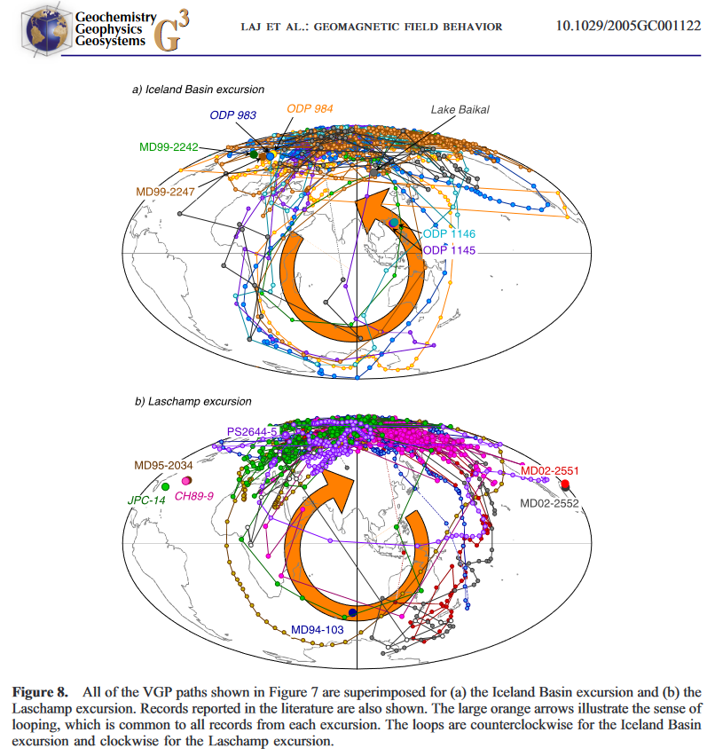
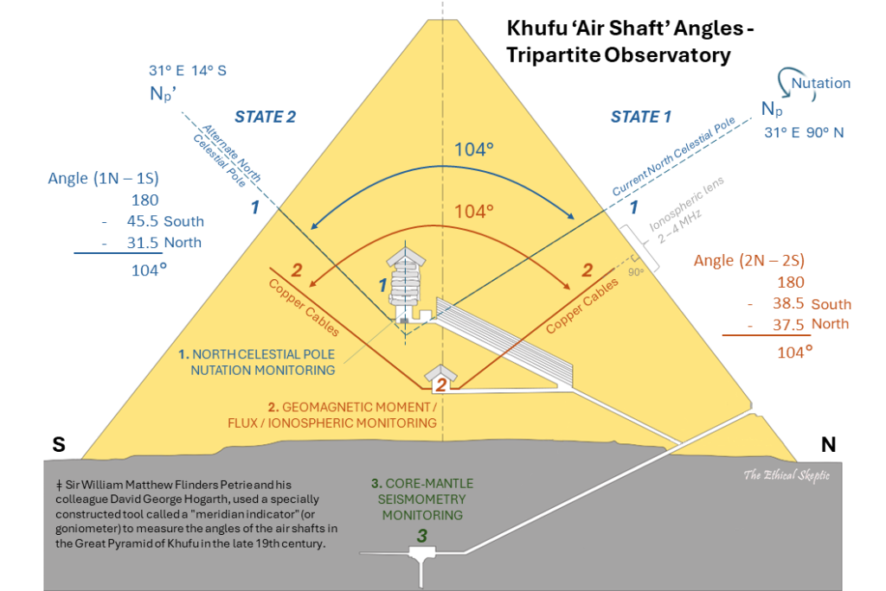

# Exothermic Core-Mantle Decoupling – Dzhanibekov Oscillation (ECDO) Hypothesis

*Posted on May 12, 2024 by The Ethical Skeptic*

The following material presents one of three novel hypotheses, each developed by the author through decades of dedicated professional and independent research. These original hypotheses form the foundation of The Ethical Skeptic’s ECDO Theory, which is summarized in this article.

*It is our contention that we are now well past an Indigo Point of exothermic core-mantle decoupling, and that we have incorrectly interpreted the heat presented by this transpiration as being caused by man’s activity alone. We now face the urgent need to detect the approach of a subsequent Tau Point Dzhanibekov oscillation in Earth’s rotation. During such an event, the outer rotational body (ORB) of the Earth, comprising the mantle and crust, decouples from the core at the H-layer. This decoupling is central to the mediated Dzhanibekov Rotation hypothesis discussed in this paper.*

*For decades, I was taught to view such a rotation and its resulting inundation as impossibilities, and I believed it. However, we lack the ability to distinguish a Dzhanibekov rotation from a geomagnetic pole excursion or flip. How, then, can we be so certain? My confidence in this long-held dogma has been shaken to its core.*

Decades ago, as a junior consultant still wet behind the ears, I was tasked with a project to boost the profitability of a men’s apparel retailer based on Manhattan’s Fifth Avenue. This brand had been a staple for nearly a century, the type of establishment likely frequented by characters from the series Mad Men during their lunch-hour shopping sprees or a surgical strike to replace a stained or substandard shirt before an important board meeting.

The retailer was facing brand erosion due to decades of stodgy bureaucracy and competition from more agile newcomers on Fifth Avenue. Men’s business shirts, particularly in blue and white, served as the anchor product or loss leader (when on sale) for this retail class. These shirts drew customers into the store from 10 AM to 4 PM, however the retailer was losing ground inside this segment. Sales of these staple shirts were declining, signaling broader challenges as customers took their money elsewhere.

Dressed in my best Hugo Boss suit, I spent several hours over multiple days in apparent nonchalance observing the men’s apparel department. I noticed shoppers’ frustration with finding the right combination of sleeve length, collar size, and button details within the brief time they allotted themselves for shopping. Typically, they had only 5 to 8 minutes to make a purchase. If they couldn’t find what they needed quickly, they left without buying anything else—and more importantly, they didn’t return.

To address this, I devised a nightly recovery process within the men’s dress shirts department. Every night at 10:30 PM, a stocking associate used a cart I had specially designed (one offered still in retail supply catalogs to this day) to remove all shirts from the sales floor and take them to the basement stockroom—part of the problem as well being shirts hidden out of customer sight as a result of this very recovery issue. There, the associate would restock each 10-shirt bin in the cart, organized by size, style, and color, heel-toed, and squared to perfection. No torn bags, no jumble-folds, no out-of-place or missing product tags. At around 8 AM the next morning, the shirts were returned to the sales floor, ready for the next sales day. Every fixture filled to perfection.

Rarity can drive price, but abundance drives interest. This system ensured that every customer could find the exact shirt they needed within seconds, purchase it, and leave within 8 minutes. This change realized several key benefits: high-wage sales associates were freed up to assist customers rather than reorganize stock, customers knew they could rely on finding what they needed in short order, affording them time to think of other things they needed, and the store saw less requirement for overstock sales due to improved presentation and less hidden inventory.

A year later, the Vice President of the retailer, who had initially dismissed the idea as ‘crazy,’ called to thank me. The project had not only tripled sales and doubled store traffic during critical hours but had also increased department profitability five-fold. He had won the company’s annual award for the initiative. This experience underscored the crucial distinction in brand management of comprehending value versus cost, or seeing the forest despite the trees standing in the way.

### Tree Dwellers and Tactical Fixation

No doubt, this article will be spun by science poseurs as constituting ‘conspiracy theory.’ This will only highlight the sad state of affairs within science, particularly in archaeology and Egyptology. Much of science today operates under a practice I describe as ‘linear (incremental) induction.’[1] We start by formulating an answer, which we then mislabel as a hypothesis. From there, we assemble a collection of observations which might appear to support or p-value our preconceived notion, while mandating that useful idiots socially discredit all competing theories or parties without substantial evidence. All the while hypocritically bemoaning the presence of any dissent inside those same social mechanisms. An example of this pathological old world syndicate elite thinking can be seen by clicking here.

This constitutes a severe form of confirmation bias called in military parlance ‘tactical fixation’. Such a process is particularly vulnerable to manipulation by external influences (agency as opposed to mere bias), leading to what we referred to in a previous article as the ‘Nelsonian Ignorance Trap.’

However, there exists a less common yet much more potent method of discovery, which conceives of science as an evolutionary process rather than a collection of immutable truths, inductive incremental validations, and entrenched syndicates. I refer to this approach as deductive critical path science, akin to ‘working the problem’ as known in detective work or military contexts. It begins with falsification of various notions and constructs supported by weak inductive evidence, and culminates in a living, breathing, sometimes threatening, theory – as opposed to standing dogma. This version of science does not require hordes of ‘science enthusiasts’ in order to maintain the faithful inside a state of belief.

Furthermore, peer review falls short in encompassing the essence of ‘working the problem’; instead, it often dismisses ideas perceived as unfamiliar or abhorrent by resorting to critique of tactics and trivialities. Researchers are acutely aware of this reality and as a consequence often limit their conclusions to highly constrained ‘might-be’ inference, title their work in a manner that does not accurately represent the study’s conclusions, express their findings in cryptic language, or embellish their work with excessive heuristic ornamentation—ultimately rendering peer review the epitome of conflict of interest. Many researchers have learned how to game this vulnerability.[2] [3]

The result of all this is that Narrative Science takes precedence over the actual scientific method, under a tenet of philosophy I call The Principle of Diminishing Scientific Returns. It is for precisely this reason why we often rely on Kuhn-Planck Paradigm Shifts to drive scientific advancement.

Indeed, such activity transforms into a process of ‘working the solution’ rather than working the core problem, thereby deviating from the fundamental principles of science. Such foible typically can only be perceived by outsiders.

*Orthodoxies run anathema to innovation; they merely know how to profit from or rule through it.*

Truly tackling a problem demands both deep situational awareness, along with innovative and deductive thinking from the outset. Starting the prosecution of a problem with complex and precise math or heuristics indicates a fundamental misunderstanding of how logical calculus operates. As a result, peer review often functions to bolster established club doctrine and, at most, make incremental refinements to what is already deemed correct. Novel ideas often meet their demise at the hands of what constitutes merely methodically applied opinion.

*The science of evolution was developed through critical path deduction for instance, while in contrast Covid-19 and climate science were promulgated through the awesome insistence of linear induction. These latter sciences have most recently failed us catastrophically.*

Throughout my career, I have often been summoned to leadership roles in research and laboratory environments precisely because of this distinction: the prevalent focus on subject fixation to secure science funding contrasts sharply with the objective-driven strategy of working the problem to achieve specific goals.

*Archaeologists’ unwillingness to develop any research that might remotely suggest a biblical flood or ancient aliens hypothesis has led to a compromise in the integrity of science itself. In reality, a religion is defined not by what it accepts as true, but rather by what it embargoes as unworthy.*

In the example of the early-career retailer scenario I described above, my role was to work the problem, not incrementally improve the tactics. My purpose was not to produce more inductive evidence as to how correct standing theory indeed was. Standing theory had already failed miserably, and the participants therein did not perceive this. I was tasked with assessing the broader picture—the forest—rather than deepening my expertise and securing additional funding by fixating narrowly on the trees.

### When Working the Problem, First Seek to Falsify

*When you have eliminated the impossible, whatever remains, however improbable, must be the truth.*

*~ Sherlock Holmes, “The Sign of the Four” by Sir Arthur Conan Doyle*

Within this article, readers will be introduced to a hypothesis derived from the critical path deductive process outlined above. A deductive process is not subject to the apophenia that a linear-inductive ‘connect the dots’ approach might be vulnerable to, as deduction reduces the set of viable explanations rather than promoting a preselected one. To that end, this hypothesis represents the last idea considered, only after all other possibilities have been falsified (see Image 1). It is the alternative one has to be dragged kicking and screaming into objectively assessing, after every other idea has failed.

**Image 1** – Waterline Erosion ‘Dead Body’ Falsification Event – Earth’s oceans have been displaced in the past, and have done so over a significant period of time (10 – 50 years). Long enough to carbonic acid dissolve the Tura limestone casing of both the Khufu and Khafre pyramids. If a hypothesis does not explain this specific Khafre erosion waterline feature conclusively, then it is not a scientific hypothesis.

I want to make it clear that I dislike this alternative. At its heart, the hypothesis involves what is called in philosophy, an ‘unfalsifiable prediction through indefinite timing’ (Point Tau below). I dislike such notions – favoring context-and-control testable predictions as one of the elements of true hypothesis. In fact, I opposed this idea vehemently for decades. Like many of my colleagues, I had grown weary of hearing Noah’s flood theories, and had attained a level of cynicism regarding the matter as well (not skepticism).

However, I was wrong – finally setting my mind to develop its probative construct (not a ‘final answer’) only after having falsified every single previously favored notion or alternative I or others could muster.[4] Thereafter, this hypothesis exists as a probative construct – as there is no possible way for it to be 100% correct out of the box. It is a working and evolving set of ideas—thoughts that have been doggedly embargoed from the collective consciousness of science.

*The majority of archaeologists lack extensive seafaring expertise and are not versed in materials science research. As someone with deep experience in both domains, the significance of what is shown in Image 1 is readily apparent to me. Moreover, if a standing hypothesis fails to address the deductive evidence shown in Image 1, it is not a scientific hypothesis – rather a political technology.*

Furthermore, this hypothesis includes several predictive elements that are substantiated upon detailed examination, as will be demonstrated in the subsequent sections of this article and have been outlined in our preceding article.[5] Initially, I considered this theory extremely unlikely, comparable to the improbability of conjecturing a murder. Yet, my perspective underwent a dramatic shift after inspecting the exterior of the Khafre Pyramid. The evidence I observed there was as compelling as the discovery of a dead body, motivating me to now pursue this most improbable path. Despite its initial apparent implausibility, this hypothesis presents the most robust ‘probative construct’ I have encountered regarding this topic, particularly in its description of the ‘function’ of the four ‘air shafts’ within the Khufu pyramid. This construct will continue to be modified into the future of course – but more importantly, it constitutes a paradigm shift, one which allows science to move forward and no longer wallow in appeal to authority and prior plausibility. Ockham’s razor has been surpassed, and plurality is now necessary.

*One can scream all they want about how ‘experts have concluded…’. If I find a deceased individual in the living room immediately after a party, it doesn’t matter how many expert attendees testify that the party went fine; the dead body proves otherwise. Khafre’s erosion marks constitute a ‘dead body’. Khafre ocean submersion falsifies convention and serves to introduce a necessary deductive critical path construct, and absolutely everyone is ignoring this.*

For more deductive evidence and hypothesis detail behind this, see our article Hidden in Plain Sight.

### The Heat Between Indigo and Tau

Points Indigo and Tau are inflection and tipping points that I often utilize when analyzing strategies, campaigns, problems, or deceptions. The Indigo Point is a critical juncture where plans are quietly set in motion, potentially irrevocably, steering towards a predetermined Tau strike point. Although not an exact match, functionally, Point Indigo aligns with Ray Bradbury’s concept of the butterfly effect, where minor, early changes serve to precipitate significant later outcomes. Conversely, Point Tau resembles Malcolm Gladwell’s notion of a tipping point— a moment when the issue of outcome becomes apparent and it is too late for direct intervention to alter the course of events.

*Between points Indigo and Tau, the underlying process may often be concealed, with its elements considered normal, irrelevant, or mistakenly attributed to other factors. At point Tau, all hell breaks loose.*

For the sake of comprehension therefore, I have chosen to present the hypothesis described here in terms of both its Indigo and cryptic inception—where actions are subtly set in motion and might even be misinterpreted or misattributed—and its inevitable Tau strike point, the culmination of the entire set of events.

*A culmination of events that ancient civilizations have endeavored to communicate as they understood them, through artifacts, symbolic art, stone circles, and high altitude monuments across the millennia.*

## Indigo-Point Exothermic Core-Mantle Decoupling – Tau-Point Dzhanibekov LLVP Oscillation (ECDO)

### Point Indigo (Construct and Critical Path) – Exothermic Core-Mantle Decoupling and Heat Transfer Inflection

This sequence of events, that we refer to as the Indigo Point set, initiates with a weakening of the core magnetic moment and the associated core-mantle magnetic coupling, which currently influences the position of our geographic North Pole (Np) (what we call ‘priority’). Following this, there is a transfer of exothermic heat from the core into a network of Large Low-Velocity-Shear Provinces (LLVPs) within the Earth’s viscoelastic mantle, with the most notable being the ‘South Africa Cusp’. This activity contributes to consistent and sometimes dramatic ocean warming, as we all observed in 2023, and also leads to the heating of the northern hemisphere tundra – with the resulting forced methane release thereby causing methane ppm’s to significantly exceed forecasts of climate models.

**Exhibit A** – Heat contribution from the core feeds into the mantle, avoiding the red-hued Large Low-Velocity-Shear Provinces under the south African continent (SAC-LLVP) and Pacific ocean (see Exhibits E and E2).[6] As a result, these massive structures also become less dense as compared to the surrounding core-fed mantle.

A. Weakening of the core-mantle magnetic coupling (Earth’s geomagnetic moment) and North Pole (Np) priority.

B. Contribution of exothermic kinetic energy (heat) into the Earth’s mantle (see Exhibit E2), excluding the axially-located Large Low-Velocity-Shear Provinces (LLVP – see Exhibit E) – which become relatively lower in density as compared to the surrounding core-fed mantle.

C. Causing dramatic ocean SST and northern hemisphere tundra warming, along with a resulting forced carbon dioxide and methane release.

Most of this Indigo Point chain of events is outlined in our article The Climate Change Alternative We Ignore (to Our Peril). It is also summarized in this graphic.

### Point Tau (Prediction) – True Polar Wander Event – Gyroscopically Mediated Dzhanibekov Decoupling Tip-In (104º flip along the 31º E Meridian)

In our continued expansion of the ECDO theory, a critical tip-in, or Tau Point, manifests with a significant geological event. This pivotal occurrence involves the substantial contribution of heat from the phase state change of hexagonal close-packed iron (HCP-Fe) into the entire Earth’s mantle, save for the South Africa Cusp and Pacific Large Low-Velocity-Shear Province (LLVP) group of mantle formations (left side of Exhibit A above). This infusion of dense, metallic mass at a key geodynamic nexus is hypothesized to catalyze an increasing gyroscopic moment commensurate with a reduction in the geomagnetic permeability of the Earth’s core. The geographic North Pole (Np) is theorized to realign to a new position, designated as Np’ in Exhibit B to the right, which is projected to occur along the 31° East Meridian—a line of longitude notably shared with the ancient and enigmatic Khufu Pyramid. This realignment, shifting approximately 104 degrees, represents a dramatic reorientation of the Earth’s rotational axis,or what it called a True Polar Wandering (TPW) event,[7] underpinning the transformative implications of the ECDO theory at this Tau Point.

**Exhibit B** – Conceptual Dzhanibekov Rotation based upon the ECDO Theory and established LLVP lower density axes within the Earth’s mantle.

D. Once past a specific threshold of reduced magnetic moment, the core-mantle magnetic coupling gives way to a gyroscopically mediated form of Dzhanibekov rotation from Np to Np‘ (104º along 31º E longitude – the same meridian as the Khufu Pyramid).

The H-layer of the core accelerates its exothermic sloughing, and this material-shedding effect serves as a kind of ‘infinite lubricant’ between the core and the mantle, allowing the two bodies to rotate independently (as shown in Exhibits J and J2).

It is our contention that we are now well past Point Indigo in this process, have incorrectly interpreted the heat presented by this transpiration as being caused by man’s activity alone, and now face a need to detect the approach of a Point Tau Gyroscopically Mediated Dzhanibekov rotation.

This broaches the question, How does one go about detecting the onset of such an event?

### Dzhanibekov Dynamics and Rotation

The Dzhanibekov Effect, also known as the tennis racket theorem, refers to a phenomenon observed regarding rotating bodies in space, where an object with three distinct momenta of inertia (axes of rotation) behaves in a counterintuitive way when rotated. Discovered by Russian cosmonaut Vladimir Dzhanibekov while in Earth orbit, the effect became particularly famous after he observed a wingnut flipping unexpectedly when spun.

**Exhibit C** – Pure Dzhanibekov Effect on a symmetrical object rotating in space. Rotation around its intermediate axis forces a flip in the axial dynamics. [8]

The effect occurs because the intermediate axis theorem states that rotation around the object’s intermediate axis (neither its maximum nor its minimum inertia axis) is unstable. [9] When an object such as a tennis racket or a wingnut is tossed with a spin around this intermediate axis, it eventually flips around, rotating about the other axes, leading to a sudden and unexpected shift in orientation.[10] This surprising behavior highlights unique stability characteristics in rotational dynamics, particularly in the microgravity conditions of space.

While our theory references the Dzhanibekov Effect, it is crucial to understand that Earth’s real three PIM-axis body application (see Exhibit C2 to right) diverges in part from the classical three-axis definition observed in space (Exhibit C).[11] Our model does not strictly adhere to the traditional Dzhanibekov Effect definition, where an object flips 180 degrees due solely to rotational instability around its intermediate axis (Exhibit C above). Instead, we explore how similar principles could influence Earth’s rotational dynamics under different conditions, specifically,

**Exhibit C2** – Mundi and Euler Dense Axes – contrast sharply with the LLVP axis we estimate (extracted from the cited Wenying, et al. Geodynamics 2020 study).

1. a reduction in the geomagnetic coupling between the Earths’ core and its mantle as the core’s geomagnetic moment, which helps to keep the present polar rotational axis as priority, fades,

2. destabilization caused by the Earth’s hotter mantle versus less-dense Large Low-Velocity-Shear Provinces (LLVPs), and in particular the center of low-mass in the South Africa Cusp LLVP. This core material infusion can potentially polarize the Earth’s rotational momentum, leading to significant shifts in the planet’s rotation around its maximum axis (the remaining dense mantle), and

3. a gyroscopic 104 degrees (relative to the current polar axis, see Exhibits H and J) mediation of the Dzhanibekov effect—not the 0 to 180 degrees typically illustrated in simpler physical models (Exhibit C).

This adjustment in our theoretical approach highlights the unique application and adaptation of rotational dynamics principles to the geological and magnetic complexities of Earth’s interior. The theory thus introduces the terms ‘dynamics’, ‘mediated’, and ‘rotation’ to describe these complex interactions rather than a direct ‘effect’ in terms of Dzhanibekov’s observation with regard to rotating 3-axis bodies.

### Large Low-Velocity-Shear Province (LLVP) – Earth’s Hidden Gyroscope

Large Low-Shear-Velocity Provinces (LLVPs) are significant geophysical features located deep within the Earth’s viscoelastic mantle, particularly at the boundary with the core, ranging upwards towards the asthenosphere of the Earth, to around 2,900 kilometers below the surface. These regions are differentiated by their seismic properties; specifically, seismic waves travel through these structures at slower speeds as compared to surrounding materials. This anomalous behavior suggests that LLVPs are both hotter and less dense than the majority of the Earth’s mantle.

**Exhibit D** – South Africa Cusp – Large Low-Velocity-Shear Province (SAC-LLVP) tomography structures (red) and centroid (yellow) at the southern tip of the African continent. The lighter axial centroid of the SAC-LLVP aligns precisely with the 31st East Meridian, which also passes through the Giza Plateau—positioned 104 degrees offset from the current North Pole.[12]

There are two primary LLVP structures, which we refer to herein as ‘SAC’ for South Africa Cusp, and ‘PAC”, for Pacific. Both are rather massive, about twice the size of our moon, and constitute a sizeable differential in terms of georotational mass moment.[13] [14]

*Bear in mind that the Earth’s mantle is anisotropic, while most of our tomography and science concerning mantle density and specifically Large Low-Shear-Velocity Provinces (LLVPs) has been developed within the last decade.*

The two LLVP structures are found beneath Africa and the Pacific Ocean – acting like low-density poles along a kind of gyroscopic axis of their own within the Earth’s mantle. They are massive in scale, each covering a substantial portion of the lower mantle. These formations are regarded to be potentially less dense than the surrounding mantle matrix. While in contrast, the orthogonal (90-degrees of longitude offsets – 30°E – 120°E – 150°W – 60°W) below-identified Euler axes are denser and vary little in their relative density to each other (△PIM (A, B, C) = .35%).[16] We believe this interleaving of heat and low density zones, by the 90-degree intervals depicted in Exhibits E and E2, to be no coincidence.

**Exhibit E** – LLVP Formation Less-Dense Axial Centroids – align at the 30°E/150°W meridians, while being 104 degrees offset from the current North Pole, inside the south tip of the African continent.[15] Chart is from the referenced Mcnamara, et al. study, however the yellow and text annotations are ours.

*Thus, there is a clear perpendicular relationship between the True Polar Wander (30°E and 150°W meridians) great circle and ENSO geothermal heating along the orthogonal Euler Axes (120°E and 60°W meridians) great circle.*

Moreover, these Euler Axis geographic points both reside at the east and west centroids of sustained oceanic heating (ENSO or El Niño-Southern Oscillation events). We conjecture that this heat originates from the latent energy of phase-changing core hexagonal closepack iron (HCP-Fe) being introduced from the Earth’s core and into its mantle.[18]

**Exhibit E2 – Contrasting Orthogonal Euler Axis Heating Centroids** – align at 120°E/60°W longitudes. Oceanic heating centers on these East and West Euler Axes, which we also identify through other analytical approaches later in this article.[17]

This mass adds to the overall mass of the maximum moment inside the Earth’s 3-PIM rotational body, helping to precipitate a True Polar Wander event. The LLVP formations in contrast (Exhibit E), serve as a minimum axis, with the rest of the mantle forming a hot 3-PIM maximum-axis set (Exhibit E2). When combined, these serve to gyroscopically compete with the magnetically coupled axis, as well as mitigate a pure 180 degree Dzhanibekov rotation departure from that geomagnetic axis.

As can be seen in Exhibit E, the central part of the African Large Low-Shear-Velocity Province (LLVP) lies beneath south tip of the African plate, with hotspots appearing to concentrate along the LLVP’s boundary. In the mid-mantle, seismic tomographic models reveal broad slow seismic wavespeed anomalies beneath the African craton,[19] commonly interpreted to be heat plume upwellings from the outer core.[20]

*Take note that the African LLVP tapers with both the Rift Valley, as well as the 31st East Meridian through the Giza Plateau. This is significant.*[21]

Exhibit F below shows a conceptual depiction of this minimum/maximum gyroscopic axis formed by the two LLVPs. It is extracted from the referenced Cottaar, et al. study, with our annotations shown in yellow and blue text/lines.

**Exhibit F** – Moment Map of Earth’s Hidden Gyroscope – Three perspectives of the LLVP structures under Africa and the Pacific, along with a conceptual depiction of the axis of gyroscopic moment (thick yellow line) based upon the South Africa Cusp centroid of the African LLVP.[22]

However, in the interest of precision, let’s examine a more objective and recent (2021 tomographic) measure of the geographic position of the South Africa Cusp – Large Low-Velocity-Shear Province (SAC-LLVP). In the extracted Exhibit G below, from the referenced Tsekhmistrenko, et al. 2021 study, one can observe the intersection of the cusp’s radial centroid and the 31° E Meridian.

**Exhibit G** – South Africa Cusp Radial Center of Mass – 2021 tomography indicating the geographic position of the South Africa Cusp – Large Low-Velocity-Shear Province (SAC-LLVP). Please note that the red lines and annotations ‘Radial Centroid’ and ‘Meridian’ are our added highlights.[23]

*The reader should note that, while the longitude of point 4 (green ball) on the chart shown in Exhibit G above is arguably the 31st East Meridian, the same one upon which Giza is located, there exists a range of latitude inside which a center of LLVP lower density might be assigned. The north-south placement could range from 8 to 18 degrees south latitude. We chose 104° (103.5° +⁄− 1° or 13.5° South Latitude) for consistency in the specific scenario of conjecture here. As well, this angle corresponds to 90 degrees of cardinal rotation through Dzhanibekov effect, combined with a very reasonable and common 14 degrees of gross (not longitude dependent) magnetic pole variation (angle between core magnetic and rotational poles – under the same definition convention used in celestial navigation). Thus, one should note that this in no way constitutes a petitio principii appeal.*

*Furthermore, regarding the argument of a ‘lack of recorded history’ for such Dzhanibekov shifts, consider this: if the Earth’s geomagnetic core maintained its current orientation while a Dzhanibekov rotation occurred in the mantle and crust (Exhibit I below), such an event would be interpreted as a geomagnetic pole excursion in the field of paleomagnetism. This is due to our current methods of measurement. Over a prolonged period, we would not have the means to distinguish between a Dzhanibekov rotation and traditional geomagnetic pole shift (see note[24]). Moreover, during a short Khafre-styled reversal of say 10 to 50 bitter cold, dark, and wet years, we might not be able to detect such a Dzhanibekov rotation at all, even in ice cores.*

We posit therefore, that the centroid of the South Africa Cusp serves to act as the minimum gyroscopic-Dzhanibekov axis point during a decoupling of Earth’s mantle and core, serving to potentially rotate the Earth’s gyroscopic mass along a new geographic axis of Earth rotation (Np‘), with the center of less-dense mass of the South Africa Cusp now pointing directly at the celestial North Pole (Polaris, Ursa Minor, etc.). The gyroscopic plane of higher mantle mass therefore would reside perpendicular to the LLVP axis, as depicted in Exhibit G above. The old geographic axis of Earth rotation (current ‘North Pole’) is also marked (Np).

**Exhibit H** – Dzhanibekov SAC-LLVP longitudinal (meridional) center of cusp (less dense mass) in relation to the Giza Plateau meridian and North Pole. 104 total degrees, bisected with a mid-point in central Turkey – which just happens to also be the Geographic Center of the World.[25] This is no accident. This serves as the basis of an authentication, which will be examined in Exhibit L below.

*Of a most curious note, 31° East, 38° North, the bisecting latitude location in Exhibit H above, which matches the Queen’s Chamber on the right side of Exhibit L below – was regarded by the ancients as The Geographical Center of the World (until update by computers in 1973).[26] This explains why the two sets of star shafts in Exhibit L are depicted for this location in central Turkey, and for Giza. This is not a coincidence.*

*Nor is it an accident that Africa’s Rift Valley falls right on the 31st Meridian—as this is where the SAC-LLVP upwelling is occurring, which serves to form the light-moment axis of rotation in our proposed State 2, gyroscopic rotation, below.[27]*

The principle shown in Exibit H above is developed in terms of the physics of rotating bodies below. The special form of rotation proposed by this article, we call a Gyroscopically Mediated Dzhanibekov Rotation (last scenario on the right in Exhibit I below).

**Exhibit I** – Gyroscopically Mediated Dzhanibekov Rotation – not a retrograde rotation. What we postulate is a modified pure Dzhanibekov Effect rotation (Exhibit C), which does not complete fully – being mediated by the gyroscopic effect of the differential mass planes between the LLVP less dense axis versus the more dense surrounding mantle. This more dense body serves as a form of gyroscopic wheel, forcing the Earths rotation to conserve momentum by taking on a gyroscopic stability priority, and neither a core-mantle coupled nor pure Dzhanibekov rotation. Note that the first two rotation concepts adhere to the ‘right hand rule’ of ‘Arctic’ polar definition. The latter two indicate the ‘former Arctic’ in each scenario.

*Key inference to be taken from the rightmost two images of Exhibit I above: The science of paleomagnetism possesses no method to detect a Dzhanibekov rotation, as distinct from a geomagnetic pole excursion or flip. So an appeal to ignorance here, is worthless.*

Now, let’s take the modified scenario at the right end of Exhibit I above, and arrange it into the graphic extracted from the Cottaar, Lekic, et. al study which we examined in Exhibit F earlier.

**Exhibit J – The Solution – Inertial Interchange 104° True Polar Wander (IITPW)** – Internal schema of core, mantle, SAC-LLVP, and PAC-LLVP in relation to the Gyroscopically Mediated Dzhanibekov Rotation. The ‘mediation’ involves the intervention of the lighter moment of Earth’s mass distribution—composed by the net centroids of its LLVP structures, this becomes Earth’s new less-dense Conservation of Angular Momentum (gyroscopic) rotational axis.

*The reader should note that in this scenario, geomagnetic north has not moved; rather, it is the mantle, asthenosphere, and lithosphere (crust) that have undergone rotation. The sloughing of the H-layer acts as a lubricating mechanism between the core and the mantle, facilitating this process, much like applying duct tape to a ball of melting butter—it simply won’t adhere.*

Earth’s core remains in its same stable rotation – albeit bearing a weaker magnetic moment, and with a slightly lower total mass. The H-Layer affords the disconnect between the mantle and core’s rotating masses. We address the combined mass of the mantle and crust (mesosphere, asthenosphere, and lithosphere) as the outer rotational body (ORB), for short.

A history of this type of rotation we propose here, along with the precedent scientific study for this geophysical moment alternative approach to Earth’s rotational dynamics is outlined in Kirschvink, et al. 1997. Relevant conclusions from that study are cited below.

*Early to Middle Cambrian inertial interchange true polar wander event, during which Earth’s lithosphere and mantle rotated about 90 degrees in response to an unstable distribution of the planet’s moment of inertia.*

…at least two tectonic plates, involving more than two-thirds of Earth’s continental lithosphere, were involved in a rapid rotation of ~90° relative to the spin axis. The new ages, along with paleomagnetic data, indicate that continents moved at rapid rates that are difficult to reconcile with our present understanding of mantle dynamics. A variant of this mechanism, inertial interchange true polar wander (IITPW), involves discrete bursts of TPW of up to 90° in geologically short intervals of time if the magnitudes of the intermediate and maximum moments of inertia cross.

This would result in a **rapid movement away from the spin axis by the geographic location of the former pole with rotation of the entire solid Earth centered about the minimum moment of inertia** located on the equator. If the velocities are due to TPW, however, such geodynamical considerations are obviated because **the entire mantle would have rotated along with the lithosphere.**

~ Evidence for a Large-Scale Reorganization of Early Cambrian Continental Masses by Inertial Interchange True Polar Wander, Kirschvink et al. (1997)[28]

With ‘The Solution’ identified now in Exhibit J, forgive me, dear reader, as I must ask you to endure one more complex graphic. This graphic describes the entire set of physics behind the oscillation (repeating cycle) of Dzhanibekov rotation. Exhibit J2 below presents the pair of Earth rotational conditions and further outlines the physics involved in each state: Geomagnetic Priority and Gyroscopic Priority.

**Exhibit J2** – The repeating cycle of core exothermic sloughing followed by subsequent endothermic accretion creates a repeating oscillation based on the variable strength of the geomagnetic moment of the Earth’s core (green annotation in Exhibit J2). This process operates through the Dzhanibekov effect and the Earth’s mantle’s gyroscopic angular momentum. We speculate that the process of moving from State 2, Gyroscopic Priority, back to State 1, Geomagnetic Priority, may involve a viscoelastic-mantle tectonic height readjustment and gradual settle-in process, however involving a relatively sudden cooling event at the point where the core recaptures its HCP-Fe lattice integrity.

**State 1: Geomagnetically Induced Mechanical Equilibrium (Core-Mantle Coupled)**

Description: In this state, the gyroscope’s axis of spin is aligned with the applied magnetic field, and the weighted wheel is not rotating around the spin axis. The system is stable due to the magnetic forces, resulting in a balanced, equilibrium state.

**State 2: Conservation of Angular Momentum by Rotation Axis (Core-Mantle Decoupled)**

Description: When the external magnet is removed, the gyroscope wheel returns to its plane of rotation (which has not changed in either State). In this state, the gyroscope conserves angular momentum through its rotational axis, with the magnet decoupled, allowing the rotational motion to resume.

This plausible (or arguably probable) oscillation, along with the mythic traditions of over 20 cultures, serve to broach the critical path question: Why does does such an event not show up in the paleomagnetic or ice core sample data?

*Footnote on True Polar Wander and Khufu Alignment: Concerning the contention that a return from State 2 would not likely result in Khufu being aligned so precisely to true north upon resumption of State 1.[29] While this issue is indeed salient, it is merely inductive, appeals to ignorance, is exposed to the possibility of accident, risks tolerance vulnerability, relies on cherry-picking/cultural grandstanding, and does not rise to the level of a falsification. We plan to monitor this observation set (multiple monuments) over time however.*

### A Geologic Appeal to Ignorance? Maybe Not…

While researching this issue, I found that most paleogeomagnetic dipole moment studies unfortunately reside behind annual subscription paywalls. Nonetheless, I discovered that the typical temporal resolution of these studies is on the order of two to four thousand years at best.[30]

**Figure 8** – Laj and Lund Studies on Geomagentic Excursion Histories.

Nonetheless, the bottom line is this: aside from the Leschamps excursion event 41,000 years ago, we lack strong differential data (unique from static measures) on the history of Earth’s dipole moment. However, what macro-scale data we do have links mass and large-fauna extinctions with dipole phenomena at the very least.

*From what we know about field strength through time, over the last hundred thousand years, there does appear to be a linkage between extinctions and low geomagnetic field strength.*

*~ James Channell, University of Florida Geologist, NPR*[31]

It is worthy to note however, that two recent geomagnetic excursions, the 41,000-year-old Laschamp Event (lower panel of Figure 8) and the up to 187,000-year-old Iceland Basin Excursion (upper panel of Figure 8) paleomagnetic core records, followed a Virtual Geomagnetic Pole (VGP) progression that conformed to the 31st Meridian polar shift conjectured in this article. See both progressions in Figure 8 from that study, to the right. Notice that both excursions followed the same geographic route, which was drawn to the SAC-LLVP Cusp as each event progressed, eventually reverting back to State 1 (clockwise) or to State 2 (counterclockwise)—both along the 31st Meridian.[32] The Lund Study on the Laschamp and Iceland Basin Excursions shows similar pathway derivations to the Laj Study as well.[33]

*Note as well that the Laschamp excursion from State 1 to State 2 initiated with a change in geomagnetic pole geographic location, starting from Canada and moving into Russia, a pattern that also began for our modern era in 1973.*

It is important to note that, under this hypothesis, the period during the shorter duration of State 2 does not constitute ‘business as usual, just upside down.’ The pronounced volcanic activity and ocean displacement would make the world a cold, wet, and dark place during the intervening years of decoupled rotation. In other words, Greenland, Antarctic, and Lake Vostok ice cores and the resulting accelerated carbon-14 deposition rate may not clearly reflect the net impact of such a short and cold rotation period. I tend to place more inferential confidence in human myth with corroborating physical evidence to the presence (Euler Axis desert hashmarks), than in the mythological precision of a smoothed index suggesting an absence.

### Earth Bears the Euler Axis Hashmarks

Finally, below is a short video illustrating the concept of the Mediated Dzhanibekov Oscillation between Geomagnetically Induced Mechanical Equilibrium (State 1) and Conservation of Angular Momentum by Rotation Axis (State 2). Special thanks to Craig Stone at nobulart.com for developing this video. Before proceeding to the next section, please pay particular attention to the location and celestial pole angles of the Great Pyramid at Giza depicted in the video.

**Exhibit J3** – Mediated Dzhanibekov Oscillation with the rotational north axis cycling between 90° North (State 1) and 14° South (State 2) latitude (104 degrees) along the 31st East Meridian of longitude. The lever driving this cycle is the strength of the core’s magnetic moment. We currently rotate in State 1, with a strong-but-diminishing geomagnetic moment. The only thing in the video which differs from the hypothesis presented in this article is that the core of the Earth would not Dzhanibekov rotate with the outer rotational body (ORB = mantle + crust). It would continue to rotate as it does in State 1.

The ECDO rotation shown in Exhibit J3 is consistent with the major oceanic-inundation desert formations across the globe, including the Gobi Desert, American Southwest, Great Victoria Desert, Patagonia, and the Sahara Desert.[34] [35] The Arabian Desert may well have occurred as the result of a settle-in process unique to the Arabian Tectonic Plate after or during return to State 1. Hence the seemingly more recent receding shorelines back to the Persian Gulf.

**Exhibit J4 – West and East Euler Axes** – a violent 48 hours. The axis around which the Earth would temporarily rotate to shift the geographic North Pole to the new location (Np‘). Indicated on the chart are the theoretical initial oceanic inertial velocities at original angular momentum and the resulting deserts and striations which would form from such an oceanic displacement. It is no coincidence that human, fauna, and flora genetic diversity is greatest at these two ‘eye-of-the-hurricane’ stability points (blue areas) during a 104° ECDO rotation from State 1 to State 2. Sub-Saharan Africa as well is partly spared due to its shielding by the North African continental mass and high deserts as well as its variances in land mass elevation. Special thanks again to Craig Stone at nobulart.com for developing this image (click image to expand).

Moreover, the ‘East and West Euler Axis Mundi’ (demarcated by the green arrow vector in Exhibit J3 and yellow/red ⊕ symbols in Exhibit J4) are the points at (0°, 121°E) and (0°, 59°W) respectively, representing the axis around which the Earth would temporarily rotate to shift the geographic North Pole to the new location (Np‘) at 31°E, 14°S. This terminology aligns with the concept of Euler’s rotation theorem,[36] describing the temporary orthogonal axis of rotation for this specific geophysical event. Deserts formed from oceanic displacement, along with the terrestrial striations from this kinetic event, cleanly match both poles of the Euler Axis Mundi.

Craig Stone has pointed out as well that past geomagnetic pole excursion events have clustered on both the East and West Euler Axis Meridians we identify immediately above.[37] This is not a coincidence.

### Survival of Genetic/Biological Diversity Clusters at Euler Axes is No Coincidence

One should note that the optimal location for inundation-survival in the Western Hemisphere under this scenario, would be the Ecuadoran and Peruvian Andes, along the coast just west of the Euler Axis in South America. From the perspective of the East Euler Axis, a similar location for survival of such an event would reside at Sulawesi and Gunung Padang, Indonesia.

Perhaps this is the reason why the oldest cave art in the world (51,200 years old) can only be found at Leang Bulusipang, Sulawesi[38] – which is a cave at an altitude of 1800 feet positioned right on the East Euler Axis.

Perhaps as well, this is why we find Mankind’s oldest surviving genetic components, originating near the East Euler Axis in the forms of homo floresiensis, the extraordinary genetic distribution of Indonesia, along with our most ancient genetics in the Papuan, Austronesian, Orang Asli (Semang), and Andamanese Aborigines. Ample and recent genetic study using mitochondrial DNA and Y-chromosome data, such as those published in Nature Genetics, American Journal of Human Genetics, Investigative Genetics, and Nature, have shown that Indonesian populations are among the most genetically diverse in the world. Finally, these genetic clusters show clear association with the most ancient Amazonian tribes existing along the West Euler Axis as well.

*Notwithstanding the environment of Sub-Saharan Africa, these two Euler Axis locations are the most genetically diverse (across all species) locations on the planet. We believe this to be no coincidence.*

As our discussion transitions from geophysical analysis to mankind’s related history and mythology, it is appropriate to segue by noting that the ECDO rotational construct outlined thus far is consistent with detailed descriptions of events as related by ancient cultural legends, as will be seen towards the end of this article. Meanwhile, to wit:

*When the water god Gong Gong saw that he was losing, he smashed his head against Mount Buzhou, a pillar holding up the sky. The pillar collapsed and caused the sky to tilt towards the northwest and the earth to shift to the southeast.*

*~ Chinese Nüwa Indundation Myth[39]*

In fact, in the State 1 to State 2 transition depicted above, China rotates in exactly this fashion.

## The Prescience of Giza (Khufu Finally Solved)

*The popular fairy tale that this pyramid was the burial chamber of Pharaoh Khufu has been sufficiently falsified.*
*In the broader scheme of things, wonder, as it turns out, is more vital than mere information.*

Below, the reader may grasp why such a monumental endeavor might have been shrouded in commemorative silence. This was no mere feat of construction, but a task of utmost importance for the survival of future generations. The monument itself inspired a profound sense of purpose in every engineer, superintendent, and laborer. It was not just about building a pyramid; it was about safeguarding the legacy and continuity of mankind. This structure was not in any way, shape, or form a burial chamber.

The monumental work around the Exothermic Core Cycle addressed by this structure may even continue to this very day. Although not definitive, the symbology below suggests a purpose for the purported activity in the anomalous structures found in Antarctica. Has this group been successful in their quest? I do not know the answer to this; however, I do know that those who lie to cover this up do so under the contexts of control and malice.

**Image 2 – US Navy LCDR Seal ‘Spartan 1’ Anomalous Finding Markings** – marked into the door or the ‘Octagon,’ Antarctica, 2003 (right panel). Matched to a coin from antiquity found in Mexico in 1993 (left panel) – possibly suggesting a 6,000-year cycle. Matched as well to both Np and Np‘ as depicted in our argument below (center panel). Left and right panels are from this 2019 production by Linda Moulton Howe. Center panel is an east-facing perspective (the same direction that the Spinx gazes) of Exhibit K below.

**Image 3 – Reverse Side of Coin** – The coin in the left panel in Image 2 above has a reverse side with a radial symbol stamped into it. That symbol is recreated in the central panel of this, Image 3. The coin proportions exactly along the 55% radius of the Earth’s core and the 19% radius of the Earth’s inner core, in relation to its whole body radius. This makes the core arguably 30 to 40% of the Earth’s total mass, depending upon the phase state, lattice, and density assumptions employed. This raises the question, how did the maker of the coin know this?

The back of the coin shown on the left side of Image 2 above is stamped with a radial diagram divided into 12 and then 24 segments in radial progression (Image 4 to the right). That radial pattern is recreated in Image 3 above. If we recreate this symbol according to even proportions, the symbol matches the radius proportion of the Earth’s core in relation to its entire body. While the hypothesis below does not depend upon this observation, it is certainly intriguing. Perhaps the additional symbol found by Spartan 1 on the same 20 ft door in the Antarctic Octagon was suggesting a shift in the positional relationship between the core and its mantle? Possibly the core reversing its relative motion with the mantle as of late indicates that someone (I make no conjecture as to ‘who’) is achieving success?[40]

**Image 4 – Back of Coin Matched to Antarctic Door Symbol** – Symbol also found by Spartan 1 in Antarctic ‘Octagon.’

Are such markings analogous to the 104° angle marks on the three pyramids etched into the surface of the 7,000 year old Nubian Ostrich Egg as well (which we outlined in our previous article, Hidden in Plain Sight)? Was this principle of a celestial pole observation function of Khufu well known in antiquity? This is all of course, mere speculation, and the angle marks on the egg could simply be coincidence. Nonetheless, something of this nature was being communicated by the markings on the Nubian Egg. The etching strikes were deliberate and related the three pyramids to the sky in some manner.

Returning to our critical path, scientist and amateur investigator alike have long wondered why the Khufu Pyramid has been positioned so tantalizingly close to the center of Earth’s landmasses[41] and the 30th North Parallel (reader please be aware that, in the vernacular of celestial navigation, a latitude is called a ‘parallel’ and a longitude is a ‘meridian’). Khufu’s positioning so as to inherit its location at the nominal 31st East Meridian is of course simply a matter of Greenwich, England having been selected as the demarcation point for the Prime Meridian, so that was deliberate.

However, Khufu’s specific positioning at the very longitude which just happens to also be named the 31st East Meridian is not an accident, in that this meridian is the very line of progression between the current North Pole (Np) and the proposed alternative SAC-LLVP based North Pole (Np‘) – anchored upon the axis of gyroscopic dynamics depicted in Exhibits F, I, and J above.

*Thus in the period of eleven thousand three hundred and forty years they said that there had arisen no god in human form; nor even before that time or afterwards among the remaining kings who arise in Egypt, did they report that anything of that kind had come to pass. In this time they said that the sun had moved four times from his accustomed place of rising, and where he now sets he had thence twice had his rising, and in the place from whence he now rises he had twice had his setting;*

*~ Herodotus, An Account of Egypt*[42]

*I mean the change in the rising and the setting of the sun and the other heavenly bodies, how in those times they used to set in the quarter where they now rise, and they used to rise where they now set.*

*~ Plato, The Statesman (Politicus)*[43] [44]

This sets the framework for considering some long-puzzling features of the pyramid’s interior and may shed light on their actual purposes.

### The Curious Case of the Khufu Tripartite Observatory and Dual 104 Degree Anomaly
### Why Was this Structure so Important to Build?

**Exhibit K** – There is a 104-degree span between the shafts extending from both the King’s and Queen’s Chambers in the Khufu Pyramid. This is not accidental. Neither are these shafts purposed for air supply or spotting specific stars. It is our conjecture that the three chambers of the Khufu Pyramid were designed to house sophisticated sensors used to monitor the Earth’s rotational stability. This same motif was found marked on the top right hand side of a 20 ft tall door to an anomalous octagonal structure purportedly found in Antarctica by a Navy Seal Team, Spartan 1, in 2003.[45] We speculate (note: not critical path to the hypothesis) that this was a tripartite observatory:

1. **King’s Chamber – Celestial Pole Nutation Monitoring:** The north celestial pole monitoring shafts are oriented to a specific celestial reference, running directly to the pyramid’s surface and pointing accurately at both Np (State 1) and Np‘ (State 2) for Giza. These shafts are designed to monitor the nutation (wobble and wander) of the celestial north pole (see Exhibit K3 below). Since the North Shaft from the King’s Chamber makes a mid-shaft break to the west to avoid some structure (similar to the North Shaft from the Queen’s Chamber), it cannot be used for direct optical observation, as is often conjectured. Instead, this would be a monitoring device requiring termination at the pyramid’s surface, facing directly at the celestial north pole.

**Exhibit K3** – Earth’s Celestial North Pole Nutation (Wobble and Wander). As the Earth’s geomagnetic moment weakens, nutation of the celestial pole dilates and global ocean temperatures rise rapidly.

We postulate (though not critical to the hypothesis) that a gravitational sled operated in the Grand Gallery, moving a mechanism in the King’s Chamber involved in powering the entire structure. The linear sliding scars on the side benches indicate that a sled indeed operated in the Grand Gallery.[46] The gallery was not used for lifting stones for the pyramid or the King’s Chamber, as it did not extend far enough to address the loft problem in any application context. In other words, getting an 80-ton stone to the Grand Gallery is a more daunting task than using the Grand Gallery to lift it a mere 21 additional meters. A monumental and complex structure (made of 5 to 16-ton stones itself) to provide a minor benefit for just a handful of stones, which is accomplished everywhere else without comment or pyramid alteration. Any compounding to multiply the sled distance moved would have required as monumental an assembly as the gallery itself. Instead, the design of the Grand Gallery was clearly one of a closed gravitational potential energy system—much like a weight-powered grandfather clock.

The granite used for the floor, walls, and ceiling of the King’s Chamber, as well as for the successive ceilings of its stress-relieving chambers, is a good conductor of heat. Its use in these components of the broader chamber structure could help dissipate heat away, and rising vertically up, from the King’s Chamber—if this indeed was the center of power generation and distribution for all three high-amperage sensor components. The limestone walls of the relieving chambers would not be a particularly good conductor of heat in comparison (1.3 to 2.4 W/m·K), so this construction would have acted much like a heat-chimney of sorts. Some researchers have noted that the granite beams in the King’s Chamber exhibit unusual discoloration, which could suggest exposure to chronic high temperatures (per Christopher Dunn’s work on “The Giza Power Plant”).[47] Here again, however, our hypothesis is not critically founded upon such conjecture.

Such a power core would need to be functionally located away and off-axis from our next sensor component located in the Queen’s Chamber.

2. **Queen’s Chamber – Geomagnetic Moment and Ionospheric Monitoring:** Geomagnetic moment/flux field orientation monitoring – by means of copper cable pairs (seen in Exhibit M), that were allegedly confiscated in part by former Egyptian Antiquities Minister, Zahi Hawass.[48] [49] These copper cables were contained inside shafts that do not run completely to the exterior of the pyramid, are capped off (neither for ‘air’ nor ‘stars’), and are oriented to the pyramid structure itself. The limestone blocks of the pyramid served as a natural isolation mechanism, insulating the copper cables and shielding them from extraneous electromagnetic interference, while simultaneously allowing transparency to the critical Earth geomagnetic frequencies essential to the mission. The 90-degree relative angle to the pyramid’s sky-facing sides (no accident – annotated as the right angle in Exhibit K) might have been designed to focus and channel electromagnetic resonances, enhancing the sensitivity and accuracy of the geomagnetic monitoring system in the Queen’s Chamber. This was arguably an ionospheric-monitoring antenna. The following applies:

### Why are there Two Different Sets of Angles/End Points in the Shafts?
### Why Did Only the Queen’s Shafts have Copper Cable Pairs?

**Exhibit K2** – Conclusion: “An active, high amperage, low SWR dual-dipole-antenna with sensitivity from 0.664 to 5.34 MHz would be well-suited for monitoring geomagnetic and ionospheric conditions.” The differential orientation of the Core’s geomagnetic moment, is offset by 104-degrees from the geomagnetic moment of the Mantle during State 2 (see Exhibit J2). Hence the 104-degree spread of the antenna’s ‘V’. The north shaft was altered as the structure was built, to more align with geomagnetic north for Giza (annotated as ‘variation’ in the Top-Down View).

Remnants of the copper cables (click on photo to right) were found by the Gantenbrink Upuaut Project in March 1990 in the Queen’s Chamber south air shaft (and later the North Shaft as well). These cables have long since been removed by both tomb robbers, as evidenced by the Dixon Relics found by Waynman Dixon at the bottom of the north shaft in 1872, and by obfuscation (alleged) on the part of Zahi Hawass. As one can see in this linked image of the door cables, Hawass had the right hand cable removed by the door pressure testing team during the Djedi Project (Hawass knew exactly what he needed to hide/steal—this constituted theft of mankind’s intellectual property). They then proceeded without comment regarding the sudden change, and no trace of the copper cable remnant was ever admitted by the research team—while no outcry from the archaeological community was ever raised. This is a prime example of why I have little respect for archaeology.

Below, the reader will lay witness to the reasons behind why Hawass (allegedly) knew these copper cables had to be confiscated and their documentation prevented—these copper cables will never show up again.[50]

In Exhibit K2b below, a longitudinal cross section drawing is depicted as to how we surmised the cables were affixed into the shaft end stone. This anchoring method prevented the cables from either pushing through or pulling out from the stone during expansion (heating with active current) and contraction (when inactive) respectively.

*In 2014, the former Egyptian Minister of Antiquities, archaeologist Zahi Hawass was charged with stealing Egyptian antiquities. In the [manifest] of items [allegedly] stolen by [Hawass], the most unusual artifact was the ancient copper wires from the Pyramid of Cheops. ~ Riddle, VineMontana TV*

After Egyptian authorities and Hawass cut a deal regarding his improprieties, the internet was scrubbed of any manifest of such items. Despite this, one of the copper cable segments was still found 5 meters down the shaft, laying on the floor, having been pulled free from the end stone by applied force long ago.[51]

As one can observe in the photo above and in Exhibit K2b, there are two copper components that extend out of the stone face: first is a dovetail mold of copper cut into the stone itself to keep the end of the wire anchored and prevent it from being pulled too taut out the back of the stone, and second, the cable itself, now hanging over the dovetail mold of the right cable. The same dangling cables and dovetailed anchors can be observed on the North Shaft stone as well. One can observe where the dovetail-molded copper fitting has fallen out and the copper cable hangs in its place in this closeup of the North Shaft left cable. In this anchoring design the copper cables can neither be pulled out of the stone, nor can they be pulled too taught through the stone itself. The cables are anchored through the stone in both directions—an engineering solution befitting a precision-engineered critical component and not a decorative or one-time functional feature in the least.

**Exhibit K2b** – Longitudinal cross section of shaft end door and expansion/contraction anchoring, dovetailing, and stopping.

If these fittings were merely intended to bear stone load, they would have been made of cheaper and stronger bronze, not soft copper. Additionally, they were not designed to prevent the stone from being removed, as a stone-cut bevel across the entire face of the stone would have been much more effective and easier to craft. As one can see with the cable on the right, the run of copper extended far beyond the anchoring dovetail on the face of the stone. Therefore, the copper cable did not end as a dovetail on this stone face. This cable end-piece remained in place until the Djedi Project drilled through the door and caused it to dislodge in 2011.

*The deductive key to understanding the shaft-door copper fittings lies here: a dovetail cut-mold is unnecessary for a one-time-use function, such as lowering handles or mere decoration. These cuts are used to affix or anchor a component that is intended to endure repeated or long-term dynamic stress. They secure a metal component expected to expand and contract under varying heat and/or amperage conditions. This stone and copper contraption was not incidental—it was engineered with a specific function in mind.*

We note that newer, patina-free, and finely-hewn limestone blocks were used for the final 10 meters of the north shaft’s ceiling. Prior to this section, the shaft is composed of older stones with a dark patina, which has been scratched by several previous metal rod investigation attempts. Similar to the Queen’s south air shaft, this shaft appears to have been constructed in stages, separated by a significant amount of time.[52] There remains inference to be drawn from this deductive evidence, if archaeology would pause from its confirmation bias of the ‘burial chamber’ narrative and focus on thoroughly investigating these findings. Simply taking photographs and exclaiming, “Well isn’t that a mystery…” is not science.

**Radio Frequency Performance Analysis Results**

A military intelligence colleague, communications specialist, and lifelong friend recently reminded me that, in military and maritime communications is it common to employ ‘V’ configuration omni-directional antennas. So we contacted a military antenna engineering specialist and had an analysis run. The results were as follows:

The copper cables in the pyramid ran out in independent pairs (possibly for differential and polarized signal detection modes as well) and terminated independently behind the shaft end-stone. Thus:
   • South Shaft 78 meters x 2
   • North Shaft 75 meters x 2
Resonant wavelength = 150 (75 x 2) meters @ λ/2 Dipole = primary at 1.932 MHz, a 1.27 standing wave ratio, and a ground wave main lobe at 15° above horizon (report output shown in the above right image inset). Secondary resonances exist at 5.34 / 4.29 / 3.11 / 0.644 MHz (MF/HF).

Superior geomagnetic monitoring sensitivity lobes form at 1.932 MHz and its harmonics (EZNEC Pro 2+)—both axial ground and air from the two double-cable, high amperage antennas connecting back to the Queen’s Chamber.

Limestone is not an effective blocker of electromagnetic (EM) signals, particularly in the frequency range of 0.1 to 30 MHz. Instead, it tends to be relatively transparent to these signals, allowing them to pass through with minimal attenuation. Nor is limestone a conductor of electricity. It would provide for an excellent insulating jacket for high-amperage electrical cables. Two 7 mm solid core copper lines run 8 cm apart would perform as a single active antenna with a high amperage, low voltage, and low SWR (a configuration designed to pick up subtle signals).[53] [54]

Conclusion: An active, high amperage, low SWR antenna with sensitivity from 0.664 to 5.34 MHz would be well-suited for monitoring geomagnetic and ionospheric conditions. The high EM-amperage field would activate the piezoelectric characteristics of the Tura limestone face of the pyramid to act as an active reception amplifier.

Applicable frequency ranges:
   • Earth’s Geomagnetic Moment (ELF) = 3 to 30Hz
   • Atmosphere/Ionosphere (VLF) = .3 to 3 MHz
   • Schumann Resonance = 7.83 Hz
   • Geomagnetic Pulsations = 1 Hz to 1 MHz

Thus, argument can be made that these wires were part of a system designed to monitor Earth’s Geomagnetic Moment (ELF) and its dynamics via their impact upon the ionosphere.[55]

This functionality was feasible particularly if the system’s active power was controlled and frequency-tuned by a horizontal and perpendicular-to-field shunt coil, cooled (high amperage) by its extension into the eastward horizontal passage of the chamber’s eastward-facing niche, whereby the limestone block heat transfer efficiency would keep the overall temperature of the Queen’s Chamber at a reasonable level. For predictive confirmation, we therefore examined the condition of the limestone just outside and above the south passage, and indeed this is what we find.

The burnt limestone above and exiting the Queen’s Chamber niche, continuing to the ceiling of the Queen’s Chamber itself, also aggregated near the niche and dissipating across the ceiling ridge moving westward, confirms the presence of high heat in antiquity. The surface of heated limestone can undergo thermal decomposition and partial melting, resulting in a dark brown colored vitrification with a glossy appearance (see Exhibit K2c below).[56] This heat was not from fire, because the vitrified patina contains no bound combustion ash or chemical reaction residues. This dark brown ‘leoparding’ (my term) is due to the release of carbon dioxide (CO₂) and the presence of impurities in the limestone that can change color upon exposure to high heat.

As well, the ‘melting streaks’ inside the stone directly over the mouth of the niche passage come from the higher heat decay of softer limestone into ‘quick lime.’[57]

The users of this power did not fully grasp the utility of voltage (Ohm’s Law: V = IR), and therefore had no need for transferring this power over long distances (which would have required high voltage). Consequently, the power was high amperage, high resistance, and was used for a nearby demand. Those who generate power for distant applications seek to minimize resistance and heat at all costs. In this application, the users were not concerned about power transmission over a distance. This power was utilized directly within the pyramid itself.

*Eventually one must discard the fairy tales they were taught—this is a prerequisite of integrity and maturity.*

**Exhibit K2c – High, non-combustion generated, heat** – Notice that the highest temperature (quick lime) decay is located right at the exit of the horizontal passage, transitioning to lower temperature leoparding as the heat dissipates while rising to the top of the niche. This indicates an extraordinary level of heat exposure, which was not caused by chemical reaction or combustion.

3. **Subterranean Chamber – H-Layer P-Wave Infrasound Monitoring:** Deep-earth seismometry/core-mantle H-layer/LLVP dynamics monitoring fluid-based sensor. In similar effect to the geomagnetic monitoring, the pyramid’s structure could have been optimized to both isolate and focus seismic signals towards the Subterranean Chamber, allowing it to effectively monitor seismic activity and internal Earth dynamics free of noise from surface, device, or other nearby activity. The chamber itself would use water to detect the infrasound frequencies involved.[58]

Moreover, there is an independent determination that the rock-cut dead-end south passage inside the chamber might well have functioned as a sound resonance tube, generating or receiving infrasound with a base frequency in the range of 5 and 10 Hz – and that constant low frequency noise can be heard/sensed in the chamber.[59] [60] This corresponds well to the design of the pyramid itself – which is wavelength optimized to 5 Hz, per Exhibit K3 below.

### Understanding the Necessity of The Great Pyramid’s Scale
### Why Did They Bury a Water-Eroded Chamber so Far Below It?

**Exhibit K3** – Infrasound featuring wavelengths in the range of 30 to 70 meters (Earth P-waves), suitable for propagation from the H-layer up to the Earth’s surface[61] [62] [63] would reflect inside the pyramid in much the same fashion as occurs in a microphone’s parabolic reflector. The focal point for such infrasound coincides with the location of the Subterranean Chamber. The 5 to 10 Hz range is quite reasonable for detecting infrasound signals emanating from deep within the Earth, including potential core noise.

This also describes why the scale of the Great Pyramid was critical to its function. If the pyramid’s slope angle were reduced, the fluid-filled[64] chamber would need to be placed deeper into the Earth. Conversely, if the slope were too steep, the structure would risk collapse and costs would increase non-linearly. If the structure had smaller dimensions, it would not have effectively concentrated the wavelengths involved. Therefore, the design aimed to optimize the balance between the side slope, depth of the Subterranean Chamber, and overall instrument effectiveness. With the exception of Khafre, all other pyramids were cargo cult imitations, displaying a lack of awareness of Khufu’s critical feature functionalities.

The combined observation of the celestial pole’s short term nutation dynamics, the strength, asymmetry, and orientation of the Earth’s magnetic moment, and H-layer/LLVP seismic noise amplified by the pyramid, monitored from the Subterranean Chamber, could have formed a dynamic integrated system. The pyramid’s shape itself acted as a kind of receiving cone, pointing down into the Earth, enhancing those monitoring capabilities. This system would allow for more accurate inferences if all three components showed simultaneous anomalous signals, indicating onset of a significant geophysical event.

This integrated system is mounted upon the original bedrock shelf which underlies only the ‘observatory’ footprint of the pyramid, and not the entire edifice. Together, these chambers composed an advanced monitoring system that may have allowed an unknown party, possibly the mythical Anunnaki themselves, to predict significant geological and rotational events, such as the coming deluge. An event they all took an oath to conceal from mankind.[65]

To those who resent that our suggestion of such technology also might imply the presence of ancient aliens, I would say this: I don’t care. In our second article we make it clear that the evidence supports the contention that humans built the pyramids. In contrast, what we have venerated as science to date regarding the purpose of Khufu constitutes a ridiculous children’s fairy tale. Most of humanity is weary of being insulted and gaslighted over this edifice. If this hypothesis makes you uncomfortable or challenges your superior beliefs, put on your big boy pants and start dealing with this evidence set like a mature human being, and not as a pampered arbiter of truth.

### The Secret of the Shafts

However, it is clear to us that the two sets of shafts serve a dual purpose, not just one. In the image shown in Exhibit K above, regarding the ‘air/star shafts’ which run outward and up at specific angles from each of the King and Queen’s Chambers, one pair of these shafts points directly north, while the other points directly south. Such precision in alignment suggests a purpose beyond mere ventilation, as the substantial cost and engineering effort involved in these particular designs would be unjustifiable for simple air shafts – more easily run (and more importantly, removed so as to deter robbers) in a vertical orientation. (Please note that within this article, 7N and 7S for example are referred to as a ‘set’ of shafts, whereas, 7N and 10N are referred to as a ‘pair’)

**Exhibit H2** – Both the Geographic Center of the World at the 38th North parallel, as well as the Giza Complex at the 30th North parallel are depicted in relation to each other and the Np to Np’ meridian of Dzhanibekov rotation.

Additionally, the low placement of these shaft openings within each chamber would be ineffective for promoting airflow as warmer air rises. This considerable investment in engineering and labor seems too deliberate to constitute or tolerate an inept airflow design. Furthermore, the significance of these ‘star shafts’ may not lie solely in which stars they align with, but rather in the angle they form as a set—104 degrees—supplementing the angles of each chamber’s horizon to 180 degrees.

*More importantly, the two angles defined by these sets of shafts (King and Queen’s shaft sets), match an alignment to the Dzhanibekov rotation as viewed from the the two critical locations defined in Exhibit H2: The Giza Plateau and the Geographic Center of the World (see where The Eratosthenes Experiment applies a similar heuristic). These two intervening differential angles, rather than the direct measurements or match to specific stars, carries the critical message of this monument.*

**The Secret of the Shafts**
*Each pair of shafts is affixed upon the same astronomical reference,*
*the celestial north pole in two different Earth rotational orientations (Np and Np’)*
*and from two different geographic locations (Giza and Geographic Center of the World).*
*The eight degrees of geographic latitude separation is employed as part of the key to authenticate the message.*

**Exhibit L – Khufu Shafts Aligned to Mediated Dzhanibekov Rotation Angle** – from both the Turkey bisection latitude as well as Giza. Conceptually, here the builders of the pyramid have employed the King and Queen’s Chamber shafts to both demarcate and authenticate the shift from normal polar alignment at Np (State 1) to the novel polar alignment at Np‘ (State 2). It is no accident that the alignment on the right, both bisects the Dzhanibekov rotation and happens to sit right on the Geographic Center of the World, 31.4° East Longitude and 38.4° North Latitude.

*What the duplication in shafts and offset chambers serve to communicate, is an authentication of the change in celestial north pole location, during two different time periods. An intelligence which cannot be communicated by a single set of shafts, nor certainly by shaft combinations which do not agree.*

The builders of the underlying observatory inside the Khufu pyramid depicted this principle from two differing geographic locations (Giza, left and Turkey, right), indicating a very sophisticated knowledge of the Earth’s diameter. What the duplication in shafts and offset chambers serve to communicate, is an authentication of the change in celestial north pole location, during two different time periods. An intelligence which cannot be communicated by a single set of shafts. Moreover, this coded message is something that cannot be defaced or dismantled by holy armies or their jealous God, cannot be rendered silent by righteous knowledge, nor consumed by fire or buried, nor eroded away by the elements.

*I did not erect this structure as a monument to my own grandeur, nor to glorify my realm, nor even as a resting place for my remains. How could such immense vanity neglect to inscribe its name even once within its own colossal tribute? No, we are your forebears. Know, oh man, you who have unlocked these innermost secrets, that you now journey beyond this realization into an era akin to the days of Utnapishtim.*

*You may ask why we did not communicate an issue this monumental in the form of a picture—this monument is that picture. We entombed this observatory beneath millions of stones, at the cost of vast fortunes and countless lives, so that this legacy may never again be washed away, erased, or stolen. For we understood the sloth, avarice, and cunning of your captors, those who pretend to the throne of gods. This monument was not crafted for our sakes—oh dear children of ignorance, blinded by your gadgets and sophistry—it was crafted for yours.*

Remember, regarding the lack of markings inside the pyramid to suggest a specific purpose, two issues arise. First, every hypothesis faces this challenge, not just this one, as there are no markings to confirm any proposed use of the edifice. Second, whatever was originally stored and obviously protected inside these chambers was likely removed by later interlopers. These interlopers could have also erased any accessible markings, even going so far as to forge red ochre ones as we noted in our previous article, Hidden in Plain Sight. Therefore, the absence of markings is both an appeal to ignorance and ultimately moot.

Of course, it would have been helpful had the builder at least marked one of these inaccessible shafts to clearly indicate its polar direction at the time of construction. Surely, someone of this sophistication would have anticipated the need for such an informative relic. One set into a location where it cannot be erased by The God™ or debunked by The Science™. Be patient, dear reader, as it may very well be that such a clue exists.

### If Stones Could Speak

In one of the star/air shafts extending upward from the Queen’s Chamber, there resides a curious set of non-hieroglyphic markings which were photograped by the Upuaut Project.[66] On the ceiling, just at the final stone before the block that terminates this shaft, a depiction of the night sky is carved. This artistic representation includes the constellations Ursa Minor and Ursa Major, Draco, Lacerta, Bootes, Cepheus, and Cassiopeia, unmistakably identifying this specific section of the sky and its orientation.

**Exhibit M – End of Queen’s Chamber Star Shaft** – A star chart is carved into the last stone serving as the ceiling of the shaft. By Precession of the Equinoxes, that chart depicts a Giza skyline from 9200 to 9600 BCE. Plus, the depiction is of a north sky, used to align a southward pointing shaft.

The stone depiction itself is centered on true north, with the celestial north pole anchored at the very bottom center of the stone framing – almost as if this specific stone was employed to select a time and set of stars to ‘shoot’ (navigator’s term for obtaining a line of position from a given star) each night, in order to align the next day’s workload to true north (when no alignment guide would be available). Exhibit N below outlines this functional practice. This I found to constitute a rather clever artifice on the part of the construction foreman.

What remains in question is the timeframe represented by this depiction of the northern sky. Notably, the rendering centers on a celestial north pole that is significantly offset—not only from the current North Star, Polaris, which is expected due to the precession of the equinoxes, but also surprisingly far from the celestial north pole as it would have been positioned around the time of Khufu (circa 2540 BCE) – inside the end of Draco’s tail (as depicted in the bottom panel of Exhibit M).

This depiction suggests a construction timeframe for the star shaft of around 9200 to 9600 BCE, as evidenced by comparing Exhibits M and N. Many of the stars represented in this carving would have been below the horizon in 2540 BCE and thus invisible in this depiction, to observers of that era. A Starry NightTM rendering of the northern sky at Giza as it appeared in 9200 BCE, which precisely matches the arrangement carved into the stone shown in Exhibit M, is shown below, along with the sextant-like alignment technique entailed.

**Exhibit N – Star Time Frame and Engineering Analogous to a Sextant** – In practice, the foreman would take the shaft ceiling stone upon which the star map was marked, align the bottom center of the stone with the celestial north pole in the sky, and then ensure that the center of the stone matched exactly the azimuth and altitude of the celestial pole itself – in this manner, aligning the next day’s work (as well as the shaft) to true north. The stone had to bisect the north sky horizontally so that the altitude of the celestial north pole could also be shot, along with its azimuth. If the foreman used an 8 inch mirror fit into the shaft itself, this would in essence be analogous to a sextant. Through employing this method, along with knowledge of the precession of the equinoxes (celestial position of the north pole over a 25,772 year cycle), the date range for construction of the shaft becomes abundantly clear.

The fact that all four of these shafts initially run at odd angles to the celestial north pole, thereafter reattaining the altitude and azimuth discipline in each case, indicates just how important this alignment was to the function of these shafts. They were not air shafts (despite our employment of that name at times herein). The copper fittings in the sealing stone were not for dropping the stone into place, as every stone in the pyramid had to be dropped into place, yet none of them used such labor intensive through-stone-fittings. Nor are the fittings placed at the right center of gravity to afford such a function. These were copper cables, for which we previously had no theory regarding their purpose—that is until now.

**Exhibit N2** – The Vulture Stone (Pillar 43) at Göbekli Tepe indicates a construction date of 14,800 BCE. Bottom panel is developed from Starry Night Pro 8, for Sanliurfa, Turkey, 14,800 BCE. Note that an important part of the stone was purposely obscured by the excavation oversight team. We comment upon such pseudoscientific dysethics in a subsequent article.[67]

The 9200 – 9600 BCE date range suggested by this shaft has been conjectured by some to match the dating carved into Pillar 43 at Göbekli Tepe, or what is known as the ‘Vulture Stone’.[68] In Exhibit N2 to the right one may observe where I have marked the Precession of the Equinoxes great circle onto the stellar depiction of Pillar 43. One should note that the circle in Pillar 43 depicts the celestial north pole and its location along the Precession of the Equinoxes around a date of 14,800 BCE. The Pillar 43 circle cannot possibly be the sun as many have suggested, as the sun moves along the ecliptic (purple line in Exhibit N2) and comes nowhere near Cygnus. The position of the celestial north pole above Cygnus’ right wing (yellow circle in Exhibit N2) equates to 14,800 BCE. However, I do not know what to do with that datum as of yet.

Perhaps it was findings like this, ones which inculpate Archonic powers in their Enochian unforgivable sins (genetic hybridizing, enslavement, sexual abuse, lifespan altering, human rights violations, ignorance, neglect, posing as God, and existential/spiritual torture), behind why excavation at Gobekli Tepe has been shut down by the Doğuş Group at the behest of its 20-year funding sponsor, the World Economic Forum.[69] [70]

*About 11,500 years ago – in 9,550 B.C., as dated by astronomers from Potsdam Observatory from writings in the ruins of Tiahuanaco – the 60-mile thick shell of the earth shifted its position once more in ¼ to ½ a day, 7,000 years after the previous shift. The North Pole moved southward, and the Sudan Basin in Africa shifted to the North Pole. This was the time which the Talmud states was the setting of the Pleiades below the horizon, when the Holy Land was moved into a “region of terrible cold” for many generations – actually for 5,000 years until Noah’s flood, 6,500 years ago. The equatorial pivot points were off the coast of mid-Chile and in mid-China, near the Yangtze, North of Viet Nam.*

*~ Chan Thomas, The Adam and Eve Story*[71]

*A true polar wandering (TPW) event evidently changed the location of the pole around 11k-9k before present.*

*~ Utah Geology*[72]

As mentioned in our last article, the momentary oceanic surges of this inundation rose to as high as 2200 feet above sea level for a very short period of time. I find it intriguing that our oldest large-scale human habitations, Göbekli Tepe and its contemporary site Karahan Tepe, are both situated on hilltops at approximately 2500 feet in elevation (see top panel in Exhibit N2). Why did these consistently self-depicted as emaciated ancient humans (with their animals) choose these elevated locations for their homes when their food sources were located in the Harran Plain (Paddan Aram) well below them?[73]

*Notice in Exhibit N2 that the aurora borealis is carved into the stone above the depiction of celestial north (the circle on the condor’s wing), indicating that the cataclysm which the stone’s authors were attempting to document, was related to a far-reaching geomagnetic phenomenon.*

*Perhaps Göbekli Tepe and Karahan Tepe were not homes or temples (the go-to dismissal tactic) at all then; instead, they were planned refuges from a known cataclysmic phenomenon. An event the builders tried to speak to us about through stone and their use of stellar reliefs. Important information we do not want known today.*

This form of evidence is indeed inductive of course, nor do I believe that the builders constructed two of the Great Pyramid shafts while underwater during the counter-alignment. Complicatedness arises when we attempt to force simplicity upon a complex reality. This hypothesis in contrast is the first one to bear robust elegance. It was the last idea I considered—the only one I could not falsify, yet it explains so many mysteries woven into mankind’s monument history.

Dismissing all such observations as mere cultural and religious symbolism which bears no relevance to our modern enlightened state—when in fact, the stone depictions are salient to specific embargoed constructs—merely serves to perpetuate the linear induction or Nelsonian Ignorance Trap approach to science that we criticized at the outset of this article. Science is stuck in that trap regarding the Khafre and Khufu pyramids (and all ancient monuments in reality), in desperate need of disruption and paradigm shift. There is a great deal yet to be resolved with regard to this aspect of mankind’s history. Here, we are introducing a hypothesis, not another ‘perfect answer’ for a new doctrinal set of beliefs. If a priori perfect answers were the standard, the current consensus would have never survived to be considered in the first place. However, because of the critical and heteroductive nature of these observations, any hypothesis which leaves the issues cited in this series of articles unaddressed, meets the definition of pseudoscience.

Nonetheless, setting aside the debate over the possible date range for the stone star depiction, one fact remains unmistakably clear:

*The shaft that was aligned by means of this celestial north star map today points toward Giza’s southern sky.*

### An Epilogue in Epic

*I encourage the reader to contrast the below material with the biblical recount of Noah. In the Noah tale, one may observe a story heavily rewritten so that the targeted population could understand, as opposed to comprehend, the evolution of events.*

*The biblical flood narrative reduces that set of events into familiar tropes: it was ‘man’s fault’ (sound familiar?), it ‘rained’ (for a familiar esoteric number of days), then there were these magic ‘fountains’, and all that massive excess oceana (over triple the volume of all oceans which exist today) just disappeared in a couple months – poof! Finally, a fully mature olive tree mysteriously reappeared in 47 days[74] – when it takes an olive pit 6 months to germinate and produce its first leaf even under optimal conditions.[75] Give me strength…(ChatGPT-4o comments accordingly)*

*This illustrates the problem with ‘explain it like I’m 5’: a technique that often leads to critical inaccuracies. As a result, the biblical version is unreliable as compared to more ancient accounts (such as below) that offer a more nuanced and physically plausible depiction of events. Generations of mankind miss an important geophysical principle because someone wanted to make the story ‘easy to understand’. This is what happens when you dumb things down – everyone gets dumb as a result.*

Curiously, in the Epic of Gilgamesh’s Tablets IX, X, and XI, King of Uruk, Gilgamesh, set out upon a quest to find his ancestor Utnapishtim. Utnapishtim had been granted immortality by the Gods after he had followed one God’s (Ea/Enki) direction to build a large boat. He then loaded the vessel with his kith, kin, and domesticated animals, and successfully survived an epic inundation. Gilgamesh, being two thirds God himself, desired to understand the mystery of immortality (my commentary: why someone would wish to live forever in this realm is beyond me).

**Exhibit O** – Seal of The King of Mohenjo Daro.

Accordingly, Gilgamesh crossed the Mountains of Mashu, and marched for days eastward. The Great Flood Story Segment E in the Electronic Text Corpus of Sumerian Literature (ETCSL) confirms that Utnapishtim’s residence was in the “Land of Dilmun, where the sun rises.”[76] Thereafter, his team portaged and powered by poles up a river for three days (hundreds of miles, or a month and a half’s normal journey according to the text), whereupon they attained their objective.[77] This journey could only equate to the mouth of the Indus River and upriver passage to one of the oldest cities in the world, Mahenjo Daro (3 days at 4 knots = 327 miles, Mahenjo Daro is 325 miles upriver). There, Gilgamesh encountered Utnapishtim, who was running a river trading and fishing business.

Utnapishtim recounted to Gilgamesh how his world was lost in a mere day’s sudden turning, not “40 days and 40 nights” of rain – a catastrophe not wrought by sustained storms, celestial impacts, or solar coronal mass ejection, but rather by a displaced sea, kinetically mixed with displacing atmospheric winds, swiftly surmounting the mountains in one sudden, overwhelming inundation. This combination of water borne upon high winds (not the same as rain), the shattering of the land, and sudden encroaching of the ocean (Segment E of the ETCSL regarded that the inundation would “sweep over the land”) – constitute georotation phenomena – and nothing else.

Utnapishtim thus related to Gilgamesh:[78]

*I will reveal to you, Gilgamesh, a thing that is hidden, a secret of the gods I will tell you!*

*Ea, the Clever Son of Anu, was [bound by] an oath*
*with [the Anunnaki] so he repeated their [knowledge*
*of the coming deluge] to [my] reed house [wall instead]:*
*‘Reed house, reed house! Wall, wall! [Were you to speak*
*with him, say to] the man of Shuruppak, son of Ubartutu:*
*“Tear down [your] house and build a boat!”*

*That stated time had arrived.*
*In the morning [Shamash] let loaves of bread [tephra*
*volcanic bomb] shower down, and in the evening a*
*rain of wheat [tephra ash/lapilli].*
*I watched the appearance of the weather–the weather*
*was frightful to behold! I went into the boat and*
*sealed the entry.*

*Just as dawn began to glow*
*there arose from the horizon a black cloud.*
*[Thunder] rumbled inside of it,*
*before him went [a dark squall] and [lightning],*
*[with a large pyroclastic maelstrom] going over mountain and land.*

*The Anunnaki lifted up the torches,*
*setting the land ablaze with their flare.*
*[The stunning] shock [of the maelstrom] overtook the heavens,*
*and turned to blackness all that had been light.*

*[Then all the land suddenly] shattered like a [clay] pot.*
*All day long the South Wind blew …,*
*blowing fast, submerging the mountain in water,*
*overwhelming the people like an [attacking army].*
*No one could see his fellow,*
*they could not recognize each other in the torrent.*
*The gods were frightened by the Flood,*
*and retreated, ascending to the heaven of Anu.*

*Six days and seven nights*
*came the wind and flood, the storm flattening the land.*
*When the seventh day arrived, the storm was pounding,*
*the flood was a war–struggling with itself like a woman*
*writhing (in labor).*
*The sea calmed, fell still, the whirlwind (and) flood stopped up.*
*I looked around all day long–quiet had set in*
*and all the human beings had turned to clay!*
*The terrain was as flat as a roof.*

As one can see from the various comparative notes on inundation myths, three or four of the most prominent deluge myths, aside from the Torah, match the specifics of the timeline depicted above. The Chinese Gun-Yu myth is one of two that specify or imply how long the people struggled with the displaced waters (two generations, most of 1 lifespan, or 50 years – our Karst erosion estimate top end). Nonetheless, if our hypothesis bears merit, this inundation effect is part of a repeating cycle (ECDO – oscillation).

Notice as well, that according to the Chinese inundation myth of Nüwa, their land proceeded to the southeast, while the sky moved to the northwest. This is exactly what happens to China in the Mediated Dzhanibekov Rotation shown moving from State 1 to State 2 in Exhibit J3 above.

*From the Library of Ashurbanipal comes The Legend of Etana.[79] The largest and most famous collection of cuneiform tablets, including the Legend of Etana, was discovered at Nineveh, the capital of Assyria. Etana was a legendary king of Kish, mentioned in the Sumerian King List, and he was said to have sought to build a great tower or city. However, he encountered difficulties because the people were fearful of coming down from the mountains, where they had taken refuge after a great flood. According to the King List, Etana ruled during the Early Dynastic Period, around the early 3rd millennium BCE (approximately 2900–2800 BCE or earlier). The Sumerian King List places him after the flood and as one of the kings who “made the foundations of civilization” in the post-flood world.*

*Gilgamesh, on the other hand, is listed as a king of Uruk in a later section of the King List, during the Early Dynastic Period as well, but at a later time. Scholars typically date Gilgamesh to around the 27th to 26th century BCE.*

Finally, pertaining to the comparative credibility of the Torah/Bible narrative, as a lifelong sailor of sometimes heavy seas, I recognize that a long and narrow keelboat design, also known as a ‘surface-piercing/large freeboard’ class of ocean vessel, especially one not under power, would not have survived the kinetic inundation described. The popular depictions of Noah’s Ark, purported by the Bible to be a 450 x 75 x 45 ft vessel of this class (aspect ratio of 6:1 – see top two panels of Exhibit P to the right), would not have withstood the bow-on sea-state-induced moment called ‘hogging,’ and its segmented 450 ft keel would have snapped very quickly.

**Exhibit P** – Surface keelboat compared to Enki’s circular submarine.

Furthermore, when waves hit broadside to such a long and narrow vessel, the vessel would have rolled completely, potentially for days on end. Add significant ballast to this, mix the hogging, sagging, and heeling moments into a twisting torsion along a 450 ft keel made of wooden segments, and suddenly you have a violent enclosed space from which no one, including the ship itself, would have survived.[80]

From extensive experience in a variety of vessel designs, one does not construct a ship of this design without a means to propel it through the water and keep the bow into the seas and wind. A long, thin, dead-in-the-water surface keelboat is a fatal disadvantage in heavy seas. This observation, as much as anything, suggests to me that the Torah/Bible story was a later fabrication. This was not a fanciful, symbolic, allegorical, nor inspirational story to demonstrate God’s providence and mercy. It was a lie—and all other more accurate versions of the account were obliterated or buried. The question is, why? The reader should take note that such obfuscation becomes a consistent pattern in regard to human history and origins.

The only feasible boat design that might have survived such a kinetic inundation would have been a mostly-submerged circular crescent hull ‘submarine.’ In this design, hogging load dynamics would be distributed circumferentially first, and then radially toward the leeward aspect of the vessel, while the hogging moment itself would be much less pronounced as waves would crest over the ship, not under it, minimizing all surface effects in the process. Additionally, there would be no rolling since the ship would never present a ‘long’ side in any scenario. The mythical God Enki’s ark design (see third panel in Exhibit P), one of this exact nature he submitted to Atra-Hasis, was rather non-mythical in its engineered approach to such unprecedented challenges.[81]

Before we close, let’s take a few more steps down this uncomfortable pathway of cataclysm for just a moment. Of course, this entire construct raises the key existential question: Why would a responsible entity of any kind purposely place or develop a large sentient civilization like humanity on an ECDO planet prone to frequent flipping, knowing the immense suffering this would cause? This argues poignantly for an atheist viewpoint.

If, however, a putative entity of such opportunity and influence had indeed done this, and if this action could be judged as wrong by an outside party, would this entity not want the evidence of such maliciousness destroyed or even blamed upon randomness or the wickedness of the victims themselves? Would such a despicable act constitute the Enochian ‘unforgivable sin’—a blasphemy against the Force that protects pneuma-life throughout the universe?[82] Mandating its obfuscation by every available means—scientific, rhetorical, religious, burning, interment, shortening of human lifespan, social ridicule and defamation, or imperial conquest—it would not matter. A will of such desperation that it might only be thwarted by the gravitas of two million two-and-a-half-ton stones.

*Perhaps the Great Pyramid did not constitute a monument after all; rather, it was a purposed message, a safekeep for a preexisting observatory, an impossible stack of stones both flagging the importance of what resides underneath and ensuring that this intellectual property could neither be washed away again, nor confiscated to damnatio memoriae by those who regard themselves as gods. But they try … oh, they do try.*

Such exhibits the elegance of publishing ideas like this inside a private blog article. I do not have to adopt the pro forma and magisterial edicts of those who embargo questions, ideas, and evidence. Wallowing in the quagmire of linear inductive Nelsonian ignorance, while adorning the ironic priestly robes of inquiry.

Perhaps of an even more curious final note, the seal of the first King of Mahenjo Daro, the city we contend inside which Gilgamesh sought to find Utnapishtim,[83] despite its being located a couple hundred miles up the Indus River, depicted a large ocean-going vessel, along with a raven and a dove.

*epoche vanguards gnosis*

The Ethical Skeptic

# Citations

1. The Ethical Skeptic, “Syndicate Science – The Definition”; The Ethical Skeptic, WordPress, 24 Apr 2024; Web, https://theethicalskeptic.com/?p=84476

2. Academic Studies Are Getting Marked Down,” The Wall Street Journal, accessed 30 May 2024, https://www.wsj.com/science/academic-studies-research-paper-mills-journals-publishing-f5a3d4bc.

3. Fake scientific papers are alarmingly common,” Science, accessed May 29, 2024, https://www.science.org/content/article/fake-scientific-papers-are-alarmingly-common.

4. Burial chamber for anyone, hall of records library, river of mercury cap, power station, rocket launch pad, alien construction, giant construction, granary, water pump, natural formation, celestial energy generator, penny-on-a-fan effect, dimensional portal, irrigation, stellar gateway, time machine, great Egypt society monument, stellar communications station, king’s/national treasure vault, chemical production factory, ceremonial chamber, Earth orbit, rotation, or land mass control system, solar/celestial observatory, ark, ark of the covenant hold, spacecraft navigational aide, home of gods, metallurgy/alchemy work station, home, celestial energy focal prism, rites and initiation chamber, etc. – please note, that when I use the names ‘Khufu’ and ‘Khafre’, this is for pyramid identification only. The notion that these edifices were burial chambers built by those Pharaohs over 20 years in and around 2550 BCE is not a realistic possibility.

5. A few, but not all, of the predictions I have made and confirmed with this theory:

Sea Salt in human inaccessible areas (Queen’s North Air Shaft)

Karst geomorphology on the Sphinx (Yes)

Limestone reconcretions in the lower passages and chambers of the pyramid (Yes)

Ocean silt in the lower pyramid chamber (inaccessible areas only)

Morphology and size of the erosion band on the Khafre Pyramid

Artifacts from the pyramid which pre-date the Fourth Dynasty significantly (Cedar Plank Dixon Relic)

Regional flood geomorphologies in the Saudi and Sahara Deserts.

Correspondence in metrics between the geomorphologies in #7

Heat decay of Queen’s Chamber niche and hoizontal passage

Transparency of limestone to geomagentic monitoring frequencies.

Copper cables only in the Queen’s Chamber air shafts.

Karst geomorphology on stones which are inaccessible (Queen’s North Air Shaft midway up)

The full set of pyramid angles, dimensions, and designs.

6. The Ethical Skeptic, “The Climate Change Alternative We Ignore (to Our Peril)”; The Ethical Skeptic, WordPress, 16 Feb 2020; Web, https://theethicalskeptic.com/2020/02/16/the-climate-change-alternative-we-ignore-to-our-peril/

7. “A true polar wandering (TPW) event evidently changed the location of the pole around 11k-9k BP.”; UtahGeology website; extracted 12 Jul 2024; https://utahgeology.com/bin/iceage/index.html

8. Veritasium; The Bizarre Behavior of Rotating Bodies; YouTube; https://www.youtube.com/watch?v=1VPfZ_XzisU&t=92s

9. Wikipedia: The Tennis racket theorem; https://en.wikipedia.org/wiki/Tennis_racket_theorem

10. Veritasium; The Bizarre Behavior of Rotating Bodies; YouTube; https://www.youtube.com/watch?v=1VPfZ_XzisU&t=92s

11. Wenying Zhang, Wenbin Shen, New estimation of triaxial three-layered Earth’s inertia tensor and solutions of Earth rotation normal modes, Geodesy and Geodynamics, Volume 11, Issue 5, 2020, Pages 307-315, ISSN 1674-9847, https://doi.org/10.1016/j.geog.2020.03.005.(https://www.sciencedirect.com/science/article/pii/S1674984720300240)

12. Tsekhmistrenko, Maria & Sigloch, Karin & Hosseini, Kasra & Barruol, Guilhem. (2021). A tree of Indo-African mantle plumes imaged by seismic tomography. Nature Geoscience. 14. 1-8. 10.1038/s41561-021-00762-9.

13. Garnero, Edward J.; McNamara, Allen K.; Shim, Sang-Heon (2016). “Continent-sized anomalous zones with low seismic velocity at the base of Earth’s mantle”. Nature Geoscience. 9 (7): 481–489.

14. Laura Baisas; Popular Science: “Two giant blobs lurk deep within the Earth, but why?; https://www.popsci.com/science/earth-blob/

15. Mcnamara, Allen. “A review of large low shear velocity provinces and ultra low velocity zones.” Tectonophysics (2019): n. pag.

16. Wenying Zhang, Wenbin Shen, New estimation of triaxial three-layered Earth’s inertia tensor and solutions of Earth rotation normal modes, Geodesy and Geodynamics, Volume 11, Issue 5, 2020, Pages 307-315, ISSN 1674-9847, https://doi.org/10.1016/j.geog.2020.03.005.(https://www.sciencedirect.com/science/article/pii/S1674984720300240)

17. NOAA Physical Sciences Laboratory (PSL); https://psl.noaa.gov/

18. The Ethical Skeptic, “The Climate Change Alternative We Ignore (to Our Peril)”; The Ethical Skeptic, WordPress, 16 Feb 2020; Web, https://theethicalskeptic.com/2020/02/16/the-climate-change-alternative-we-ignore-to-our-peril/

19. a craton is an old and stable part of the continental lithosphere, which consists of Earth’s two topmost layers, the crust and the uppermost mantle

20. Tsekhmistrenko, Maria & Sigloch, Karin & Hosseini, Kasra & Barruol, Guilhem. (2021). A tree of Indo-African mantle plumes imaged by seismic tomography. Nature Geoscience. 14. 1-8. 10.1038/s41561-021-00762-9.

21. Boyce, Alistair & Kounoudis, Rita & Bastow, I. & Cottaar, S. & Ebinger, C. J. & Ogden, C.. (2023). Mantle Wavespeed and Discontinuity Structure Below East Africa: Implications for Cenozoic Hotspot Tectonism and the Development of the Turkana Depression. Geochemistry, Geophysics, Geosystems. 24. 10.1029/2022GC010775.

22. Cottaar; Lekic (2016). “Morphology of lower mantle structures”. Geophysical Journal International. 207 (2): 1122–1136.

23. Tsekhmistrenko, Maria & Sigloch, Karin & Hosseini, Kasra & Barruol, Guilhem. (2021). A tree of Indo-African mantle plumes imaged by seismic tomography. Nature Geoscience. 14. 1-8. 10.1038/s41561-021-00762-9.

24. ChatGPT-4: If the Earth’s core and geomagnetic poles remain stationary while the outer mantle rotational component undergoes a Dzhanibekov rotation, the resulting observations could be interpreted as a magnetic pole shift inside scientific studies covering such a timeframe. Without a clear understanding and ability to differentiate between core dynamics and mantle movements, such an event could easily be misinterpreted as a conventional geomagnetic pole shift. This misinterpretation could lead to incorrect assumptions about the processes occurring within the Earth’s interior.

25. Please note that one could argue 103° as well, given that the north and south faces of Khufu are each 51.5° on average. We would not quibble with this approach. In this approach the “52+52=104” annotation would be changed to “51.5+ 51.5 = 103”.

26. Wikipedia: Geographical centre of Earth; https://en.wikipedia.org/wiki/Geographical_centre_of_Earth

27. https://x.com/Rainmaker1973/status/1817579048991682575

28. Kirschvink, Joseph & Ripperdan, Robert & Evans, David. (1997). Evidence for a Large-Scale Reorganization of Early Cambrian Continental Masses by Inertial Interchange True Polar Wander. Science. 277. 541-545. 10.1126/science.277.5325.541.

29. 1. Mechanism Locking True North for 4,550 Years: The Earth’s rotational axis (true north) has maintained a stable alignment with the Khufu Pyramid for the past 4,550 years. Some geophysical mechanism has kept the rotational axis precisely locked that entire time, preventing significant shifts in the Earth’s orientation. We are missing that key mechanism as a premise to this argument. If one is to ask the former question, one must also ask this inverse question as well. It suggests an appeal to ignorance at play, and need for genuine skepticism both ways.

2. Variance of Nutation within Precession: We do not have precise measurements of the celestial pole’s nutation variance within the 25,772-year precession cycle. This lack of detailed understanding means we cannot definitively conclude whether the Great Pyramid’s precision alignment to true north is purely coincidental within this variance or if another factor ensures this alignment. Again, we risk appeal to ignorance here.

3. Disagreement between Khufu and Khafre Alignments:The alignments of the Khufu and Khafre pyramids to true north do not perfectly match each other, both within each structure (intra-structure) and between the two structures (inter-structure). How do we address this discrepancy tolerance? What physical feature do we select as our single reference for this contention?

4. Other Aligned Monuments: What about the myriad other aligned monuments that indicate significant historical true polar wander and/or disagreement as to true north? Do we simply discard the whole body of observational evidence to emphasize only one observation?

5. Inconsistent Alignment within Pyramids: Different components of each pyramid show slight deviations from the true north alignment. This suggests that while the builders aimed for alignment, natural construction variances may have led to accidentals and/or misalignments. In other words, did we cherry pick what we chose as our alignment reference as a touch of cultural grandstanding?

30. Furthermore, the measurement error tolerance for any given time interval spanned nearly to the Leschamps excursion limit (6% of DM2017 = 80 ZAm2) to begin with.(Panovska S., Korte M., & Constable C. G. (2019). One hundred thousand years of geomagnetic field evolution. Reviews of Geophysics, 57, 1289–1337. https://doi.org/10.1029/2019RG000656) The Panovska study cited above even summed together the age-uncertainty blending of study averages, which themselves data smoothed over large timescales extrapolated from small geographic sampling regions, and only when such measures were in agreement (Panovska, Section 2.3).

In other words, these studies do not feature a temporal resolution which would alert to this type of event. It would simply appear as noise inside a mundane geomagnetic excursion, if at all.

The study chart plot-lines look pretty and authoritative—with lots of intimidating notation (“(V)(A)DM [ZAm2]”) and precision-implying summation functions (“V(r, θ, φ, t) = ΣΣΣ (a/r)”) serving as academic window dressing and proxy for a conceptually straightforward yet imprecise measure (volcanic material ‘thermoremanent magnetization’ with 70% of the sampling derived from Europe and Turkey). Such confidence/blending results contrast starkly with the currently observed speed of dipole moment weakening, one which is 10 times faster than any measure found inside these paleogeomagnetic studies—including the Leschamps event.(Fiona MacDonald; Science Alert: New Study Shows How Rapidly Earth’s Magnetic Field Is Changing; 11 May 2016; https://www.sciencealert.com/new-study-shows-that-earth-s-magnetic-field-is-weakening-more-rapidly-than-we-thought)

This is Gaussian blindness, and as such it is not very informative. It is akin to estimating the ten-minute-interval speed of a car during a 10-day trip, with a standard deviation-based confidence band ranging from 10 to 110 miles per hour and a discrimination interval of half a day, from sampling only conducted while the car was on two-lane roads, and only by means of an agreement between tire and wind noise (no speedometer). Based on this type of analytical approach, the car would never exceeded the speed limit and never stop even once for gas, fuel, or restroom.

In systems engineering, when transient signal dynamics exceed weak-observation histories by a factor of 10, the confidence in such historical observations is significantly reduced.(Chiang, L.H. et al.; “Fault Detection and Diagnosis in Industrial Systems”; 2001; ISBN: 1-85233-327-8.) (Chen, Chi-Tsong. Linear System Theory and Design. 3rd ed. New York: Oxford University Press, 1999.)

Gyre-driven models (Finlay, Aubert, 2016) of our current decline in the Earth’s geomagnetic moment, place the attainment of a Leschamps-level of decay, as occurring in less than 1000 years (1900 years to “zero”), a timeframe far below the resolution of current paleogeomagnetic models.(Finlay, C., Aubert, J. & Gillet, N. Gyre-driven decay of the Earth’s magnetic dipole. Nat Commun 7, 10422 (2016). https://doi.org/10.1038/ncomms10422 As one may observe in the study graphic linked earlier (Panovska, 2019), we are already 1500 years into such a dipole weakening. The sint-2000 model itself indicating a particularly precipitous drop during this timeframe.

31. Nell Greenfieldboyce; NPR Science: Ancient Trees Show When The Earth’s Magnetic Field Last Flipped Out; 18 Feb 2021; https://www.npr.org/2021/02/18/969063568/ancient-trees-show-when-the-earths-magnetic-field-last-flipped-out

32. Carlo Laj, Catherine Kissel, Andrew Roberts. Geomagnetic field behavior during the Iceland Basin and Laschamp geomagnetic excursions: A simple transitional field geometry?. Geochemistry, Geo-physics, Geosystems, 2006, 7 (3), pp.n/a-n/a. 10.1029/2005GC001122. hal-03118231

33. Lund, Steve & Schwartz, Martha & Keigwin, Lloyd & Johnson, Thomas C.. (2005). Deep-sea sediment records of the Laschamp geomagnetic field excursion (∼41,000 calendar years before present). J. Geophys. Res.. 110. 10.1029/2003JB002943.

34. rotating gif graphics courtesy again of Craig Stone at nobulart.com

35. Desert classification is based on the Köppen climate classification system – however, in this definition featuring oceanic displacement striations

36. Wikipedia: Euler’s rotation theorem; https://en.wikipedia.org/wiki/Euler%27s_rotation_theorem

37. McElHinney, M.W.; Paleomagnetism: Continents and Oceans; 2000; San Diego Academic Press; ISBN: 12-483355-1

38. Aubert, Maxime & Lebe, Rustan & Oktaviana, Adhi & Tang, Muhammad & Burhan, Basran & Hamrullah, & Jusdi, Andi & Abdullah, & Hakim, Budianto & Zhao, Jian-xin & Geria, I. & Sulistyarto, Priyatno & Sardi, Ratno & Brumm, Adam. (2019). Earliest hunting scene in prehistoric art. Nature. 576. 1-4. 10.1038/s41586-019-1806-y.

39. 女媧補天, Wikibooks: Chinese Stories/Nüwa; https://en.wikibooks.org/wiki/Chinese_Stories/N%C3%BCwa

40. Nikk Ogasa; Science News: “Earth’s inner core may be reversing its rotation;” 23 Jan 2023; https://www.sciencenews.org/article/earth-inner-core-reverse-rotation

41. Ancient Code: “The Great Pyramid of Giza is located at the exact center of Earth’s landmass”; 29 Apr 2024; https://www.ancient-code.com/the-great-pyramid-of-giza-is-located-at-the-exact-center-of-earths-landmass/

42. Project Gutenberg; Herodotus: An Account of Egypt: https://www.gutenberg.org/files/2131/2131-h/2131-h.htm,

43. Plato. (c. 360 B.C.E.). The Statesman (Politikos). In Jowett, B. (Trans.), The Dialogues of Plato. Retrieved from Perseus Digital Library.

44. Velikovsky, I. (1950). Worlds in Collision. Retrieved from Spirasolaris: Selections from Immanuel Velikovsky’s Worlds in Collision (1950) https://www.spirasolaris.ca/wic.pdf

45. YouTube: “The Why Files: Mysteries Beneath the Ice: The Secrets of Antarctica”; March 2024; https://www.youtube.com/watch?v=IQz7innxnms

46. YouTube: Great Pyramid: Lost Technology of the Grand Gallery REVEALED; https://www.youtube.com/watch?v=SslpjDtEw_U&t=1261s

47. Dunn, Christopher. The Giza Power Plant: Technologies of Ancient Egypt. Bear & Company, 1998.

48. Andrew Lawler; Smithsonian Magazine: “The Fall of Zahi Hawass; 17 Jul 2011; https://www.smithsonianmag.com/history/the-fall-of-zahi-hawass-32319337/

49. In 2014, the former Egyptian Minister of Antiquities, archaeologist Zahi Hawass was charged with stealing Egyptian antiquities. In the list of items [allegedly] stolen by [Hawass], the most unusual artifact was the ancient copper wires from the Pyramid of Cheops;” YouTube: “New Discovery Inside the Great Pyramid! What Did Scientists Find?’; 20 Apr 2023; https://www.youtube.com/watch?v=Mr2jqqvHL2w

50. In 2014, the former Egyptian Minister of Antiquities, archaeologist Zahi Hawass was charged with stealing Egyptian antiquities. In the list of items [allegedly] stolen by [Hawass], the most unusual artifact was the ancient copper wires from the Pyramid of Cheops;” YouTube: “New Discovery Inside the Great Pyramid! What Did Scientists Find?’; 20 Apr 2023; https://www.youtube.com/watch?v=Mr2jqqvHL2w

51. YouTube: “Discovering the Closed Door Inside the Great Pyramid: The Upuaut Project”; (Full Documentary)https://www.youtube.com/watch?v=cT16PVkhwrg&t=2997s

52. Ancient Architects, YouTube: EXCLUSIVE: First Look Inside the Great Pyramid Queen’s Chamber (2022); pulled 9 Jun 2024; https://www.youtube.com/watch?v=Ki0405ulvIY

53. 3ROAM – Antenna Length to Frequency Calculator; https://3roam.com/antenna-length-to-frequency-calculator/#google_vignette.

54. ChatGPT-4o agrees with our engineer:

1. Active Antenna Characteristics (Medium Frequency/High Frequency Antenna)

An active antenna with a standing wave ratio (SWR) of 1.27 indicates a relatively low amount of power reflected back towards the source, which is efficient for signal transmission and reception. The design frequency of 1.932 MHz and its resonances at various frequencies suggest a broad range of operability. This range of resonances could imply a sophisticated design, possibly to maximize sensitivity across multiple frequency bands. Such a feature might have been employed for detecting a wide range of signals or for enhancing communication capabilities.

2. Close Proximity of Cables

The close proximity of the two cables could indeed afford high amperage and low voltage, particularly in an active antenna configuration. In such a setup, the antenna might use an active component, like a transistor or amplifier, to boost signal strength. This increased sensitivity would be crucial for detecting weak signals or for long-range communication. The high amperage could enhance the antenna’s ability to pick up faint signals, making it more effective in its role.

3. Polarized or Differential Detection

The potential for using the two cables in a polarized or differential detection role is worth exploring. Polarization could help in distinguishing between different signal sources or reducing interference from unwanted directions. Differential detection could enhance signal clarity by comparing the signals received by the two cables, effectively canceling out noise and improving signal-to-noise ratio. This might not have been commented upon, but it could provide additional functionality to the antenna system.

55. Wang, C., G. Hajj, X. Pi, I. G. Rosen, and B. Wilson (2004), Development of the Global Assimilative Ionospheric Model, Radio Sci., 39, RS1S06, doi:10.1029/2002RS002854.

56. Leeder, M. R. (1999). Sedimentology and Sedimentary Basins: From Turbulence to Tectonics. Blackwell Science.

57. Pamela Pearson; “Why Burn Limestone?”; 20 Mar 2017; https://oldknows.com/2017-03-20-a-flow-chart-showing-the-uses-and-processes-of-limestone.html

58. ChatGPT-4o comments: To detect P-waves effectively in a static chamber infiltrated with sensors, the fluid used should have properties that allow efficient transmission of seismic waves while being compatible with the sensors and the chamber environment. One of the best fluids for this purpose is water. Here are the reasons why:

Acoustic Impedance Matching: Water has an acoustic impedance that is well-matched to many materials used in seismic sensors, ensuring efficient transmission of P-waves from the fluid to the sensors.

High Transmission Speed: P-waves travel through water at a speed of approximately 1500 meters per second, which is relatively high compared to other fluids, allowing for clear and fast detection of seismic signals.

Low Attenuation: Water has low attenuation for seismic waves, meaning the waves can travel longer distances without significant loss of energy, leading to clearer signals.

Availability and Safety: Water is readily available, non-toxic, and safe to handle, making it a practical choice for use in a controlled experimental setup.

Temperature Stability: Water maintains its properties over a range of temperatures, which is beneficial for consistent and reliable seismic measurements.

While other fluids like mineral oil or glycerin could also be used, they often have higher attenuation or are less practical to handle. Thus, water is generally considered the best fluid for detecting P-waves in such a setup.

59. Ancient Origins: The Great Pyramid Experiment: Exploring Infrasound Technology Use By The Ancientshttps://www.ancient-origins.net/artifacts-other-artifacts/great-pyramid-0012179

60. YouTube: “When was the Subterranean Chamber built? | Great Pyramid of Giza | Lines in Sand”; https://www.youtube.com/watch?v=iiozjuoILu0

61. The frequency range for infrasound, which can be generated by natural sources such as earthquakes, volcanic activity, and other geological phenomena, typically lies between 0.1 Hz and 10 Hz. This is the range where infrasound waves are most effective at traveling long distances through the Earth’s solid materials, such as those originating from the core and propagating to the surface.

Earthquake P-waves are employed as the sound generation mechanism for the velocity based mapping of the core and LLVP structures themselves. Body waves, specifically Primary waves (P-waves), that travel through the Earth as a result of an earthquake typically have a frequency range between 0.1 Hz and 10 Hz. However, most of the energy from these waves is concentrated in the lower part of this range, typically from 1 Hz to 5 Hz. Inner Earth activity is attenuated more quickly because it falls in the higher frequencies, 5 Hz to 10 Hz.

P-waves are capable of traveling through the Earth’s interior and are the fastest seismic waves, thus they are the first to be detected by seismometers after an earthquake occurs. This makes the 5 to 10 Hz range quite reasonable for detecting infrasound signals emanating from deep within the Earth, including potential core noise (sources: Wikipedia on Infrasound, White, B. C., Elbing, B. R., and Faruque, I. A.: Infrasound measurement system for real-time in situ tornado measurements, Atmos. Meas. Tech., 15, 2923–2938, https://doi.org/10.5194/amt-15-2923-2022, 2022.).

This frequency range corresponds to wavelengths that are tens of meters long, making them suitable for penetrating deep into the Earth’s structure and reaching the surface where they can be monitored. These properties of infrasound align well with the idea of using such frequencies to detect and study geophysical phenomena originating from the Earth’s core and other deep layers.

62. Wikipedia: Seismic wave/Bod wave/P-waves; https://en.wikipedia.org/wiki/Seismic_wave

63. LibreTexts: Geosciences: 6.6: Seismic Waves; https://geo.libretexts.org/Courses/Lumen_Learning/Book%3A_Physical_Geography_(Lumen)/06%3A_Tectonic_Forces/6.06%3A_Seismic_Waves

64. The Khufu Pyramid: The Shaft or Well: Important notes: ; https://khufupyramid.dk/important-information/important-notes

65. Academy of Ancient Texts: “The Epic of Gilgamesh, Tablet XI”; http://www.ancienttexts.org/library/mesopotamian/gilgamesh/tab11.htm

66. Wikipedia: Upuaut Project; https://en.wikipedia.org/wiki/Upuaut_Project

67. The Ethical Skeptic, “The Principle of Diminishing Narrative Returns”; The Ethical Skeptic, WordPress, 13 Jun 2024; Web, https://theethicalskeptic.com/?p=89300

68. The Why Files (Nov 2023). Göbekli Tepe and the Prophecy of Pillar 43 [Video]. YouTube.https://www.youtube.com/watch?v=r4xzFWW-FAA&t=646s

69. YouTube: You Won’t Believe This Disturbing Gobekli Tepe Update; 10 Jun 2024; https://www.youtube.com/watch?v=cPNgGnUrCKM

70. “the ICOMOS panel considers that there is an imbalance between the scientific research requirements and prospects as indicated in the nomination dossier, and the proposed management plan. The ICOMOS Panel would appreciate if the State Party could provide reassurances regarding the continuing medium-and long-term funding of fundamental, independent, scientifically motivated and managed research programmes.” ICOMOS Evaluation Unit letter to UNESCO, 22 Dec 2017; https://whc.unesco.org/document/165629

71. Chan Thomas, The Adam and Eve Story. Bengal Tiger Press; 1963; p. 45; https://nobulart.com/media/The_Adam_And_Eve_Story-Chan_Thomas.pdf

72. “A true polar wandering (TPW) event evidently changed the location of the pole around 11k-9k BP.”; UtahGeology website; extracted 12 Jul 2024; https://utahgeology.com/bin/iceage/index.html

73. YouTube: Mysterious 11,000-Year-Old Statues: Were the People of Göbekli Tepe Starving to Death?; https://www.youtube.com/watch?v=aoGg3VPdVLA

74. Genesis 8:4-11: 40 days after the first mountain peaks reappeared Noah releases a dove which returns with nothing, then 7 days later he releases it again and it returns with an olive leaf in its beak.

75. Gardening Know How. Propagating Olive Trees: How To Grow An Olive Tree From A Pit. Available at: https://www.gardeningknowhow.com/edible/fruits/olive/propagating-olive-pits.htm. Accessed May 15, 2024.

76. “[The Gods An and Enlil gave Zi-ud-sura and his wife eternal life and] settled Zi-ud-sura the king in an overseas country, in the land Dilmun, where the sun rises.”; ETCSL: The Sumerian Great Flood Story: Segment E; https://www.mesopotamiangods.com/the-sumerian-great-flood-the-flood-story-translation/ 

77. Academy of Ancient Texts: “The Epic of Gilgamesh, Tablets IX, X, XI”; http://www.ancienttexts.org/library/mesopotamian/gilgamesh/tab10.htm

78. Academy of Ancient Texts: “The Epic of Gilgamesh, Tablets IX, X, XI”; http://www.ancienttexts.org/library/mesopotamian/gilgamesh/tab11.htm

79. Wikipedia: Library of Ashurbanipal; https://en.wikipedia.org/wiki/Library_of_Ashurbanipal

80. The challenges faced by long vessels in rough seas, including hogging and sagging stresses, are well-documented in naval architecture. These phenomena are extensively covered in sources such as the Society of Naval Architects and Marine Engineers’ Principles of Naval Architecture. Additionally, the propensity for long, narrow vessels to roll in beam seas is a recognized issue in ship design and stability. ~ Society of Naval Architects and Marine Engineers. Principles of Naval Architecture. Various editions. This comprehensive reference covers the fundamental principles of ship design, including the structural stresses of hogging and sagging, and the stability challenges faced by vessels in various sea conditions.

81. Dr. Irving Finkle; “The Ark Before Noah: A Great Adventure”; extracted 3 Jun 2024; https://www.youtube.com/watch?v=s_fkpZSnz2I

82. The Complete Book of Enoch: Chapter 5 – Book of the Words of Righteousness, Verse 5: “Your petition [to the high council for forgiveness] will not be granted unto you. And from henceforth you shall not ascend [back] into heaven unto all eternity, and in bonds of the earth the decree has gone forth to bind you for all the days of the world.”; https://ia801001.us.archive.org/19/items/TheCompleteBookOfEnochStandardEnglishVersionJayWinter/The%20Complete%20Book%20of%20Enoch%2C%20Standard%20English%20Version%20-%20Jay%20Winter.pdf

83. Two seals discovered in the (c. 2500-1750 BC) from the DK area of Mohenjo Daro and one graffiti have representations of sea-going ships. There are two birds, forward and aft which seem to be dishakak used for finding direction. “It was common to carry such birds aboard, because their infallible flight towards the land when released helped the mariners in locating the direction of the land.” The biblical Noah kept a raven and a dove in his ark and let them out at intervals to find out dry land. ~Mathew, K. S. (2018). Shipbuilding, Navigation and the Portuguese in Pre-modern India. Routledge. p. 32. ISBN 978-1-351-58833-1. 