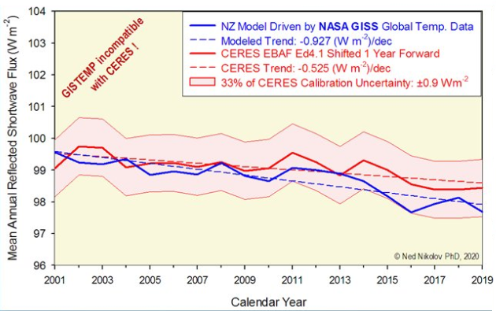

# Part 1: Earth Warming Coming From the Core

[Here](https://theethicalskeptic.com/2020/02/16/the-climate-change-alternative-we-ignore-to-our-peril/) is the original thesis.

## Quotes

Yes, it is generally acknowledged by mainstream science and society at large that our planet’s oceans are heating very fast. The result of this warming is an increasingly unhealthy environment for our ocean’s flora, fishes, microbiota, mollusks, crustaceans, and fauna.5 To varying degrees, this emergent condition threatens everything which lives on planet Earth. The vast preponderance of scientists agree that we are well underway on the sixth mass, or what could be reasonably titled, Anthropocene Extinction.

While we don’t know fully what all this means in terms of global climate change, mankind can draw at the very least, the inference that substantial changes are at play in both the Earth’s inner and outer cores which serve to generate our planet’s magnetic moments. **These three changes, higher Schumann banding, acceleration of geographic location as well as weakening of the Earth’s magnetic moment, run commensurate with and sensitive in dynamic to the last two decades of extreme climate change.** Such changes historically have served to correlate well with global temperatures. These changes cannot be ignored as potential contributors vis-à-vis the ‘heat coming from beneath our feet’.

## Comment Quotes

One of the goals embedded in all this chicanery is the extensive amount of effort placed into obfuscating mankind’s past. That is the priority here and no science bears the right to usurp that authority.

## Summary

The thesis begins with ten observations that "prove wrong" the man-made global warming hypothesis, creating a need for "plurality" - a better explanation.

The observations are as follows, from weakest to strongest:
1. Inconsistencies in CO2 emission data which are unexplainable by man-made factors alone
    - winter month carbon ppm slowdown
    - yearly vernal jump
    - Anecdote: Covid (record C02 increase when industry is shut down)
    - Anecdote: 2018 - 2020
2. Atmospheric CO2 levels follow temperature rises and are accelerating - Man's carbon-productiving activity is linear and of insufficient slope to drive this
3. CO2's mechanism of heating the atmosphere by capturing more solar energy doesn't hold up with conservation of solar radiation wrt the atmosphere
4. Mean sea level is rising, but sea variange range is also increasing, seemingly caused by global ocean current speed increase, which is not plausibly caused by changes in the atmosphere wind speed
5. (VERY IMPORTANT) Earth's magnetic field ranged high, indicating a weakening in the Earth's magnetic moment generated from its core. This matches in time with the recent global temperature increases
6. Earth's rotational measures' alignment with global temperatures diverged in 1930, sea temperature increases coincide with speeding up of the outer rotational body.
	- TES clearly states in his thesis that as the core expels mass into the mantle, the rotation of the mantle would slow down, while the rotation of the core would speed up.
7. There was a heat plume in 2023 which could not be explained by the atmosphere or man.
8. Earthquake and volcano activity have been increasing as well along with temperature and CO2
9. Heat anomalies have a physical pattern on the Earth's continents
10. Deep ocean levels are absorbing lots of heat. Tremendous amounts of heat.

So, conclusion? The Earth's core undergoes state change, releasing heat, which warm the deep oceans through deepwater sea vents, which warm the entire oceans, which warms the atmosphere.

## Summary v2

Observation 1: Carbon PPMs are not mainly derived from human activity. Carbon variance exhibits a regular seasonal cyclicity which is not explained by man's activity. This is further supported by anecdotal Covid data which showed that during lockdown and lower human carbon consumption, we still experienced a record carbon PPM increase. This demonstrates a need for an alternative explanation as to what drives (changes in) carbon PPM levels.

Observation 2: Carbon PPM increase is accelerating, while temperature is increasing linearly. Anecdotal data points also don't support the idea that human activity is creating this carbon PPM increase - human activity is growing linearly, and the economic depression in 2008-2012 didn't slowdown carbon PPM increase. Finally, there is no corresponding acceleration in the temperature increase, which implies that it is not carbon increasing that is driving the temperature increase.

Observation 3: If global warming was caused by the Earth's atmosphere capturing more solar radiation from the Sun, then we should see a corresponding decrease in the radiation expelled from Earth as is trapped. This is not evidenced by the data, which measures slightly less than half the required capture in practice.

Observation 4: Mean sea level is rising, but mean sea level variance is also rising (and should not be). Additionally, global ocean current speed has increased by 15% over that same timeframe, indicating that this may causing the sea level variance. If ocean currents are indeed increasing, there is only one thing that possesses enough energy to do so, and it is not atmospheric wind. It must come from underneath.

Observation 5: Schumann Resonance banding-power has ranged upwards, indicating a weakening in the Earth's magnetic moment. This is commensurate with a dramatic wandering of the geomagnetic north pole. This is happening at the same time as global temperature increase.

Observation 6: The Earth's rotation is speeding up, but the rate at which it is speeding up is slowing down and reversing, indicating a force that is slowing down Earth's rotation.

Observation 7: Anecdote: Spring 2023 brought a heat surge in ocean sea surface temperature. This happened too fast for humans to have been the driving factor. This also coincided with a record Antarctic ice melt-off. The Earth's core stands as the only possible energy source capable of generating this massive heat surge.

Observation 8: Recent rise in earthquakes and volcanic activity, indicating increasing activity of Earth's upper mantle.

Observation 9: Heat anomalies are not random - rather they follow specific patterns and arise from specific crustal locations (mid-Atlantic rise, El Nino/ULVZ/LLVP currents). Additionally, the heating from El Nino seems to accumulate persistently, and as such the heat increases of the last few decades has happened within only a few weeks of rapid temperature rise, something that is too rapid to be explained by atmospheric changes. There's also evidence of heat plumes in ANtarctica, which could seemingly only be explained by the mantle.

Observation 10: Deep oceans are absorbing excessive amounts of heat.