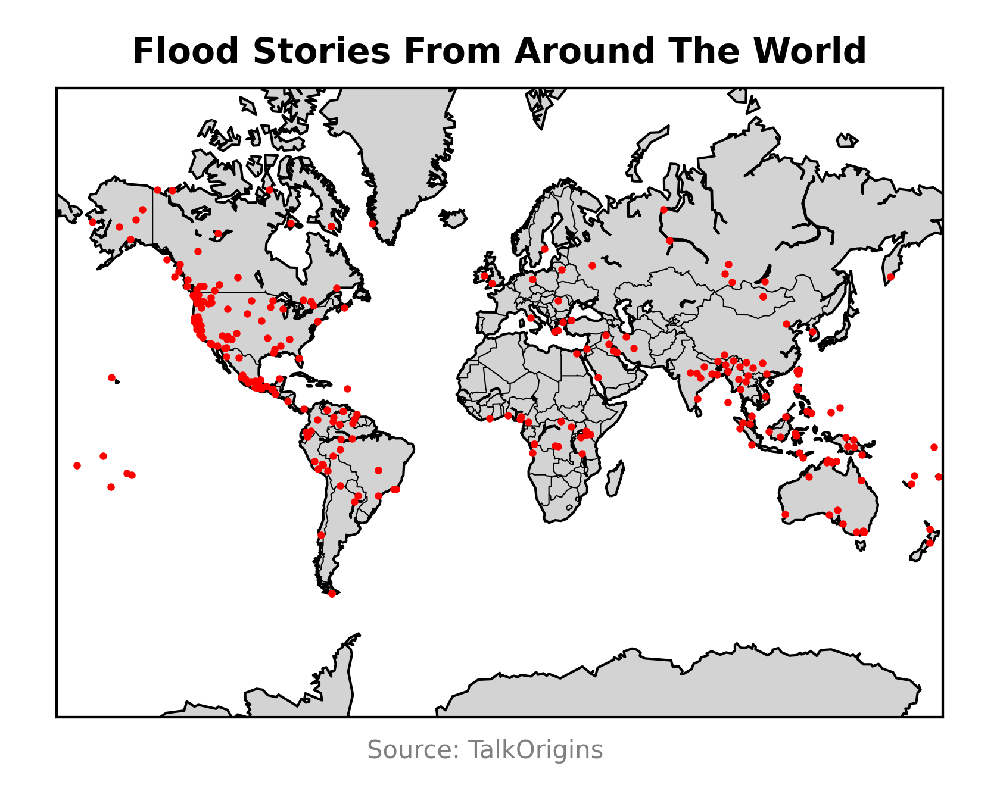

# Sovrynn (Repo owner)

Compiling my 2D ECDO graphics in here, and an AI summarized book/document collection of 1118 files.

## Research paper files

I have scripts (compile.sh) for compiling the PDFs from the .tex files.

All necessary image, bibliography, and Latex files are in the folders. You just need to install all the necessary latex libraries.

## Graphics

## Literature

"In the decades before the cataclysm, the masses, who'd been hoodwinked by the magic word spells of law, order, money, and pacifist liberalism, stood idly by, entranced, as their labor and resources continued to be taken away in front of their blind unsuspecting eyes. "It is ours", the collectors said, "this is the law", as the masses handed over their earnings into the collectors' outstretched hands.

Those receiving the tributes of the proles used them to prepare their own secret hideouts. When the cataclysm came, the proles were left to perish on the surface, as they were viewed as naught more than that. The proles couldn't realize that all they needed to do to survive was to collectively stand up, organize themselves, and take what could have been theirs in the years before the cataclysm. All that was needed was for them to take back what was theirs.

Instead, they chose to remain captured under the spells of money and liberalism till the very end, perishing after working as cattle for generations. Today, they remain eternal examples of what once was, as fossils under the sea. Oh, what could've been."

- History of the Ancient Silicon Age Trans-Atlantic Empire, Written 5000 CE