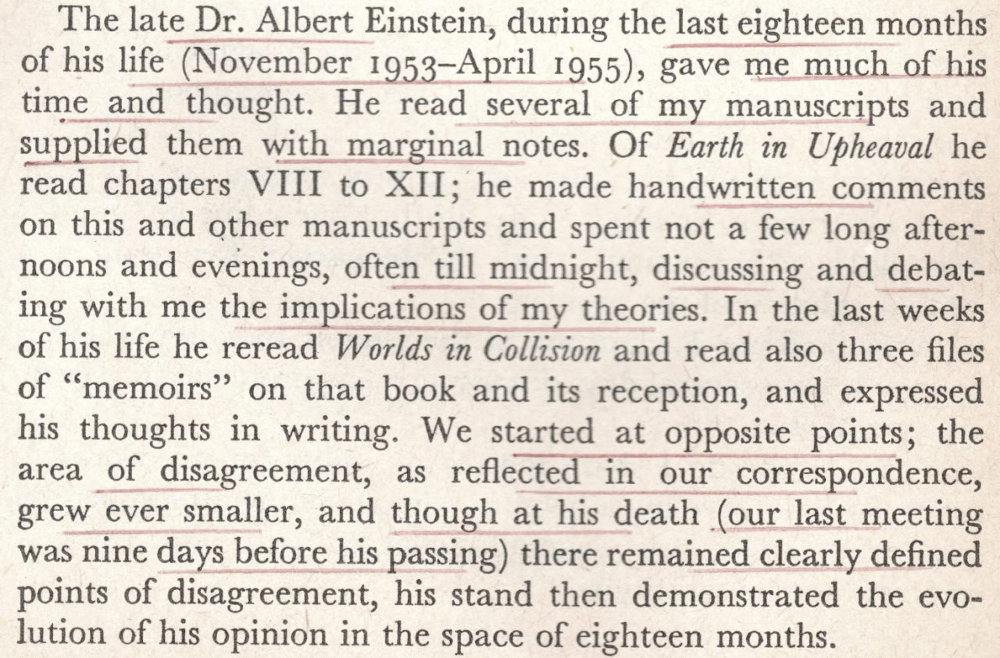

# Albert Einstein

## Relevant foreword in a research paper

Albert Einstein's foreword to Charles Hapgood's Earth's Shifting Crust (1958). His only reservation appears to have been that the ice mass might not be sufficient to overcome friction between the mantle and crust as described by Hapgood. This reservation is not applicable where ECDO is concerned, as the decoupling occurs at the core-mantle boundary.

https://archive.org/details/eathsshiftingcru033562mbp

## Velikovsky

Albert Einstein certainly kept some interesting company. This is from the acknowledgments page of Immanuel Velikovsky's Earth in Upheaval (1955)
1. https://archive.org/details/EarthInUpheavalVelikovsky

Velikovsky-Einstein Correspondence:
2. https://varchive.org/bdb/study.htm
3. https://varchive.org/cor/einstein/
4. https://varchive.org/bdb/letter.htm
5. https://varchive.org/cor/einstein/520826ve.htm

There is some very interesting reading in notes [2] thru [5].