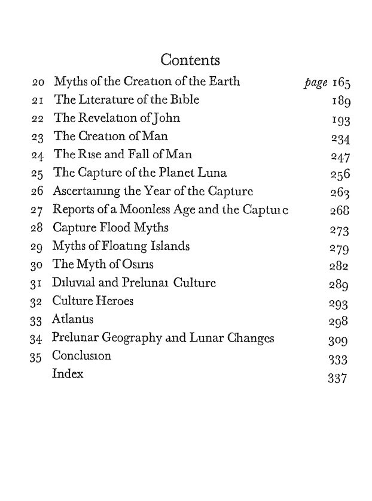

# H.s. Bellamy

Moons, Myths and Man, Bellamy (1936): https://archive.org/details/in.ernet.dli.2015.76982

The memory of both fire and water is hardly rare.

## Built before the flood

Reading through the backlog of messages, in case you are still looking :: https://www.abebooks.com/servlet/BookDetailsPL?bi=30489008951&cm_sp=snippet-_-srp0-_-tile1&searchurl=cty%3Dca%26ds%3D10%26rollup%3Don%26sortby%3D17%26tn%3DBefore%2Bthe%2Bflood%2Btiahuanaco

I found this  —- best to read the transcript    Re:     https://www.youtube.com/watch?v=HVA-0oVRdQs&pp=ygUdVGlhaHVhbmFjbyBSdWlucyBCZWxsYW15LCBIIFM%3D

## Bellamy and Allan concluded that...

Bellamy and Allan concluded that the Moon was captured in the Earth's gravity at the time of the Younger Dryas. It's new. In this context, the Moon may have done two things: a) it mitigated the Earth's previously chaotic rotations, but b) it's stabilizing effect on the Earth…

## In The Great Idol of...

In The Great Idol of Tiahuanaco (1959), Bellamy and Allan interpreted a record of three global cataclysms at 12ky and 6ky intervals: "According to the Hoerbiger Theory: when the Satellite, in its approach nearer and nearer to the Earth, had reached a distance of perhaps 6-7 ER… https://t.co/Gw1bzFsRQh

