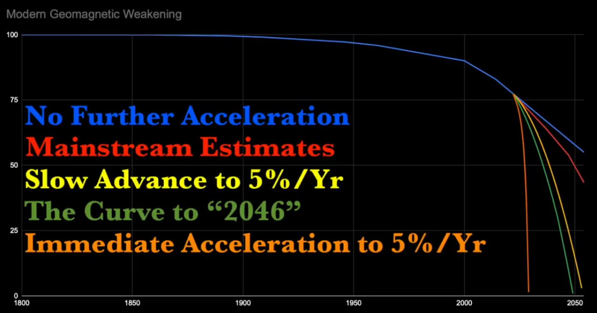
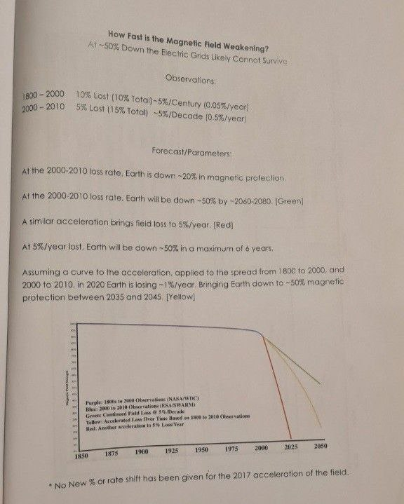

# Ben Davidson

Has produced some material potentially relevant to ECDO.

Here is his [website](suspicious0bservers.org). Seems like his info is behind a (small) paywall.

He also has a [Youtube channel](https://www.youtube.com/@Suspicious0bservers/search?query=6000%20year) where he talks about his theories.

He believes there is a 6000 year "event" cycle. He talks about the crust decoupling from the low velocity zone at the top of the mantle which is basically an electromagnetically charged region that keeps the crust fixed to the liquid mantle. He believes that a coming solar micronova temporarily disrupts this zone enabling the weight of the ice caps to migrate to the equator in a 90 degree flip.

## Streams

https://www.youtube.com/live/5u5XC9OKAOY?feature=shared

## Book excerpt

## GPT Trained on his theories

https://chatgpt.com/g/g-sgpKLbqOh-bd-s-theories

## Ben on this.
https://t.co/89SLYsmBNQ

Ben on this. https://t.co/89SLYsmBNQ