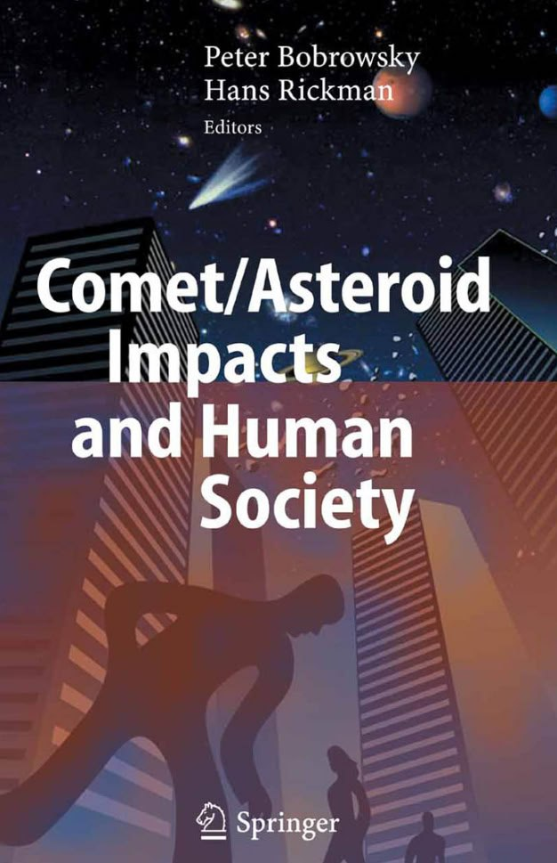
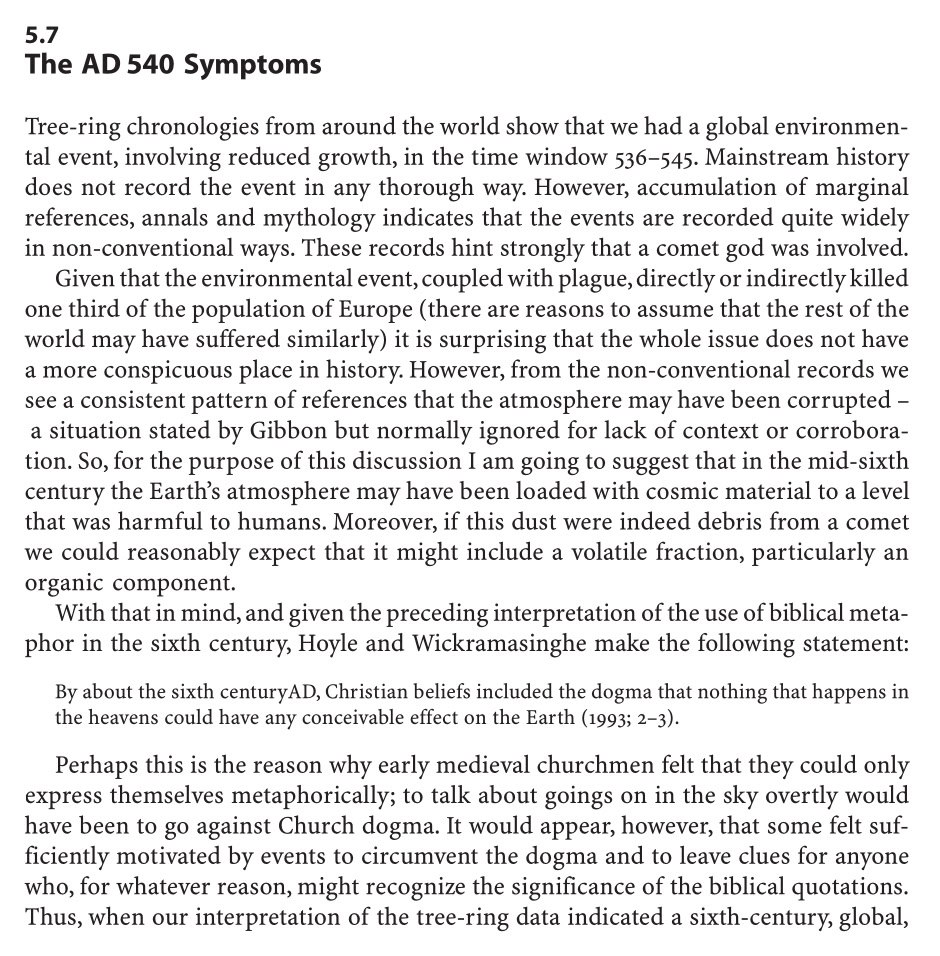
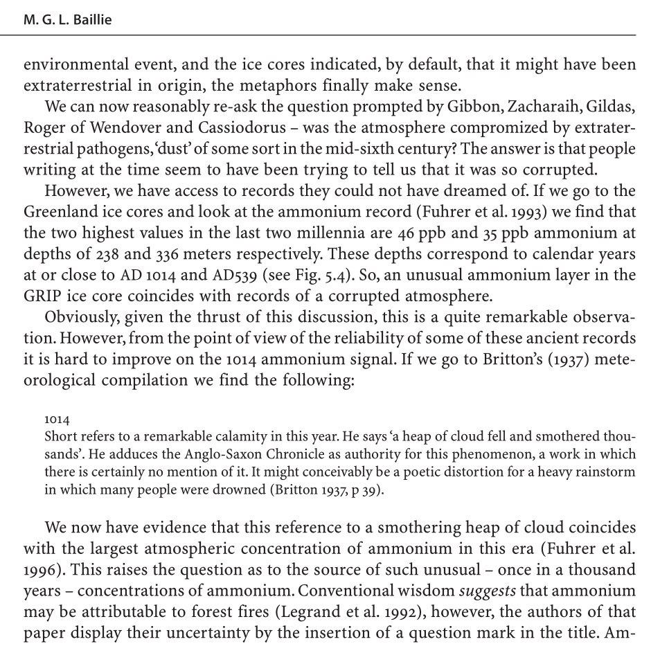
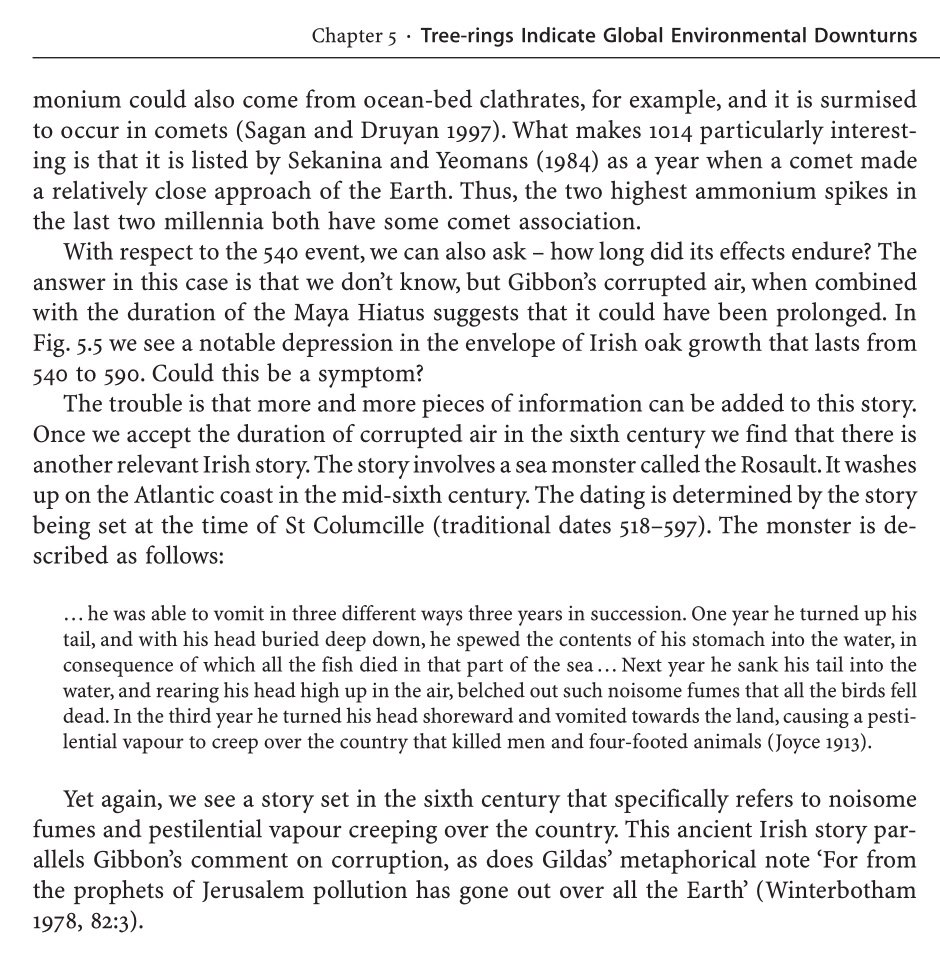
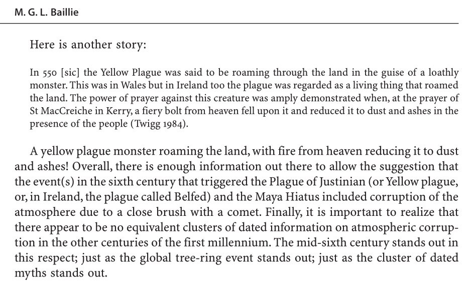
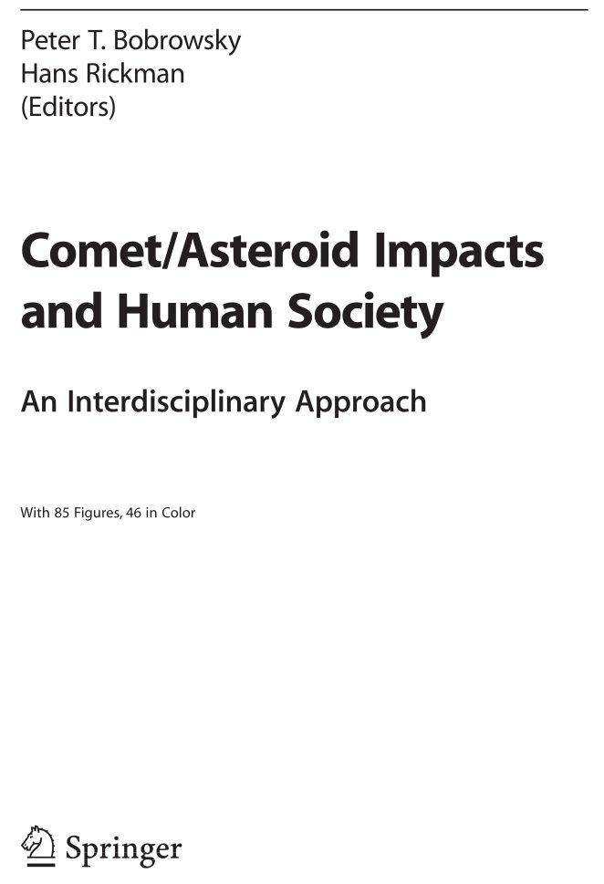
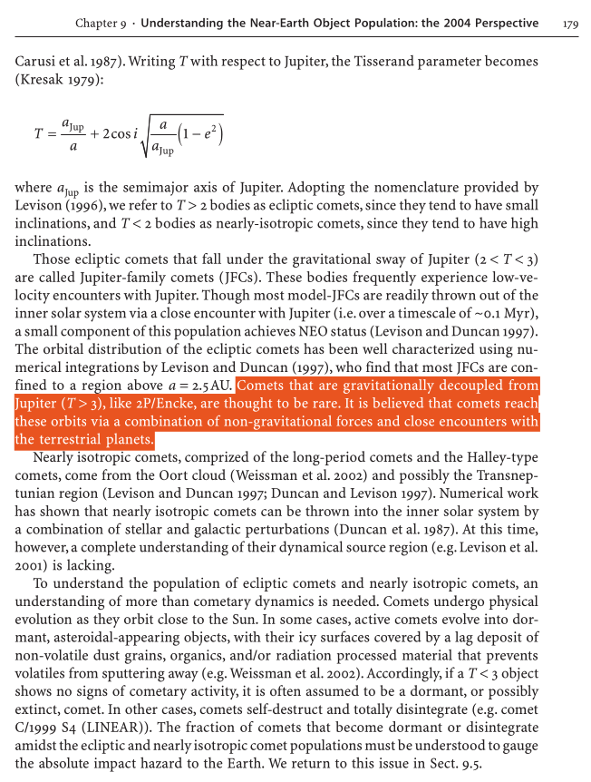

# Bobrowsky

Arthur's Comet

## "The International Council for Science...

"The International Council for Science (ICSU) recently recognized that the societal implications (social, cultural, political and economic) of a comet/asteroid impact on Earth warrants an immediate consideration by all countries in the world." -Bobrosky/Rickman (2007, 549 pages) https://t.co/Dms4shuXu7

