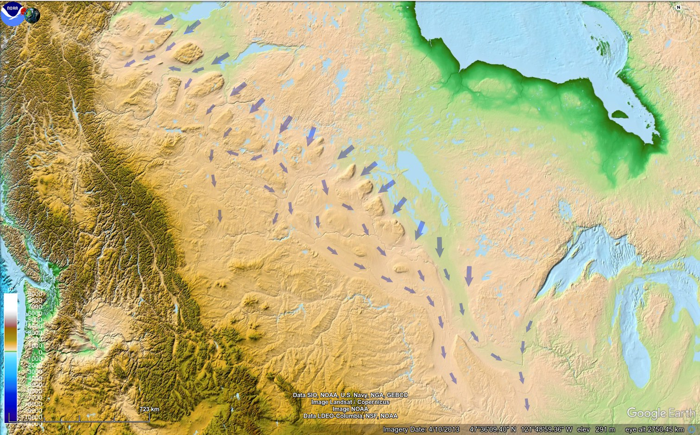

# J Harlen Bretz

"The debate on what caused the prehistoric ice sheet melt has raged since the early 1900’s. One geologist named J Harlen Bretz proposed a catastrophic single flood that wiped the majority of glacial ice. His theory came from studying the scarred landscapes of North America. The geological patterns, in his opinion, showed an incredibly large flood of prehistory which occurred due to the ice sheet melted suddenly. The flood’s trail of destruction can still be seen throughout the geology of North America.

It is now clear that the ice was completely gone in as little as a few thousand years. In order to remove such a large body of ice during this time period, an enormous amount of energy is required. This suggests that a catastrophic event needed to intervene in order for the ice to disappear. Such an event would fit with a single flood due to a large amount of energy dispersed."

https://humanoriginproject.com/evidence-younger-dryas-forged-human-prehistory/