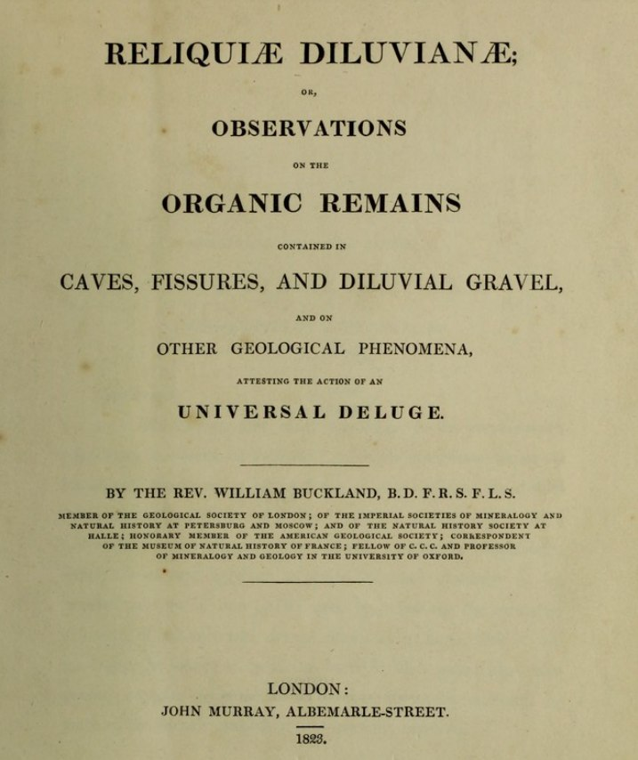
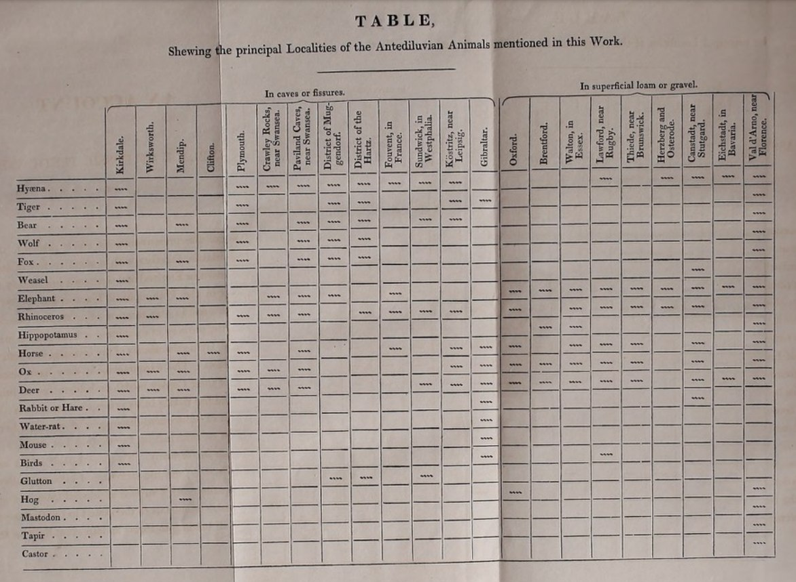
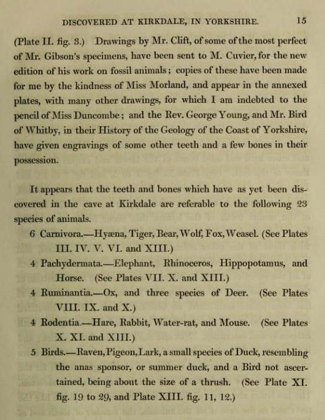
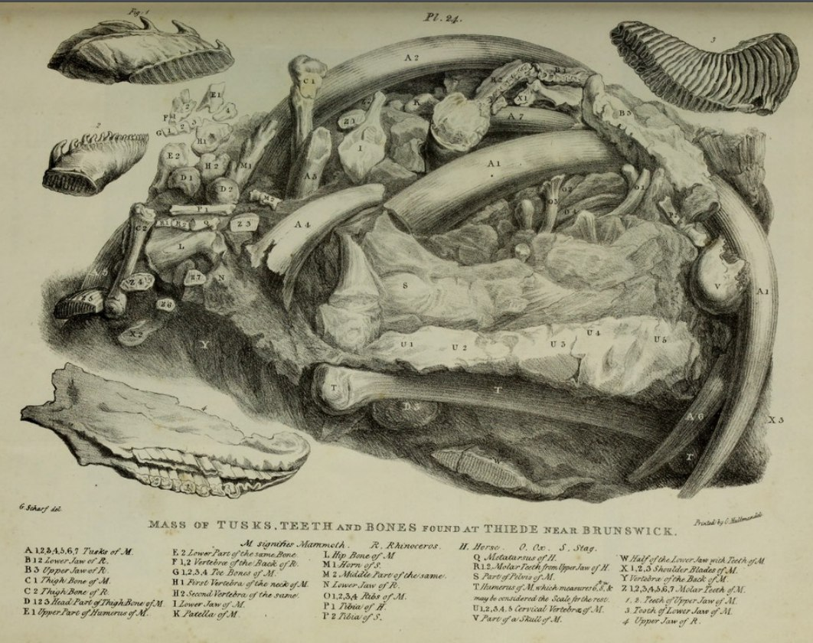
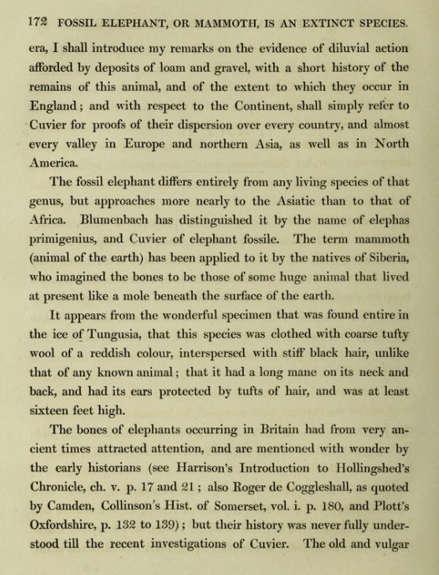

# William Buckland

Reliquoæ Diluvianæ (1823)
A 380 page record of an historic deluge, overflowing with findings of numerous species of fauna which had no explicable reason to be found together, scattered across Britain and Europe, buried in layers of 'diluvium' (a term coined by Buckland).

https:// (https://t.co/K4GQDGqcHv)iiif.wellcomecollection.org/pdf/b2201729x (https://t.co/K4GQDGqcHv)