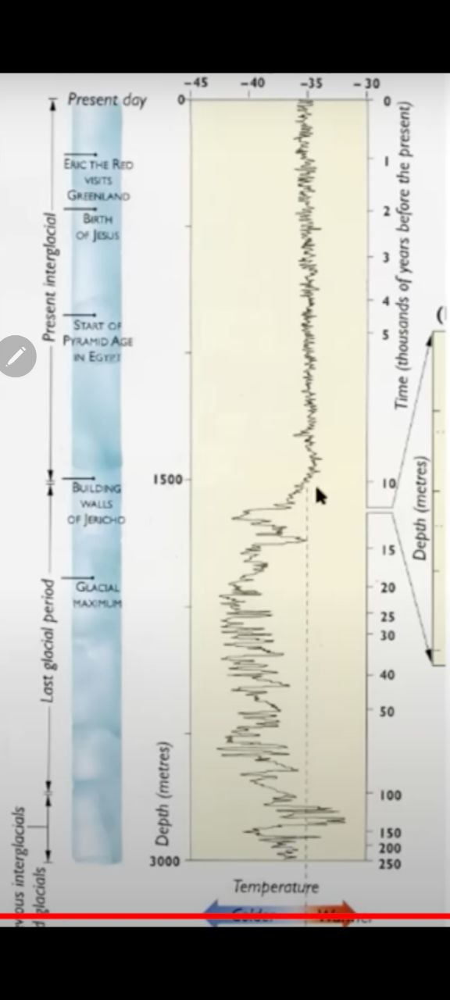

# Randall Carlson

Modern geologist. Leans toward cataclysm theory rather than gradualism. Appeared on Joe Rogan and Graham Hancock's show.

## Greenland Ice Sample Graph

Someone has challenged me on the pole flip theory based on this Greenland Ice sample graph that Randall Carlson presented on Joe Rogan. Does this disprove the theory or is it flawed data?

He presents the data from the 14 min mark in this video

https://youtu.be/G0Cp7DrvNLQ?si=q0oFVVNIyOsYNmzt

The flip isn't mentioned I don't think in the video. The person messaging me is implying a cyclical flip would be obvious on the Greenland Ice core data as Greenland will move to and from the equator. I wonder if their timeline per metre of ice is correct. 3km of ice could form much quicker than 250k years I reckon!