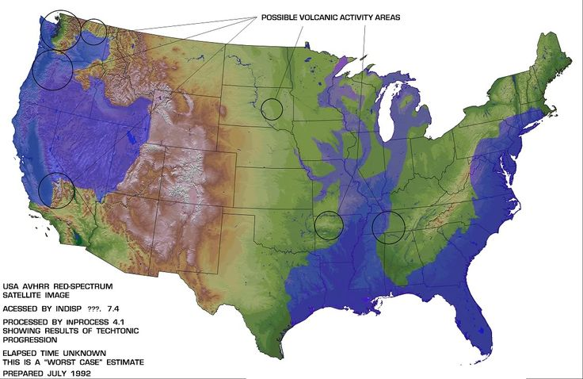

# Edgar Cayce (1877 - 1945)

Published theories on pole shift, flooding, earthquakes, and volcanoes. His work may be worth looking into.

Blog post about him:
- https://www.lovetoknow.com/life/lifestyle/edgar-cayce-maps-his-prophecies-earth-explained

## Signal predictions

Cayce predicted that when both Mt. Etna volcano in Italy and Mt. Pelee in Martinique erupt together, there will be approximately 90 days to evacuate the west coast before the massive flood claims the coastline.

## Flood Map

## Contents

- `articles`: Copies of articles about Edgar Cayce.