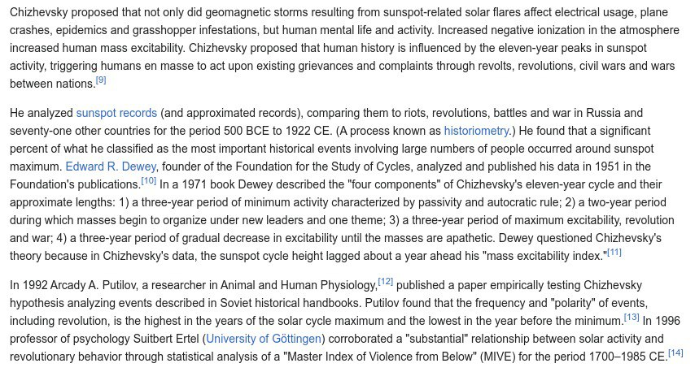

# Chelivsky

Heliobiology.

## Physical Factors of the Historical Process (chizhevsky1.pdf)

Hard copy here: This is a small sample from over a hundred years of heliobiology research, Alexander Chizhevsky being considered the "father" of this science.

Chizhevsky identified strong relationships between solar and cosmic cycles and disease, pandemics, wars, revolutions, stock markets, and numerous other aspects of human and other life. He enjoyed open access to the vast library of medical and other records kept by the state at the time - hospital records from across Russia, spanning many decades.

## Excerpt

Its very revealing that this extraordinarily well researched and repeatedly corroborated science is not taught in schools. It would undermine the very shaky foundations of almost every area of corporate $cience, especially pharma and its deceptions around the causes of dis-ease.

image : https://en.wikipedia.org/wiki/Alexander_Chizhevsky