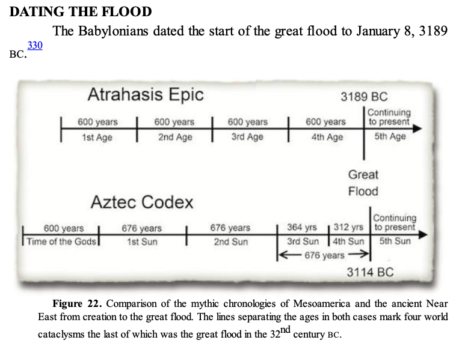

# S. C. Compton

"Exodus Lost: An Inquiry into the Genesis of Civilization"

Most of his work is based on Mesoamerica and the Middle East (Mesopotamia, Egypt, Mediterranean).

## forum post on his 3200 bc comet impact hypothesis

What follows is a [forum post](https://www.mormondialogue.org/topic/74277-global-flood-literalism-rides-again/page/5/) detailing an Internet anon's synopsis of the work of S. C. Compton in his book "Exodus Lost: An Inquiry into the Genesis of Civilization". Full forum post text below.

## Forum post verbatim

Following is my synopsis of the evidence Compton presents for a world-wide event including flooding and possibly massive rain fall, taking place in the 5,200 years BP time frame.  This is just one of several of his propositions from his book.  It may be too long for a single post, but here goes:

There is strong evidence for a massive bolide (very large meteor) impact event that happened circa 3,200 BC or 5,200 yrs BP. It was discovered by Dr. Dallas H. Abbott, of LaMont-Doherty Earth Observatory in 2005 (see: Exodus Lost by S.C. Compton, 2010), and is called the Burkle Crater.

The main evidence for this is a 25 km diameter crater that has been found using geophysical methods on the floor of the Indian Ocean. Modeling indicates the size of the meteor would have had to be about 5 km diameter to create the crater it did and at the bottom of 12,500 feet of water. Estimates of the energy are ~ 20,000,000 megatons of force, equivalent to about 1,330,000,000 Hiroshima-style atomic bombs.

They also estimate that several trillion tons of water could have been displaced into the atmosphere, and chevrons of sediment thrown up onto surrounding coastlines indicate a tsunami that was 600 ft high.

What goes up, has to come down . . . not to mention the flooding from such a massive tsunami . . . . though it would dampen as it traveled through the world's oceans.

There are 2-3 ancient calendars that mark a flood event as the start of their new calendric era at roughly this same time, and there are many other physical conditions in ice and sediments that seem to have radically changed around that time, as well.

Here’s the evidence, taken from pages 141-155 of Compton’s Exodus Lost, 2010:

### Calendar evidence; indicating a flood at  ~ 3,200 yrs BC (or 5,200 yrs BP) 

a. Babylonian flood-start at 3189 BC as indicated by the Atrahasis Epic of the tribal Ammorites, “easily the most sophisticated of all known ancient Near-Eastern mythological epics – Sumerian, Accadian, Canaanite (Ugaritic), Horite (Hurrian) and Hittite”.  They carried this into Babylon. This was the end of one of four of their 600 year ages or epics separated by calamities; with the last one, delineated by the great flood.  It’s interesting to note that Noah was 600 years old when the Biblical flood began.

b. Ancient Indian texts indicate a last world flood, also one of four, took place at 3,102 BC as indicated by ancient Indian texts:  the Sataptha Brahmana, the Mahabharata and several Puhanas.  This ushered in our current Kali Yuga age.  Speculation is that these two accounts (Babylonian and Indian) may be related.

c. Mayan/Aztec calendars count time from 3114 BC, also demarcating a flood that ended the fourth of four ages.  Evidence indicates the same date in Mixtec and Aztec calendric data, even in the Aztec Calendar stone; and speculation is that the Mayan’s inherited this story from the Olmecs.  Taken from:  Historia de los Mexicanos por sus Pinturas, ~1530s; Leyenda de los Soles, 1558; and the Codex Rios.  Their ages lasted 676 years as opposed to 600 years of the Babylonians, but they also say that 600 years passed between the “birth of the Gods and the creation of the earth”.

d. Egyptian record of a flood.  Compton is sparse on this but cites an Egyptian text, The Destruction of Mankind, that cites a period of darkness after a great flood, but provides no footnote.

Commentary on the discrepancies of these dates:  The Babylonians only give a start date for the flood:  3189 BC. But both the Indian and Mayan/Aztecan dates signify not the start of the flood, but the start of a new age with a new Sun God appearing after a period of darkness following the flood.  A Mayan pot exhibits an interim date of 3149 BC as the time when the old sun god was defeated after the flood, but a new one had not yet been installed (3114 BC).

Similarly, as indicated above, an Egyptian text (The Destruction of Mankind), “similarly describes a

period of time following the flood when the world was in darkness until a god could be found to become the new sun.

One of the characteristics of a large meteor (bolide) hitting the earth is a lot of dust (and in the case of the Burkle crater, immense amounts of water and water vapor) being sent into the atmosphere largely obscuring or dampening sunlight for several years.

### Pysical evidence of a major planetary event happening in the 3,200 yrs BC (or 5,200 yrs BP) time frame.  Footnotes for these claims can be found in the book.

a. Major drop in temperature at the ~3,200 yrs BC mark, as indicated by:

1) Oxygen 18 (δO18) ratio measurements in ice caps.

2) δO18 ratios from stalagmites from cave formations

3) Temperature sensitive chemicals in phytoplankton in sediments drilled from sea floor.

4) Species of pollen trapped in ancient sediment layers.

b. Monumental surge in precipitation for this time period, as indicated by:

1) Sudden dramatic surge in methane at 3,200 yrs BC as found in air bubbles trapped in Greenland ice cap.  Methane correlates w/amount of wetlands.

2) Pollen profiles indicate surge in precipitation at this time, as well.

3) High precision records of water levels in ancient lakes increase at this time.

“In many of these paleoclimate records, this event is the most extreme increase in precipitation and drop in temperature in the more than 10,000 years since the end of the last ice age” and “was also nearly instantaneous.”

c.  Flash freeze events:

1) Discovery in 2003 by the Byrd Polar Research Center of well-preserved but frozen, soft-bodied wetland plants still rooted in ancient earth, at the base of the Quelccaya ice cap situated at 18,600 foot elevation in the Peruvian Andes.  RC-14 dates of the plants yielded a date of 3,188 ± 45 yrs BC, precisely the Babylonian date for the great flood (3189 BC).

2) “Unweathered tree still standing with its roots firmly planted in the earth” discovered in Washington State at the base of the receding Cascade Glacier and dated to this same time”.

3) 1991 discovery of Ötzi, a human body revealed by a melting glacier in the Italian Alps, which dated to 3225 ± 125 yrs BC.  “The exceptional state of preservation of the Ice-man and of his artifacts requires that he was rapidly entombed at the time of this death and remained so until he was discovered”.  “Thus, the Iceman reveals that at about 5,300-5,050 cal yr BP, a rapid climatic change took place producing a persistent snow cover on previously deglaciated areas . . . . This deterioration in climate marks the beginning of Neoglaciation in the Alps, which induced a glacier expansion.”

4) Entire town found buried by a mudslide in the Czech Republic at this exact time.  Excavation revealed a ground gradient so gradual that it would have taken extreme precipitation to mobilize the earth.

d. Volcanic-like effects also induced by large meteors:

1) “Dust-veil” events:  largest ever recorded according to tree rings, began in 3,190 yr BC range.  “In some places, including Mesoamerica, vast forests completely died.  In England, the oldest known trees of two regional oak chronologies all began their lives at this time”.

2) Primary way dust-veil events affect climate is through the release of sulfur into the stratosphere, where it combines w/water to produce sulfuric acid.  Largest spike in acid levels found in the Greenland ice sheet in at least the last 9,000 years occurred in 3150 ± 90 yrs BC, but there are no correlated volcanic eruptions associated with this spike.

3) Largest sulfate spike in the Greenland ice sheet began ~3,200 yrs BC.  Much larger than sulfate spikes associated w/known volcanic eruptions.

4) In 2005, a new technique (combining synchrotron radiation, XRAY microfluorescence and absorption spectroscopy) analyzed bands in Alpine stalagmites, and found a band containing highly concentrated sulfur dated at 3150 ± 130 yrs BC.

Commentary on the sulfur/sulfuric/sulfuric acid concentrations at this date and time:  the fact that the intense sulfur is found in the ice cap is indicative of atmospheric sulfur and not a local anomaly; and the amount is far greater than that produced by any known volcanoes.  The likely source is a very large meteor, where one “300 m across contains five times as much sulfur as the entire modern (well-polluted) atmosphere”.  So the Burkle meteor, at 25 km across, could contains 17 times as much as this.

e. Chevrons consisting of sediments thrown up from deep ocean floor on coastlines surrounding location of the Burkle Crater.

1) Miles long and more than 100 m tall, some covering an area as large as Manhattan. It would take a tsunami 600 ft tall to produce them.

2) Dee Breger analzed samples of chevron sediment in October, 2006, using “a scanning electron microscope (SEM) and found deep-ocean microfossils (benthic foraminifera) that had been splashed with molten iron, nickel and chrome in proportions consistent with a chondritic meteor”.

Now I haven't thoroughly vetted Compton's sources, but if accurate and in my view, the event 'precipitated' by the Burkle meteor has a high probability of having caused the massive flooding, including the Noahic flood of that time-period.

## Aztec Calendar Stones

## Quotes

## Part 1: Discovery (Page 3)

### Ch. 2: A Lost Civilization (Pg. 9)

- La Venta  
- Olmec

Rather than the Olmec having "suddenly appeared," what if they were the only ones left after a cataclysm?

### Ch. 3: Lost City of Tula (Pg. 16)

- Quetzalcoatl, Tula, San Lorenzo  
- First city in Mesoamerica.

### Ch. 4: Black Land, Red Land (Pg. 21)

### Ch. 5: Royal Purple (Mesopotamia, Mediterranean)

### Ch. 6: The Alphabet Code (Pg. 30)

### Ch. 7: The Alphabet in Mexico (Pg. 48)

- Aztec calendar stone
- Mesoamerican 260-day year.

## Part 2: Eruptions (Page 57)

### Ch. 8: Volcanic Winter (Pg. 59)

The island of Santorini, the modern remains of Thera, whose ancient eruption devastated the eastern Mediterranean. As in Plato, Theran civilization ended suddenly, violently, and completely. Thera’s is now considered to be the first or second largest eruption of the last 10,000 years, some 900 times more powerful than Mount St. Helens and more than four times the intensity of the Krakatoa eruption that killed 36,000 people in 1883.

In 1939, archaeologist Spyridon Marinatos dated the eruption to 1500 BC by linking local pottery to the Egyptian chronology. But in 1976, radiocarbon testing of material directly associated with the eruption dated the event a full century earlier. Yet, by this time, the 1500 BC date had already become so canonical that many (if not most) archaeologists rejected the radiocarbon dates.

In 1984, a breakthrough paper in *Nature* showed that frost damage in ancient tree rings marked the dates of major volcanic eruptions. Large eruptions ejected so much particulate matter into the atmosphere that they blocked enough sunlight to cool the planet to the point that the trees had suffered visible frost damage. The tree rings marked every major eruption except Thera. Although they checked the rings for a century to either side of 1500 BC, the dendrochronologists failed to find the signature frost damage. However, extreme frost damage was found to have begun in 1627 BC. Given the magnitude of this event and its close fit with the radiocarbon dates for the Thera eruption, they concluded that Thera had erupted in 1627 BC.

On reading this original study of California trees, Irish scientists checked their own 7,272-year-long oak tree chronology. The 22 oaks that included the 1620s BC all showed the extreme event. In some, the rings were so narrow that they were unreadable after 1628 BC. Germany’s oak tree sequence also showed severely diminished growth in the 1620s BC. And the English oak ring chronology had a gap for this period, most of its oak forests having died out in the 17th century BC. When a few survivors were finally found in a bog near Sheffield, they too had extraordinarily narrow rings for the 1620s BC. The findings of this discipline were in general agreement that this event had been one of the largest volcanic eruptions in human history and was likely Thera, though the European evidence shifted its date back to 1628 BC.

### Ch. 9: Genesis of the Exodus (Pg. 65)

Such bone deformation and softening is characteristic of fluorosis, caused by fluorine in the volcanic fallout. This recalls the story of Joseph, in which the narrator strains for adjectives to describe just how miserable the cattle were: “poor and very ill-favoured and lean-fleshed, such as I never saw in all the land of Egypt for badness.” Between fluorosis and starvation, 80% of Iceland’s sheep and half of the cattle and horses died. Among humans, a quarter of Icelanders died, as did roughly 5% of the population of France.

While pollen from the Dead Sea records an extensive famine in Canaan at this time, it was not confined to this region. We have already seen the drastic effect on trees in Europe and North America. In 1985, Kevin Pang of NASA’s Jet Propulsion Laboratory argued that Thera’s dust veil had caused the collapse of China’s Xia Dynasty. The Bamboo Annals for 1618 BC record “yellow fog, a dim sun, then three suns, frost in July, famine, and the withering of all five cereals.” Because the Bamboo Annals are not absolutely dated, this could well be a record of the effects of the severe dust-veil event that began in 1628 BC. If so, then the ancient Chinese chronology could be anchored and calibrated by this precise tree-ring date.

### Ch. 10: Egypt Falls (Pg. 71)

Around 2000 BC, in a massive effort to keep out the neighboring Canaanites, the Egyptians erected a tall border wall 100 miles long, lined it with a moat, and, for good measure, added crocodiles. Yet still the Canaanites came, often at the behest of ambivalent Egyptians who relied on their labor.

Toward the end of the 13th Dynasty, as Egypt’s central government weakened, an independent kingdom arose within this culturally distinct delta as Egypt’s 14th Dynasty. These simultaneous 13th and 14th dynasties then fell to the Hyksos, invaders from Canaan who ruled northern Egypt for the next 108 years as Egypt’s 15th Dynasty and reduced southern Egypt to a tribute-paying vassal state.

According to the Egyptian priest and historian Manetho, the Hyksos conquered Egypt “without striking a blow.” The archaeological record likewise shows no evidence of a battle or large-scale looting. Yet Egypt was arguably the most powerful nation in the world and had never been conquered in their 1500-year history. How could they now fall without a fight?

The invasion is dated to the 1630s BC with a margin of error of more than a decade. It thus occurs in the same place and time as the Joseph story, which can now be bracketed by the tree-ring dates of the two climatic events to 1647-1621 BC. Not only do the history and the story coincide in time and place, but the Joseph story makes a far more interesting claim than has previously been recognized, one that offers a new explanation for the bloodless conquest.

This papyrus records a massive famine. Given when it was written, and the “collapse of agriculture” in the climate proxy records of this time, it may offer another perspective on the devastating famine that appears to have followed the eruption of Thera. In it, the Egyptian scribe Ipuwer bemoans starvation and death throughout the land:

The Canaanites, whom the Egyptians viewed as barbarian workmen and slaves, suddenly possessed all of Egypt’s wealth, and the Egyptian nobility were poor, homeless, and starving.

## Part 3: From the Sea (Page 79)

### Ch. 11: The First Americans? (Pg. 80)

The animal was identified as an enormous bison thought to have gone extinct 10,000 years ago. A flurry of excavations followed this initial discovery as newspaper headlines lauded “Evidence of Ancient Hunters Discovered 10,000 Years Old!”

The physical evidence of human coexistence with and hunting of the Ice Age megafauna (the mammoths, horses, camels, saber tooth tigers, dire wolves, and 17-foot tall sloths that roamed Ice Age America) forced a seismic shift in the understanding of America’s prehistory.

The decisive breakthrough came when excavations under archaeologist Thomas Dillehay at Monte Verde, Chile, unearthed ancient human homes and associated artifacts radiocarbon-dated to 12,500 years old. Not only did they predate the Clovis people by 1000 years, but they used completely different tools and were at the wrong end of the world. The earliest human artifacts should have been in Alaska, with Chile being reached and populated last.

Meanwhile in North America, a skeleton was found protruding from a river back in Washington State in July of 1996. Suspecting foul play, the authorities called archaeologist and forensic investigator Dr. James Chatters. From the long, narrow shape of its skull, he concluded that the man had been of European descent. However, partially healed within its pelvic bone was a style of flint projectile point used until 7000 BP, and the skeleton radiocarbon dated to 8140 BP. How had a European-looking person come to be in North America 8000 years ago? Physical anthropologists Douglas Owsley and Richard Jantz analyzed the six known North American skulls dated to before 8000 years BP and found that each had Caucasoid features. Among modern populations, they most closely resemble the Ainu, an indigenous Japanese minority physically distinct from the modern Japanese population.

After about 7000 BC, people with northeast Asian characteristics (craniofacial morphology) replaced the earlier Jomon-like population in North America. This new population, resembling modern Asians, predominated in North America until the European invasion that followed Columbus.

### Ch. 12: Escape from Egypt (Pg. 89)

But this is where understanding the geography and terminology of the day revolutionizes the story. At that time, the “wall of water” on the one side was the 230-foot wide, crocodile-filled, rampart-lined canal, known as the “Wall of the Ruler.” On the other side was the second “wall” that we now call the Tumilat Canal. (As in Egyptian, such aquatic boundaries could also be called “walls” in Biblical Hebrew, e.g., Nahum 3:8.) At the tip of the Red Sea, at the “mouths of the (manmade) gorges,” the Israelites passed through the sweet spot between the two walls of water, the only weak link in hundreds of miles of water walls, ramparts, and guards. Here on the active seashore, tides and waves came in and eroded the ramparts, then receded lowering their natural barrier (helped that night by a divine wind). Here the Israelites slipped the trap “with a wall of water on their right and on their left.”

### Ch. 13: Bedouin of the Sea (Pg. 99)

### Ch. 14: War (Pg. 110)

### Ch. 15: Red Hair, Peace Pipes (Pg. 113)

## Part 4: Forensic Mythology (Pg. 125)

### Ch. 16: In the Beginning (Pg. 129)

### Ch. 17: Hell or High Water (Pg. 131)

Among other things, Aztec calendar stone flood.

The ancient sacred texts of India (including the Satapatha Brahmana, the Mahābhārata, and several of the Puranas) also feature a story of a world flood incorporated into a series of world ages. In this case, each of the successive cataclysms are world floods, after the last of which, the current world age (the Kali Yuga) began on February 18, 3102 BC.

### Ch. 18: Science of the Flood (Pg. 141)

The most extreme drop in global temperatures of the last 10,000 years occurred suddenly circa 3200 BC, as evidenced by the ratio of oxygen-18 in cores drilled from ice caps, by the temperature-sensitive chemical composition of ancient phytoplankton in sediment layers drilled from the sea floor, in isotopic ratios sampled from the layers of cave formations, and in the species of pollen trapped in ancient sediment layers.

### Ch. 19: Chicken Little (Pg. 147)

### Ch. 20: Sword Play (Pg. 155)

## Part 5: The Sweet Hereafter (Pg. 162)

### Ch. 21: Geography of Hell (Pg. 163)

### Ch. 22: Gehenna's Children (Pg. 181)

### Ch. 23: The Hounds of Hell (Pg. 190)

### Ch. 24: Chia-Gods (Pg. 192)

### Ch. 25: Living with the Dead (Pg. 198)

## Part 6: Architecture (Pg. 201)

### Ch. 26: Beginnings (Pg. 203)

### Ch. 27: The Pyramids (Pg. 211)

As for the Pyramids, there is nothing to wonder at in them so much as the fact that so many men could be found degraded enough to spend their lives constructing a tomb for some ambitious booby, whom it would have been wiser and manlier to have drowned in the Nile, and then given his body to the dogs.  
—Henry David Thoreau, *Walden*

After more than a thousand years of building pyramids, the Egyptians suddenly stopped after the expulsion of the Hyksos, never to resume. The last Egyptian pyramid was that of Ahmose, the southern Egyptian pharaoh who finally defeated the Hyksos. What made them stop at this moment is not known.

### Ch. 28: Ancient Hydraulics (Pg. 217)

### Ch. 29: Raiders of the Lost Naos (Pg. 220)

## Part 7: Hieroglyphica (Pg. 228)

### Ch. 30: Speech Made Visible (Pg. 229)

## Part 8: Third Party (Pg. 241)

### Ch. 31: Nubia and the Hyksos (Pg. 242)

### Ch. 32: Pottery (Pg. 244)

### Ch. 33: Buried Alive (Pg. 248)

However, Sir William Flinders Petrie described encountering a similar situation while excavating Hyksos burials near Sharuhen. He puzzled over how to interpret what he found, calling it a “difficult question.” The tombs contained multiple bodies, yet there was a great deal of fill on top of each tomb so that “it would be an awkward matter to dig down and clear part of the side for additional loculi.” Nor was there any evidence of such an operation. It thus appeared that all of the occupants of a given tomb had been buried simultaneously. Petrie posited a “pestilence.” However, he excavated at least two adult bodies with a child still in their arms. This recalls the remains of mothers at Kerma, sheltering their children as they were buried alive.

### Ch. 34: Appearance (Pg. 253)

### Ch. 35: Attire (Pg. 264)

### Ch. 36: The Meroitic Reliefs (Pg. 270)

### Ch. 37: Unforgettable Fire (Pg. 276)

### Ch. 38: Conclusion (Pg. 289)
