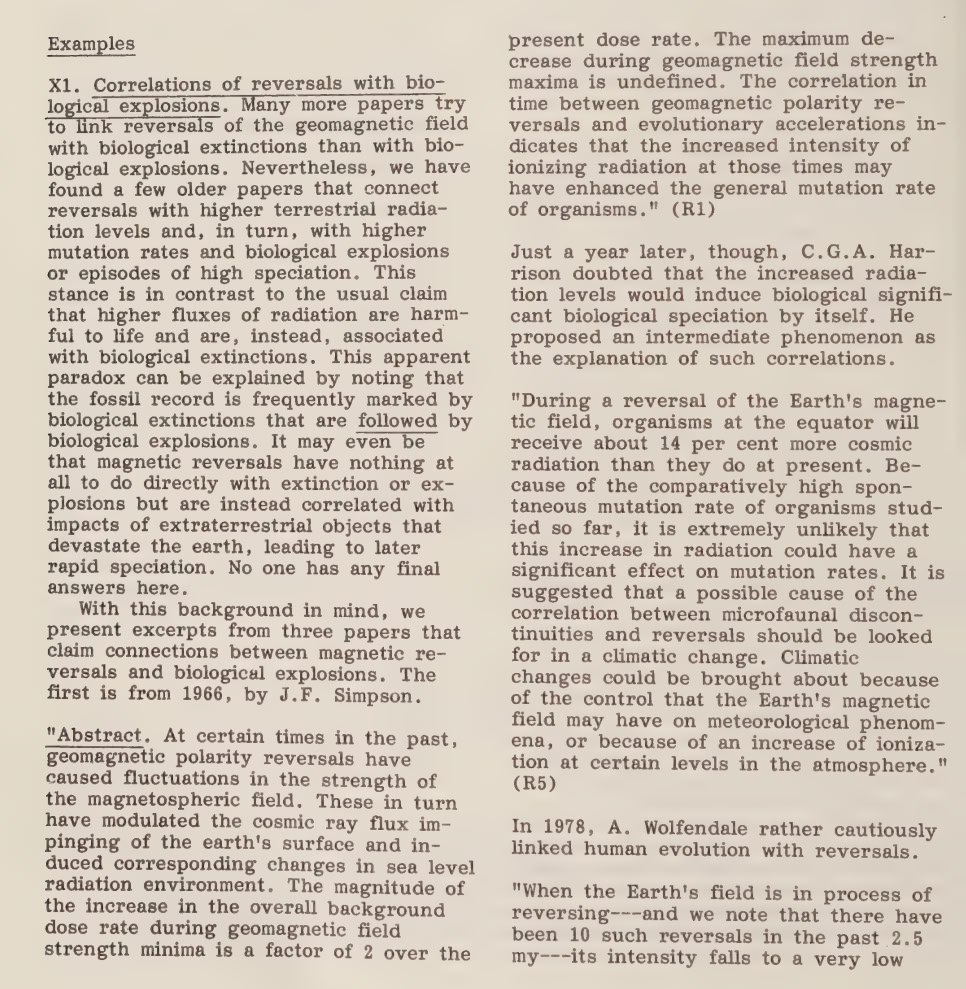

# William R. Corliss

Has written a number of excellent books covering all kinds of scientific anomalies. Lot of it very likely relevant to the ECDO.

Carolina bays and strange planet have a lot of ECDO related stuff.

```
'Ancient Infrastructure_ Remarkable Roads, Mines, Walls.txt',
'Ancient structures_ remarkable pyramids, forts, towers.txt',
'Carolina bays, Mima mounds, submarine canyons.txt',
'Inner Earth_ A Search for Anomalies.txt',
'Mysteries of the universe.txt',
'Remarkable luminous phenomena in nature.txt',
'Scientific Anomalies and Other Provocative Phenomena.txt',
'Strange phenomena.txt',
'Strange planet - a sourcebook of unusual geological.txt',
'Unknown earth_  a handbook of geological enigmas.txt',
'ancientman.txt'
```

## Earth’s Missing Pages (https://nobulart.com/earths-missing-pages/)

“Could erosion have swept whole continents clean? And where did all these sediments go? Mainstream science believes that its armory of fossil succession, radiometric dating, and episodic erosion and sedimentation, caused by changing sea levels and the rising and subsiding of land are more than sufficent. It is a matter of opinion whether these accepted processes can cope with the sheer number and magnitudes of the gaps in the Stratigraphic Record.” - Inner Earth: A Search for Anomalies, William R. Corliss (1991)
https://nobulart.com/earths-missing-pages/

## Inner Earth: A Search for Anomalies, William R. Corliss (1991)

