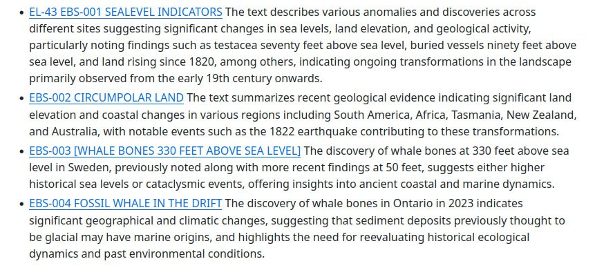

# William R. Corliss

Has written a number of excellent books covering all kinds of scientific anomalies. Lot of it very likely relevant to the ECDO.

Carolina bays and strange planet have a lot of ECDO related stuff.

```
'Ancient Infrastructure_ Remarkable Roads, Mines, Walls.txt',
'Ancient structures_ remarkable pyramids, forts, towers.txt',
'Carolina bays, Mima mounds, submarine canyons.txt',
'Inner Earth_ A Search for Anomalies.txt',
'Mysteries of the universe.txt',
'Remarkable luminous phenomena in nature.txt',
'Scientific Anomalies and Other Provocative Phenomena.txt',
'Strange phenomena.txt',
'Strange planet - a sourcebook of unusual geological.txt',
'Unknown earth_  a handbook of geological enigmas.txt',
'ancientman.txt'
```

## Earth’s Missing Pages (https://nobulart.com/earths-missing-pages/)

“Could erosion have swept whole continents clean? And where did all these sediments go? Mainstream science believes that its armory of fossil succession, radiometric dating, and episodic erosion and sedimentation, caused by changing sea levels and the rising and subsiding of land are more than sufficent. It is a matter of opinion whether these accepted processes can cope with the sheer number and magnitudes of the gaps in the Stratigraphic Record.” - Inner Earth: A Search for Anomalies, William R. Corliss (1991)
https://nobulart.com/earths-missing-pages/

## Inner Earth: A Search for Anomalies, William R. Corliss (1991)


## Carolina Bays... book, GPT Summary Excerpts

Coral reefs and marine-related structures found at unusual levels above and below sea level: https://github.com/sovrynn/ecdo/blob/master/6-LITERATURE-MEDIA/corliss/carolina-bays-topological-phenomena.md#ete2-raised-and-submerged-fossil-coral-reefs


Expanding earth, gradualism vs cataclysmic earth changes


Lots and lots of meteor/comet impacts


"Mounds" ie mega current ripples, all over the world.

In Peru, the Ninacaca Mounds, located between 13,500 and 14,000 feet elevation, exhibit distinctive layered compositions of stony topsoil over rounded stones, covering an extensive area with consistent spacing and height.

In the Beaufort Sea, undersea mounds with irregular and asymmetric shapes, averaging 400 meters in diameter at the base, have been discovered and are believed to be formed by various geological processes including the dynamics of ice floes.

The text discusses various anomalies related to drumlins, including their association with other geological features, the presence of giant ripple marks indicating flowing water, unusual uphill orientations, characteristics contradicting glacial theory, and the inability of existing ice sheets to form drumlins, highlighting challenges to the traditional understanding of drumlin formation.

Img: Mima mounds: https://iafi.org/desert-biscuit-mounds-a-probable-explanation/


In the Andes, mysterious layered islands of freshwater ice, rising several meters above saline lakes and stretching up to a mile in length, have been discovered but their formation, possibly due to freeze-thaw actions, remains speculative.

Having trouble finding out more about these.

USGS: Massive blocks of freshwater ice and frozen sediments protrude from shallow, saline lakes in the Andes of southwestern Bolivia and northeastern Chile. These ice islands range up to 1.5 kilometers long, stand up to 7 meters above the water surface, and may extend out tens of meters and more beneath the unfrozen lake sediments. The upper surfaces of the islands are covered with dry white sediments, mostly aragonite or calcite. The ice blocks may have formed by freezing of the fresh pore water of lake sediments during the "little ice age." The largest blocks are melting rapidly because of possibly recent increases in geothermal heat flux through the lake bottom and undercutting by warm saline lake water during the summer.

Eskers and megaripples... 

Kropotkin identified distinct differences between the cores and mantles of eskers, asserting that while the cores are made of unwashed and unstratified moraine, the mantles come from water action. This separation raises questions about the processes that led to their formation, challenging the commonly held views of their origin.

Some eskers are reported to run uphill, contrary to the expectation that they should follow the contours dictated by their formation processes. This phenomenon poses challenges to the prevailing understanding of how these structures were deposited and the hydrological conditions at play during their creation.


Critics of the glacial theory note that the continuous and homogenous nature of many esker deposits contradicts their formation by englacial or superglacial streams. This observation suggests that if esker deposits were indeed formed within or atop thick ice, their structural identity would likely have been compromised, further complicating the narrative surrounding their origins.

The mention of marine shells within some esker deposits indicates a possible marine flooding component which is not adequately addressed by the fluvial formation theory. The presence of such fossils raises additional questions about the environmental conditions when these deposits formed, pointing to a complex interplay of geological processes.

Eskers contain large angular and subangular blocks, sometimes in significant numbers, questioning their formation through typical fluvial actions. One notable example is near Gamla Upsala, where blocks of considerable size, potentially 36 yards cubical, were observed.

lol

Anomalous topological structures that may be more recent than we think...

The text describes wind gaps as dry, V-shaped notches in mountains that suggest historical fluctuations in water levels and potential catastrophic marine flooding, evaluating them as anomalies compared to typical water gaps.

In 2023, an anomaly suggested that some rivers might be only a few thousand years old due to their youthful erosive features and sediment deposition rates, though the reliability of this claim is questioned as it is primarily found in creationist literature.

Recent evidence challenges the traditional view, suggesting that the Grand Canyon may be younger than previously thought... The Grand Canyon’s rim is notably level and appears uneroded, challenging the assumption that it should show significant weathering if its geological history spans millions of years. This lack of erosion leads to further questioning of the Canyon's long-term geological timeline.


## Strange Planet GPT Excerpts

Strange Planet, by Corliss: https://github.com/sovrynn/ecdo/blob/master/6-LITERATURE-MEDIA/corliss/strange-planet.md

Exhibit: Mammoth graveyards:
In 1887, Mr. Howorth concluded that a universal flood at the end of the mammoth period led to the simultaneous death and burial of various mammals, including mammoths, across a wide area, based on findings of well-preserved remains and mixed fauna deposits.

A drilling project in northern Alaska unexpectedly uncovered an 18-inch frozen tree trunk at 1,000 feet in 2023, adding to the mystery of the deep, frozen "muck" layers that can exceed 4,000 feet in depth and challenge current geological understanding.


Sea level changes

The discovery of whale bones at 330 feet above sea level in Sweden, previously noted along with more recent findings at 50 feet, suggests either higher historical sea levels or cataclysmic events, offering insights into ancient coastal and marine dynamics.



