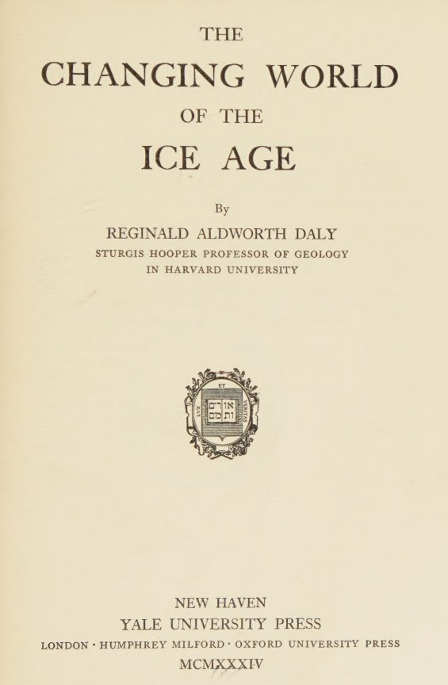
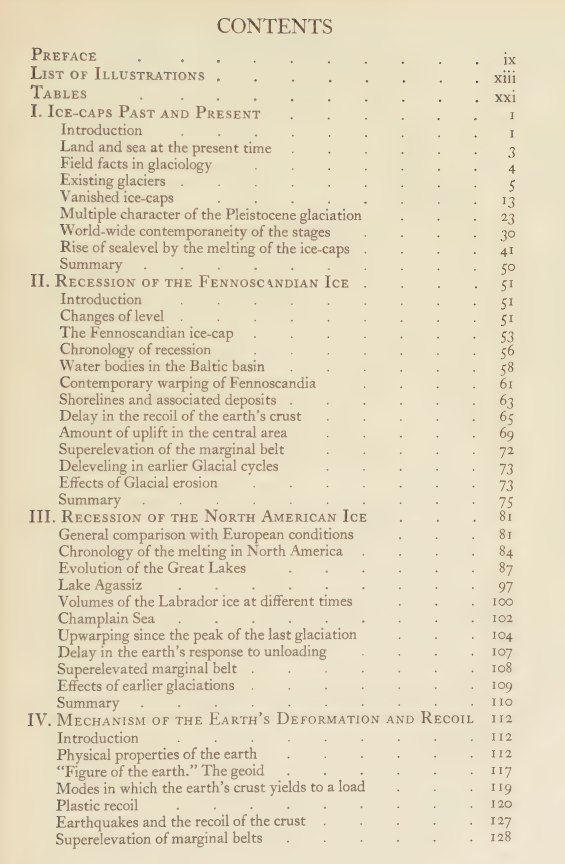
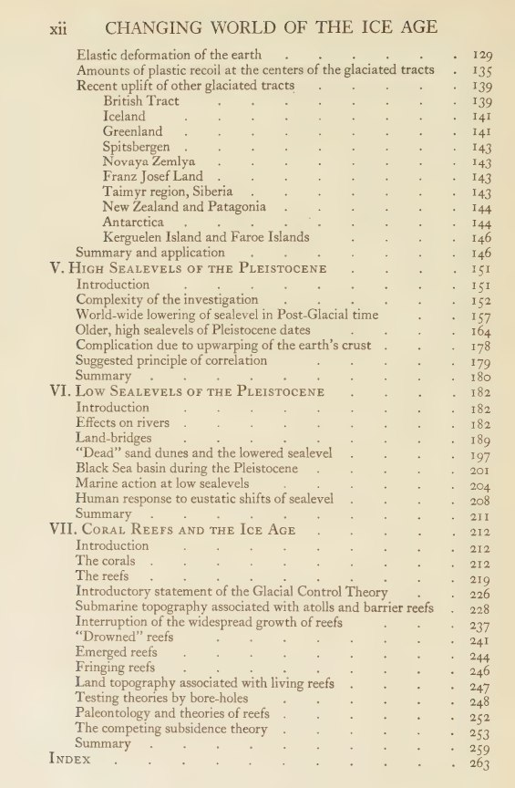
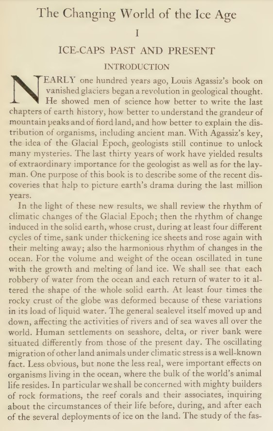

# Reginald Aldworth Daly

Another hidden treasure. 1934. 324 pages.

"...the rhythm of change induced in the solid earth, whose crust, during at least four different cycles of time, sank under thickening ice-sheets and rose again with their melting away;"

https://annas-archive.org/md5/93a6ff7944c37eea9a28bb9de6c996bc