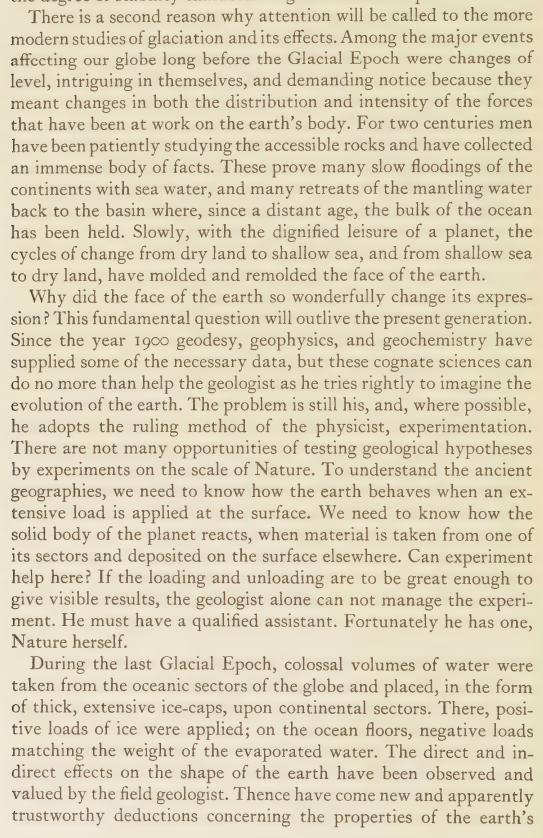

# Reginald Aldworth Daly

Another hidden treasure. 1934. 324 pages.

"...the rhythm of change induced in the solid earth, whose crust, during at least four different cycles of time, sank under thickening ice-sheets and rose again with their melting away;"

https://annas-archive.org/md5/93a6ff7944c37eea9a28bb9de6c996bc

## "colossal volumes of water were...

"colossal volumes of water were taken from the oceanic sectors of the globe and placed, in the form of thick, extensive ice-caps, upon continental sectors. There, positive loads of ice were applied; on the ocean floors, negative loads matching the weight of the evaporated water." https://t.co/B0BIDS1gGw

