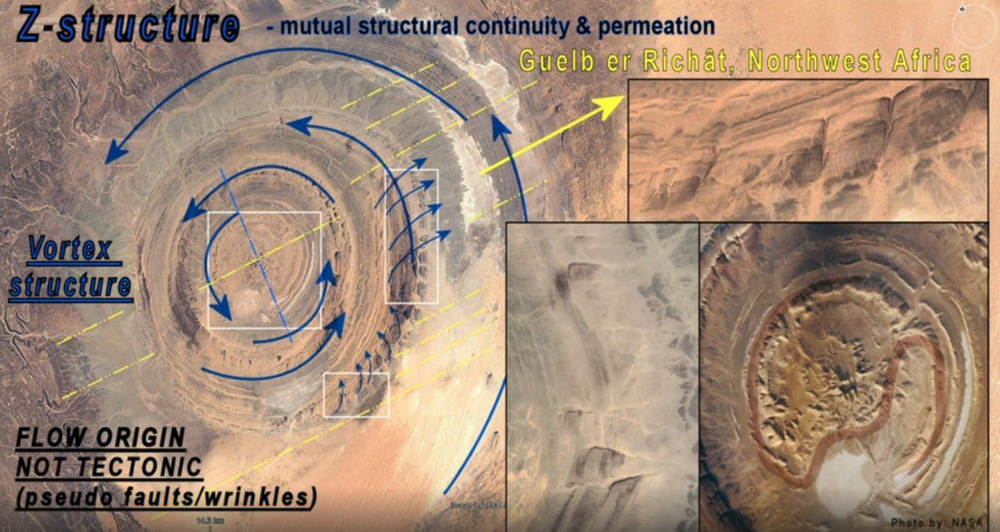
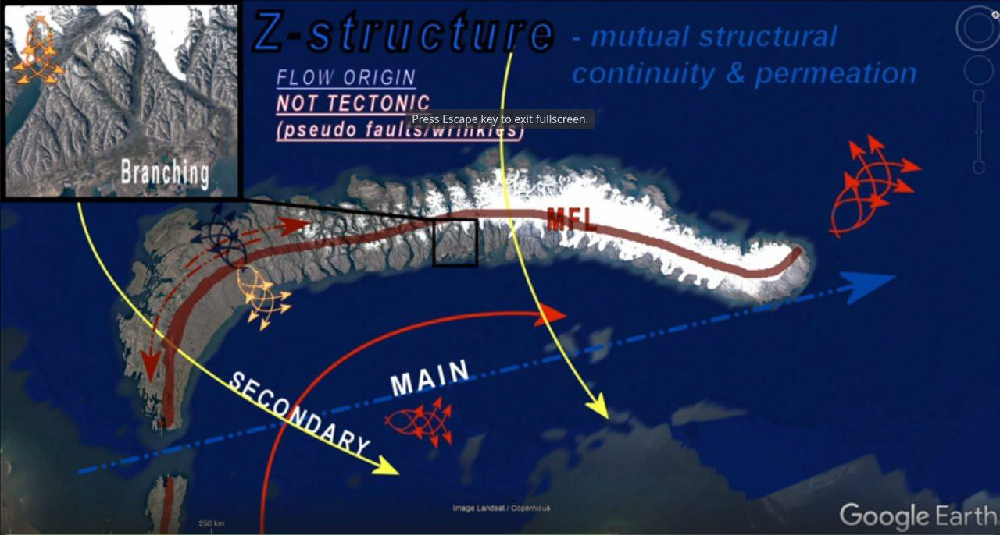
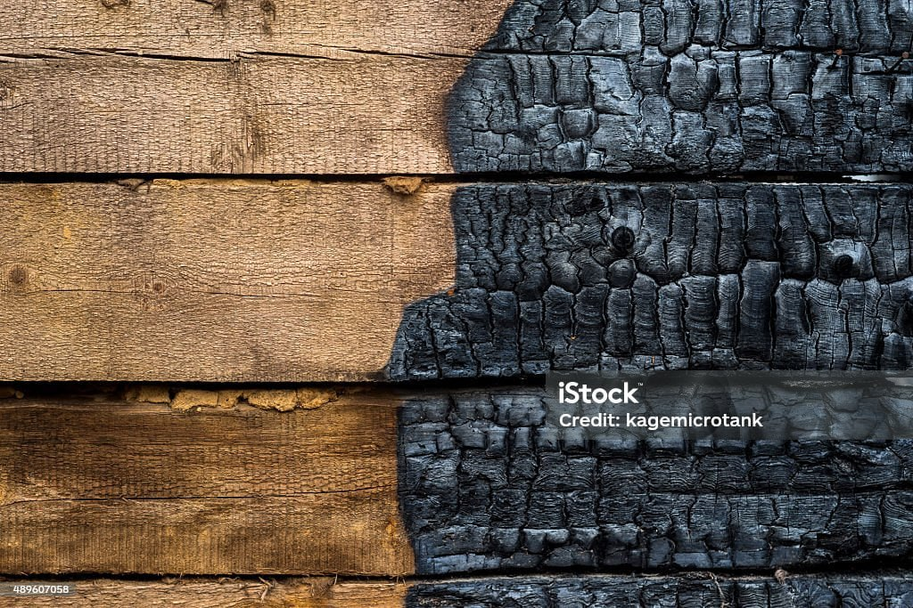
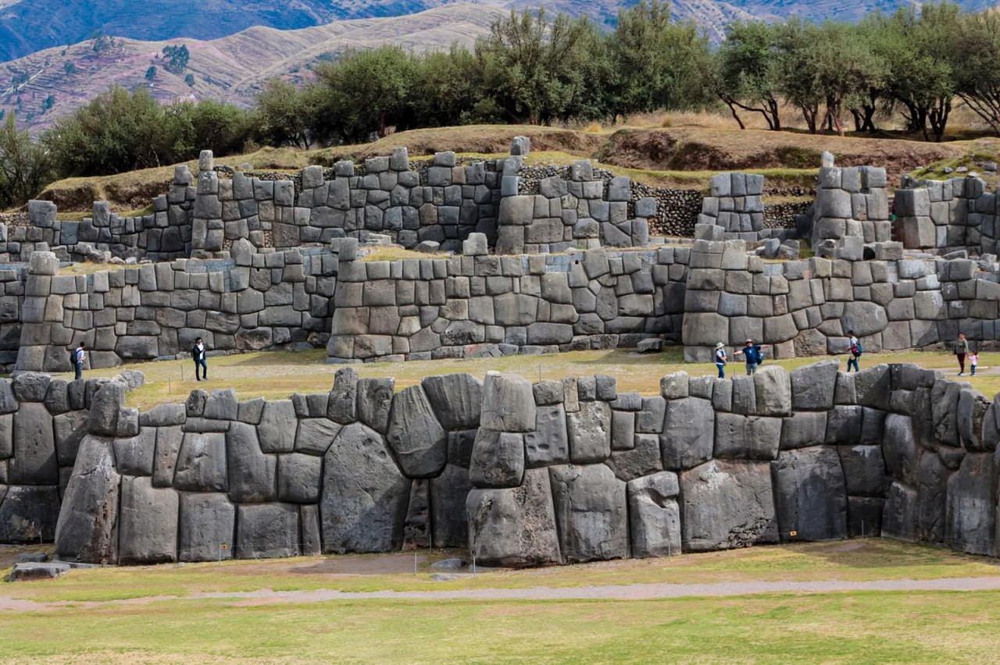

# GEOreSET

Rumble author (geologist) who has published a [video](https://rumble.com/v5auer1-wave-concept-and-creation-of-continents.html?e9s=src_v1_upp) titled "Wave concept and Creation of continents".

The basic idea is that geological features such as mountains are not created by orogenesis and tectonic plates, but by massive wave flows consisting of water, sediment, and magma - vast quantities of material that moves and relocates as one sediment body.

He estimates waves of 10-15 km or more in height from today's sea level.

Believes these late mammoths were frozen in after event conditions - "instant" drop of temperature.

Richat structure whirlpool?

His analysis of Severny Island flow.

## Man-made or natural?

One of GEOreSET's beliefs is that structures we attribute as being man-made are actually created by these massive flow events, and later inhabited and decorated by humans.

Notice how the burn bit looks like stones in a wall, perfectly fitting.