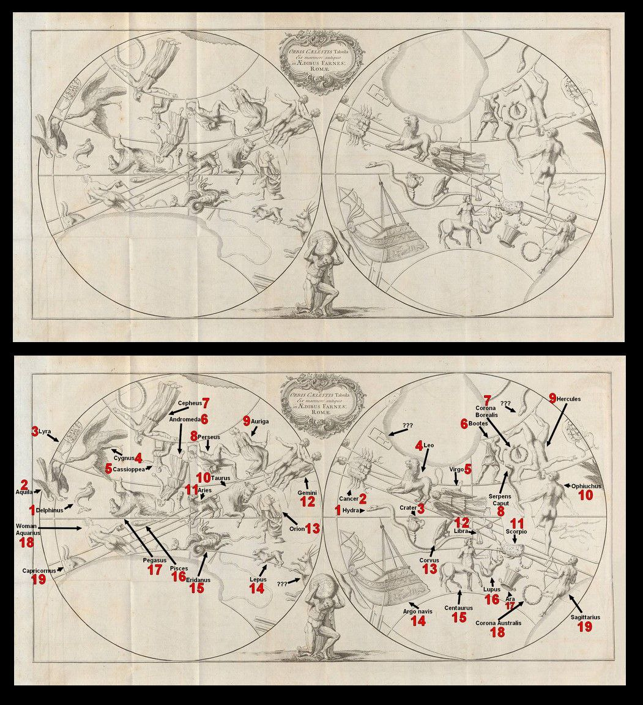

# HIpparchus

## Discovery of the Lost Star Catalog of Hipparcus on the Farnese Atlas

I hadn't seen that statue before of a figure holding a celestial sphere. I had to look it up.

It lead me to a paper, "Discovery of the Lost Star Catalog of Hipparcus on the Farnese Atlas"

Short article here:

https://www.space.com/719-long-lost-star-catalog-plain-sight.html

"Bradley Schafer of Louisiana State University, Baton Rouge combined data from the precession cycles with measurements he took of 70 positions on the globe and used a mathematical model to determine what point in time the Atlas's sky globe represents. Schafer determined that the best date for the original observations was 125 BC, with a normal margin of error of ? 55 years.

The date of 125 BC immediately suggests that this is the lost catalog of Hipparchus, who created his star catalog in 129 BC. The 125 BC date also eliminates all previously proposed candidates for this star catalog. The works of Aratus (275 BC), Eudoxus (366 BC), and the Assyrian observer (1130 BC), are all too early, while Ptolemy's work in 128 AD is too late to match up to this star catalog.

Providing more evidence that the constellation figures on the Farnese Atlas were based on a star catalog is that the accuracy is within 3.5 degrees"

"Hipparchus, who was Greek, was one of the greatest of the ancient astronomers and did his most important work between 140-125 BC. He calculated the length of the year to within six and a half minutes, developed a scale to rate the brightness of stars, was the first to record a nova, theorized on the motions of the Sun and Moon, provided high quality planetary observations and created the first ever catalog of 1,000 stars.

Perhaps his most important observation, and the one that provided the key to determining the Atlas held his catalog, was precession. Precession is the wobbling of Earth on its axis, like a spinning top as it slows down, over long periods of time. This wobbling is on a 26,000 year cycle, and causes the stars to appear to move across the sky."

https://en.m.wikipedia.org/w/index.php?title=Great_Year

https://en.m.wikipedia.org/wiki/Axial_precession

26,000 is a curious numbers because some ancient zodiacs recon 13 constellations in the zodiac

http://user.astro.wisc.edu/~dolan/constellations/extra/Zodiac.html

Each age would then round to 2,000 years