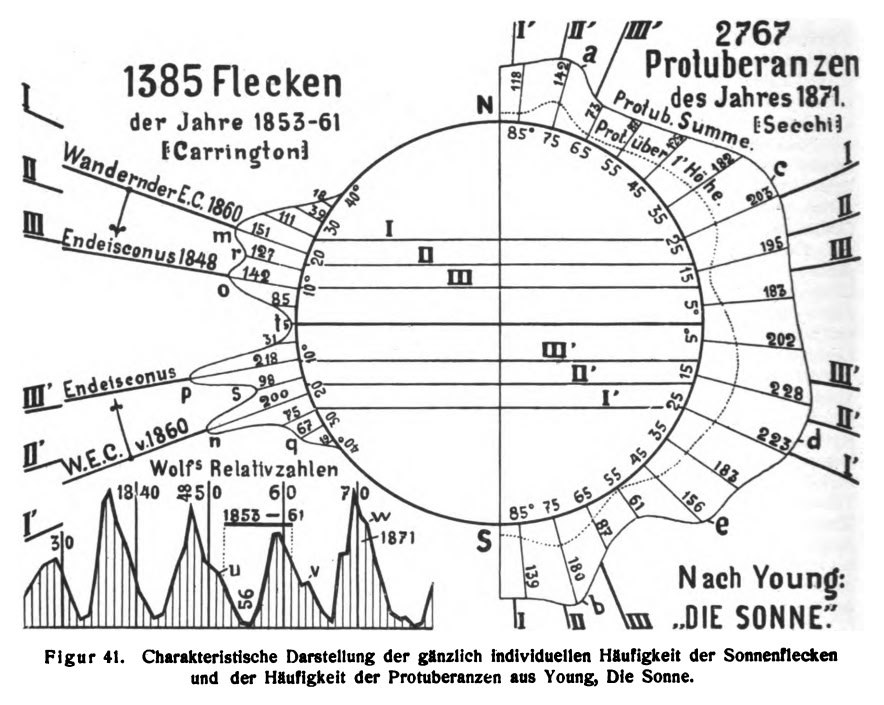
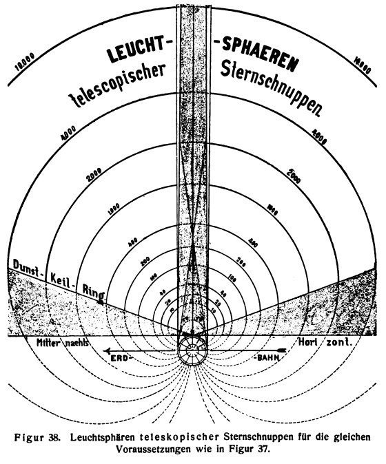
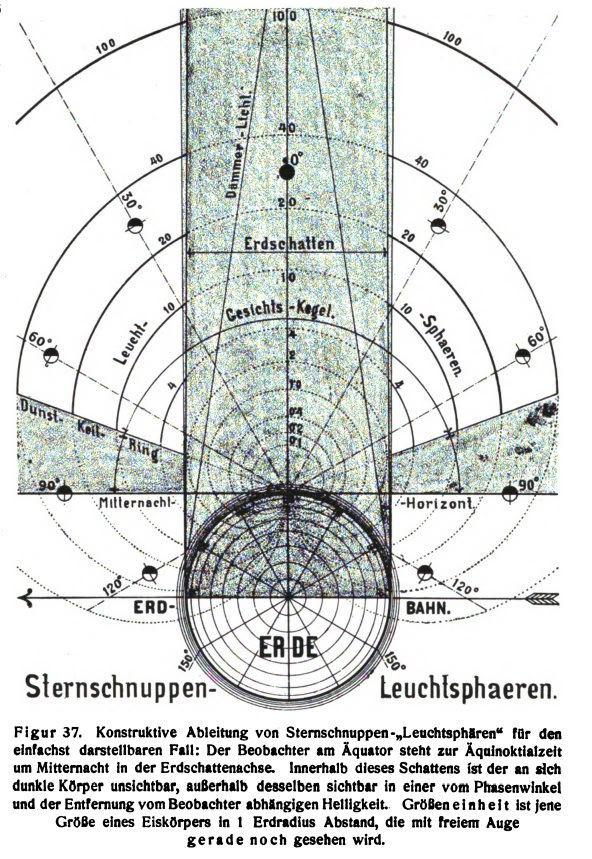
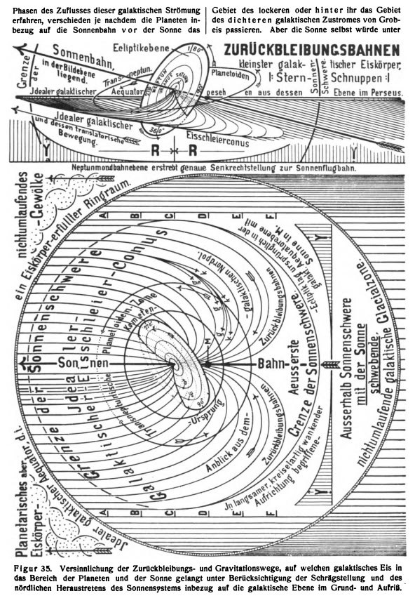
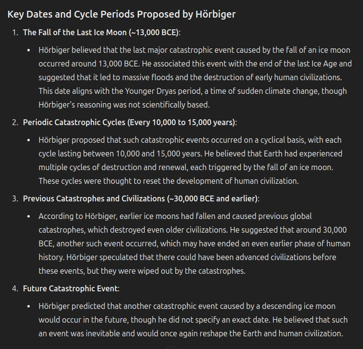
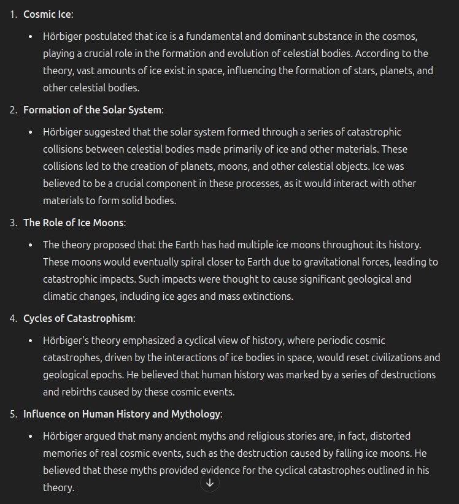

# Hans Horbiger

I also stumbled across Glacial Cosmogony by Hans Horbiger (1925). Over 800 pages. A theory that our moon displaced our previous satellite, resulting in its capture and destruction in the Earth's gravity, raining down in pieces some 20-27ky in the past.

[1] https://archive.org/details/hoerbiger-hanns-und-fauth-philipp-glazial-kosmogonie-welteislehre-1925-823-s.-scan

## ChatGPT synopsis

Hörbiger's Theory as rendered by GPT: https://chatgpt.com/share/ca7f2a5e-acab-4047-8cd6-f051439efb26

