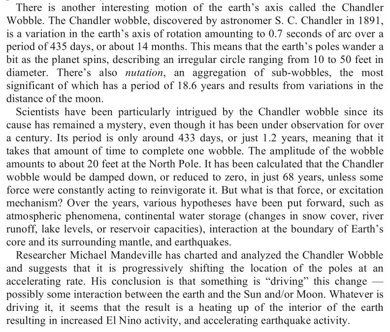

# Jadczyk

## The Secret History of The World (2005) [1]

A surprising similarity to exothermic core theory.

The Secret History of the World (2005).
V harmonic. Confirmed again. And again.

Remarkably similar to my own findings: "..recent scientific evidence points to the date actually being between 1644 and 1600 BC. There is also evidence for a disruption circa 5200 BC, 8,800 BC, 12,400 BC, 16,000 BC, 19,600 BC, and by logical extension every 3,600 years previously for an indefinite and unknown period of time. What is more, if the last “return” was in 1600 BC, we are not just due, we are overdue for the next one. 

What is clear is that whatever comes at 3600 year intervals as shown by the ice cores is capable of setting off prolonged periods of earth changes that are above the levels of ordinary uniformitarian geologic and climatalogical changes. But what is important is that the mythical and archaeological evidence suggests that it is a shower of asteroids or comets that are NOT seen until it is TOO LATE." 

- The Secret History of the World (2005)
1. https://archive.org/details/the-secret-history-of-the-world_202011 .

This 20-year old book is making my head spin.

The most astounding part is that our discovery of the cycle was arrived at along a completely different path of inquiry - one that does not involve or require any external unknown influence - just the planets we have and the rocks dancing with them.

## Citations

1. [Craig Stone](https://nobulart.com)