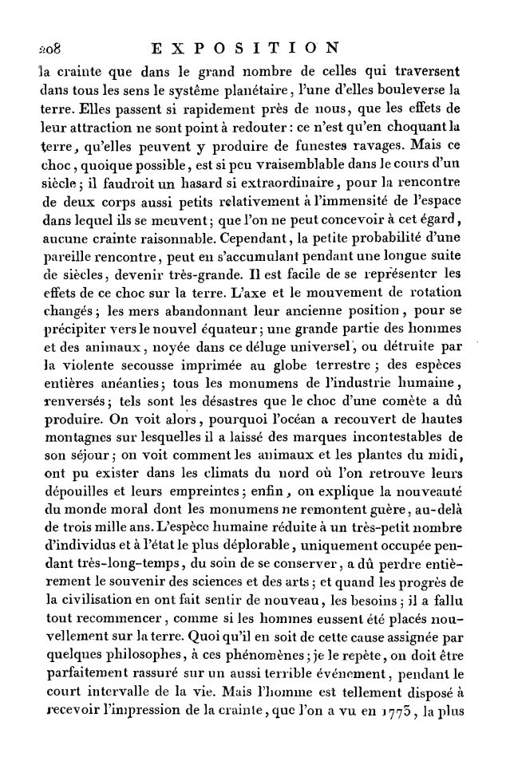

# Pierre Laplace

## Exposition du Systeme du Monde, Pierre Laplace (1796)

"The axis and the movement of rotation change; the two abandon their former position, to precipitate themselves towards the new equator; a large part of humans and animals, drowned in this universal deluge, or destroyed by the violent shock imprinted on the terrestrial globe; entire species annihilated; all the monuments of human industry, overturned; such are the disasters that the shock of a comet must have produced. We see then why the ocean has covered high mountains on which it has left incontestable marks of its stay; we see how the animals and plants of the Middle Ages have been able to exist in the northern climates where their remains and their imprints are found; finally, we explain the novelty of the moral world whose monuments hardly date back more than three thousand years. The human species, reduced to a very small number of individuals and to the most deplorable state, occupied for a very long time only with the care of preserving itself, must have entirely lost the memory of the sciences and the arts; and when the progress of civilization made the needs of them felt again, it was necessary to start all over again, as if humans had been placed anew on the earth."

"Interesting that Laplace specifically mentions a period of at least 3,000 years (1200 BC at his time). I think he was possibly referencing the time of the event by evidence of the Greek Dark Ages, Post-Palacial period, and the 1750-1700 BC string of destructive event(s)." [4]

## Citations

1. https://archive.org/details/expositiondusys02laplgoog
2. https://en.wikipedia.org/wiki/Pierre-Simon_Laplace
3. https://theethicalskeptic.com/2024/05/12/exothermic-core-mantle-decoupling-dzhanibekov-oscillation-ecdo-theory/
4. https://nobulart.com