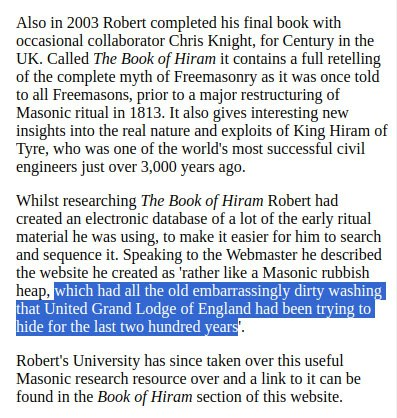

# Robert Lomas

Co-author of Uriel's Machine.
https://x.com/Dr_Robert_Lomas

Its interesting going through his posts. Gives some insight into how some masons spend their time - studying ancient history and cosmology and doing normal stuff. Several books mentioned.

https://www.robertlomas.com/Books/index.html

He's certainly put a great deal of time into exploring the origins of freemasonry and its connection to ancient cultures and events. Seems to be of the "watcher" disposition, rather than the "occulter" one. This work fits my thesis that freemasonry has been whispering this warning for hundreds of years.

[1] https://www.webofhiram.org