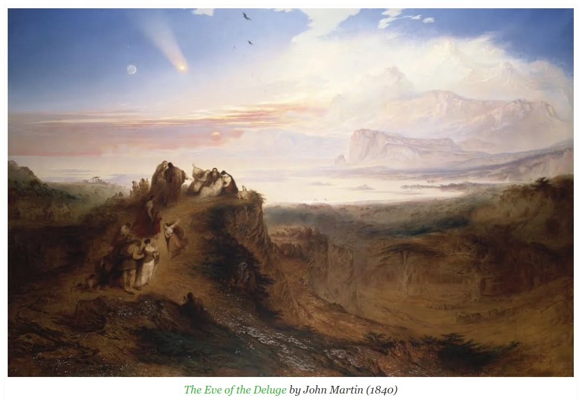

# John Martin

## The Eve of the Deluge...

The Eve of the Deluge by John Martin (1840). Note the comet. Martin produced many cataclysmic paintings, for which he is most famous. What purpose does cataclysm art serve? Is it to instill fear, warn.. or perhaps prepare us psychologically through the abstraction of the medium? https://t.co/illIVljH18

