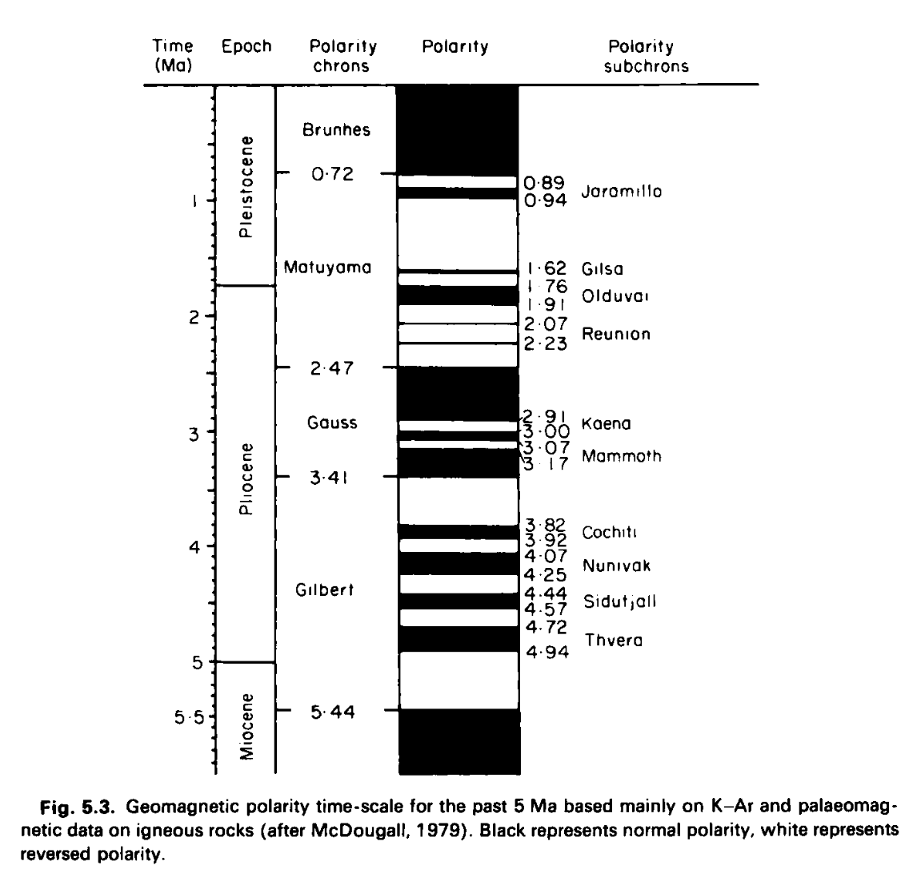
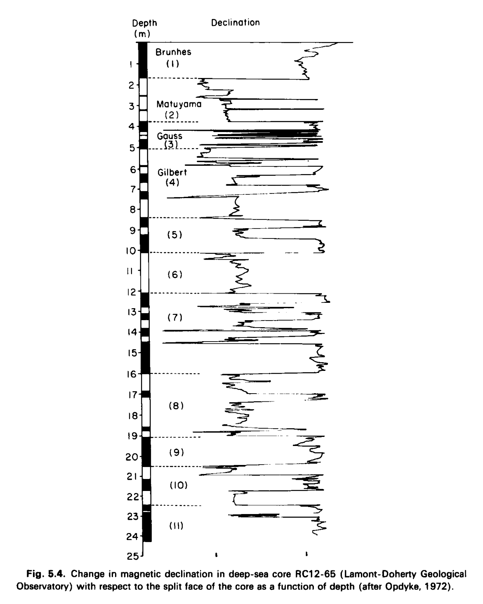

# McElhinny

## Book: Paleomagnetism (hard copy here)

This is the more recent version of his book, I assume most of the content is the same.

Many charts from this book in `EVIDENCE/physical-material/paleomagnetism`.

He just quotes someone else's work when citing the decrease of the geomagnetic dipole moment.

### Chapters and Subchapters Discussing Recent Weakening of the Geomagnetic Dipole in McElhinny

Look at chapter 5 and 6.3 (not much).

#### 1.1.4 Variations of the Dipole Field with Time
- **Location:** Found in section 1.1.4
- **Content Summary:** Discusses the decrease in the geomagnetic dipole field's intensity since Gauss’s first spherical harmonic analysis, with notable decline rates of approximately 5% per century.
  
#### 1.2 Paleomagnetism
- **Relevant Subsection:** 1.2.5 Paleointensity over Geological Times
- **Content Summary:** Analyzes paleointensity measurements across geological periods, highlighting changes in the dipole moment that provide historical context to recent declines.
  
#### Figures and Data Representations
- **Figures:** Includes Figure 1.9, illustrating time variations in the geomagnetic dipole moment and the positional shifts of the North Geomagnetic Pole since 1600.

## The Earth's magnetic field: Its history, origin and planetary perspective (hard copy here)

"Thus after a historical introduction in Chapter 1, the more traditional aspects of geomagnetism relating to the present field and historical observations are presented in Chapter 2. The various methods and techniques and theoretical background of palaeomagnetism are given in Chapter 3. Chapters 4, 5 and 6 present the results of palaeomagnetic and archaeomagnetic studies in three topics. Chapter 4 relates to studies of the geomagnetic field roughly back to about 50,000 years ago. Chapter 5 is about reversals of the geomagnetic field and Chapter 6 presents studies of the field for times older than 50,000 years and on the geological time scale of millions or hundreds of millions of years. Chapters 7, 8 and 9 provide insight into dynamo theory. Chapter 7 is essentially a non-mathematical attempt to explain the physical basis of dynamo theories to palaeomagnetists. This is followed in Chapter 8 by a more advanced theoretical treatment for those with greater mathematical skills. Chapter 9 explains theoretical aspects of secular variation and the origin of reversals of the geomagnetic field. Chapter 10 is our attempt to bring the two sides together, to relate theory to experiment and vice versa."

"The dipole field is also changing with time. The intensity of the dipole field has decreased at the rate of about 5 % since the time of Gauss' analysis in 1835 (Leaton and Malin, 1967; Vestine, 1967; McDonald and Gunst, 1968) (Fig. 2.lOa). Indeed, Leaton and Malin (1967) and McDonald and Gunst (1968) have speculated on the demise of the main dipole around A.D. 3700 to 4000 if the present trends continue. The dipole axis, however, as represented by the position of the North Geomagnetic Pole has hardly changed its position since the analysis of Gauss (Bullard et 01.,1950). Over the past 150 years there appears to have been a slow westward change of near 0.05° per year in azimuth angle, but no progressive motion in polar angle (Nagata, 1965; McDonald and Guest, 1968)." [Page 45]

Leaton and Malin sources: hard copies here

Playing telephone game I see!

Page 48:

### Ch 5

"Systematic studies attempting to define a polarity time-scale using joint magnetic polarity and K-Ar age determinations on young lava flows were undertaken both in the USA and Australia. The first time-scale put forward by Cox et al. (1963a) suggested a periodicity of magnetic reversals at about one million year intervals. However, as new data quickly appeared in the literature (Cox et al., 1963b, 1964a; McDougall and Tarling, 1963, 1964) it soon became apparent that there was no simple periodicity, the lengths of successive polarity intervals were sometimes long (-1 Ma) or quite short (-0.1 Ma). Cox et al. (1964b) proposed that within intervals of predomin- antly one polarity lasting of the order of 1 Ma, there were short intervals of opposite polarity of the order of 0.1 Ma. The longer intervals were termed magnetic polarity epochs and the shorter intervals were called events. The epochs were named after pioneering scientists in geomagnetism, Brunhes, Matuyama, Gauss and Gilbert, whereas the events were labelled from the location of their discovery, The International Sub-Commission on Stratigraphic Classification has now adopted the terms chron and subchron to replace the terms epochs and events."

### Ch 6

"Cox (1968) has suggested that the most useful analogy to geomagnetic polarity reversals has been provided by the double-disc dynamo of Rikitake (1958). From this he developed a probabilistic model for reversals in which the dipole moment oscillates sinusoidally about some mean value during stable polarity times. It is not difficult to show (Kono, 1972; McFadden and McElhinny, 1982) that such a model predicts a distribution of dipole moments which groups with minimum frequency about a central mean. This is virtually the opposite to that observed (Fig. 6.lla). The data thus quite clearly do not support a model of an oscillating dipole moment during stable polarity times." [Pg 192]

### Sections on the Decreasing Dipole Field in McElhinny's Text

#### 1. Chapter 2 - *The Present Geomagnetic Field*
   - **Section 2.4.5 - Variations of the Dipole Field with Time**  
     This section discusses the observed decrease in the Earth's dipole field strength, which has been diminishing at about 5% since Gauss's analysis in 1835. It speculates on the potential complete decay of the main dipole around AD 3700–4000 if the current trend continues&#8203;:contentReference[oaicite:0]{index=0}.

#### 2. Chapter 4 - *The Earth's Magnetic Field*
   - **Section 4.1.5 - Dipole Moments Before 10,000 Years B.P.**  
     This section provides insight into the dipole's historical strength over prehistoric times, showing a significantly weaker dipole moment in the past. Notable decreases are recorded for periods between 50,000 and 10,000 years B.P., supported by palaeointensity data&#8203;:contentReference[oaicite:1]{index=1}&#8203;:contentReference[oaicite:2]{index=2}.

#### 3. Chapter 6 - *The Time-averaged Palaeomagnetic Field*
   - **Section 6.3 - Variation in the Earth's Dipole Moment**  
     This section discusses palaeointensity records over the past five million years, explaining fluctuations and trends in dipole moments and detailing methods like the Virtual Dipole Moment (VDM) to estimate historical field strength variations&#8203;:contentReference[oaicite:3]{index=3}.
